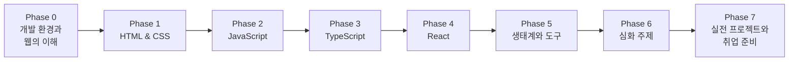

# 웹 프론트엔드 개발자 양성 로드맵

> 프로그래밍 입문자를 **취업 가능한 주니어 웹 프론트엔드 개발자**로 양성하기 위한 학습 로드맵입니다.
> 모든 교육 문서는 한국어로 작성하며, 이 저장소의 `docs/` 디렉터리에 Phase별로 배치합니다.

---

## 1. 과정 개요

| 항목 | 내용 |
|------|------|
| 대상 | 5년차 이상 경력 개발자 (백엔드·모바일 등 타 분야 출신, 프론트엔드로 전환/확장하려는 사람) |
| 목표 | 실무 투입이 가능한 웹 프론트엔드 개발자 양성 |
| 기간 | 총 약 24주 (주 20시간 이상 학습 기준, 경력자의 배경지식에 따라 크게 단축 가능) |
| 주력 스택 | HTML / CSS / JavaScript / TypeScript / React / Next.js |
| 산출물 | Phase별 실습 과제 + 최종 포트폴리오 프로젝트 2개 이상 |

### 학습 원칙

1. **기본기 우선** — 프레임워크보다 HTML/CSS/JavaScript와 브라우저 동작 원리를 먼저 탄탄히 다진다.
2. **만들며 배우기** — 모든 Phase는 이론 문서 학습 후 반드시 실습 과제로 마무리한다.
3. **표준과 공식 문서 중심** — MDN, 각 도구의 공식 문서를 1차 자료로 삼는 습관을 들인다.
4. **점진적 확장** — JavaScript → TypeScript → React 순서로, 이전 단계 지식 위에 다음 단계를 쌓는다.
5. **실무 관행 체득** — Git 협업, 코드 리뷰, 테스트, 배포까지 실제 개발 워크플로를 경험한다.

---

## 2. 전체 커리큘럼 구조



| Phase | 주제 | 기간(권장) | 핵심 산출물 |
|-------|------|-----------|------------|
| 0 | 개발 환경과 웹의 이해 | 1주 | GitHub 저장소에 첫 커밋/PR |
| 1 | HTML & CSS | 3주 | 반응형 정적 웹사이트 |
| 2 | JavaScript | 5주 | 바닐라 JS 웹 앱 (Todo/검색 앱 등) |
| 3 | TypeScript | 2주 | 기존 JS 프로젝트의 TS 마이그레이션 |
| 4 | React | 5주 | React SPA (API 연동 포함) |
| 5 | 프론트엔드 생태계와 도구 | 2주 | 테스트/린트/CI가 갖춰진 프로젝트 |
| 6 | 심화 주제 | 3주 | 성능 개선 리포트, Next.js 앱 |
| 7 | 실전 프로젝트와 취업 준비 | 3주+ | 포트폴리오 프로젝트, 이력서 |

---

## 3. Phase별 상세 커리큘럼

### Phase 0 — 개발 환경과 웹의 이해 (1주)

**학습 목표**: 개발 도구에 익숙해지고, 웹이 어떻게 동작하는지 큰 그림을 이해한다.

| # | 문서 | 주요 내용 |
|---|------|----------|
| 0-1 | `docs/phase-0/01-how-the-web-works.md` | 인터넷과 웹의 동작 원리, HTTP, DNS, 브라우저와 서버 |
| 0-2 | `docs/phase-0/02-dev-environment.md` | VS Code, 터미널 기초 명령어, Node.js 설치 |
| 0-3 | `docs/phase-0/03-git-and-github.md` | Git 기본 (commit, branch, merge), GitHub, PR 워크플로 |

**실습 과제**: GitHub에 학습 기록용 저장소를 만들고, 브랜치를 생성해 PR로 병합해 본다.

---

### Phase 1 — HTML & CSS (3주)

**학습 목표**: 시맨틱한 마크업과 현대적인 CSS 레이아웃으로 반응형 웹페이지를 만들 수 있다.

| # | 문서 | 주요 내용 |
|---|------|----------|
| 1-1 | `docs/phase-1/01-html-basics.md` | HTML 문서 구조, 주요 태그, 폼과 입력 요소 |
| 1-2 | `docs/phase-1/02-semantic-html.md` | 시맨틱 태그, 문서 아웃라인, SEO 기초 |
| 1-3 | `docs/phase-1/03-css-basics.md` | 선택자, 우선순위(specificity), 박스 모델, 단위 |
| 1-4 | `docs/phase-1/04-css-layout.md` | Flexbox, Grid, position, 정규 흐름(normal flow) |
| 1-5 | `docs/phase-1/05-responsive-design.md` | 미디어 쿼리, 모바일 퍼스트, 반응형 이미지 |
| 1-6 | `docs/phase-1/06-css-advanced.md` | 변수(custom properties), 트랜지션/애니메이션, 의사 클래스 |
| 1-7 | `docs/phase-1/07-accessibility.md` | 웹 접근성(a11y) 기초, ARIA, 키보드 내비게이션 |

**실습 과제**: 자기소개 페이지 → 실제 서비스(카페, 쇼핑몰 등) 랜딩 페이지 클론을 반응형으로 제작하고 GitHub Pages로 배포한다.

---

### Phase 2 — JavaScript (5주)

**학습 목표**: 언어 핵심 개념과 비동기 처리, DOM 조작을 이해하고 프레임워크 없이 동작하는 웹 앱을 만들 수 있다.

| # | 문서 | 주요 내용 |
|---|------|----------|
| 2-1 | `docs/phase-2/01-js-basics.md` | 변수(let/const), 자료형, 연산자, 조건문, 반복문 |
| 2-2 | `docs/phase-2/02-functions-and-scope.md` | 함수, 스코프, 클로저, 화살표 함수, this |
| 2-3 | `docs/phase-2/03-objects-and-arrays.md` | 객체, 배열, 구조 분해, 스프레드, 주요 배열 메서드 |
| 2-4 | `docs/phase-2/04-prototypes-and-classes.md` | 프로토타입, 클래스, 상속 |
| 2-5 | `docs/phase-2/05-dom-and-events.md` | DOM 탐색/조작, 이벤트 리스너, 이벤트 위임, 버블링 |
| 2-6 | `docs/phase-2/06-async-javascript.md` | 콜백, Promise, async/await, 이벤트 루프 |
| 2-7 | `docs/phase-2/07-fetch-and-http.md` | fetch API, REST API 호출, JSON, 에러 처리 |
| 2-8 | `docs/phase-2/08-modules-and-es6plus.md` | ES 모듈(import/export), 최신 문법 정리 |
| 2-9 | `docs/phase-2/09-browser-storage.md` | localStorage, sessionStorage, 쿠키 |

**실습 과제**: 바닐라 JS로 Todo 앱(로컬 스토리지 저장) 제작 → 공개 API를 활용한 검색/조회 앱(영화, 날씨 등) 제작.

---

### Phase 3 — TypeScript (2주)

**학습 목표**: 정적 타입의 가치를 이해하고, TypeScript로 안전한 코드를 작성할 수 있다.

| # | 문서 | 주요 내용 |
|---|------|----------|
| 3-1 | `docs/phase-3/01-ts-basics.md` | 타입 주석, 기본 타입, 함수/객체 타이핑, tsconfig |
| 3-2 | `docs/phase-3/02-interfaces-and-types.md` | interface vs type, 유니언/교차 타입, 리터럴 타입 |
| 3-3 | `docs/phase-3/03-generics.md` | 제네릭 함수/타입, 제약(constraints) |
| 3-4 | `docs/phase-3/04-advanced-types.md` | 타입 좁히기, 유틸리티 타입, keyof/typeof, 타입 가드 |

**실습 과제**: Phase 2에서 만든 JS 프로젝트를 TypeScript로 마이그레이션한다.

---

### Phase 4 — React (5주)

**학습 목표**: 컴포넌트 기반 사고방식을 익히고, React + TypeScript로 API 연동 SPA를 만들 수 있다.

| # | 문서 | 주요 내용 |
|---|------|----------|
| 4-1 | `docs/phase-4/01-react-intro.md` | React의 철학, Vite로 프로젝트 생성, JSX |
| 4-2 | `docs/phase-4/02-components-and-props.md` | 컴포넌트 분리, props, 합성(composition), 리스트와 key |
| 4-3 | `docs/phase-4/03-state-and-events.md` | useState, 이벤트 처리, 제어 컴포넌트(폼) |
| 4-4 | `docs/phase-4/04-effects-and-lifecycle.md` | useEffect, 의존성 배열, 데이터 페칭, 클린업 |
| 4-5 | `docs/phase-4/05-hooks-deep-dive.md` | useRef, useMemo, useCallback, 커스텀 훅 |
| 4-6 | `docs/phase-4/06-context-and-state-management.md` | Context API, 전역 상태 관리(Zustand 등) 개요 |
| 4-7 | `docs/phase-4/07-routing.md` | React Router, 중첩 라우팅, 동적 라우트 |
| 4-8 | `docs/phase-4/08-data-fetching.md` | TanStack Query로 서버 상태 관리, 캐싱, 로딩/에러 UI |
| 4-9 | `docs/phase-4/09-styling-in-react.md` | CSS Modules, Tailwind CSS, 스타일링 전략 비교 |

**실습 과제**: React + TypeScript로 API 연동 SPA(예: 상품 목록/상세/장바구니, 게시판) 제작.

---

### Phase 5 — 프론트엔드 생태계와 도구 (2주)

**학습 목표**: 실무 프로젝트에서 쓰이는 빌드/품질/테스트 도구를 이해하고 프로젝트에 적용할 수 있다.

| # | 문서 | 주요 내용 |
|---|------|----------|
| 5-1 | `docs/phase-5/01-package-managers.md` | npm/pnpm, package.json, 의존성과 시맨틱 버저닝 |
| 5-2 | `docs/phase-5/02-bundlers-and-vite.md` | 번들러의 역할, Vite 동작 원리, 환경 변수, 빌드 |
| 5-3 | `docs/phase-5/03-linting-and-formatting.md` | ESLint, Prettier, 에디터 연동, 팀 컨벤션 |
| 5-4 | `docs/phase-5/04-testing.md` | Vitest, React Testing Library, 컴포넌트/훅 테스트 |
| 5-5 | `docs/phase-5/05-ci-and-deployment.md` | GitHub Actions로 CI 구성, Vercel/Netlify 배포 |

**실습 과제**: Phase 4 프로젝트에 린트/포맷/테스트/CI/자동 배포를 모두 적용한다.

---

### Phase 6 — 심화 주제 (3주)

**학습 목표**: 브라우저와 네트워크의 동작을 깊이 이해하고, 성능·보안·렌더링 전략까지 고려한 개발을 할 수 있다.

| # | 문서 | 주요 내용 |
|---|------|----------|
| 6-1 | `docs/phase-6/01-browser-rendering.md` | 렌더링 파이프라인, 리플로우/리페인트, 합성 |
| 6-2 | `docs/phase-6/02-network-and-http-deep-dive.md` | HTTP/1.1 vs 2 vs 3, 캐싱 헤더, CORS |
| 6-3 | `docs/phase-6/03-web-performance.md` | Core Web Vitals, 코드 스플리팅, 이미지 최적화, Lighthouse |
| 6-4 | `docs/phase-6/04-web-security.md` | XSS, CSRF, 인증/인가(JWT, 세션), HTTPS |
| 6-5 | `docs/phase-6/05-rendering-strategies.md` | CSR/SSR/SSG/ISR 비교, 하이드레이션 |
| 6-6 | `docs/phase-6/06-nextjs.md` | Next.js(App Router), 서버 컴포넌트, 라우팅과 데이터 페칭 |

**실습 과제**: Phase 5 프로젝트의 Lighthouse 점수를 측정·개선하고 리포트 작성 → Next.js로 SSR 적용 미니 프로젝트 제작.

---

### Phase 7 — 실전 프로젝트와 취업 준비 (3주+)

**학습 목표**: 기획부터 배포까지 프로젝트를 완주하고, 기술 면접에 대응할 수 있다.

| # | 문서 | 주요 내용 |
|---|------|----------|
| 7-1 | `docs/phase-7/01-project-guide.md` | 프로젝트 기획, 요구사항 정의, 일정 관리, 협업 워크플로 |
| 7-2 | `docs/phase-7/02-code-quality-and-review.md` | 코드 리뷰 문화, 리팩터링, 폴더 구조와 아키텍처 |
| 7-3 | `docs/phase-7/03-portfolio-and-resume.md` | 포트폴리오 구성법, README 작성, 이력서 |
| 7-4 | `docs/phase-7/04-interview-prep.md` | 프론트엔드 기술 면접 단골 질문, CS 기초 정리 |

**실습 과제**: 자유 주제 포트폴리오 프로젝트 완성(팀 프로젝트 권장), 배포 및 회고 작성.

---

## 4. 저장소 구조

```
web-fe-roadmap-study/
├── ROADMAP.md              # 이 문서 (전체 커리큘럼)
├── docs/
│   ├── phase-0/            # 개발 환경과 웹의 이해
│   ├── phase-1/            # HTML & CSS
│   ├── phase-2/            # JavaScript
│   ├── phase-3/            # TypeScript
│   ├── phase-4/            # React
│   ├── phase-5/            # 생태계와 도구
│   ├── phase-6/            # 심화 주제
│   └── phase-7/            # 실전 프로젝트와 취업 준비
└── exercises/              # Phase별 실습 과제 안내 및 예시 코드 (추후)
```

### 문서 작성 규칙

문서의 구조, 서술 스타일, 품질 기준 등 집필 지침은 **[CLAUDE.md](CLAUDE.md)** 를 따른다. 핵심만 요약하면:

- 모든 문서는 **한국어**로 작성하며, 기술 용어는 첫 등장 시 원어를 병기한다. 예: 클로저(closure)
- 독자는 5년차 이상 경력 개발자이므로 프로그래밍 기초 설명은 생략하고, 프론트엔드 고유의 동작 원리와 판단 기준에 집중한다.
- 각 문서는 `학습 목표 → 배경 → 핵심 개념 → 실무 관점 → 정리 → 확인 문제 → 참고 자료` 구조를 따른다.
- 문서 분량은 1개당 30분~1시간 내에 읽고 따라 할 수 있는 수준을 유지한다.

---

## 5. 진행 현황

문서 작성 진행 상황을 이 표에서 추적합니다. (✅ 완료 / 🚧 작성 중 / ⬜ 예정)

| Phase | 문서 수 | 상태 |
|-------|--------|------|
| Phase 0 — 개발 환경과 웹의 이해 | 3 | ⬜ 예정 |
| Phase 1 — HTML & CSS | 7 | ✅ 완료 |
| Phase 2 — JavaScript | 9 | ⬜ 예정 |
| Phase 3 — TypeScript | 4 | ⬜ 예정 |
| Phase 4 — React | 9 | ⬜ 예정 |
| Phase 5 — 생태계와 도구 | 5 | ⬜ 예정 |
| Phase 6 — 심화 주제 | 6 | ⬜ 예정 |
| Phase 7 — 실전 프로젝트와 취업 준비 | 4 | ⬜ 예정 |

**다음 단계**: Phase 0 문서부터 순서대로 작성합니다.
