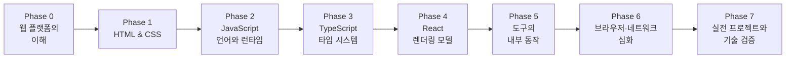

# 웹 프론트엔드 심화 학습 로드맵

> 5년차 이상 경력 개발자(백엔드·모바일 등)를 **내부 동작 원리와 트레이드오프를 근거로 설계 판단을 내릴 수 있는 웹 프론트엔드 엔지니어**로 성장시키기 위한 심화(deep dive) 커리큘럼입니다.
> 모든 교육 문서는 한국어로 작성하며, 이 저장소의 `docs/` 디렉터리에 Phase별로 배치합니다.

---

## 1. 과정 개요

| 항목 | 내용 |
|------|------|
| 대상 | 5년차 이상 경력 개발자 (백엔드·모바일 등 타 분야 출신, 프론트엔드로 전환/확장하려는 사람) |
| 목표 | 도구 사용법이 아니라 **브라우저·언어·프레임워크의 동작 모델**을 갖추고, 기술 선택의 트레이드오프를 설명할 수 있는 수준 |
| 기간 | 총 약 24주 (주 20시간 이상 학습 기준, 경력자의 배경지식에 따라 단축 가능) |
| 주력 스택 | HTML / CSS / JavaScript / TypeScript / React / Next.js |
| 산출물 | Phase별 실습 과제 + 성능·구조 분석 리포트 + 최종 포트폴리오 프로젝트 2개 이상 |

### 학습 원칙

1. **원리 우선** — API 사용법이 아니라 그 아래의 동작 모델(파서, 엔진, 런타임, 네트워크)을 먼저 세운다. 사용법은 모델의 표현으로 익힌다.
2. **트레이드오프 중심** — 모든 기술 선택에는 비용이 있다. "무엇을 쓸까"가 아니라 "이 상황에서 각 선택이 무엇을 얻고 무엇을 포기하는가"를 판단 기준으로 삼는다.
3. **경계 조건 탐색** — 추상화가 무너지는 지점(성능 급락, 스펙의 한계, 프레임워크의 탈출구)을 의도적으로 찾아가며 학습한다.
4. **표준과 1차 자료 중심** — 스펙(WHATWG, ECMA-262, CSSWG)과 공식 문서를 1차 자료로 삼고, 통념과 스펙이 다르면 스펙으로 검증한다.
5. **만들며 검증하기** — 모든 Phase는 실습 과제로 마무리하되, "돌아간다"에서 멈추지 않고 DevTools 계측·분석으로 왜 그렇게 동작하는지까지 확인한다.

---

## 2. 전체 커리큘럼 구조



| Phase | 주제 | 기간(권장) | 핵심 산출물 |
|-------|------|-----------|------------|
| 0 | 웹 플랫폼의 이해 | 1주 | 요청→픽셀 파이프라인 정리 노트 |
| 1 | HTML & CSS — 파싱과 렌더링 모델 | 3주 | 반응형 정적 웹사이트 (접근성 검증 포함) |
| 2 | JavaScript — 언어와 런타임 | 5주 | 바닐라 JS 웹 앱 + 이벤트 루프/메모리 분석 |
| 3 | TypeScript — 타입 시스템 | 2주 | JS 프로젝트의 TS 마이그레이션 + 타입 설계 문서 |
| 4 | React — 렌더링 모델과 상태 아키텍처 | 5주 | React SPA (리렌더 분석 리포트 포함) |
| 5 | 도구의 내부 동작 | 2주 | 테스트/린트/CI가 갖춰진 프로젝트 |
| 6 | 브라우저·네트워크·보안 심화 | 3주 | 성능 개선 리포트, Next.js 앱 |
| 7 | 실전 프로젝트와 기술 검증 | 3주+ | 포트폴리오 프로젝트, 기술 의사결정 기록 |

---

## 3. Phase별 상세 커리큘럼

### Phase 0 — 웹 플랫폼의 이해 (1주)

**학습 목표**: 주소창 입력부터 화면의 픽셀까지 전체 파이프라인의 큰 그림을 세우고, 웹 표준이 만들어지고 브라우저에 구현되는 구조를 이해한다. (Git·터미널 등 일반 개발 도구는 경력자 전제로 다루지 않는다.)

| # | 문서 | 주요 내용 |
|---|------|----------|
| 0-1 | `docs/phase-0/01-how-the-web-works.md` | 주소창에서 픽셀까지: DNS 해석, TCP/TLS 핸드셰이크, HTTP 요청-응답, 파싱→렌더의 큰 그림. 브라우저의 멀티 프로세스 아키텍처(프로세스 분리의 이유와 비용) |
| 0-2 | `docs/phase-0/02-frontend-toolchain.md` | 프론트엔드 툴체인의 지형: 브라우저 밖 JavaScript(Node.js)가 필요한 이유, 트랜스파일·번들·폴리필의 개념적 구분, DevTools를 계측 도구로 쓰는 법 |
| 0-3 | `docs/phase-0/03-web-standards-and-browsers.md` | 웹 표준의 제정 구조(WHATWG/W3C/TC39)와 Living Standard 모델, 브라우저 엔진 지형(Blink/WebKit/Gecko), Baseline으로 호환성을 판단하는 법 |

**실습 과제**: 임의의 웹 페이지 하나를 골라 DevTools Network/Performance 패널로 요청→렌더 과정을 추적하고, 단계별로 무슨 일이 일어나는지 정리 노트를 작성한다.

---

### Phase 1 — HTML & CSS: 파싱과 렌더링 모델 (3주)

**학습 목표**: HTML 파서와 CSS 캐스케이드의 동작 모델을 세우고, 레이아웃 알고리즘과 접근성 트리까지 근거를 갖고 마크업·스타일을 설계할 수 있다.

| # | 문서 | 주요 내용 |
|---|------|----------|
| 1-1 | `docs/phase-1/01-html-basics.md` | HTML 파서의 오류 복구 모델(작성한 마크업 ≠ 생성된 DOM), 파서 블로킹과 스크립트 로딩 전략(defer/async), 콘텐츠 카테고리와 중첩 규칙, 폼 직렬화 메커니즘, 속성(attribute) vs DOM 프로퍼티 |
| 1-2 | `docs/phase-1/02-semantic-html.md` | 시맨틱의 실제 소비자(접근성 트리·크롤러·리더 모드), 랜드마크와 article/section 판단 기준, 아웃라인 알고리즘이 폐기된 이유, SEO 메타데이터 |
| 1-3 | `docs/phase-1/03-css-basics.md` | 값 결정 3단계(캐스케이드→상속→초기값), 명시도 계산과 `!important`가 군비 경쟁인 이유, 박스 모델과 border-box의 근거, 단위 선택 기준 |
| 1-4 | `docs/phase-1/04-css-layout.md` | 정규 흐름과 마진 겹침, BFC, Flexbox/Grid의 배치 알고리즘과 선택 기준, position과 쌓임 맥락(z-index가 전역이 아닌 이유) |
| 1-5 | `docs/phase-1/05-responsive-design.md` | 가상 뷰포트의 역사와 CSS 픽셀/DPR, 모바일 퍼스트의 근거, clamp()/컨테이너 쿼리로 미디어 쿼리 줄이기, srcset/sizes/picture의 역할 분담 |
| 1-6 | `docs/phase-1/06-css-advanced.md` | 커스텀 프로퍼티의 런타임 모델(전처리기 변수와의 차이), 캐스케이드 레이어(@layer), 렌더링 비용 기반 애니메이션 판단(transform/opacity), :has()/:focus-visible |
| 1-7 | `docs/phase-1/07-accessibility.md` | 접근성 트리라는 두 번째 인터페이스, ARIA의 책임 범위(정보만 바꾸고 동작은 주지 않는다), 커스텀 위젯의 포커스 관리, 검증 도구와 한계 |

**실습 과제**: 자기소개 페이지 → 실제 서비스 랜딩 페이지 클론을 반응형으로 제작하고 GitHub Pages로 배포한다. 접근성(Lighthouse ≥90, 키보드 완주)과 구조 분석 리포트를 포함한다. 상세 기준은 [exercises/phase-1](exercises/phase-1/README.md) 참고.

---

### Phase 2 — JavaScript: 언어와 런타임 (5주)

**학습 목표**: ECMAScript의 실행 모델(실행 컨텍스트, 프로토타입, 이벤트 루프)과 브라우저 런타임의 상호작용을 메커니즘 수준에서 설명할 수 있고, 프레임워크 없이 동작하는 웹 앱을 만들 수 있다.

| # | 문서 | 주요 내용 |
|---|------|----------|
| 2-1 | `docs/phase-2/01-execution-model.md` | 실행 컨텍스트와 렉시컬 환경(Environment Record), 호이스팅의 실체와 TDZ, 스코프 체인, this 바인딩 4가지 규칙과 결정 시점 |
| 2-2 | `docs/phase-2/02-closures-and-functions.md` | 클로저의 메모리 모델(무엇이 캡처되고 언제 해제되는가), 고차 함수 패턴, 화살표 함수가 this를 바인딩하지 않는 설계 의도 |
| 2-3 | `docs/phase-2/03-types-and-coercion.md` | 동적 타입 시스템과 암묵적 변환의 알고리즘(ToPrimitive 등 추상 연산), `==`의 실제 판정 규칙, NaN/-0/BigInt 경계 사례 |
| 2-4 | `docs/phase-2/04-object-model.md` | 프로토타입 체인의 탐색·섀도잉 메커니즘, property descriptor, class 문법이 감추는 것과 감추지 못하는 것, private 필드(#) |
| 2-5 | `docs/phase-2/05-event-loop.md` | 콜 스택·태스크 큐·마이크로태스크의 우선순위 규칙, 렌더링 파이프라인과의 상호작용, requestAnimationFrame, Node.js 이벤트 루프와의 차이 |
| 2-6 | `docs/phase-2/06-promises-and-async.md` | Promise 상태 머신과 then 체이닝 규칙, async/await가 어떻게 변환되는가, 에러 전파 경로, AbortController와 취소, 동시성 제어 패턴 |
| 2-7 | `docs/phase-2/07-dom-and-events.md` | DOM 조작의 비용 모델(왜 느린가), live vs static 컬렉션, 이벤트 전파 3단계와 위임, 커스텀 이벤트로 컴포넌트 간 통신 |
| 2-8 | `docs/phase-2/08-network-apis.md` | fetch의 설계(Response 스트림, body를 한 번만 읽을 수 있는 이유), HTTP 캐시와의 협력, 네트워크 에러 vs HTTP 에러, CORS 개요(심화는 6-2) |
| 2-9 | `docs/phase-2/09-modules.md` | ESM vs CommonJS: 정적 구조와 라이브 바인딩, 순환 의존 처리 방식의 차이, 모듈 그래프 — 트리 셰이킹이 성립하는 전제 |
| 2-10 | `docs/phase-2/10-memory-and-storage.md` | V8의 세대별 GC와 도달 가능성, 프론트엔드 특유의 누수 패턴(리스너·클로저·캐시), 브라우저 저장소(localStorage/IndexedDB/쿠키)의 트레이드오프와 보안 속성 |

**실습 과제**: 바닐라 JS로 Todo 앱(로컬 스토리지 저장) 제작 → 공개 API 검색/조회 앱 제작. DevTools Performance/Memory 패널로 이벤트 루프 동작과 메모리 누수 여부를 직접 계측해 분석 노트를 남긴다.

---

### Phase 3 — TypeScript: 타입 시스템 (2주)

**학습 목표**: 구조적 타입 시스템의 판정 규칙을 이해하고, 타입으로 도메인 제약을 표현하는 설계와 타입 레벨 프로그래밍을 구사할 수 있다.

| # | 문서 | 주요 내용 |
|---|------|----------|
| 3-1 | `docs/phase-3/01-type-system-foundations.md` | 구조적 타이핑(structural typing) vs 명목적 타이핑, 할당 가능성 판정 규칙, 타입 추론과 넓히기/좁히기, any/unknown/never의 타입 격자 상 위치 |
| 3-2 | `docs/phase-3/02-type-design.md` | interface vs type의 실제 차이(선언 병합, 표시 방식), 판별 유니언(discriminated union)과 철저성 검사, enum의 문제와 대안(const 객체, 리터럴 유니언) |
| 3-3 | `docs/phase-3/03-generics-and-variance.md` | 제네릭 타입 인자의 추론 동작, 제약(constraints), 변성(variance): 공변/반공변과 메서드 축약 표기가 만드는 구멍 |
| 3-4 | `docs/phase-3/04-type-level-programming.md` | 조건부 타입과 유니언 분배, infer, mapped type, template literal type — 유틸리티 타입(Partial, ReturnType 등)을 직접 구현하며 원리 이해 |
| 3-5 | `docs/phase-3/05-compiler-and-config.md` | tsc 파이프라인(타입 검사와 트랜스파일의 분리 — 왜 esbuild는 검사를 안 하는가), tsconfig strict 계열 옵션 각각의 근거, 선언 파일(.d.ts)과 모듈 해석 |

**실습 과제**: Phase 2 프로젝트를 TypeScript로 마이그레이션한다. any 0개를 목표로 하되, 타입 단언이 필요했던 지점마다 "왜 추론이 실패했는가"를 기록한 타입 설계 문서를 함께 작성한다.

---

### Phase 4 — React: 렌더링 모델과 상태 아키텍처 (5주)

**학습 목표**: React의 렌더링 파이프라인(렌더/커밋, 재조정)을 모델로 세우고, 리렌더·이펙트·상태 배치를 근거를 갖고 설계·진단할 수 있다.

| # | 문서 | 주요 내용 |
|---|------|----------|
| 4-1 | `docs/phase-4/01-react-mental-model.md` | UI를 상태의 함수로 보는 모델과 그 비용, JSX가 컴파일되는 결과물(createElement/jsx 런타임), 직접 DOM 조작 대비 무엇을 얻고 무엇을 포기하는가 |
| 4-2 | `docs/phase-4/02-rendering-and-reconciliation.md` | 렌더 단계와 커밋 단계의 분리, 재조정 휴리스틱(타입 비교, key의 실제 역할), 리렌더가 전파되는 규칙 — "부모가 렌더하면 자식도 렌더한다" |
| 4-3 | `docs/phase-4/03-state-and-batching.md` | useState의 내부(훅이 호출 순서에 의존하는 이유), 상태 갱신의 자동 배칭과 스냅샷 의미론, 불변성이 전제인 이유, 제어 컴포넌트와 폼 |
| 4-4 | `docs/phase-4/04-effects.md` | useEffect의 실행 시점과 클린업 사이클, 의존성 배열과 stale closure, 데이터 페칭의 race condition 처리, "이펙트가 필요 없는 경우"의 판별 |
| 4-5 | `docs/phase-4/05-performance-model.md` | 메모이제이션의 비용-편익 분석(useMemo/useCallback/memo가 역효과인 경우), React DevTools Profiler로 리렌더 진단, React Compiler의 접근 |
| 4-6 | `docs/phase-4/06-state-architecture.md` | Context의 리렌더 전파 문제, 외부 스토어와 useSyncExternalStore(tearing), 상태를 어디에 둘 것인가 — 지역/전역/서버 상태의 구분 기준 |
| 4-7 | `docs/phase-4/07-routing-and-code-splitting.md` | 클라이언트 라우팅의 동작(History API), React Router 모델, lazy/Suspense와 라우트 단위 분할 |
| 4-8 | `docs/phase-4/08-server-state.md` | TanStack Query의 캐싱 모델(stale-while-revalidate), 캐시 키 설계와 무효화 전략, 서버 상태를 클라이언트 상태와 분리해야 하는 이유 |
| 4-9 | `docs/phase-4/09-styling-strategies.md` | CSS Modules / Tailwind / CSS-in-JS의 빌드 타임·런타임 비용 비교, 각 접근이 무너지는 지점과 선택 기준 |

**실습 과제**: React + TypeScript로 API 연동 SPA(상품 목록/상세/장바구니, 게시판 등) 제작. React DevTools Profiler로 불필요한 리렌더를 찾아 개선한 전/후 비교 리포트를 포함한다.

---

### Phase 5 — 도구의 내부 동작 (2주)

**학습 목표**: 패키지 매니저·번들러·린터·테스트 러너를 블랙박스가 아니라 동작 원리 수준에서 이해하고, 문제가 생겼을 때 어느 계층을 의심할지 판단할 수 있다.

| # | 문서 | 주요 내용 |
|---|------|----------|
| 5-1 | `docs/phase-5/01-package-management.md` | 의존성 해석 알고리즘과 lockfile의 역할, node_modules 평탄화(호이스팅)의 문제와 pnpm의 링크 구조, semver 범위 지정의 함정(유령 의존성, 중복 설치) |
| 5-2 | `docs/phase-5/02-bundlers.md` | 모듈 그래프 구성과 번들링, 트리 셰이킹이 성립하는 조건(사이드 이펙트 판정), Vite의 이중 구조(개발: 네이티브 ESM + esbuild, 빌드: Rollup)와 HMR의 원리 |
| 5-3 | `docs/phase-5/03-static-analysis.md` | AST 기반 도구의 동작(ESLint 규칙이 코드를 읽는 방식), 린터와 포매터의 역할 분리, 타입 인지(type-aware) 린트의 비용 |
| 5-4 | `docs/phase-5/04-testing-strategy.md` | 무엇을 테스트할 것인가(테스팅 트로피, 구현 상세 vs 동작), React Testing Library의 쿼리 철학, mock의 비용과 경계, Vitest 동작 구조 |
| 5-5 | `docs/phase-5/05-ci-and-deployment.md` | CI 파이프라인 설계(캐싱, 병렬화), 미리보기 배포의 동작, 정적 호스팅과 CDN 캐시 무효화 전략 |

**실습 과제**: Phase 4 프로젝트에 린트/포맷/테스트/CI/자동 배포를 적용한다. 번들 분석 도구로 산출물을 열어 트리 셰이킹 여부와 청크 구성을 검증한다.

---

### Phase 6 — 브라우저·네트워크·보안 심화 (3주)

**학습 목표**: 렌더링 파이프라인·HTTP·보안 모델을 계층 수준에서 이해하고, 성능·보안·렌더링 전략을 측정과 근거에 기반해 결정할 수 있다.

| # | 문서 | 주요 내용 |
|---|------|----------|
| 6-1 | `docs/phase-6/01-browser-rendering.md` | 스타일 재계산→레이아웃→페인트→합성 파이프라인, 강제 동기 레이아웃(layout thrashing)의 발생 조건, 컴포지터 스레드와 레이어 승격의 비용 |
| 6-2 | `docs/phase-6/02-network-deep-dive.md` | HTTP/1.1의 HOL 블로킹과 2/3(멀티플렉싱, QUIC)의 해법·잔여 한계, 캐싱 헤더의 협상 모델(Cache-Control, ETag), CORS의 동작 원리(preflight가 존재하는 이유) |
| 6-3 | `docs/phase-6/03-web-performance.md` | Core Web Vitals(LCP/CLS/INP)의 계측 원리, 로딩 워터폴 분석과 크리티컬 패스, 코드 스플리팅·리소스 힌트·이미지 최적화의 우선순위 판단 |
| 6-4 | `docs/phase-6/04-web-security.md` | XSS 공격 벡터와 방어 계층(이스케이프, CSP, Trusted Types), CSRF와 SameSite 쿠키, 토큰 저장 위치의 트레이드오프(JWT vs 세션, localStorage vs httpOnly 쿠키) |
| 6-5 | `docs/phase-6/05-rendering-strategies.md` | CSR/SSR/SSG/ISR의 비용 구조 비교(TTFB vs 인터랙티브 시점), 하이드레이션의 실체와 비용, 스트리밍 SSR과 선택적 하이드레이션 |
| 6-6 | `docs/phase-6/06-nextjs-and-rsc.md` | Next.js App Router, React Server Components의 실행 모델(서버-클라이언트 직렬화 경계), 서버/클라이언트 컴포넌트 분리 기준과 캐싱 계층 |

**실습 과제**: Phase 5 프로젝트의 Core Web Vitals를 계측·개선하고 원인-조치-효과를 담은 성능 리포트 작성 → Next.js(App Router)로 SSR/RSC 적용 미니 프로젝트 제작.

---

### Phase 7 — 실전 프로젝트와 기술 검증 (3주+)

**학습 목표**: 기획부터 배포까지 프로젝트를 완주하며 기술 의사결정을 문서로 남기고, 원리 수준의 기술 질문에 대응할 수 있다.

| # | 문서 | 주요 내용 |
|---|------|----------|
| 7-1 | `docs/phase-7/01-project-guide.md` | 프로젝트 기획과 요구사항 정의, 기술 선택의 근거를 남기는 법(ADR), 일정 관리와 협업 워크플로 |
| 7-2 | `docs/phase-7/02-code-quality-and-review.md` | 코드 리뷰의 관점(정합성·설계·성능·경계 조건), 리팩터링 전략, 폴더 구조와 아키텍처 경계의 트레이드오프 |
| 7-3 | `docs/phase-7/03-portfolio-and-resume.md` | 깊이가 드러나는 포트폴리오(문제→접근→측정된 결과 구조), README 작성, 이력서 |
| 7-4 | `docs/phase-7/04-interview-prep.md` | 원리 기반 기술 면접 대응 — 각 Phase에서 다룬 "왜"를 면접 답변으로 전환하기, 시스템 설계형 프론트엔드 질문 |

**실습 과제**: 자유 주제 포트폴리오 프로젝트 완성(팀 프로젝트 권장). 주요 기술 선택마다 ADR을 남기고, 배포 및 회고를 작성한다.

---

## 4. 저장소 구조

```
web-fe-roadmap-study/
├── ROADMAP.md              # 이 문서 (전체 커리큘럼)
├── docs/
│   ├── phase-0/            # 웹 플랫폼의 이해
│   ├── phase-1/            # HTML & CSS — 파싱과 렌더링 모델
│   ├── phase-2/            # JavaScript — 언어와 런타임
│   ├── phase-3/            # TypeScript — 타입 시스템
│   ├── phase-4/            # React — 렌더링 모델과 상태 아키텍처
│   ├── phase-5/            # 도구의 내부 동작
│   ├── phase-6/            # 브라우저·네트워크·보안 심화
│   └── phase-7/            # 실전 프로젝트와 기술 검증
├── plan/                   # Phase별 학습 기획 문서
└── exercises/              # Phase별 실습 과제 안내 및 예시 코드
```

### 문서 작성 규칙

문서의 구조, 서술 스타일, 품질 기준 등 집필 지침은 **[CLAUDE.md](CLAUDE.md)** 를 따른다. 핵심만 요약하면:

- 모든 문서는 **한국어**로 작성하며, 기술 용어는 첫 등장 시 원어를 병기한다. 예: 클로저(closure)
- 독자는 5년차 이상 경력 개발자이므로 프로그래밍 기초 설명은 생략하고, 프론트엔드 고유의 동작 원리와 판단 기준에 집중한다.
- 모든 주요 주제는 **3층위**를 갖춰 서술한다: 동작 모델(내부에서 무슨 일이 일어나는가) → 설계 배경(왜 이렇게 설계되었는가) → 경계 조건(언제 무너지는가).
- 각 문서는 `학습 목표 → 배경 → 핵심 개념 → 실무 관점 → 더 깊이 → 정리 → 확인 문제 → 참고 자료` 구조를 따른다.
- 문서 분량은 1개당 45분~1시간 30분 내에 읽고 따라 할 수 있는 수준을 유지한다. 분량을 줄일 때는 깊이가 아니라 주제의 폭을 줄인다.

---

## 5. 진행 현황

문서 작성 진행 상황을 이 표에서 추적합니다. (✅ 완료 / 🚧 작성 중 / ⬜ 예정)

| Phase | 문서 수 | 상태 |
|-------|--------|------|
| Phase 0 — 웹 플랫폼의 이해 | 3 | ✅ 완료 |
| Phase 1 — HTML & CSS | 7 | ✅ 완료 |
| Phase 2 — JavaScript 언어와 런타임 | 10 | ⬜ 예정 |
| Phase 3 — TypeScript 타입 시스템 | 5 | ⬜ 예정 |
| Phase 4 — React 렌더링 모델 | 9 | ⬜ 예정 |
| Phase 5 — 도구의 내부 동작 | 5 | ⬜ 예정 |
| Phase 6 — 브라우저·네트워크·보안 심화 | 6 | ⬜ 예정 |
| Phase 7 — 실전 프로젝트와 기술 검증 | 4 | ⬜ 예정 |

**다음 단계**: Phase 2 문서부터 순서대로 작성합니다.
