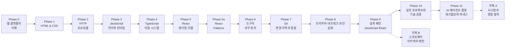

# 웹 프론트엔드 심화 학습 로드맵

> 5년차 이상 경력 개발자(백엔드·모바일 등)를 **내부 동작 원리와 트레이드오프를 근거로 설계 판단을 내릴 수 있는 웹 프론트엔드 엔지니어**로 성장시키기 위한 심화(deep dive) 커리큘럼입니다.
> 모든 교육 문서는 한국어로 작성하며, 이 저장소의 `docs/` 디렉터리에 Phase별·부록별로 배치합니다.

---

## 1. 과정 개요

| 항목 | 내용 |
|------|------|
| 대상 | 5년차 이상 경력 개발자 (백엔드·모바일 등 타 분야 출신, 프론트엔드로 전환/확장하려는 사람) |
| 목표 | 도구 사용법이 아니라 **브라우저·언어·프레임워크·협업 도구의 동작 모델**을 갖추고, 기술 선택의 트레이드오프를 설명할 수 있는 수준 |
| 기간 | 본 과정 약 35주 이상 + 부록 선택 학습 (주 20시간 이상 학습 기준, 경력자의 배경지식에 따라 단축 가능) |
| 주력 스택 | HTML / CSS / JavaScript / TypeScript / React / Next.js / Git |
| 산출물 | Phase별 실습 과제 + 성능·구조 분석 리포트 + Git 운영 플레이북 + 최종 포트폴리오 프로젝트 2개 이상. 부록 A는 상황별 사고법 레퍼런스, 부록 B는 아키텍처 비교표·선택 ADR·진화 경로 리포트로 활용 |

### 학습 원칙

1. **원리 우선** — API 사용법이 아니라 그 아래의 동작 모델(파서, 엔진, 런타임, 네트워크)을 먼저 세운다. 사용법은 모델의 표현으로 익힌다.
2. **트레이드오프 중심** — 모든 기술 선택에는 비용이 있다. "무엇을 쓸까"가 아니라 "이 상황에서 각 선택이 무엇을 얻고 무엇을 포기하는가"를 판단 기준으로 삼는다.
3. **경계 조건 탐색** — 추상화가 무너지는 지점(성능 급락, 스펙의 한계, 프레임워크의 탈출구)을 의도적으로 찾아가며 학습한다.
4. **표준과 1차 자료 중심** — 스펙(WHATWG, ECMA-262, CSSWG, HTTP RFC), Git 공식 문서, 각 도구의 공식 문서를 1차 자료로 삼고, 통념과 1차 자료가 다르면 1차 자료로 검증한다.
5. **만들며 검증하기** — 본 과정의 모든 Phase는 실습 과제로 마무리하되, "돌아간다"에서 멈추지 않고 DevTools 계측, Git 커밋 그래프 분석, 테스트 결과 등으로 왜 그렇게 동작하는지까지 확인한다. 부록 A는 과제 대신 실제 상황을 해석하는 사고 도구로, 부록 B는 기존 시스템을 품질 속성과 실패 시나리오로 분석하는 설계 도구로 다룬다.

---

## 2. 전체 커리큘럼 구조



| Phase | 주제 | 기간(권장) | 핵심 산출물 |
|-------|------|-----------|------------|
| 0 | 웹 플랫폼의 이해 | 1주 | 요청→픽셀 파이프라인 정리 노트 |
| 1 | HTML & CSS — 파싱과 렌더링 모델 | 3주 | 반응형 정적 웹사이트 (접근성 검증 포함) |
| 2 | HTTP — 프로토콜의 이해 | 2주 | 실서비스 HTTP 트래픽 분석 리포트 |
| 3 | JavaScript — 언어와 런타임 | 5주 | 바닐라 JS 웹 앱 + 이벤트 루프/메모리 분석 |
| 4 | TypeScript — 타입 시스템 | 2주 | JS 프로젝트의 TS 마이그레이션 + 타입 설계 문서 |
| 5 | React — 렌더링 모델과 상태 아키텍처 | 5주 | React SPA (리렌더 분석 리포트 포함) |
| 5a | React Patterns — 컴포넌트 합성과 로직 재사용 | 2주 | 패턴 비교 리포트, headless/compound 컴포넌트와 스트리밍 AI UI 샘플 |
| 6 | 도구의 내부 동작 | 2주 | 테스트/린트/CI가 갖춰진 프로젝트 |
| 7 | Git — 변경 이력과 협업 모델 | 3주 | Git 운영 플레이북, 충돌 해결·이력 복구 리포트 |
| 8 | 브라우저·네트워크·보안 심화 | 3주 | 성능 개선 리포트, Next.js 앱 |
| 9 | 설계 패턴 — JavaScript와 React 컴포넌트 패턴 | 2주 | 패턴 리팩터링 리포트, React 컴포넌트 패턴 샘플 |
| 10 | 실전 프로젝트와 기술 검증 | 3주+ | 포트폴리오 프로젝트, 기술 의사결정 기록 |
| 11 | AI 에이전트 활용 — 프론트엔드 개발 워크플로와 하네스 설계 | 2주+ | agent-ready 저장소 지시문, 에이전트 워크플로 플레이북, 검증 리포트 |
| 부록 A | 사고법과 경험 법칙 — hacker-laws 재분류 | 선택/상시 | 과제 없음. 상황별 판단 질문과 법칙 레퍼런스 |
| 부록 B | 소프트웨어 아키텍처 패턴 — 경계·흐름·분산 시스템 | 선택/상시 | 아키텍처 비교표, 선택 ADR, 점진적 진화 경로 리포트 |

---

## 3. Phase별·부록별 상세 커리큘럼

### Phase 0 — 웹 플랫폼의 이해 (1주)

**학습 목표**: 주소창 입력부터 화면의 픽셀까지 전체 파이프라인의 큰 그림을 세우고, 웹 표준이 만들어지고 브라우저에 구현되는 구조를 이해한다. (터미널 등 일반 개발 도구는 경력자 전제로 다루지 않는다. Git의 변경 이력·협업 모델은 Phase 7에서 별도로 다룬다.)

| # | 문서 | 주요 내용 |
|---|------|----------|
| 0-1 | `docs/phase-0/01-how-the-web-works.md` | 주소창에서 픽셀까지: DNS 해석, TCP/TLS 핸드셰이크, HTTP 요청-응답, 파싱→렌더의 큰 그림. 브라우저의 멀티 프로세스 아키텍처(프로세스 분리의 이유와 비용) |
| 0-2 | `docs/phase-0/02-frontend-toolchain.md` | 프론트엔드 툴체인의 지형: 브라우저 밖 JavaScript(Node.js)가 필요한 이유, 트랜스파일·번들·폴리필의 개념적 구분, DevTools를 계측 도구로 쓰는 법 |
| 0-3 | `docs/phase-0/03-web-standards-and-browsers.md` | 웹 표준의 제정 구조(WHATWG/W3C/TC39)와 Living Standard 모델, 브라우저 엔진 지형(Blink/WebKit/Gecko), Baseline으로 호환성을 판단하는 법 |

**실습 과제**: 임의의 웹 페이지 하나를 골라 DevTools Network/Performance 패널로 요청→렌더 과정을 추적하고, 단계별로 무슨 일이 일어나는지 정리 노트를 작성한다.

---

### Phase 1 — HTML & CSS: 파싱과 렌더링 모델 (3주)

**학습 목표**: HTML 파서와 CSS 캐스케이드의 동작 모델을 세우고, 레이아웃 알고리즘과 접근성 트리까지 근거를 갖고 마크업·스타일을 설계할 수 있다.

| # | 문서 | 주요 내용 |
|---|------|----------|
| 1-1 | `docs/phase-1/01-html-basics.md` | HTML 파서의 오류 복구 모델(작성한 마크업 ≠ 생성된 DOM), 파서 블로킹과 스크립트 로딩 전략(defer/async), 콘텐츠 카테고리와 중첩 규칙, 폼 직렬화 메커니즘, 속성(attribute) vs DOM 프로퍼티 |
| 1-2 | `docs/phase-1/02-semantic-html.md` | 시맨틱의 실제 소비자(접근성 트리·크롤러·리더 모드), 랜드마크와 article/section 판단 기준, 아웃라인 알고리즘이 폐기된 이유, SEO 메타데이터 |
| 1-3 | `docs/phase-1/03-css-basics.md` | 값 결정 3단계(캐스케이드→상속→초기값), 명시도 계산과 `!important`가 군비 경쟁인 이유, 박스 모델과 border-box의 근거, 단위 선택 기준 |
| 1-4 | `docs/phase-1/04-css-layout.md` | 정규 흐름과 마진 겹침, BFC, Flexbox/Grid의 배치 알고리즘과 선택 기준, position과 쌓임 맥락(z-index가 전역이 아닌 이유) |
| 1-5 | `docs/phase-1/05-responsive-design.md` | 가상 뷰포트의 역사와 CSS 픽셀/DPR, 모바일 퍼스트의 근거, clamp()/컨테이너 쿼리로 미디어 쿼리 줄이기, srcset/sizes/picture의 역할 분담 |
| 1-6 | `docs/phase-1/06-css-advanced.md` | 커스텀 프로퍼티의 런타임 모델(전처리기 변수와의 차이), 캐스케이드 레이어(@layer), 렌더링 비용 기반 애니메이션 판단(transform/opacity), :has()/:focus-visible |
| 1-7 | `docs/phase-1/07-accessibility.md` | 접근성 트리라는 두 번째 인터페이스, ARIA의 책임 범위(정보만 바꾸고 동작은 주지 않는다), 커스텀 위젯의 포커스 관리, 검증 도구와 한계 |

**실습 과제**: 자기소개 페이지 → 실제 서비스 랜딩 페이지 클론을 반응형으로 제작하고 GitHub Pages로 배포한다. 접근성(Lighthouse ≥90, 키보드 완주)과 구조 분석 리포트를 포함한다. 상세 기준은 [exercises/phase-1](exercises/phase-1/README.md) 참고.

---

### Phase 2 — HTTP: 프로토콜의 이해 (2주)

**학습 목표**: HTTP를 의미론(semantics)과 전송(transport)의 두 계층으로 나눠 이해하고, 캐싱·상태 관리·프로토콜 버전 선택을 RFC 9110~9114 스펙을 근거로 판단할 수 있다. 프론트엔드가 보내고 받는 모든 바이트의 규약을 세우는 Phase다.

| # | 문서 | 주요 내용 |
|---|------|----------|
| 2-1 | `docs/phase-2/01-http-semantics.md` | **[기초]** HTTP 메시지의 구조와 의미론(RFC 9110): 메서드의 안전성(safe)·멱등성(idempotent)이 재시도·캐시·프리페치의 근거가 되는 구조, 상태 코드의 분류와 실무 오용 사례, 표현(representation)과 콘텐츠 협상 |
| 2-2 | `docs/phase-2/02-http-caching.md` | **[기초]** HTTP 캐싱 모델: 신선도(Cache-Control)와 재검증(ETag/Last-Modified, 조건부 요청)의 2단 구조, 공유 캐시와 사설 캐시, 불변 자산의 캐시 영구화 패턴(콘텐츠 해시), 캐시가 무너지는 경계 조건 |
| 2-3 | `docs/phase-2/03-cookies-and-state.md` | **[기초]** 무상태 프로토콜 위의 상태: 쿠키의 동작 모델과 속성(Domain/Path/Secure/HttpOnly/SameSite)의 보안 함의, 세션 vs 토큰의 트레이드오프, 쿠키가 요청마다 실어 나르는 비용 (보안 공격·방어 심화는 7-4) |
| 2-4 | `docs/phase-2/04-http-versions.md` | **[심화]** 연결 관리와 프로토콜 진화: HTTP/1.1 keep-alive와 HOL 블로킹, HTTP/2 멀티플렉싱·스트림 우선순위와 남은 한계(TCP 계층 HOL), HTTP/3와 QUIC이 UDP 위에 다시 만든 것, 버전별 선택 기준 |
| 2-5 | `docs/phase-2/05-https-and-tls.md` | **[심화]** HTTPS의 동작 모델: TLS 핸드셰이크가 지연에 미치는 비용(1.3의 개선, 0-RTT), 인증서 체인과 신뢰 모델, HSTS, mixed content — HTTPS가 사실상 필수가 된 플랫폼 정책(Secure Context 전용 API) |

**실습 과제**: 실서비스 하나를 골라 DevTools Network 패널과 `curl -v`로 HTTP 트래픽을 분석한다 — 프로토콜 버전, 캐싱 정책, 쿠키 속성, 압축·협상 헤더를 항목별로 평가하고 개선안을 담은 분석 리포트를 작성한다.

---

### Phase 3 — JavaScript: 언어와 런타임 (5주)

**학습 목표**: ECMAScript의 실행 모델(실행 컨텍스트, 프로토타입, 이벤트 루프)과 브라우저 런타임의 상호작용을 메커니즘 수준에서 설명할 수 있고, 프레임워크 없이 동작하는 웹 앱을 만들 수 있다.

| # | 문서 | 주요 내용 |
|---|------|----------|
| 3-1 | `docs/phase-3/01-execution-model.md` | 실행 컨텍스트와 렉시컬 환경(Environment Record), 호이스팅의 실체와 TDZ, 스코프 체인, this 바인딩 4가지 규칙과 결정 시점 |
| 3-2 | `docs/phase-3/02-closures-and-functions.md` | 클로저의 메모리 모델(무엇이 캡처되고 언제 해제되는가), 고차 함수 패턴, 화살표 함수가 this를 바인딩하지 않는 설계 의도 |
| 3-3 | `docs/phase-3/03-types-and-coercion.md` | 동적 타입 시스템과 암묵적 변환의 알고리즘(ToPrimitive 등 추상 연산), `==`의 실제 판정 규칙, NaN/-0/BigInt 경계 사례 |
| 3-4 | `docs/phase-3/04-object-model.md` | 프로토타입 체인의 탐색·섀도잉 메커니즘, property descriptor, class 문법이 감추는 것과 감추지 못하는 것, private 필드(#) |
| 3-5 | `docs/phase-3/05-event-loop.md` | 콜 스택·태스크 큐·마이크로태스크의 우선순위 규칙, 렌더링 파이프라인과의 상호작용, requestAnimationFrame, Node.js 이벤트 루프와의 차이 |
| 3-6 | `docs/phase-3/06-promises-and-async.md` | Promise 상태 머신과 then 체이닝 규칙, async/await가 어떻게 변환되는가, 에러 전파 경로, AbortController와 취소, 동시성 제어 패턴 |
| 3-7 | `docs/phase-3/07-dom-and-events.md` | DOM 조작의 비용 모델(왜 느린가), live vs static 컬렉션, 이벤트 전파 3단계와 위임, 커스텀 이벤트로 컴포넌트 간 통신 |
| 3-8 | `docs/phase-3/08-network-apis.md` | fetch의 설계(Response 스트림, body를 한 번만 읽을 수 있는 이유), HTTP 캐시와의 협력(캐싱 모델은 Phase 2-2 전제), 네트워크 에러 vs HTTP 에러, CORS 개요(심화는 7-2) |
| 3-9 | `docs/phase-3/09-modules.md` | ESM vs CommonJS: 정적 구조와 라이브 바인딩, 순환 의존 처리 방식의 차이, 모듈 그래프 — 트리 셰이킹이 성립하는 전제 |
| 3-10 | `docs/phase-3/10-memory-and-storage.md` | V8의 세대별 GC와 도달 가능성, 프론트엔드 특유의 누수 패턴(리스너·클로저·캐시), 브라우저 저장소(localStorage/IndexedDB/쿠키)의 트레이드오프와 보안 속성 |

**실습 과제**: 바닐라 JS로 Todo 앱(로컬 스토리지 저장) 제작 → 공개 API 검색/조회 앱 제작. DevTools Performance/Memory 패널로 이벤트 루프 동작과 메모리 누수 여부를 직접 계측해 분석 노트를 남긴다.

---

### Phase 4 — TypeScript: 타입 시스템 (2주)

**학습 목표**: 구조적 타입 시스템의 판정 규칙을 이해하고, 타입으로 도메인 제약을 표현하는 설계와 타입 레벨 프로그래밍을 구사할 수 있다.

| # | 문서 | 주요 내용 |
|---|------|----------|
| 4-1 | `docs/phase-4/01-type-system-foundations.md` | 구조적 타이핑(structural typing) vs 명목적 타이핑, 할당 가능성 판정 규칙, 타입 추론과 넓히기/좁히기, any/unknown/never의 타입 격자 상 위치 |
| 4-2 | `docs/phase-4/02-type-design.md` | interface vs type의 실제 차이(선언 병합, 표시 방식), 판별 유니언(discriminated union)과 철저성 검사, enum의 문제와 대안(const 객체, 리터럴 유니언) |
| 4-3 | `docs/phase-4/03-generics-and-variance.md` | 제네릭 타입 인자의 추론 동작, 제약(constraints), 변성(variance): 공변/반공변과 메서드 축약 표기가 만드는 구멍 |
| 4-4 | `docs/phase-4/04-type-level-programming.md` | 조건부 타입과 유니언 분배, infer, mapped type, template literal type — 유틸리티 타입(Partial, ReturnType 등)을 직접 구현하며 원리 이해 |
| 4-5 | `docs/phase-4/05-compiler-and-config.md` | tsc 파이프라인(타입 검사와 트랜스파일의 분리 — 왜 esbuild는 검사를 안 하는가), tsconfig strict 계열 옵션 각각의 근거, 선언 파일(.d.ts)과 모듈 해석 |

**실습 과제**: Phase 3 프로젝트를 TypeScript로 마이그레이션한다. any 0개를 목표로 하되, 타입 단언이 필요했던 지점마다 "왜 추론이 실패했는가"를 기록한 타입 설계 문서를 함께 작성한다.

---

### Phase 5 — React: 렌더링 모델과 상태 아키텍처 (5주)

**학습 목표**: React의 렌더링 파이프라인(렌더/커밋, 재조정)을 모델로 세우고, 리렌더·이펙트·상태 배치를 근거를 갖고 설계·진단할 수 있다.

| # | 문서 | 주요 내용 |
|---|------|----------|
| 5-1 | `docs/phase-5/01-react-mental-model.md` | UI를 상태의 함수로 보는 모델과 그 비용, JSX가 컴파일되는 결과물(createElement/jsx 런타임), 직접 DOM 조작 대비 무엇을 얻고 무엇을 포기하는가 |
| 5-2 | `docs/phase-5/02-rendering-and-reconciliation.md` | 렌더 단계와 커밋 단계의 분리, 재조정 휴리스틱(타입 비교, key의 실제 역할), 리렌더가 전파되는 규칙 — "부모가 렌더하면 자식도 렌더한다" |
| 5-3 | `docs/phase-5/03-state-and-batching.md` | useState의 내부(훅이 호출 순서에 의존하는 이유), 상태 갱신의 자동 배칭과 스냅샷 의미론, 불변성이 전제인 이유, 제어 컴포넌트와 폼 |
| 5-4 | `docs/phase-5/04-effects.md` | useEffect의 실행 시점과 클린업 사이클, 의존성 배열과 stale closure, 데이터 페칭의 race condition 처리, "이펙트가 필요 없는 경우"의 판별 |
| 5-5 | `docs/phase-5/05-performance-model.md` | 메모이제이션의 비용-편익 분석(useMemo/useCallback/memo가 역효과인 경우), React DevTools Profiler로 리렌더 진단, React Compiler의 접근 |
| 5-6 | `docs/phase-5/06-state-architecture.md` | Context의 리렌더 전파 문제, 외부 스토어와 useSyncExternalStore(tearing), 상태를 어디에 둘 것인가 — 지역/전역/서버 상태의 구분 기준 |
| 5-7 | `docs/phase-5/07-routing-and-code-splitting.md` | 클라이언트 라우팅의 동작(History API), React Router 모델, lazy/Suspense와 라우트 단위 분할 |
| 5-8 | `docs/phase-5/08-server-state.md` | TanStack Query의 캐싱 모델(stale-while-revalidate — HTTP 캐싱(2-2)과 같은 문제의 애플리케이션 계층 해법), 캐시 키 설계와 무효화 전략, 서버 상태를 클라이언트 상태와 분리해야 하는 이유 |
| 5-9 | `docs/phase-5/09-styling-strategies.md` | CSS Modules / Tailwind / CSS-in-JS의 빌드 타임·런타임 비용 비교, 각 접근이 무너지는 지점과 선택 기준 |

**실습 과제**: React + TypeScript로 API 연동 SPA(상품 목록/상세/장바구니, 게시판 등) 제작. React DevTools Profiler로 불필요한 리렌더를 찾아 개선한 전/후 비교 리포트를 포함한다.

---

### Phase 5a — React Patterns: 컴포넌트 합성과 로직 재사용 (2주)

**학습 목표**: Phase 5의 렌더링·상태 모델을 바탕으로 React에서 로직과 UI를 합성하는 주요 패턴의 데이터 흐름과 비용을 설명하고, 레거시 패턴을 읽거나 현대적 대안으로 전환하며, 제품 요구사항에 맞는 UI·애플리케이션 스택을 근거 있게 선택할 수 있다.

**운영 원칙**: HOC·Container/Presentational·Render Props는 역사적 패턴으로만 치부하지 않고 장기 운영 코드와 라이브러리 API를 해석하는 도구로 학습한다. 동시에 같은 문제를 custom hook·Context·일반 합성으로 풀었을 때의 컴포넌트 트리, 타입 추론, 테스트 가능성, 리렌더 비용을 비교한다. 특정 AI SDK·프레임워크·라이브러리의 버전별 API는 고정 지식으로 암기하지 않고 공식 문서로 재검증하며, Phase 9에서는 이 구현 경험을 더 넓은 JavaScript 설계 패턴과 연결해 선택 기준을 심화한다.

| # | 문서 | 주요 내용 |
|---|------|----------|
| 5a-1 | `docs/phase-5a/01-hoc-pattern.md` | [HOC Pattern](https://www.patterns.dev/react/hoc-pattern/): 컴포넌트를 받아 기능을 주입한 컴포넌트를 반환하는 구조, 횡단 관심사와 HOC 합성, TypeScript props 보존과 `displayName`, prop 충돌·ref/static 전달·wrapper hell의 실패 조건, custom hook·일반 합성을 우선할 기준 |
| 5a-2 | `docs/phase-5a/02-hooks-pattern.md` | [Hook Pattern](https://www.patterns.dev/react/hooks-pattern/): 호출 순서에 기반한 Hooks 규칙, 상태·이펙트·Context·외부 스토어 로직의 custom hook 추출과 합성, stale closure·불필요한 Effect·SSR 경계, `use`·`useActionState`·`useFormStatus`·`useOptimistic`을 이용한 비동기 UI 패턴과 API 설계·테스트 기준 |
| 5a-3 | `docs/phase-5a/03-compound-pattern.md` | [Compound Pattern](https://www.patterns.dev/react/compound-pattern/): 암묵적 공유 상태와 namespaced 하위 컴포넌트 API, Context 기반 headless 합성, controlled/uncontrolled 확장과 접근성 책임, `Children.map`/`cloneElement` 방식의 직접 자식 제약·prop 충돌, Context 값 안정성과 리렌더 범위 |
| 5a-4 | `docs/phase-5a/04-container-presentational-pattern.md` | [Container/Presentational Pattern](https://www.patterns.dev/react/presentational-container-pattern/): 데이터·상태를 소유하는 container와 props로 UI를 표현하는 presentational component의 경계, 순수 UI의 재사용·테스트 이점, custom hook과 서버/클라이언트 경계로 책임을 분리하는 현대적 대안, 작은 기능에서 과도한 계층이 되는 조건 |
| 5a-5 | `docs/phase-5a/05-render-props-pattern.md` | [Render Props Pattern](https://www.patterns.dev/react/render-props-pattern/): 함수값 prop과 children-as-function, TypeScript generic을 이용한 typed slot/headless API, 트리 소유권이 필요한 접근성·애니메이션·목록 구성 사례, callback pyramid·함수 identity 비용, 순수 로직 공유를 custom hook으로 전환할 기준 |
| 5a-6 | `docs/phase-5a/06-ai-ui-patterns.md` | [AI UI Patterns](https://www.patterns.dev/react/ai-ui-patterns/): API key를 숨기는 서버 경계와 메시지 상태 모델, Web Streams 기반 부분 응답과 중단·재시도·오류 복구, 중복 제출·debounce/rate limit, 텍스트·tool call·구조화 결과의 상태 표현, 재사용 가능한 headless/presentational 채팅 컴포넌트와 Vite+별도 서버/통합 프레임워크의 트레이드오프 |
| 5a-7 | `docs/phase-5a/07-react-stack-patterns.md` | [React Stack Patterns](https://www.patterns.dev/react/react-2026/): 프레임워크와 custom stack의 선택 기준, 빌드·라우팅·렌더링·서버 상태·클라이언트 상태·폼·UI·테스트 계층의 책임 지도, 기능 중복과 결합·마이그레이션·운영 비용, 요구사항과 관측 증거를 바탕으로 선택하고 재검토 조건을 남기는 stack ADR |

**실습 과제**: Phase 5 SPA의 한 기능을 HOC 또는 Render Props와 custom hook 두 방식으로 구현해 컴포넌트 트리·타입·테스트·리렌더 차이를 비교하고, Context 기반 compound/headless 컴포넌트를 하나 제작한다. 이어 실제 모델 호출 대신 제어 가능한 mock stream으로 부분 응답·중단·재시도·오류 상태를 갖춘 AI UI를 만들고, 선택한 React 스택과 대안을 비교한 ADR을 작성한다. 상세 기준은 [exercises/phase-5a](exercises/phase-5a/README.md) 참고.

---

### Phase 6 — 도구의 내부 동작 (2주)

**학습 목표**: 패키지 매니저·번들러·린터·테스트 러너를 블랙박스가 아니라 동작 원리 수준에서 이해하고, 문제가 생겼을 때 어느 계층을 의심할지 판단할 수 있다.

| # | 문서 | 주요 내용 |
|---|------|----------|
| 6-1 | `docs/phase-6/01-package-management.md` | 의존성 해석 알고리즘과 lockfile의 역할, node_modules 평탄화(호이스팅)의 문제와 pnpm의 링크 구조, semver 범위 지정의 함정(유령 의존성, 중복 설치) |
| 6-2 | `docs/phase-6/02-bundlers.md` | 모듈 그래프 구성과 번들링, 트리 셰이킹이 성립하는 조건(사이드 이펙트 판정), Vite의 이중 구조(개발: 네이티브 ESM + esbuild, 빌드: Rollup)와 HMR의 원리 |
| 6-3 | `docs/phase-6/03-static-analysis.md` | AST 기반 도구의 동작(ESLint 규칙이 코드를 읽는 방식), 린터와 포매터의 역할 분리, 타입 인지(type-aware) 린트의 비용 |
| 6-4 | `docs/phase-6/04-testing-strategy.md` | 무엇을 테스트할 것인가(테스팅 트로피, 구현 상세 vs 동작), React Testing Library의 쿼리 철학, mock의 비용과 경계, Vitest 동작 구조 |
| 6-5 | `docs/phase-6/05-ci-and-deployment.md` | CI 파이프라인 설계(캐싱, 병렬화), 미리보기 배포의 동작, 정적 호스팅과 CDN 캐시 무효화 전략(HTTP 캐싱 모델(2-2) 위에서) |

**실습 과제**: Phase 5 프로젝트에 린트/포맷/테스트/CI/자동 배포를 적용한다. 번들 분석 도구로 산출물을 열어 트리 셰이킹 여부와 청크 구성을 검증한다. 상세 기준은 [exercises/phase-6](exercises/phase-6/README.md) 참고.

---

### Phase 7 — Git: 변경 이력과 협업 모델 (3주)

**학습 목표**: Git을 명령어 모음이 아니라 객체 데이터베이스·참조(ref)·인덱스(index)·커밋 DAG로 이해하고, 개인 작업부터 팀 협업·릴리스·이력 복구까지 근거 있는 운영 결정을 내릴 수 있다.

| # | 문서 | 주요 내용 |
|---|------|----------|
| 7-1 | `docs/phase-7/01-git-mental-model.md` | **[기초]** Git이 추적하는 것과 추적하지 않는 것: 작업 트리(working tree), 인덱스, 로컬 저장소의 역할 분리, 스냅샷 모델이 diff 저장 방식과 어떻게 다른지, `.git` 디렉터리의 최소 구조 |
| 7-2 | `docs/phase-7/02-objects-refs-and-commits.md` | **[기초→심화]** blob/tree/commit/tag 객체와 해시 주소화(content-addressing), HEAD와 브랜치가 가리키는 참조(ref)의 실체, 커밋 DAG를 읽는 법, detached HEAD가 위험해 보이는 이유와 실제 의미 |
| 7-3 | `docs/phase-7/03-staging-diff-and-commit-design.md` | **[기초]** `git add`가 파일을 "저장"하는 것이 아니라 인덱스 스냅샷을 구성하는 방식, `diff`/`status`를 세 계층 관점에서 해석하기, 의미 있는 커밋 단위와 메시지 작성 기준, `add -p`로 변경을 분할하는 법 |
| 7-4 | `docs/phase-7/04-branching-merging-and-conflicts.md` | **[기초→심화]** 브랜치는 커밋을 가리키는 이동 가능한 포인터라는 모델, fast-forward와 merge commit의 차이, 3-way merge와 충돌 마커가 만들어지는 조건, 충돌 해결 전략과 `rerere`의 비용-편익 |
| 7-5 | `docs/phase-7/05-remotes-fetch-pull-push.md` | **[기초]** 원격 저장소(remote)는 특별한 중앙 서버가 아니라 다른 저장소라는 관점, remote-tracking branch와 upstream, `fetch`/`pull`/`push`의 참조 갱신 규칙, refspec, force push가 협업에서 위험해지는 경계 |
| 7-6 | `docs/phase-7/06-rewriting-history-and-recovery.md` | **[심화]** `commit --amend`, `reset`, `restore`, `revert`, `cherry-pick`, rebase가 커밋 그래프를 어떻게 바꾸는지, interactive rebase로 이력을 정리하는 법, reflog와 `fsck`를 이용한 복구, 공개 이력 재작성의 판단 기준 |
| 7-7 | `docs/phase-7/07-collaboration-workflows.md` | **[심화]** trunk-based development, GitHub Flow, Git Flow의 브랜치 수명과 통합 비용 비교, pull request와 code review의 실제 목적, protected branch·CODEOWNERS·CI gate로 정책을 자동화하는 법 |
| 7-8 | `docs/phase-7/08-release-debugging-and-repo-operations.md` | **[심화]** tag와 release branch, hotfix 운용, `bisect`/`blame`/`log --graph`로 회귀를 추적하는 법, submodule/subtree/worktree/LFS 선택 기준, packfile·GC·signed commit이 필요한 상황 |

**실습 과제**: 작은 기능 개발 저장소를 만들고 intentional conflict, 잘못된 rebase, 잘못된 force push 시나리오를 재현한다. 각 상황에서 커밋 그래프가 어떻게 바뀌었는지 `log --graph`, reflog, 원격 브랜치 상태로 분석하고, 팀 협업 규칙(브랜치 전략·리뷰 기준·릴리스 태그·복구 절차)을 담은 Git 운영 플레이북을 작성한다. 상세 기준은 [exercises/phase-7](exercises/phase-7/README.md) 참고.

---

### Phase 8 — 브라우저·네트워크·보안 심화 (3주)

**학습 목표**: 렌더링 파이프라인·네트워크·보안 모델을 계층 수준에서 이해하고, 성능·보안·렌더링 전략을 측정과 근거에 기반해 결정할 수 있다.

| # | 문서 | 주요 내용 |
|---|------|----------|
| 8-1 | `docs/phase-8/01-browser-rendering.md` | 스타일 재계산→레이아웃→페인트→합성 파이프라인, 강제 동기 레이아웃(layout thrashing)의 발생 조건, 컴포지터 스레드와 레이어 승격의 비용 |
| 8-2 | `docs/phase-8/02-network-deep-dive.md` | 브라우저와 네트워크의 통합: CORS의 동작 원리(preflight가 존재하는 이유, 단순 요청의 조건), 리소스 로딩 우선순위와 리소스 힌트(preload/preconnect/fetchpriority), CDN·프록시 계층에서의 캐시 운용 (HTTP 프로토콜 자체는 Phase 2 전제) |
| 8-3 | `docs/phase-8/03-web-performance.md` | Core Web Vitals(LCP/CLS/INP)의 계측 원리, 로딩 워터폴 분석과 크리티컬 패스, 코드 스플리팅·리소스 힌트·이미지 최적화의 우선순위 판단 |
| 8-4 | `docs/phase-8/04-web-security.md` | XSS 공격 벡터와 방어 계층(이스케이프, CSP, Trusted Types), CSRF와 SameSite 쿠키(쿠키 모델은 2-3 전제), 토큰 저장 위치의 트레이드오프(JWT vs 세션, localStorage vs httpOnly 쿠키) |
| 8-5 | `docs/phase-8/05-rendering-strategies.md` | CSR/SSR/SSG/ISR의 비용 구조 비교(TTFB vs 인터랙티브 시점), 하이드레이션의 실체와 비용, 스트리밍 SSR과 선택적 하이드레이션 |
| 8-6 | `docs/phase-8/06-nextjs-and-rsc.md` | Next.js App Router, React Server Components의 실행 모델(서버-클라이언트 직렬화 경계), 서버/클라이언트 컴포넌트 분리 기준과 캐싱 계층 |

**실습 과제**: Phase 6 프로젝트의 Core Web Vitals를 계측·개선하고 원인-조치-효과를 담은 성능 리포트 작성 → Next.js(App Router)로 SSR/RSC 적용 미니 프로젝트 제작. 상세 기준은 [exercises/phase-8](exercises/phase-8/README.md) 참고.

---

### Phase 9 — 설계 패턴: JavaScript와 React 컴포넌트 패턴 (2주)

**학습 목표**: JavaScript의 객체·함수·모듈 모델 위에서 자주 쓰이는 설계 패턴을 해석하고, React 함수 컴포넌트의 합성·상태·로직 재사용 패턴을 트레이드오프에 따라 선택할 수 있다.

| # | 문서 | 주요 내용 |
|---|------|----------|
| 9-1 | `docs/phase-9/01-patterns-as-design-vocabulary.md` | 패턴을 설계 어휘로 쓰는 법: GoF 패턴을 JavaScript에 그대로 이식할 때 생기는 왜곡, 언어 기능(클로저·프로토타입·모듈·일급 함수)이 패턴의 형태를 바꾸는 이유, 패턴 적용 판단 기준 |
| 9-2 | `docs/phase-9/02-creational-and-composition-patterns.md` | 생성·구성 패턴: factory, builder, module, singleton, dependency injection을 JavaScript/TypeScript에서 구현하는 방식과 테스트 가능성·전역 상태·번들 경계의 트레이드오프 |
| 9-3 | `docs/phase-9/03-behavioral-patterns.md` | 행위 패턴: strategy, command, observer/pub-sub, state, iterator/generator. 이벤트 기반 UI와 비동기 흐름에서 패턴이 복잡도를 낮추거나 오히려 숨기는 조건 |
| 9-4 | `docs/phase-9/04-structural-and-boundary-patterns.md` | 구조·경계 패턴: adapter, facade, proxy, decorator, middleware/chain of responsibility. 외부 API·브라우저 API·레거시 코드와의 경계를 안정화하는 방법 |
| 9-5 | `docs/phase-9/05-react-composition-patterns.md` | React 함수 컴포넌트 합성 패턴: children-as-slot, compound components, controlled/uncontrolled components, polymorphic component, context 기반 합성의 리렌더 비용 |
| 9-6 | `docs/phase-9/06-react-logic-and-state-patterns.md` | React 로직 재사용과 상태 패턴: custom hook, reducer + context, provider boundary, external store adapter, function-as-children. 클래스 컴포넌트 패턴은 역사적 맥락으로만 다룸 |

**실습 과제**: 기존 JavaScript/React 코드를 골라 패턴 후보를 찾고, 최소 3개 패턴을 적용하거나 적용하지 않기로 결정한 근거를 리팩터링 리포트로 남긴다. 함수 컴포넌트만 사용해 compound component 또는 controlled/uncontrolled 패턴을 포함한 작은 컴포넌트 샘플을 제작한다. 상세 기준은 [exercises/phase-9](exercises/phase-9/README.md) 참고.

---

### Phase 10 — 실전 프로젝트와 기술 검증 (3주+)

**학습 목표**: 기획부터 배포까지 프로젝트를 완주하며 기술 의사결정을 문서로 남기고, 원리 수준의 기술 질문에 대응할 수 있다.

| # | 문서 | 주요 내용 |
|---|------|----------|
| 10-1 | `docs/phase-10/01-project-guide.md` | 프로젝트 기획과 요구사항 정의, 기술 선택의 근거를 남기는 법(ADR), 일정 관리와 협업 워크플로 |
| 10-2 | `docs/phase-10/02-code-quality-and-review.md` | 코드 리뷰의 관점(정합성·설계·성능·경계 조건), 리팩터링 전략, 폴더 구조와 아키텍처 경계의 트레이드오프 |
| 10-3 | `docs/phase-10/03-portfolio-and-resume.md` | 깊이가 드러나는 포트폴리오(문제→접근→측정된 결과 구조), README 작성, 이력서 |
| 10-4 | `docs/phase-10/04-interview-prep.md` | 원리 기반 기술 면접 대응 — 각 Phase에서 다룬 "왜"를 면접 답변으로 전환하기, 시스템 설계형 프론트엔드 질문 |

**실습 과제**: 자유 주제 포트폴리오 프로젝트 완성(팀 프로젝트 권장). 주요 기술 선택마다 ADR을 남기고, 배포 및 회고를 작성한다. 상세 기준은 [exercises/phase-10](exercises/phase-10/README.md) 참고.

---

### Phase 11 — AI 에이전트 활용: 프론트엔드 개발 워크플로와 하네스 설계 (2주+)

**학습 목표**: AI 코딩 에이전트의 동작 모델과 하네스(harness) 구성 요소를 이해하고, 기능 구현·버그 수정·리팩터링·테스트·리뷰·문서화 작업을 안전하고 검증 가능한 방식으로 에이전트에게 위임할 수 있다. 앞선 Phase의 판단 기준을 에이전트와 함께 실행하는 커리큘럼의 메타 레이어다.

| # | 문서 | 주요 내용 |
|---|------|----------|
| 11-1 | `docs/phase-11/01-agent-mental-model.md` | AI 에이전트와 챗봇/자동완성의 차이, 목표→관찰→계획→도구 실행→피드백→검증 루프, Codex·Claude Code·Antigravity·Pi의 도구 지형, 자동성과 책임의 구분 |
| 11-2 | `docs/phase-11/02-agentic-frontend-workflow.md` | 프론트엔드 작업을 에이전트가 처리 가능한 단위로 쪼개는 법, 작업 명세 작성, 탐색·계획·구현·테스트·브라우저 검증·PR 루프, 병렬 작업과 서브에이전트 |
| 11-3 | `docs/phase-11/03-context-and-instructions.md` | 컨텍스트 엔지니어링, 컨텍스트 윈도우의 동작 모델과 오염, `AGENTS.md`/`CLAUDE.md`/rules/memories를 저장소 계약으로 관리, agent-ready API 문서 |
| 11-4 | `docs/phase-11/04-harness-engineering.md` | 하네스 엔지니어링: 도구 접근, MCP, 샌드박스, 권한, 메모리, 작업 상태, 관측 가능성, 실패 귀인, 검증 책임, 실행 표면별 차이 |
| 11-5 | `docs/phase-11/05-verification-and-observability.md` | 테스트·타입체크·린트·빌드·브라우저 스크린샷·성능 측정·리뷰를 에이전트 결과의 증거 패키지로 묶는 법, 실패 귀인, 작은 평가 세트 |
| 11-6 | `docs/phase-11/06-safety-permissions-and-governance.md` | prompt injection, secret 노출, 파괴적 명령, dependency 위험, 비용·토큰 예산, 권한 모델, 팀 정책과 감사 가능한 운영 |
| 11-7 | `docs/phase-11/07-human-role-and-future-of-development.md` | 에이전트 시대에 사람이 맡는 책임(문제 정의, 판단, 검증, 보안·윤리, 커뮤니케이션), 역할·팀 구조 변화, 근거 기반 미래 전망 |

**실습 과제**: Phase 10 프로젝트 또는 실무형 프론트엔드 저장소를 하나 골라 AI 에이전트와 함께 작은 기능 추가, 버그 수정, 테스트 보강, 리팩터링 중 2개 이상을 수행한다. 각 작업마다 작업 명세, 사용한 컨텍스트, 권한 설정, 실행 명령, 검증 결과, 사람이 개입한 지점, 남은 리스크를 기록한 에이전트 실행 리포트를 작성한다. 상세 기준은 [exercises/phase-11](exercises/phase-11/README.md) 참고.

---

### 부록 A — 사고법과 경험 법칙: hacker-laws 재분류 (선택/상시)

**학습 목표**: [`hacker-laws/README.md`](hacker-laws/README.md)의 법칙과 원칙을 암기 목록이 아니라 상황을 해석하는 렌즈로 재분류한다. 각 법칙은 절대 명제가 아니라 특정 맥락에서 유용한 휴리스틱(heuristic)이며, 서로 충돌할 수 있고 조직·제품·시스템의 규모에 따라 가중치가 달라진다는 전제를 둔다.

**운영 원칙**: 이 부록은 실습 과제를 요구하지 않는다. 대신 설계 리뷰, 일정 추정, 장애 회고, 조직 구조 논의, 제품 의사결정, AI 도구 도입처럼 판단이 필요한 상황에서 어떤 질문을 던질지 정리한다. 법칙을 근거로 결론을 닫기보다, 법칙이 드러내는 비용·예외·경계 조건을 확인하는 방식으로 다룬다. 아래 분류는 대표 배치이며, 한 법칙이 여러 맥락에 걸칠 수 있음을 전제한다.

| 파트 | 문서 | 주요 내용 |
|------|------|----------|
| A-1 | `docs/appendix-a/01-laws-as-heuristics.md` | **법칙을 휴리스틱으로 읽기**: All Models Are Wrong, Occam's Razor, The Law of the Instrument, Chesterton's Fence, Hanlon's Razor, Murphy's Law / Sod's Law, The Dunning-Kruger Effect, Clarke's three laws. 단순화·도구 집착·레거시 제거·실패 가능성·전문성 착각을 절대 규칙이 아닌 판단 보조 장치로 다룬다. |
| A-2 | `docs/appendix-a/02-estimation-scope-and-finish-line.md` | **일정·범위·완료 리스크**: 90-90 Rule, Hofstadter's Law, Parkinson's Law, Brooks' Law, The Pareto Principle, The Law of Triviality, Wadler's Law, Hutber's Law. 완료 직전의 숨은 작업, 인력 추가의 비용, 사소한 논쟁, 일정이 늘어나는 구조를 일정 추정과 범위 관리의 관점에서 설명한다. |
| A-3 | `docs/appendix-a/03-complexity-abstraction-and-entropy.md` | **복잡도·추상화·소프트웨어 엔트로피**: Gall's Law, The Law of Conservation of Complexity, The Law of Leaky Abstractions, Hyrum's Law, The Second-System Effect, The Broken Windows Theory, The Scout Rule, Kernighan's Law. 큰 시스템을 한 번에 설계하려는 충동, 누수되는 추상화, 암묵적 인터페이스, 방치된 품질 저하의 경계 조건을 다룬다. |
| A-4 | `docs/appendix-a/04-code-principles-and-module-boundaries.md` | **코드 원칙·모듈 경계**: SOLID, The Single Responsibility Principle, The Open/Closed Principle, The Liskov Substitution Principle, The Interface Segregation Principle, The Dependency Inversion Principle, The DRY Principle, The KISS principle, YAGNI, The Law of Demeter, The Unix Philosophy, Input-Process-Output, The Robustness Principle, The Principle of Least Astonishment, Premature Optimization Effect. 원칙을 체크리스트가 아니라 변경 비용과 의존성 방향을 읽는 언어로 사용한다. |
| A-5 | `docs/appendix-a/05-organization-teams-and-collaboration.md` | **조직·팀·협업 구조**: Conway's Law, Dunbar's Number, The Ringelmann Effect, The Two Pizza Rule, The Spotify Model, Putt's Law, The Peter Principle, The Dilbert Principle, The Dead Sea Effect, Wheaton's Law, Cunningham's Law, Linus's Law. 시스템 경계와 조직 경계의 상호작용, 팀 크기, 리뷰와 커뮤니티 피드백, 인재 유지와 의사결정 구조를 다룬다. |
| A-6 | `docs/appendix-a/06-product-community-and-metrics.md` | **제품·커뮤니티·지표 판단**: Fitts' Law, Hick's Law, 90-9-1 Principle, Metcalfe's Law, Reed's Law, Goodhart's Law, Twyman's Law, The Shirky Principle. 사용자 행동, 선택지 수, 네트워크 효과, 참여 불균형, 지표가 목표가 될 때 생기는 왜곡을 제품 판단의 언어로 정리한다. |
| A-7 | `docs/appendix-a/07-distributed-performance-and-security-constraints.md` | **분산·성능·보안의 물리적 제약**: CAP Theorem, The Fallacies of Distributed Computing, Amdahl's Law, Moore's Law, Koomey's Law, Jevons' Paradox, Kerckhoffs's principle. 네트워크·병렬화·에너지 효율·보안 설계에서 피할 수 없는 제약과, 프론트엔드가 백엔드·플랫폼 선택을 읽을 때 필요한 질문을 다룬다. |
| A-8 | `docs/appendix-a/08-technology-adoption-ai-and-forecasting.md` | **기술 도입·AI·미래 예측**: The Hype Cycle & Amara's Law, The Bitter Lesson, The Stochastic Parrot. 신기술 기대와 실효의 시간차, 계산 자원과 범용 방법의 장기 효과, 언어 모델을 다룰 때 필요한 한계 인식을 다룬다. |

**과제**: 없음. 필요하다면 각 파트 끝에 "이 법칙이 지금 상황에서 틀릴 수 있는 조건은 무엇인가"를 묻는 회고 질문만 둔다.

---

### 부록 B — 소프트웨어 아키텍처 패턴: 경계·흐름·분산 시스템 (선택/상시)

**학습 목표**: 아키텍처 스타일(architectural style), 아키텍처 패턴(architectural pattern), 보조 전술(tactic)의 적용 범위를 구분하고, 시스템의 경계·의존성·실행 흐름·데이터 소유권·배포 단위에 가해지는 제약을 읽을 수 있다. 패턴의 이름이나 폴더 구조를 복제하는 데서 멈추지 않고, 변경 용이성·성능·확장성·일관성·신뢰성·운영 복잡도·팀 소유권 사이의 트레이드오프를 근거로 패턴을 선택·조합하거나 적용하지 않을 수 있다.

**운영 원칙**: 이 부록은 Phase 9의 객체·모듈·React 컴포넌트 패턴을 반복하지 않는다. [`plan/appendix-b/references.md`](plan/appendix-b/references.md)의 조사 결과를 바탕으로, 시스템 전체 형태를 정하는 스타일과 애플리케이션 내부 의존성 패턴, 분산 시스템의 반복 문제를 푸는 보조 패턴을 서로 다른 층위에서 다룬다. 패턴마다 해결하려는 문제와 강제하는 제약, 얻는 품질 속성, 새로 생기는 실패 모드, 적합하지 않은 조건, 제거·이전 경로를 함께 설명한다. 하나의 시스템에 여러 패턴이 중첩될 수 있으며, Microservices를 Monolith보다 발전된 단계로 간주하지 않는다.

| 파트 | 문서 | 주요 내용 |
|------|------|----------|
| B-1 | `docs/appendix-b/01-reading-architecture-patterns.md` | **아키텍처 패턴을 읽는 기준**: style·pattern·tactic과 Phase 9의 design pattern을 구분한다. context-problem-forces-solution-consequences 구조, 변경 용이성·성능·가용성·보안·테스트 가능성·운영 복잡도 같은 quality attribute, 패턴 조합과 경계 조건을 비교하는 판단 프레임을 세운다. |
| B-2 | `docs/appendix-b/02-in-process-structures.md` | **프로세스 내부 구조와 실행 흐름**: Layered/N-tier의 논리 layer와 물리 tier, open/closed layer, Pipes and Filters의 표준 입출력·재조합·backpressure, Microkernel/Plugin의 core·plugin 계약과 versioning을 다룬다. Blackboard, PAC, Reflection은 고전 POSA 패턴의 목적과 현대적 적용 범위를 비교한다. |
| B-3 | `docs/appendix-b/03-boundaries-and-dependencies.md` | **핵심 보호와 모듈 경계**: Hexagonal/Ports and Adapters의 inside-outside 비대칭과 port의 의미, Onion/Clean Architecture의 dependency rule, Modular Monolith의 명시적 공개 계약·경계 강제, Vertical Slice의 change axis를 비교한다. 단순 CRUD에서 interface·mapper·layer가 ceremony로 전락하는 조건도 다룬다. |
| B-4 | `docs/appendix-b/04-networked-system-styles.md` | **네트워크 시스템과 배포 단위**: Client-Server와 REST의 제약 합성, SOA와 Microservices의 계보, service별 데이터 소유권과 독립 배포의 실제 비용을 비교한다. Modular Monolith, Web-Queue-Worker, Peer-to-Peer, Space-Based, Serverless를 성숙도 순서가 아닌 서로 다른 topology·운영 모델로 읽는다. |
| B-5 | `docs/appendix-b/05-events-messaging-and-state.md` | **이벤트·메시징·상태 모델**: Event-Driven Architecture의 broker/mediator topology, Publish-Subscribe와 event stream의 전달 의미, CQRS의 read/write model 분리, Event Sourcing의 append-only event·replay·snapshot·schema evolution, Materialized View를 구분하고 조합한다. EDA·CQRS·Event Sourcing이 서로를 필수로 요구하지 않는 이유를 설명한다. |
| B-6 | `docs/appendix-b/06-distributed-consistency-and-resilience.md` | **분산 일관성과 복원력**: Saga choreography/orchestration과 compensating transaction, Transactional Outbox와 consumer idempotency, timeout·Retry with Backoff·Circuit Breaker·Bulkhead, Scatter-Gather를 failure timeline으로 분석한다. exactly-once라는 표현의 경계와 eventual consistency가 사용자 경험에 노출되는 지점을 다룬다. |
| B-7 | `docs/appendix-b/07-frontend-architecture-patterns.md` | **프론트엔드 아키텍처의 계보**: Smalltalk·서버·클라이언트 MVC의 차이, MVP/MVVM의 presentation 분리와 binding 비용, Flux/Redux의 단방향 data flow, BFF의 client별 API 소유권, Micro Frontends의 독립 배포·runtime integration·bundle/UX 거버넌스 비용을 비교한다. React 상태와 SSR/RSC 사용법은 Phase 5·8로 위임한다. |
| B-8 | `docs/appendix-b/08-evolution-and-architecture-decisions.md` | **점진적 진화와 아키텍처 의사결정**: Layered Monolith, Modular Monolith, Microservices 사이의 선택을 팀·배포·데이터 경계로 평가한다. Strangler Fig, Anti-Corruption Layer, API Gateway/BFF를 이용한 점진적 이전, 잘못 나눈 경계를 다시 합치는 비용, Conway's Law와 소유권을 다룬다. 후보별 quality attribute·실패 모드·관측 증거·철회 조건을 ADR에 기록한다. |

**적용 과제**: Phase 10 프로젝트나 익숙한 실무 시스템 하나를 골라 현재 아키텍처의 경계·의존성·데이터 소유권·배포 단위를 그린다. 최소 세 가지 후보 패턴을 같은 quality attribute 시나리오로 비교하고, 선택한 패턴과 선택하지 않은 이유, 예상 실패 모드, 관측 방법, 점진적 도입·철회 경로를 하나의 ADR과 진화 경로 리포트로 작성한다. 별도의 대규모 구현 프로젝트는 요구하지 않는다.

---

## 4. 저장소 구조

```
web-fe-roadmap-study/
├── .agents/                # 작업 유형별 에이전트 상세 지침
├── ROADMAP.md              # 이 문서 (전체 커리큘럼)
├── hacker-laws/            # 부록 A 분류의 원문 참고 자료
├── docs/
│   ├── phase-0/            # 웹 플랫폼의 이해
│   ├── phase-1/            # HTML & CSS — 파싱과 렌더링 모델
│   ├── phase-2/            # HTTP — 프로토콜의 이해
│   ├── phase-3/            # JavaScript — 언어와 런타임
│   ├── phase-4/            # TypeScript — 타입 시스템
│   ├── phase-5/            # React — 렌더링 모델과 상태 아키텍처
│   ├── phase-5a/           # React Patterns — 컴포넌트 합성과 로직 재사용
│   ├── phase-6/            # 도구의 내부 동작
│   ├── phase-7/            # Git — 변경 이력과 협업 모델
│   ├── phase-8/            # 브라우저·네트워크·보안 심화
│   ├── phase-9/            # 설계 패턴 — JavaScript와 React 컴포넌트 패턴
│   ├── phase-10/           # 실전 프로젝트와 기술 검증
│   ├── phase-11/           # AI 에이전트 활용 — 워크플로와 하네스 설계
│   ├── appendix-a/         # 사고법과 경험 법칙 — hacker-laws 재분류
│   └── appendix-b/         # 소프트웨어 아키텍처 패턴
├── plan/                   # Phase별·부록별 학습 기획 문서
│   └── appendix-b/         # 부록 B 조사 자료와 집필 계획
└── exercises/              # Phase별 실습 과제 안내 및 예시 코드
```

### 문서 작성 규칙

에이전트의 작업 진입점은 [CLAUDE.md](CLAUDE.md)다. 교육 콘텐츠의 구조·서술·정확성·검증 기준은 [.agents/content-writing.md](.agents/content-writing.md)에서 관리한다.

---

## 5. 진행 현황

문서 작성 진행 상황을 이 표에서 추적합니다. (✅ 완료 / 🚧 작성 중 / ⬜ 예정)

| Phase | 문서 수 | 상태 |
|-------|--------|------|
| Phase 0 — 웹 플랫폼의 이해 | 3 | ✅ 완료 |
| Phase 1 — HTML & CSS | 7 | ✅ 완료 |
| Phase 2 — HTTP 프로토콜의 이해 | 5 | ✅ 완료 |
| Phase 3 — JavaScript 언어와 런타임 | 10 | ✅ 완료 |
| Phase 4 — TypeScript 타입 시스템 | 5 | ✅ 완료 |
| Phase 5 — React 렌더링 모델 | 9 | ✅ 완료 |
| Phase 5a — React Patterns | 7 | ✅ 완료 |
| Phase 6 — 도구의 내부 동작 | 5 | ✅ 완료 |
| Phase 7 — Git 변경 이력과 협업 모델 | 8 | ✅ 완료 |
| Phase 8 — 브라우저·네트워크·보안 심화 | 6 | ✅ 완료 |
| Phase 9 — 설계 패턴 | 6 | ✅ 완료 |
| Phase 10 — 실전 프로젝트와 기술 검증 | 4 | ✅ 완료 |
| Phase 11 — AI 에이전트 활용 | 7 | ✅ 완료 |
| 부록 A — 사고법과 경험 법칙 | 8 | ✅ 완료 |
| 부록 B — 소프트웨어 아키텍처 패턴 | 8 | ✅ 완료 |

**다음 단계**: 전체 Phase와 부록의 확인 문제·참고 링크를 정기적으로 검토하고, 브라우저·React·프레임워크·도구의 기준 버전 변화와 실습 검증 결과를 반영해 유지보수합니다.
