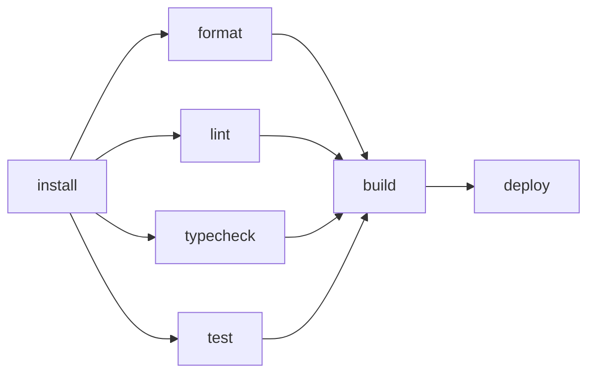

# Phase 6 실습 과제 — 도구 체인 적용과 계층 진단 노트

Phase 6 문서 학습과 병행하는 실습 과제다. [학습 기획](../../plan/phase6.md)의 2주 배분과 연동되며, 완성 기준(Definition of Done)을 체크리스트로 명시한다.

이 Phase의 실습은 **도구 적용 + 관찰 + 계층 진단**이다. 린트, 테스트, CI를 "설정했다"에서 끝내지 않고, 각 도구가 어떤 입력을 읽고 어떤 산출물을 계산했는지 기록한다.

대상 프로젝트는 Phase 5에서 만든 React + TypeScript SPA다. 별도 프로젝트를 사용해도 되지만, 라우팅, 서버 상태, 코드 분할, 배포가 포함되어 있어야 Phase 6의 관찰 포인트가 살아난다.

## 1주차 — 설치 그래프, 번들 그래프, 정적 분석

[6-1](../../docs/phase-6/01-package-management.md), [6-2](../../docs/phase-6/02-bundlers.md), [6-3](../../docs/phase-6/03-static-analysis.md)와 병행한다.

### 실험 A. pnpm 설치 그래프와 유령 의존성 점검

- [ ] Node와 pnpm 버전을 프로젝트 기준으로 고정했다. 예: `mise.toml`, `packageManager`, `engines.node`
- [ ] `pnpm install`로 lockfile을 생성 또는 갱신하고 커밋 대상에 포함했다.
- [ ] `node_modules/.pnpm` 구조를 열어 direct dependency와 transitive dependency의 위치를 확인했다.
- [ ] 앱 코드에서 직접 import하는 패키지가 모두 `dependencies` 또는 `devDependencies`에 선언되어 있는지 점검했다.
- [ ] `pnpm why <pkg>`로 중복 설치된 패키지를 하나 이상 추적하고, 중복이 정당한지 개선 가능한지 기록했다.
- [ ] React, React DOM, 라우터, Query 라이브러리 같은 singleton 성격 패키지의 peer 충돌이 없는지 확인했다.

### 실험 B. 번들 분석과 코드 분할 검증

- [ ] `pnpm build` 또는 프로젝트의 build script로 production 산출물을 생성했다.
- [ ] 번들 분석 도구를 설치했다. 예: `rollup-plugin-visualizer`
- [ ] route 단위 `lazy(() => import(...))` 또는 동적 import가 실제 별도 chunk로 나뉘는지 확인했다.
- [ ] 큰 라이브러리 import 방식을 하나 선택해 전/후 번들 크기를 비교했다. 예: 배럴 import vs 직접 import, CJS entry vs ESM entry
- [ ] `dist/assets`의 파일명에 content hash가 붙는지 확인했다.
- [ ] DevTools Network 패널에서 초기 로드와 route 이동 시 chunk 요청 순서를 기록했다.

### 실험 C. ESLint, Prettier, 타입 검사 분리

- [ ] ESLint flat config를 구성했다.
- [ ] Prettier를 formatting 전담으로 두고, ESLint formatting 충돌 규칙을 껐다.
- [ ] 일반 lint와 typed lint 규칙을 구분해 적용했다.
- [ ] 타입 인지 규칙을 하나 이상 켰다. 예: `@typescript-eslint/no-floating-promises`
- [ ] typed lint 적용 전/후 실행 시간을 기록했다.
- [ ] `tsc --noEmit`을 별도 script로 두고, lint가 타입 검사를 대체하지 않도록 분리했다.

## 2주차 — 테스트, CI, 배포 캐시 검증

[6-4](../../docs/phase-6/04-testing-strategy.md), [6-5](../../docs/phase-6/05-ci-and-deployment.md)와 병행한다.

### 실험 D. React Testing Library와 Vitest

- [ ] Vitest를 설정하고 React 컴포넌트 테스트가 실행되도록 했다.
- [ ] DOM 환경은 `jsdom` 또는 `happy-dom` 중 하나를 선택하고, 선택 이유와 한계를 기록했다.
- [ ] 핵심 컴포넌트 2개 이상을 role/name 중심 쿼리로 테스트했다.
- [ ] `getByTestId`를 사용했다면 role/text/label로 찾을 수 없었던 이유를 기록했다.
- [ ] `user-event`로 실제 상호작용에 가까운 이벤트를 사용했다.
- [ ] 구현 상세 리팩터링(컴포넌트 분리, state 구조 변경)을 하나 수행하고 테스트가 통과하는지 확인했다.

### 실험 E. MSW로 서버 상태 테스트

- [ ] MSW handler를 구성해 HTTP 요청 경계에서 mock했다.
- [ ] 성공, empty, error 응답을 각각 테스트했다.
- [ ] TanStack Query 등 서버 상태 라이브러리를 쓴다면 테스트마다 독립 QueryClient를 만들었다.
- [ ] 함수 mock과 MSW mock 중 무엇을 선택했는지, 그 경계 선택의 이유를 기록했다.
- [ ] mock 응답이 실제 API와 drift되지 않도록 유지할 방법을 정했다. 예: schema, fixture 생성 규칙, handler 공유

### 실험 F. GitHub Actions CI와 정적 배포

- [ ] `pnpm install --frozen-lockfile`을 CI 설치 단계에 사용했다.
- [ ] format, lint, typecheck, test, build를 별도 script 또는 matrix job으로 실행했다.
- [ ] `actions/setup-node`의 `cache: pnpm` 또는 명시적 cache action으로 pnpm store 캐시를 적용했다.
- [ ] cache hit/miss 로그와 install 시간을 기록했다.
- [ ] build artifact를 업로드하고 정적 호스트에 배포했다. 예: GitHub Pages, Netlify, Vercel, Cloudflare Pages
- [ ] preview deployment를 제공하는 호스트라면 PR preview URL을 확인했다.
- [ ] 배포 후 `index.html`과 hash asset의 cache header를 비교했다.
- [ ] SPA라면 deep link 새로고침이 fallback으로 동작하는지 확인했다.

## 산출물

### 1. 도구 계층 진단 노트

각 도구마다 다음 형식을 사용한다.

````md
## 도구 이름

### 입력
- 읽는 파일/그래프:
- 외부 상태:

### 계산
- 도구가 판단한 것:
- 사람이 설정으로 힌트를 준 것:

### 산출물
- 생성 파일 또는 report:
- CI에서 실패하는 조건:

### 관찰
```sh
실행한 명령
```

- 주요 로그:
- 전/후 수치:

### 경계 조건
- 이 도구가 못 보는 것:
- 다음 계층으로 넘길 것:
````

### 2. 번들 분석 전/후 기록

| 변경 | 초기 JS | async chunk | 중복 패키지 | 관찰 도구 | 해석 |
|---|---:|---:|---|---|---|
| 변경 전 | | | | visualizer/Network | |
| 변경 후 | | | | visualizer/Network | |

기록해야 할 질문:

- 큰 패키지가 들어온 경로는 무엇인가.
- 트리 셰이킹이 실패했다면 ESM, side effect, 배럴, CJS 중 어느 원인인가.
- chunk 분할이 초기 로드를 줄였는가, 이동 시 워터폴을 만들었는가.
- 개선할 수 없는 경우 그 이유는 무엇인가.

### 3. CI 파이프라인 다이어그램

Mermaid, ASCII, GitHub Actions graph 중 하나로 파이프라인을 남긴다.



각 edge마다 "왜 이 순서인가"를 한 문장으로 적는다.

### 4. 증상 → 계층 대응표

| 증상 | 원인 계층 | 확인한 증거 | 해결 또는 판단 |
|---|---|---|---|
| 선언 안 한 import가 동작 | package hoisting | `pnpm why` | 직접 dependency 추가 |
| 라이브러리가 통째 번들 포함 | 트리 셰이킹 | visualizer | ESM entry로 변경 |
| typed lint만 느림 | TypeScript program 분석 | CI duration | 적용 범위 축소 |
| 테스트가 리팩터링에 깨짐 | 구현 상세 결합 | class selector | role query로 변경 |
| 배포 후 옛 화면 | HTML 캐시 | `curl -I` | HTML no-cache |

## 완성 기준 (Definition of Done)

- [ ] pnpm 설치와 lockfile 재현성을 CI에서 검증했다.
- [ ] 유령 의존성 0개를 확인했거나, 발견한 항목을 직접 dependency로 수정했다.
- [ ] `pnpm why`로 중복 패키지 1개 이상을 추적하고 원인을 기록했다.
- [ ] 번들 분석으로 트리 셰이킹과 chunk 구성을 검증하고 전/후 수치를 남겼다.
- [ ] ESLint flat config, Prettier, `tsc --noEmit`을 역할별로 분리했다.
- [ ] typed lint 규칙 1개 이상을 적용하고 비용을 측정했다.
- [ ] RTL + Vitest 테스트가 role/name 중심으로 핵심 흐름을 검증한다.
- [ ] 서버 상태 또는 API 경계는 MSW로 mock하고 success/error/empty 상태를 포함했다.
- [ ] GitHub Actions 또는 동등한 CI에서 install, lint, typecheck, test, build가 실행된다.
- [ ] 정적 배포 URL이 있고, content hash asset과 HTML cache header를 확인했다.
- [ ] 도구 계층 진단 노트와 증상 → 계층 대응표를 완성했다.

## 진행 팁

- 모든 도구를 한 번에 붙이지 않는다. 설치 그래프 → 번들 그래프 → 정적 분석 → 테스트 → CI 순서로 추가하고, 각 단계의 diff와 관찰 결과를 커밋 단위로 남긴다.
- 실행 시간은 감각으로 쓰지 않는다. `time pnpm lint`, GitHub Actions job duration, DevTools Network/Performance 숫자를 함께 기록한다.
- CI에서 실패한 명령은 로컬에서 같은 명령으로 재현 가능해야 한다. 로컬과 CI의 Node/pnpm 버전이 다르면 먼저 도구 버전을 맞춘다.
- 배포 캐시 문제는 브라우저 새로고침으로만 판단하지 않는다. `curl -I`와 DevTools Network의 response headers로 HTML과 asset 정책을 구분한다.
