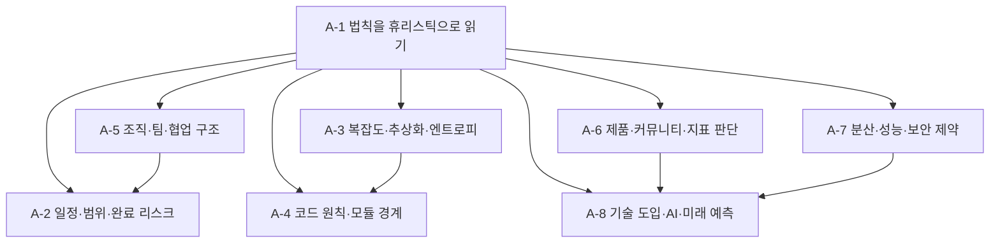

# 부록 A — 사고법과 경험 법칙: hacker-laws 재분류 학습 과정 기획

> ROADMAP.md의 부록 A(선택/상시, 문서 8개)를 실제 집필 가능한 수준으로 구체화한 기획 문서다.
> `hacker-laws/README.md`의 법칙·원칙 목록을 원문 순서가 아니라 실무 상황별 판단 렌즈로 재배치하고, 각 법칙을 절대 규칙이 아닌 휴리스틱으로 다루는 기준을 정의한다.

---

## 1. 기획 전제

### 독자 상황 분석

독자는 Phase 0~11에서 웹 플랫폼, HTML/CSS 렌더링, HTTP, JavaScript 런타임, TypeScript 타입 설계, React 렌더링 모델, 프론트엔드 도구, Git 협업, 브라우저 성능·보안·Next.js/RSC, 설계 패턴, 실전 프로젝트, AI 에이전트 활용까지 다뤘다. 부록 A는 새로운 기술 스택을 배우는 과정이 아니라, 이미 배운 기술 판단을 **불완전한 현실 상황에서 어떻게 해석할 것인가**를 다루는 메타 과정이다.

- **이미 아는 것**: 설계 트레이드오프, 성능·보안·협업·도구 선택의 비용, 프로젝트 일정과 품질 관리, 코드 리뷰와 ADR 작성, AI 도구 도입의 검증 책임.
- **모르는 것 (이 부록의 가치)**: 실무에서 자주 인용되는 법칙과 원칙은 결론을 대신 내려 주지 않는다. 같은 상황에서도 Brooks' Law와 Linus's Law, KISS와 SOLID, YAGNI와 Chesterton's Fence처럼 서로 다른 방향의 질문을 열 수 있다. 이 부록의 목표는 법칙을 외우는 것이 아니라 **법칙이 어떤 관찰에서 나왔고, 어떤 상황에서 틀리며, 어떤 질문을 남기는지**를 읽는 능력이다.
- **흔한 함정**: ① 법칙 이름을 논쟁의 종결자로 사용한다. ② 조직·제품·기술 규모가 다른 사례를 그대로 가져온다. ③ 원칙을 체크리스트로 절대화해 현재 제약을 보지 않는다. ④ 지표·성능·보안 같은 숫자와 법칙을 섞어 인과관계를 과장한다. ⑤ 풍자적 관찰과 설계 원칙, 물리적 제약을 같은 강도의 명제로 취급한다. ⑥ "법칙이 있으니 이렇게 해야 한다"로 쓰고 반례와 경계 조건을 생략한다.

### 부록 A 전체 목표 (ROADMAP 기준)

`hacker-laws/README.md`의 법칙과 원칙을 암기 목록이 아니라 상황을 해석하는 렌즈로 재분류한다. 각 법칙은 절대 명제가 아니라 특정 맥락에서 유용한 휴리스틱이며, 서로 충돌할 수 있고 조직·제품·시스템의 규모에 따라 가중치가 달라진다는 전제를 둔다.

최종 산출물: `docs/appendix-a/` 아래 문서 8개. 별도 실습 과제는 만들지 않는다. 각 문서는 상황별 사고 질문, 법칙의 동작 배경, 적용 가능한 맥락, 틀릴 수 있는 조건, 관련 Phase 연결을 제공한다.

### 선택/상시 학습 배분

부록 A는 본 과정의 필수 주차에 포함하지 않는다. Phase 10의 프로젝트 의사결정, Phase 11의 AI 에이전트 도입, 팀 회고, 설계 리뷰, 일정 추정, 장애 분석 중 필요한 파트를 참조하는 방식으로 운영한다.

| 학습 상황 | 권장 파트 | 사용 방식 |
|----------|----------|----------|
| 설계 리뷰 전 | A-1, A-3, A-4 | 현재 설계가 과도하게 단순화되었는지, 추상화가 누수되는지, 원칙이 과잉 적용되었는지 점검한다. |
| 일정·범위 조율 | A-2, A-5 | 작업 분할 가능성, 인력 추가 비용, 완료 직전의 숨은 작업, 의사결정 구조를 점검한다. |
| 제품·UX·지표 리뷰 | A-6 | 사용자 행동, 선택지 수, 참여 불균형, 지표 왜곡 가능성을 점검한다. |
| 플랫폼·백엔드 의사결정 참여 | A-7 | 분산 시스템, 병렬화, 에너지 효율, 보안 설계의 물리적 제약을 읽는다. |
| 신기술·AI 도입 검토 | A-1, A-8 | 기대와 실효의 시간차, 모델의 한계, 도구 집착, 미래 예측의 불확실성을 점검한다. |

---

## 2. 문서별 상세 기획

각 문서는 CLAUDE.md의 공통 구조를 따르되, 부록 문서라는 성격에 맞게 코드 예제보다 **상황 예시, 판단 질문, 반례, 경계 조건**을 중심으로 쓴다. 확인 문제는 사고형 질문으로 유지하되, 실습 과제나 구현 산출물은 요구하지 않는다.

### A-1. 법칙을 휴리스틱으로 읽기 — `docs/appendix-a/01-laws-as-heuristics.md`

- **핵심 질문**: 법칙과 원칙은 언제 판단을 돕고, 언제 사고를 닫아 버리는가?
- **다룰 법칙·원칙**:
  - All Models Are Wrong: 모델은 현실의 일부를 버려야 유용해진다. 버린 부분이 현재 문제의 핵심이면 모델은 해롭다.
  - Occam's Razor: 단순한 설명을 우선하되, 복잡도를 제거한 것이 아니라 숨긴 것인지 확인한다.
  - The Law of the Instrument: 익숙한 도구가 문제 정의를 왜곡하는 순간을 다룬다.
  - Chesterton's Fence: 레거시 제거 전, 그 구조가 생긴 이유와 현재도 남은 제약을 확인한다.
  - Hanlon's Razor: 악의보다 실수·제약·정보 부족을 먼저 가정하되, 반복되는 구조적 실패를 개인 선의로 덮지 않는다.
  - Murphy's Law / Sod's Law: 실패 가능한 경계는 결국 드러난다는 관찰을 테스트·모니터링·롤백 설계로 연결한다.
  - The Dunning-Kruger Effect: 자신감과 역량의 불일치를 코드 리뷰·추정·신기술 도입에서 다룬다.
  - Clarke's three laws: 기술 전망을 가능성 탐색과 과장 사이에서 읽는다.
- **다룰 범위**:
  - 법칙, 원칙, 이론, 풍자적 관찰, 물리적 제약의 강도가 다르다는 점.
  - 법칙을 "정답"이 아니라 "질문 생성기"로 쓰는 방식.
  - 서로 충돌하는 법칙을 비교해 현재 상황에서 어떤 비용을 더 크게 봐야 하는지 판단하는 방법.
  - 회고 질문 템플릿: "이 법칙이 지금 상황에서 틀릴 수 있는 조건은 무엇인가?", "이 법칙이 보지 못하는 이해관계자는 누구인가?"
- **다루지 않을 범위**: 철학 일반론, 인지과학 전체, 법칙의 역사적 진위 논쟁, 명언 모음.
- **경력자 연결**: ADR의 "대안과 기각 이유" 섹션처럼, 법칙은 결론이 아니라 판단 기록을 구조화하는 언어다.
- **의존**: Phase 10 ADR, Phase 11 AI 도구 도입 판단.

### A-2. 일정·범위·완료 리스크 — `docs/appendix-a/02-estimation-scope-and-finish-line.md`

- **핵심 질문**: 왜 소프트웨어 작업은 끝나 보이는 순간부터 다시 길어지는가?
- **다룰 법칙·원칙**:
  - 90-90 Rule: 마지막 10%에 통합, 예외 처리, 배포, 문서화, 리뷰가 몰리는 구조.
  - Hofstadter's Law: 지연을 예상해도 다시 지연되는 추정의 자기 참조성.
  - Parkinson's Law: 사용 가능한 시간이 작업의 형태와 품질 기준을 바꾸는 현상.
  - Brooks' Law: 늦은 프로젝트에 인력을 추가할 때 온보딩·커뮤니케이션·작업 분할 비용이 커지는 구조.
  - The Pareto Principle: 일부 입력이 대부분의 결과를 만든다는 관찰과, 나머지 20%를 무시할 때 생기는 품질 리스크.
  - The Law of Triviality: 사소하지만 모두가 말할 수 있는 주제가 의사결정 시간을 잡아먹는 구조.
  - Wadler's Law: 문법·표현·스타일 논쟁이 본질적 설계보다 오래 지속되는 이유.
  - Hutber's Law: 개선이 단기적으로는 시스템을 더 복잡하고 느리게 만드는 전환 비용.
- **다룰 범위**:
  - 일정 추정에서 분할 가능한 작업과 분할 불가능한 작업을 구분하는 방법.
  - "거의 끝났다"가 실제로 의미하는 것: 기능 동작, 오류 상태, 접근성, 성능, 테스트, 배포, 운영 문서의 차이.
  - 인력 추가, 범위 축소, 품질 기준 조정, 릴리스 분리의 트레이드오프.
  - 사소한 논쟁을 닫는 팀 규칙: 결정권자, 시간 제한, 기준 문서, ADR.
- **다루지 않을 범위**: 프로젝트 관리 방법론 전체, 스크럼 이벤트 설명, 추정 기법 카탈로그.
- **경력자 연결**: 90-90 Rule은 농담처럼 보이지만, 프론트엔드에서는 브라우저 호환성, 상태 경계, 디자인 QA, 접근성, 배포 캐시에서 현실화된다.
- **의존**: Phase 6 CI·배포, Phase 7 협업 워크플로, Phase 10 프로젝트 가이드.

### A-3. 복잡도·추상화·소프트웨어 엔트로피 — `docs/appendix-a/03-complexity-abstraction-and-entropy.md`

- **핵심 질문**: 추상화는 언제 복잡도를 줄이고, 언제 복잡도를 보이지 않게 밀어낼 뿐인가?
- **다룰 법칙·원칙**:
  - Gall's Law: 작동하는 복잡한 시스템은 작동하는 단순한 시스템에서 진화한다는 관점.
  - The Law of Conservation of Complexity: 복잡도는 사라지지 않고 사용자, 개발자, 플랫폼, 운영자 중 누군가에게 이동한다.
  - The Law of Leaky Abstractions: 모든 비자명한 추상화는 하위 계층의 세부를 새어 나오게 한다.
  - Hyrum's Law: 충분히 많은 사용자가 있으면 관찰 가능한 모든 동작이 암묵적 API가 된다.
  - The Second-System Effect: 첫 시스템의 후회가 두 번째 시스템의 과잉 설계로 이어지는 패턴.
  - The Broken Windows Theory: 방치된 품질 저하가 더 큰 품질 저하의 신호가 되는 구조.
  - The Scout Rule: 코드를 만질 때 주변을 조금 더 낫게 만드는 유지보수 태도.
  - Kernighan's Law: 디버깅은 작성보다 어렵기 때문에, 영리한 코드는 유지보수 비용을 키운다.
- **다룰 범위**:
  - 복잡도의 위치를 추적하는 방법: API, 상태, 빌드, 런타임, 운영, 사용자 경험.
  - 추상화의 비용: 탈출구, 디버깅 경로, 문서화, 성능 오버헤드, 암묵적 계약.
  - 점진적 개선과 대규모 재작성의 판단 기준.
  - 코드 품질 저하를 개인 취향이 아니라 팀의 미래 행동을 바꾸는 신호로 보는 관점.
- **다루지 않을 범위**: 대규모 엔터프라이즈 아키텍처 일반론, 모든 리팩터링 기법, 정량 복잡도 지표 전체.
- **경력자 연결**: React 컴포넌트 추상화, 디자인 시스템, API 클라이언트, 상태 관리 라이브러리는 모두 복잡도를 옮기는 장치다. "깔끔하다"보다 "어느 비용이 어디로 이동했는가"를 묻는다.
- **의존**: Phase 5 상태 아키텍처, Phase 6 도구, Phase 9 패턴, Phase 10 코드 품질.

### A-4. 코드 원칙·모듈 경계 — `docs/appendix-a/04-code-principles-and-module-boundaries.md`

- **핵심 질문**: 코드 원칙은 언제 변경 비용을 낮추고, 언제 불필요한 간접층을 만든다?
- **다룰 법칙·원칙**:
  - SOLID: 객체지향 문맥에서 나온 원칙을 JavaScript/TypeScript/React 경계에 맞게 재해석한다.
  - The Single Responsibility Principle: 책임을 "이유가 같은 변경" 기준으로 읽는다.
  - The Open/Closed Principle: 확장 지점의 가치와 미리 만든 확장점의 비용을 비교한다.
  - The Liskov Substitution Principle: 하위 타입이 계약을 깨는 문제를 구조적 타이핑과 React props 계약에 연결한다.
  - The Interface Segregation Principle: 큰 props/API 계약을 사용자의 필요 단위로 분리하는 기준.
  - The Dependency Inversion Principle: 구체 구현보다 안정적인 정책·계약에 의존하는 방향.
  - The DRY Principle: 중복 제거가 변경 축을 숨길 때의 역효과.
  - The KISS principle: 단순성을 목표로 하되 요구사항의 실제 복잡도를 삭제하지 않는 기준.
  - YAGNI: 아직 필요 없는 확장을 미루되, 나중에 되돌릴 수 없는 결정은 별도로 취급한다.
  - The Law of Demeter: 객체·모듈·컴포넌트가 너무 먼 내부 구조를 아는 문제.
  - The Unix Philosophy: 작은 도구, 명확한 입력·출력, 조합 가능한 경계.
  - Input-Process-Output: 시스템을 입력, 처리, 출력으로 나눠 데이터 흐름을 명확히 보는 관점.
  - The Robustness Principle: 입력에는 관대하고 출력에는 보수적인 원칙의 현대적 한계.
  - The Principle of Least Astonishment: API와 UI가 사용자의 예상을 깨지 않도록 하는 계약.
  - Premature Optimization Effect: 병목 확인 전 최적화가 구조를 왜곡하는 문제.
- **다룰 범위**:
  - 원칙 간 충돌: DRY vs KISS, YAGNI vs Open/Closed, Robustness vs 보안, SOLID vs 함수형/React 합성.
  - 모듈 경계를 정하는 기준: 변경 빈도, 데이터 소유권, 테스트 경계, 런타임 비용, 팀 소유권.
  - TypeScript 타입과 런타임 계약이 어긋날 때의 경계 조건.
  - "원칙 준수"보다 "변경이 왔을 때 어느 파일이 함께 바뀌는가"를 관찰하는 법.
- **다루지 않을 범위**: 객체지향 입문, GoF 패턴 전체, 클린 아키텍처 도식 암기.
- **경력자 연결**: 프론트엔드의 모듈 경계는 컴포넌트, hook, API client, route, store, design token, build tool 설정에 동시에 걸린다. 원칙은 그 경계를 토론하기 위한 어휘다.
- **의존**: Phase 4 타입 설계, Phase 5 React, Phase 6 정적 분석, Phase 9 패턴.

### A-5. 조직·팀·협업 구조 — `docs/appendix-a/05-organization-teams-and-collaboration.md`

- **핵심 질문**: 시스템 구조와 팀 구조는 어떻게 서로를 닮아 가는가?
- **다룰 법칙·원칙**:
  - Conway's Law: 조직의 커뮤니케이션 구조가 시스템 경계에 반영되는 현상.
  - Dunbar's Number: 안정적 관계와 맥락 공유의 인지적 한계.
  - The Ringelmann Effect: 팀 규모가 커질 때 개인 기여가 희석되는 현상.
  - The Two Pizza Rule: 작은 팀의 의사결정 속도와 소유권.
  - The Spotify Model: squad/tribe/chapter/guild를 복제 가능한 정답이 아니라 조직 설계 사례로 읽는다.
  - Putt's Law: 기술 조직의 관리·전문성 역전 풍자와 의사결정 품질.
  - The Peter Principle: 승진 구조가 역할 적합성을 깨뜨릴 수 있는 위험.
  - The Dilbert Principle: 조직 풍자를 현실 진단으로 오용하지 않되, 의사결정 왜곡 신호로 읽는다.
  - The Dead Sea Effect: 역량 있는 사람이 떠나고 남은 사람이 시스템을 굳히는 위험.
  - Wheaton's Law: 협업에서 최소한의 상호 존중이 생산성 조건이 되는 이유.
  - Cunningham's Law: 틀린 답을 제시했을 때 커뮤니티가 더 적극적으로 반응하는 현상과 그 윤리적 경계.
  - Linus's Law: 충분한 관찰자가 있으면 결함 발견 가능성이 높아진다는 오픈소스 맥락의 관찰.
- **다룰 범위**:
  - 프론트엔드 시스템 경계와 팀 경계: 디자인 시스템, 플랫폼 팀, 제품 팀, 백엔드/API 팀.
  - 팀 크기와 소유권: 리뷰 병목, 온콜, 버스 팩터, 문서화, 의사결정 지연.
  - 오픈소스·커뮤니티 피드백과 내부 코드 리뷰의 차이.
  - 조직 모델을 복제할 때 생기는 위험: 문화·제품·규모·채용 시장의 차이.
- **다루지 않을 범위**: HR 제도 설계 전체, 리더십 자기계발, 특정 회사 문화 찬양.
- **경력자 연결**: 아키텍처 논의에서 "이 모듈을 누가 소유하고, 누가 배포 책임을 지고, 누가 장애를 본다"는 질문은 타입이나 API만큼 중요하다.
- **의존**: Phase 7 협업, Phase 10 프로젝트 운영, Phase 11 에이전트 팀 운영.

### A-6. 제품·커뮤니티·지표 판단 — `docs/appendix-a/06-product-community-and-metrics.md`

- **핵심 질문**: 사용자 행동과 지표는 언제 제품 판단을 돕고, 언제 제품 판단을 왜곡하는가?
- **다룰 법칙·원칙**:
  - Fitts' Law: 목표까지의 거리와 크기가 조작 시간에 영향을 준다는 UI 설계 관찰.
  - Hick's Law: 선택지 수와 의사결정 시간이 연결되는 UX 판단.
  - 90-9-1 Principle: 커뮤니티 참여가 소수의 적극 기여자에게 집중되는 구조.
  - Metcalfe's Law: 네트워크 가치가 연결 수와 함께 커지는 모델.
  - Reed's Law: 그룹 형성 가능성이 네트워크 가치를 더 크게 만든다는 관점.
  - Goodhart's Law: 지표가 목표가 되는 순간 지표의 정보 가치가 무너지는 현상.
  - Twyman's Law: 흥미롭거나 이상한 데이터는 대개 오류이거나 추가 설명이 필요하다는 경계.
  - The Shirky Principle: 어떤 기관은 자신이 해결해야 할 문제를 보존하려 할 수 있다는 관찰.
- **다룰 범위**:
  - UI 판단과 제품 지표의 연결: 클릭률, 전환율, 유지율, 작업 완료 시간, 오류율.
  - 네트워크 효과 모델을 프론트엔드 제품에 적용할 때의 한계.
  - 커뮤니티·UGC 서비스에서 읽기 전용 사용자와 적극 기여자의 비대칭.
  - 지표 설계의 반례: 프록시 지표, 게임화, 계측 오류, 선택 편향.
- **다루지 않을 범위**: 제품 분석 도구 사용법, 통계학 입문, 성장 해킹 전술 모음.
- **경력자 연결**: 프론트엔드 변경은 지표에 가장 가까운 계층에서 일어난다. 그러나 버튼 위치 변경과 매출 변화 사이의 인과관계는 쉽게 과장된다.
- **의존**: Phase 1 접근성·반응형, Phase 8 성능 지표, Phase 10 포트폴리오와 기술 서사.

### A-7. 분산·성능·보안의 물리적 제약 — `docs/appendix-a/07-distributed-performance-and-security-constraints.md`

- **핵심 질문**: 어떤 제약은 좋은 추상화나 의지만으로 사라지지 않는다. 프론트엔드는 그 제약을 어떻게 읽어야 하는가?
- **다룰 법칙·원칙**:
  - CAP Theorem: 분산 데이터 저장소에서 네트워크 파티션 상황의 일관성·가용성 선택.
  - The Fallacies of Distributed Computing: 네트워크가 항상 빠르고 신뢰 가능하다는 가정의 실패.
  - Amdahl's Law: 병렬화 가능한 부분이 전체 속도 향상의 상한을 결정한다.
  - Moore's Law: 하드웨어 성능 증가에 기대던 최적화 전략의 역사적 맥락과 둔화.
  - Koomey's Law: 에너지 효율과 연산 비용을 보는 관점.
  - Jevons' Paradox: 효율이 좋아질수록 사용량이 오히려 늘 수 있는 역설.
  - Kerckhoffs's principle: 시스템 보안은 알고리즘 비밀이 아니라 키·비밀 관리에 의존해야 한다는 원칙.
- **다룰 범위**:
  - 프론트엔드가 분산 시스템을 직접 구현하지 않아도 API 지연, 캐시 일관성, 재시도, optimistic UI, 오프라인 상태에서 제약을 체감하는 이유.
  - 성능 최적화에서 병목을 먼저 찾고, 병렬화·캐시·압축·코드 분할의 상한을 계산하는 관점.
  - 보안 설계에서 "숨겨진 클라이언트 로직"이 비밀이 될 수 없는 이유.
  - 효율 개선이 비용 절감이 아니라 사용량 증가로 이어지는 제품·인프라 경계.
- **다루지 않을 범위**: 분산 데이터베이스 구현, 암호학 수학, GPU 프로그래밍, 서버 인프라 운영 전체.
- **경력자 연결**: 프론트엔드는 사용자에게 분산 시스템의 지연과 실패를 UI 상태로 번역하는 계층이다. 로딩, 재시도, 충돌 해결, 캐시 무효화는 모두 이 제약의 표현이다.
- **의존**: Phase 2 HTTP, Phase 3 fetch와 async, Phase 5 서버 상태, Phase 8 네트워크·성능·보안.

### A-8. 기술 도입·AI·미래 예측 — `docs/appendix-a/08-technology-adoption-ai-and-forecasting.md`

- **핵심 질문**: 신기술은 언제 과장되고, 언제 과소평가되며, 무엇을 기준으로 도입을 판단해야 하는가?
- **다룰 법칙·원칙**:
  - The Hype Cycle & Amara's Law: 단기 효과는 과대평가되고 장기 효과는 과소평가되는 기술 수용 곡선.
  - The Bitter Lesson: 장기적으로 범용 계산과 확장 가능한 방법이 도메인 특화 규칙을 이기는 경향.
  - The Stochastic Parrot: 언어 모델이 의미를 이해한다는 주장과 통계적 언어 생성의 한계를 구분하는 관점.
- **다룰 범위**:
  - 신기술 도입 판단: 문제 적합성, 실패 비용, 검증 가능성, 팀 역량, 롤백 가능성, 생태계 성숙도.
  - AI 도구 도입에서 모델 성능과 하네스·검증·보안·운영 비용을 함께 보는 기준.
  - 과장과 냉소를 모두 피하는 태도: 초기 실험, 제한된 적용, 측정 가능한 성공 기준, 장기 학습 전략.
  - 예측을 기록하는 방법: 어떤 전제를 두었고, 어떤 신호가 나오면 판단을 바꿀 것인지 명시한다.
- **다루지 않을 범위**: AI 모델 내부 수학, 시장 전망 보고서 요약, 제품별 요금제 비교, 특정 도구 홍보.
- **경력자 연결**: Phase 11의 AI 에이전트 활용은 이 문서의 대표 사례다. "AI가 모든 개발을 대체한다"와 "AI는 자동완성일 뿐이다"라는 양극단 대신, 어떤 작업에서 어떤 검증 체계와 함께 유효한지 묻는다.
- **의존**: Phase 6 도구 검증, Phase 10 기술 의사결정, Phase 11 AI 에이전트 활용.

---

## 3. 문서 간 의존 관계

- A-1은 부록 전체의 해석 규칙이다. 가능하면 가장 먼저 읽게 한다.
- A-2와 A-5는 일정·인력·조직 구조가 맞물리는 상황에서 함께 참조한다.
- A-3과 A-4는 코드 설계 리뷰에서 함께 참조한다. A-3은 복잡도의 위치, A-4는 코드 경계와 원칙의 적용을 다룬다.
- A-6은 제품 지표와 사용자 행동을 다루므로 Phase 8 성능 지표, Phase 10 프로젝트 검증과 연결한다.
- A-7과 A-8은 물리적 제약과 기술 전망을 다룬다. 신기술 도입은 제약을 무시하는 낙관과 가능성을 닫는 냉소 사이에서 판단한다.

---

## 4. 운영 방식과 회고 질문

### 과제 없음

부록 A에는 실습 과제를 만들지 않는다. 법칙을 실제 프로젝트에 억지로 적용하는 과제는 법칙을 절대화하는 역효과가 크다. 대신 각 문서 말미에 짧은 회고 질문을 둔다.

### 문서별 회고 질문 형식

각 문서는 확인 문제와 별도로 다음 형태의 회고 질문을 3~5개 둔다.

- 이 법칙이 현재 상황에서 틀릴 수 있는 조건은 무엇인가?
- 이 법칙이 강조하는 비용은 무엇이고, 숨기는 비용은 무엇인가?
- 이 법칙과 반대 방향으로 작동하는 다른 법칙은 무엇인가?
- 지금 판단에서 관찰 가능한 증거와 추측은 어떻게 구분되는가?
- 이 법칙을 적용하지 않기로 해도 남겨야 하는 안전장치는 무엇인가?

### 적용 상황 예시

- 일정 회의에서 "Brooks' Law 때문에 인력 추가는 안 된다"로 끝내지 않는다. 작업 분할 가능성, 온보딩 시간, 커뮤니케이션 경로, 릴리스 범위 축소 가능성을 함께 본다.
- 코드 리뷰에서 "DRY를 지켜야 한다"로 끝내지 않는다. 중복된 두 코드가 같은 변경 축을 갖는지, 추상화가 더 많은 조건 분기를 숨기는지 확인한다.
- 성능 개선에서 "Amdahl's Law상 의미 없다"로 끝내지 않는다. 실제 병목이 어디인지 계측하고, 사용자 경험에 영향을 주는 임계 경로인지 확인한다.
- AI 도구 도입에서 "Hype Cycle이다" 또는 "Bitter Lesson이다"로 끝내지 않는다. 실험 범위, 검증 기준, 보안 경계, 실패 비용을 명시한다.

---

## 5. 공통 집필 기준 (부록 A 특화)

- **법칙을 절대화하지 않음**: 모든 문서는 "이 법칙이 맞다"가 아니라 "이 법칙은 어떤 상황에서 어떤 질문을 열어 주는가"로 서술한다.
- **원문 구조보다 상황 구조를 우선**: `hacker-laws/README.md`는 Laws와 Principles로 나뉘지만, 부록 A는 일정, 설계, 조직, 제품, 분산 제약, 기술 도입 같은 실무 상황별 분류를 따른다.
- **반례와 경계 조건을 필수로 포함**: 각 법칙 설명에는 적어도 하나의 반례 또는 적용이 위험한 조건을 넣는다.
- **서로 충돌하는 법칙을 함께 다룸**: YAGNI와 Open/Closed, DRY와 KISS, Brooks' Law와 Linus's Law, Occam's Razor와 Chesterton's Fence처럼 충돌 가능한 쌍을 보여 준다.
- **프론트엔드 맥락으로 연결**: UI 상태, 컴포넌트 경계, 디자인 시스템, 성능 지표, API 캐싱, 배포, 코드 리뷰, AI 에이전트 활용에 연결한다.
- **권위 인용으로 쓰지 않음**: 법칙의 이름이 결론의 근거가 되어서는 안 된다. 관찰 가능한 증거, 현재 제약, 선택 가능한 대안과 함께 써야 한다.
- **풍자와 원칙을 구분**: Putt's Law, Dilbert Principle, Murphy's Law 같은 풍자적 관찰은 조직을 조롱하는 문장이 아니라 위험 신호를 읽는 도구로 다룬다.
- **1차 자료와 원문 링크 확인**: 원문 `hacker-laws/README.md`의 링크를 우선 확인하고, 법칙별 공식 문서·논문·원전이 있으면 참고 자료에 연결한다. 확신 없는 역사적 유래는 단정하지 않는다.
- **문체**: 한국어 평서형을 유지한다. 동료 시니어에게 설명하듯 쓰고, "항상", "절대", "무조건" 같은 표현은 법칙의 절대화를 유도하므로 피한다.

---

## 6. 원문 법칙 커버리지 점검표

`hacker-laws/README.md`의 모든 법칙·원칙은 아래 파트 중 하나에 대표 배치한다. 한 법칙이 여러 상황에 걸칠 수 있어도, 문서 집필 시에는 대표 배치를 기준으로 깊게 다루고 관련 문서로 교차 링크한다.

| 원문 항목 | 대표 파트 |
|----------|----------|
| 90-9-1 Principle | A-6 제품·커뮤니티·지표 판단 |
| 90-90 Rule | A-2 일정·범위·완료 리스크 |
| Amdahl's Law | A-7 분산·성능·보안의 물리적 제약 |
| The Broken Windows Theory | A-3 복잡도·추상화·소프트웨어 엔트로피 |
| Brooks' Law | A-2 일정·범위·완료 리스크 |
| CAP Theorem | A-7 분산·성능·보안의 물리적 제약 |
| Clarke's three laws | A-1 법칙을 휴리스틱으로 읽기 |
| Conway's Law | A-5 조직·팀·협업 구조 |
| Cunningham's Law | A-5 조직·팀·협업 구조 |
| Dunbar's Number | A-5 조직·팀·협업 구조 |
| The Dunning-Kruger Effect | A-1 법칙을 휴리스틱으로 읽기 |
| Fitts' Law | A-6 제품·커뮤니티·지표 판단 |
| Gall's Law | A-3 복잡도·추상화·소프트웨어 엔트로피 |
| Goodhart's Law | A-6 제품·커뮤니티·지표 판단 |
| Hanlon's Razor | A-1 법칙을 휴리스틱으로 읽기 |
| Hick's Law | A-6 제품·커뮤니티·지표 판단 |
| Hofstadter's Law | A-2 일정·범위·완료 리스크 |
| Hutber's Law | A-2 일정·범위·완료 리스크 |
| The Hype Cycle & Amara's Law | A-8 기술 도입·AI·미래 예측 |
| Hyrum's Law | A-3 복잡도·추상화·소프트웨어 엔트로피 |
| Jevons' Paradox | A-7 분산·성능·보안의 물리적 제약 |
| Input-Process-Output | A-4 코드 원칙·모듈 경계 |
| Kernighan's Law | A-3 복잡도·추상화·소프트웨어 엔트로피 |
| Koomey's Law | A-7 분산·성능·보안의 물리적 제약 |
| Linus's Law | A-5 조직·팀·협업 구조 |
| Metcalfe's Law | A-6 제품·커뮤니티·지표 판단 |
| Moore's Law | A-7 분산·성능·보안의 물리적 제약 |
| Murphy's Law / Sod's Law | A-1 법칙을 휴리스틱으로 읽기 |
| Occam's Razor | A-1 법칙을 휴리스틱으로 읽기 |
| Parkinson's Law | A-2 일정·범위·완료 리스크 |
| Premature Optimization Effect | A-4 코드 원칙·모듈 경계 |
| Putt's Law | A-5 조직·팀·협업 구조 |
| Reed's Law | A-6 제품·커뮤니티·지표 판단 |
| The Bitter Lesson | A-8 기술 도입·AI·미래 예측 |
| The Ringelmann Effect | A-5 조직·팀·협업 구조 |
| The Law of Conservation of Complexity | A-3 복잡도·추상화·소프트웨어 엔트로피 |
| The Law of Demeter | A-4 코드 원칙·모듈 경계 |
| The Law of Leaky Abstractions | A-3 복잡도·추상화·소프트웨어 엔트로피 |
| The Law of the Instrument | A-1 법칙을 휴리스틱으로 읽기 |
| The Law of Triviality | A-2 일정·범위·완료 리스크 |
| The Unix Philosophy | A-4 코드 원칙·모듈 경계 |
| The Scout Rule | A-3 복잡도·추상화·소프트웨어 엔트로피 |
| The Second-System Effect | A-3 복잡도·추상화·소프트웨어 엔트로피 |
| The Spotify Model | A-5 조직·팀·협업 구조 |
| The Two Pizza Rule | A-5 조직·팀·협업 구조 |
| Twyman's law | A-6 제품·커뮤니티·지표 판단 |
| Wadler's Law | A-2 일정·범위·완료 리스크 |
| Wheaton's Law | A-5 조직·팀·협업 구조 |
| All Models Are Wrong | A-1 법칙을 휴리스틱으로 읽기 |
| Chesterton's Fence | A-1 법칙을 휴리스틱으로 읽기 |
| Kerckhoffs's principle | A-7 분산·성능·보안의 물리적 제약 |
| The Dead Sea Effect | A-5 조직·팀·협업 구조 |
| The Dilbert Principle | A-5 조직·팀·협업 구조 |
| The Pareto Principle | A-2 일정·범위·완료 리스크 |
| The Shirky Principle | A-6 제품·커뮤니티·지표 판단 |
| The Stochastic Parrot | A-8 기술 도입·AI·미래 예측 |
| The Peter Principle | A-5 조직·팀·협업 구조 |
| The Robustness Principle | A-4 코드 원칙·모듈 경계 |
| SOLID | A-4 코드 원칙·모듈 경계 |
| The Single Responsibility Principle | A-4 코드 원칙·모듈 경계 |
| The Open/Closed Principle | A-4 코드 원칙·모듈 경계 |
| The Liskov Substitution Principle | A-4 코드 원칙·모듈 경계 |
| The Interface Segregation Principle | A-4 코드 원칙·모듈 경계 |
| The Dependency Inversion Principle | A-4 코드 원칙·모듈 경계 |
| The DRY Principle | A-4 코드 원칙·모듈 경계 |
| The KISS principle | A-4 코드 원칙·모듈 경계 |
| YAGNI | A-4 코드 원칙·모듈 경계 |
| The Fallacies of Distributed Computing | A-7 분산·성능·보안의 물리적 제약 |
| The Principle of Least Astonishment | A-4 코드 원칙·모듈 경계 |

---

## 7. 진행 체크리스트

- [ ] `docs/appendix-a/01-laws-as-heuristics.md` 작성
- [ ] `docs/appendix-a/02-estimation-scope-and-finish-line.md` 작성
- [ ] `docs/appendix-a/03-complexity-abstraction-and-entropy.md` 작성
- [ ] `docs/appendix-a/04-code-principles-and-module-boundaries.md` 작성
- [ ] `docs/appendix-a/05-organization-teams-and-collaboration.md` 작성
- [ ] `docs/appendix-a/06-product-community-and-metrics.md` 작성
- [ ] `docs/appendix-a/07-distributed-performance-and-security-constraints.md` 작성
- [ ] `docs/appendix-a/08-technology-adoption-ai-and-forecasting.md` 작성
- [ ] 각 문서가 "법칙은 절대적이지 않다"는 전제를 명시하는지 확인
- [ ] 각 문서가 적어도 하나 이상의 반례·경계 조건을 포함하는지 확인
- [ ] 각 문서가 관련 Phase 문서로 교차 링크되는지 확인
- [ ] ROADMAP.md 진행 현황 표를 부록 문서 작성 상태에 맞게 갱신
