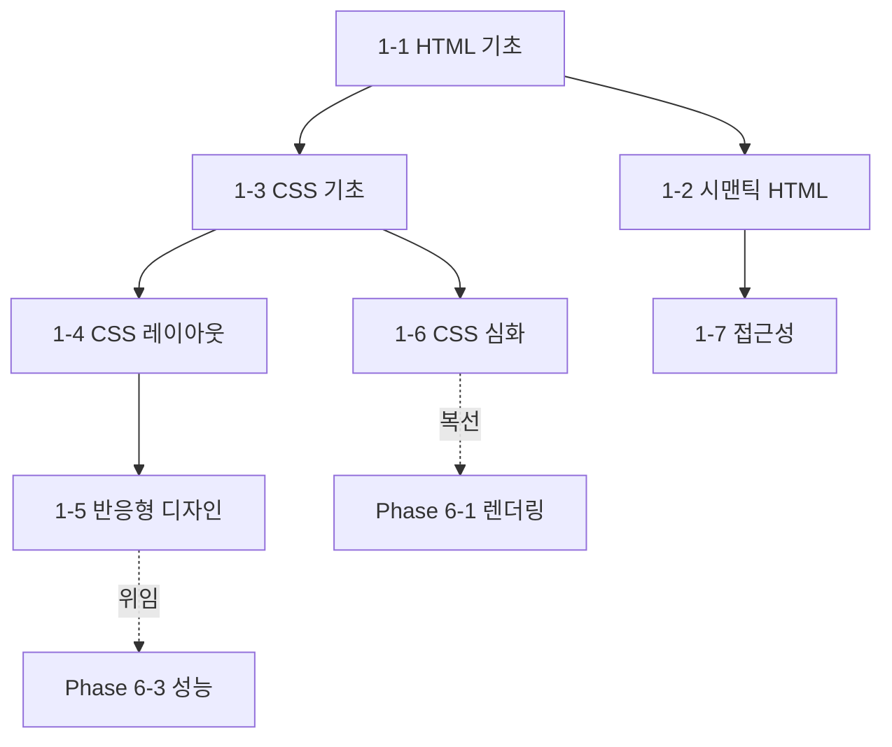

# Phase 1 — HTML & CSS 학습 과정 기획

> ROADMAP.md의 Phase 1(3주, 문서 7개)을 실제 집필 가능한 수준으로 구체화한 기획 문서다.
> 각 문서의 주제 범위, 핵심 논점, 문서 간 의존 관계, 실습 과제 설계, 집필 순서를 정의한다.

---

## 1. 기획 전제

### 독자 상황 분석

독자는 5년차 이상 경력 개발자(백엔드·모바일 출신)다. Phase 1에서 이 전제가 갖는 의미:

- **이미 아는 것**: 마크업 언어라는 개념(XML, JSP/Thymeleaf, Android XML 레이아웃 등), 트리 구조 문서 모델, 스타일과 구조의 분리라는 원칙 자체.
- **모르는 것 (이 Phase의 가치)**: 브라우저가 HTML/CSS를 **어떻게 해석하고 렌더링하는가**, CSS 캐스케이드라는 독특한 충돌 해결 모델, 정규 흐름(normal flow)이라는 레이아웃 기본 모델, 시맨틱이 접근성·SEO와 연결되는 방식.
- **흔한 함정**: 경력자는 HTML/CSS를 "쉬운 것"으로 얕보고 건너뛰다가 레이아웃 디버깅에서 무너진다. 각 문서는 "왜 내 예상과 다르게 동작하는가"를 정면으로 다뤄야 한다.

### Phase 1 전체 목표 (ROADMAP 기준)

시맨틱한 마크업과 현대적인 CSS 레이아웃으로 **반응형 웹페이지를 만들 수 있다.**
최종 산출물: 반응형 정적 웹사이트 (GitHub Pages 배포).

### 3주 배분

| 주차 | 문서 | 실습 |
|------|------|------|
| 1주차 | 1-1 HTML 기초, 1-2 시맨틱 HTML, 1-3 CSS 기초 | 자기소개 페이지 (마크업 + 기본 스타일) |
| 2주차 | 1-4 CSS 레이아웃, 1-5 반응형 디자인 | 자기소개 페이지 반응형 개선, 클론 대상 선정·분석 |
| 3주차 | 1-6 CSS 심화, 1-7 접근성 | 랜딩 페이지 클론 제작 + GitHub Pages 배포 |

---

## 2. 문서별 상세 기획

각 문서는 CLAUDE.md의 공통 구조(학습 목표 → 배경 → 핵심 개념 → 실무 관점 → 정리 → 확인 문제 → 참고 자료)를 따른다. 아래는 문서별로 **다룰 범위 / 다루지 않을 범위 / 핵심 논점 / 경력자 연결 지점**을 정의한다.

### 1-1. HTML 기초 — `docs/phase-1/01-html-basics.md`

- **핵심 질문**: 브라우저는 HTML을 어떻게 파싱하고, 왜 잘못된 마크업도 렌더링되는가?
- **다룰 범위**:
  - HTML 문서 구조(`<!DOCTYPE>`, head/body)와 파싱 모델 — 관용적(forgiving) 파서, 브라우저의 오류 복구가 만드는 함정 (예: `
` 안의 `
` 자동 분리)
  - 콘텐츠 모델(content categories): 왜 `<button>` 안에 `<a>`를 넣으면 안 되는가를 스펙 관점에서
  - 텍스트·그룹·임베디드 요소 중 실무 빈도가 높은 것 위주 (전체 태그 나열 금지)
  - 폼과 입력 요소: `<form>`의 기본 제출 동작, input 타입별 브라우저 내장 검증, `name` 속성과 서버 전송 데이터의 관계 (백엔드 경험과 직결되는 지점)
  - 속성(attribute)와 DOM 프로퍼티의 구분 (Phase 2 DOM 문서의 복선)
- **다루지 않을 범위**: 태그 백과사전식 나열, HTML의 역사 일반, 웹 동작 원리(Phase 0-1 링크로 대체)
- **경력자 연결**: XML 파서의 엄격함 vs HTML 파서의 오류 복구 비교. 폼 제출 = 백엔드에서 받던 `application/x-www-form-urlencoded`의 출발점.

### 1-2. 시맨틱 HTML — `docs/phase-1/02-semantic-html.md`

- **핵심 질문**: 브라우저 화면이 똑같은데 왜 태그 선택이 중요한가? (소비자가 사람만이 아니다)
- **다룰 범위**:
  - 시맨틱의 실제 소비자: 검색 엔진 크롤러, 스크린 리더(접근성 트리), 리더 모드, LLM/스크래퍼
  - 랜드마크 요소(`header`, `nav`, `main`, `article`, `section`, `aside`, `footer`)와 선택 기준 — 특히 `article` vs `section` vs `div` 판단 플로차트
  - 문서 아웃라인: HTML5 아웃라인 알고리즘이 **폐기된** 역사와, 그래서 heading 레벨(h1~h6)을 직접 관리해야 하는 현실
  - SEO 기초: 메타 태그, Open Graph, 구조화 데이터(JSON-LD)는 존재만 소개
- **다루지 않을 범위**: ARIA 상세(1-7로 위임), SEO 테크닉 심화
- **경력자 연결**: 시맨틱 마크업 = API 설계에서의 의미 있는 필드명. `div` 남발 = 모든 컬럼이 `varchar`인 테이블.
- **의존**: 1-1의 콘텐츠 모델 개념을 전제. 1-7 접근성의 기반.

### 1-3. CSS 기초 — `docs/phase-1/03-css-basics.md`

- **핵심 질문**: 여러 규칙이 같은 요소를 노릴 때 브라우저는 무엇을 적용하는가? (캐스케이드라는 충돌 해결 모델)
- **다룰 범위**:
  - 캐스케이드 → 명시도(specificity) → 상속의 3단계 해석 모델을 **먼저** 세우고, 선택자는 그 모델 위에서 소개
  - 명시도 계산 규칙과 `!important`가 안티패턴인 이유, `:where()`/`:is()`의 명시도 특성
  - 박스 모델: content-box vs border-box, 왜 `box-sizing: border-box` 리셋이 사실상 표준이 되었는가
  - 단위 체계: px/em/rem/%/vw·vh의 계산 기준 차이, 언제 무엇을 쓰는가 판단 기준 (표)
  - 계산된 값(computed value) 개념과 DevTools에서 확인하는 법
- **다루지 않을 범위**: 전체 프로퍼티 목록, 레이아웃(1-4), 캐스케이드 레이어(`@layer`)는 존재만 언급하고 1-6에서 다룸
- **경력자 연결**: 캐스케이드 = 설정 파일 오버라이드 체계(기본값 < 환경별 설정 < 런타임 플래그)와 유사한 우선순위 해석.

### 1-4. CSS 레이아웃 — `docs/phase-1/04-css-layout.md`

- **핵심 질문**: 요소는 기본적으로 어떻게 배치되며(정규 흐름), Flexbox/Grid는 그 흐름을 어떻게 대체하는가?
- **다룰 범위**:
  - 정규 흐름(normal flow): 블록/인라인 서식 컨텍스트, `display` 프로퍼티의 outer/inner 의미
  - 마진 겹침(margin collapsing) — 경력자가 가장 많이 당황하는 지점, 발생 조건과 회피법
  - Flexbox: 1차원 배치 모델, 주축/교차축, `flex-grow/shrink/basis`의 실제 계산 방식
  - Grid: 2차원 배치 모델, 트랙 정의(`fr`, `minmax`, `auto-fit/auto-fill`), 명시적/암시적 그리드
  - **Flexbox vs Grid 선택 기준** (콘텐츠 주도 vs 레이아웃 주도) — 트레이드오프 표
  - `position`(relative/absolute/fixed/sticky)과 쌓임 맥락(stacking context) 기초 — `z-index`가 안 먹히는 이유
- **다루지 않을 범위**: float 기반 레거시 레이아웃(왜 대체되었는지 한 문단만), `subgrid` 등 최신 기능은 존재 언급 수준
- **분량 주의**: Phase 1에서 가장 밀도가 높은 문서. 초과 시 "position과 쌓임 맥락"을 별도 문서로 분리하는 안을 ROADMAP 수정과 함께 제안한다.
- **의존**: 1-3의 박스 모델·display 개념 전제.

### 1-5. 반응형 디자인 — `docs/phase-1/05-responsive-design.md`

- **핵심 질문**: 화면 크기를 미리 알 수 없는 환경에서 어떻게 하나의 마크업으로 대응하는가?
- **다룰 범위**:
  - 뷰포트 개념과 `<meta name="viewport">`가 필요한 역사적 이유 (모바일 브라우저의 가상 뷰포트)
  - 미디어 쿼리 문법과 브레이크포인트 설계 전략 — 기기 기준이 아니라 콘텐츠 기준
  - 모바일 퍼스트 vs 데스크톱 퍼스트: `min-width` 접근이 기본이 된 이유
  - 유동 레이아웃 기법: `clamp()`, 상대 단위 조합으로 미디어 쿼리 자체를 줄이는 현대적 접근
  - 컨테이너 쿼리(`@container`) — 컴포넌트 단위 반응형이라는 패러다임 전환 (Baseline 상태 명시)
  - 반응형 이미지: `srcset`/`sizes`, `<picture>`, 해상도(DPR) 대응 — 언제 어떤 것을 쓰는가
- **다루지 않을 범위**: 이미지 포맷·최적화 심화(Phase 6-3로 위임)
- **경력자 연결**: 모바일 앱의 단일 해상도 대응 경험 vs 웹의 연속적 뷰포트라는 근본 차이.
- **의존**: 1-4의 Flexbox/Grid를 전제 (반응형의 절반은 유연한 레이아웃이 해결).

### 1-6. CSS 심화 — `docs/phase-1/06-css-advanced.md`

- **핵심 질문**: 규모가 커진 CSS를 어떻게 유지보수 가능하게 만들고, 어떤 애니메이션이 성능을 해치는가?
- **다룰 범위**:
  - 커스텀 프로퍼티(custom properties): 전처리기 변수와의 결정적 차이(런타임 해석, 상속, JS 연동), 테마 전환 패턴
  - 의사 클래스/의사 요소 실전: `:hover`/`:focus-visible` 구분, `:has()`(부모 선택), `::before/::after` 활용
  - 트랜지션과 애니메이션: `@keyframes`, 타이밍 함수 — 그리고 **transform/opacity만 컴포지터에서 처리되어 저렴하다**는 성능 원칙 (Phase 6-1 렌더링 파이프라인의 복선)
  - 캐스케이드 레이어(`@layer`)와 CSS 중첩(nesting) — 규모 관리 도구로 소개 (Baseline 상태 명시)
  - CSS 설계 방법론(BEM 등)은 "왜 필요했고 무엇이 대체하고 있는가" 관점으로 짧게
- **다루지 않을 범위**: 전처리기(Sass) 상세, CSS-in-JS(Phase 4-9로 위임), 렌더링 파이프라인 상세(Phase 6-1)
- **의존**: 1-3의 캐스케이드·명시도 전제.

### 1-7. 웹 접근성 — `docs/phase-1/07-accessibility.md`

- **핵심 질문**: 접근성은 왜 별도 작업이 아니라 올바른 마크업의 부산물인가?
- **다룰 범위**:
  - 접근성 트리: 브라우저가 DOM에서 접근성 트리를 만들고 스크린 리더가 소비하는 구조
  - ARIA의 제1원칙 — "ARIA를 쓰지 않는 것이 최선" (시맨틱 HTML이 우선, ARIA는 보정 수단)
  - role, `aria-label`/`aria-labelledby`, `aria-expanded` 등 상태 속성 — 커스텀 위젯(드롭다운 등) 예제로
  - 키보드 내비게이션: 포커스 관리, `tabindex`의 올바른 사용(0과 -1만), 포커스 표시 스타일
  - 실용 체크: 색 대비 기준(WCAG AA), `alt` 텍스트 작성 판단, Lighthouse/axe로 검사하는 법
  - 법적·산업적 맥락(WCAG, 국내 웹 접근성 인증)은 배경 섹션에서 짧게
- **다루지 않을 범위**: WCAG 전체 항목 나열, 스크린 리더별 동작 차이 상세
- **경력자 연결**: 접근성 트리 = DOM 위의 또 다른 파생 자료구조. API의 스키마 문서화가 기계 소비자를 위한 것이듯 ARIA는 보조기술이라는 소비자를 위한 인터페이스.
- **의존**: 1-2 시맨틱 HTML과 강하게 연결 (상대 링크 필수).

---

## 3. 문서 간 의존 관계

- 집필 순서는 번호 순서(1-1 → 1-7)를 그대로 따른다. 의존 관계상 뒤 문서가 앞 문서를 상대 링크로 참조한다.
- 뒤 Phase로 위임하는 주제(렌더링 파이프라인, 이미지 최적화, CSS-in-JS)는 본문에서 "Phase N에서 다룬다"고 명시해 범위 이탈을 막는다.

## 4. 실습 과제 설계

ROADMAP의 "자기소개 페이지 → 랜딩 페이지 클론" 2단계 과제를 문서 진도와 연동한다.

### 과제 A — 자기소개 페이지 (1~2주차, 문서 1-1 ~ 1-5와 병행)

| 단계 | 시점 | 요구사항 |
|------|------|----------|
| A-1 | 1-2 학습 후 | 시맨틱 마크업만으로 자기소개 페이지 작성 (CSS 없이, 리더 모드에서 읽히는지 확인) |
| A-2 | 1-3 학습 후 | 타이포그래피·색·간격 스타일링 (클래스 설계 포함) |
| A-3 | 1-4 학습 후 | 헤더/본문/사이드바 레이아웃을 Grid로, 내부 정렬은 Flexbox로 구성 |
| A-4 | 1-5 학습 후 | 모바일 퍼스트 반응형 적용 (브레이크포인트 2개 이상) |

### 과제 B — 랜딩 페이지 클론 (3주차, 문서 1-6 ~ 1-7과 병행)

- 실제 서비스(카페, 쇼핑몰 등) 랜딩 페이지를 선정해 반응형으로 클론한다.
- 요구사항: 커스텀 프로퍼티 기반 색상 체계, hover/포커스 인터랙션, 트랜지션 1개 이상, Lighthouse 접근성 90점 이상, GitHub Pages 배포.
- 완성 기준(Definition of Done)을 과제 안내 문서에 체크리스트로 명시한다.

과제 안내는 `exercises/phase-1/` 아래 별도 문서로 작성한다 (문서 7개 집필 완료 후).

## 5. 공통 집필 기준 (Phase 1 특화)

CLAUDE.md의 전 지침에 더해, Phase 1에서 특히 지킬 것:

- **기준 명시**: 브라우저 지원이 갈리는 기능(`@container`, `:has()`, nesting, `@layer`)은 Baseline 상태를 본문에 명시한다.
- **예제 형식**: HTML/CSS 예제는 단일 `.html` 파일로 열어 바로 확인 가능한 형태를 기본으로 한다. 실행 결과가 시각적인 경우 "무엇이 보여야 하는가"를 주석으로 서술한다.
- **DevTools 활용**: 각 문서에 최소 1회, 해당 개념을 크롬 DevTools에서 직접 확인하는 방법(computed 탭, 접근성 트리 패널 등)을 포함한다 — 디버깅 습관이 곧 멘탈 모델 검증 수단이다.
- **확인 문제 방향**: "이 CSS가 적용되지 않는 이유", "이 레이아웃이 깨지는 이유"처럼 디버깅 시나리오형 문제를 우선한다.

## 6. 진행 체크리스트

- [x] 1-1 `01-html-basics.md`
- [x] 1-2 `02-semantic-html.md`
- [x] 1-3 `03-css-basics.md`
- [x] 1-4 `04-css-layout.md`
- [x] 1-5 `05-responsive-design.md`
- [x] 1-6 `06-css-advanced.md`
- [x] 1-7 `07-accessibility.md`
- [x] `exercises/phase-1/` 과제 안내 문서
- [x] ROADMAP.md 5절 진행 현황 표 갱신
