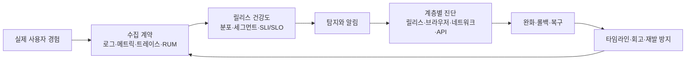
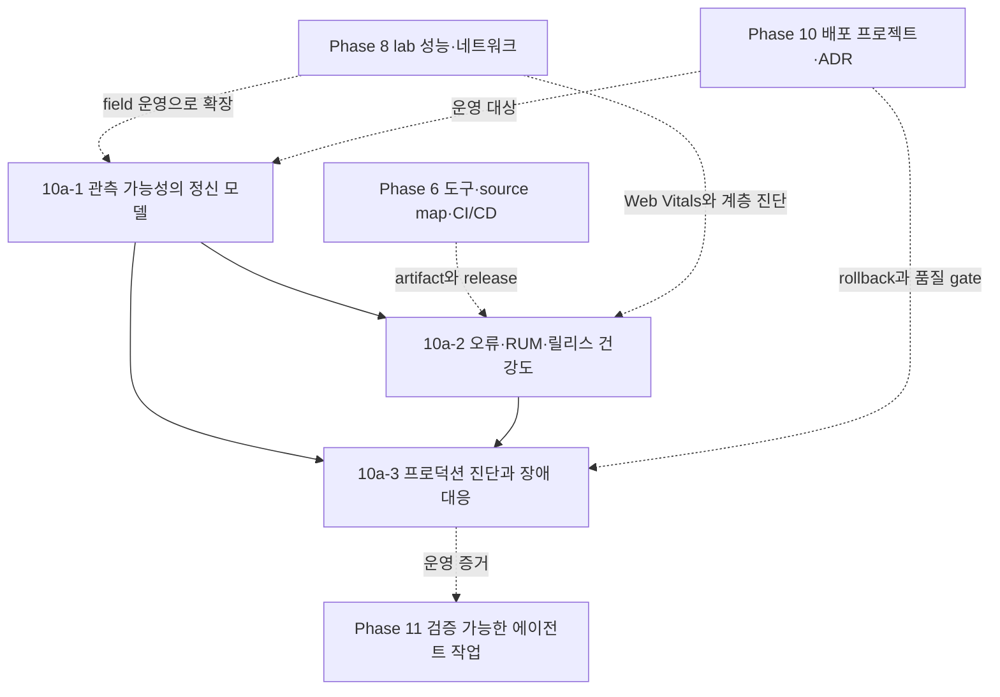

# Phase 10a — 프론트엔드 관측 가능성과 프로덕션 장애 진단 학습 과정 기획

> ROADMAP.md의 Phase 10a(2주, 문서 3개)를 실제 집필 가능한 수준으로 구체화한 기획 문서다.
> 각 문서의 경계, 공통 장애 시나리오, 실습 증거, 자료 검증 기준과 집필 순서를 정의한다.

---

## 1. 기획 전제

### 독자 상황 분석

독자는 5년차 이상 경력 개발자로, Phase 0~9에서 웹 플랫폼·HTTP·JavaScript 런타임·React 렌더링·도구·Git·브라우저 성능과 보안을 학습하고 Phase 10에서 프로젝트를 배포했다. Phase 10a는 새 모니터링 제품의 화면을 익히는 과정이 아니라, 배포 후 사용자에게 발생한 문제를 **신호로 발견하고, 여러 실행 계층에서 원인을 좁히고, 안전하게 완화한 뒤 학습으로 환류하는 운영 루프**를 만드는 과정이다.

- **이미 아는 것**: DevTools Performance/Network 패널, Core Web Vitals의 기본 의미, HTTP 요청·캐시·CORS, JavaScript 예외와 Promise, React Error Boundary, source map의 개발 도구 용도, 배포·CI·ADR·코드 리뷰.
- **모르는 것(이 Phase의 가치)**: 개발 환경에서 한 번 재현한 문제와 실제 사용자의 분산된 실패 신호는 성격이 다르다. 운영에서는 릴리스·세션·페이지·브라우저·네트워크·API 요청을 연결하고, 표본과 분포를 해석하며, 원인을 확정하기 전에도 사용자 영향을 줄이는 결정을 내려야 한다.
- **흔한 함정**: ① 수집 가능한 데이터를 전부 보내고 개인정보·비용·노이즈를 나중 문제로 미룬다. ② `window.error`만 연결하면 모든 실패가 잡힌다고 본다. ③ 평균 응답 시간과 전체 오류 개수만 보고 특정 사용자군의 회귀를 놓친다. ④ source map, release identifier, trace context가 서로 맞지 않아 스택과 요청을 연결하지 못한다. ⑤ 알림 하나를 오류 이벤트 하나에 대응시켜 alert fatigue를 만든다. ⑥ 장애 중 원인 규명에 집착해 완화·롤백을 늦춘다. ⑦ 회고를 개인의 실수나 단일 root cause 이야기로 끝내고 후속 조치의 소유자·검증 방법을 남기지 않는다.

### 커리큘럼 내 위치와 경계

- **Phase 8과의 경계**: Phase 8은 lab trace와 제한된 field-like 측정으로 렌더링·네트워크·Core Web Vitals 병목을 설명한다. Phase 10a는 실제 배포의 장기 RUM 분포, 릴리스 비교, 사용자 영향 기반 SLI·SLO·알림과 장애 대응을 다룬다. 성능 최적화 기법 자체는 반복하지 않는다.
- **Phase 10과의 연결**: Phase 10 프로젝트를 운영 대상 서비스로 재사용한다. Phase 10의 배포·ADR·품질 gate에 텔레메트리 계약, 운영 대시보드, runbook, rollback 조건을 덧붙인다.
- **Phase 11과의 경계**: Phase 11의 관측 가능성은 AI 에이전트가 읽은 파일·실행한 명령·실패 귀인을 기록하는 하네스 관점이다. Phase 10a는 브라우저 사용자 경험과 프론트엔드 릴리스의 운영 관점이다.
- **플랫폼/SRE 일반론과의 경계**: 조직 전체 on-call 체계, 백엔드 인프라 모니터링, 로그 저장소 구축, 대규모 telemetry pipeline 운영은 배경으로만 다룬다. 프론트엔드 엔지니어가 소유하거나 협업해야 하는 신호·진단·완화 경계를 중심에 둔다.

### 설계 접근법 비교와 결정

| 접근법 | 장점 | 한계 | 결정 |
|---|---|---|---|
| 신호 → 릴리스 건강도 → 장애 진단 | ROADMAP의 3개 문서와 일치하고 실습 증거가 단계적으로 누적된다 | 초반 개념이 추상적으로 느껴질 수 있다 | **채택**. 모든 문서에서 같은 장애 시나리오를 이어 사용한다 |
| Sentry/OpenTelemetry/대시보드 등 도구 설정 중심 | 즉시 따라 하기 쉽고 결과 화면이 빠르게 나온다 | 벤더·SDK 버전에 종속되고 원리와 운영 판단이 가려진다 | 제품은 adapter와 예시로만 사용한다 |
| 장애 시나리오에서 역순으로 개념 도출 | 몰입도가 높고 진단 흐름이 기억에 남는다 | 수집 계약·표본·SLI/SLO 기반이 파편화될 수 있다 | 각 장의 도입 사례와 종합 실습에만 사용한다 |

### 공통 운영 루프

세 문서는 다음 피드백 루프의 서로 다른 구간을 맡는다.



모든 신호는 최소한 **무슨 사용자 행동이 실패했는가**, **어느 릴리스·환경에서 발생했는가**, **어떤 요청·세션과 연결되는가**, **얼마나 많은 사용자에게 영향을 주는가**, **수집해도 되는 데이터인가**라는 질문에 답할 수 있어야 한다. 반대로 이 질문에 기여하지 않는 고카디널리티 필드나 원문 payload는 기본 수집 대상에서 제외한다.

### Phase 10a 전체 목표(ROADMAP 기준)

로그·메트릭·트레이스와 RUM의 역할을 구분하고, 사용자 영향 중심의 지표와 알림을 설계한다. 오류·성능 신호를 릴리스와 연결해 원인을 진단하고, 완화·롤백·재발 방지까지 근거를 남길 수 있다.

최종 산출물은 다음 네 가지를 묶은 **프론트엔드 운영 증거 패키지**다.

1. telemetry schema와 개인정보·sampling·retention 결정표
2. 오류·RUM·릴리스 건강도를 보여 주는 운영 대시보드와 알림 기준
3. 장애 탐지부터 복구까지의 타임라인, 진단 query와 완화·rollback 기록
4. 사용자 영향, 기여 요인, 후속 조치의 소유자·검증 방법을 포함한 장애 분석 리포트

### 2주 배분

| 주차 | 문서 | 실습 |
|---|---|---|
| 1주차 전반 | 10a-1 관측 가능성의 정신 모델 | 이벤트 schema, release/session/request correlation, 개인정보 redaction, sampling·비용 budget 설계 |
| 1주차 후반 | 10a-2 오류·RUM·릴리스 건강도 | 오류 수집과 symbolication 검증, Web Vitals 분포·세그먼트 대시보드, SLI·SLO·알림 초안 |
| 2주차 | 10a-3 프로덕션 진단과 장애 대응 | 오류 또는 성능 회귀 주입, 탐지·분류·계층별 진단, feature disable/rollback, 복구 확인, 회고 작성 |

---

## 2. 문서별 상세 기획

세 문서는 같은 예제 서비스와 사건을 공유한다. 기준 시나리오는 **새 릴리스 이후 특정 브라우저·저속 네트워크 사용자군에서 검색 결과 화면의 INP와 API 실패율이 함께 악화된 사건**이다. 문서 10a-1은 어떤 연결 정보를 남길지, 10a-2는 어떻게 회귀를 발견할지, 10a-3은 어느 계층이 원인인지 좁히고 어떻게 복구할지를 맡는다.

### 10a-1. 관측 가능성의 정신 모델 — `docs/phase-10a/01-observability-mental-model.md`

- **핵심 질문**: 프론트엔드의 내부 상태를 직접 볼 수 없을 때 어떤 신호와 연결 문맥을 남겨야 새로운 질문에 답할 수 있는가?
- **도입 실패 사례**: 오류 이벤트는 많지만 release, route, session, request ID가 없어 배포와 API trace 어느 쪽에도 연결하지 못한다. 디버깅을 위해 request/response 원문을 추가하려다 개인정보와 비용 위험만 키운다.
- **다룰 범위**:
  - 모니터링과 관측 가능성의 차이: 미리 정한 정상/비정상 질문을 지속 확인하는 monitoring과, 남긴 신호를 조합해 예상하지 못한 상태를 추론하는 observability를 대립어가 아닌 포함 관계로 설명한다.
  - 신호의 역할: log/event는 이산 사건과 문맥, metric은 집계·추세·알림, trace는 한 요청의 계층 간 인과와 시간, RUM은 실제 브라우저 세션의 사용자 경험 분포를 제공한다. 하나의 신호가 모든 역할을 대신하지 않는다.
  - 프론트엔드 관측 경계: page lifecycle, route transition, 사용자 핵심 작업, resource/API request, long task·Web Vitals, JavaScript error를 공통 사건 모델에 배치한다. 브라우저에서 볼 수 없는 server 내부 상태는 응답의 trace/correlation context로 연결한다.
  - 상관관계 schema: `environment`, `release`, `route`, 익명 session, operation, error fingerprint, `trace_id`/`span_id`, request ID, timestamp와 duration의 의미·카디널리티·수명. W3C `traceparent` 전파와 애플리케이션 request ID를 구분한다.
  - 수집 계약: 필수/선택 필드, schema version, clock 기준, 중복 전송·offline/종료 시 전송 실패, telemetry 자체의 실패를 제품 실패와 분리하는 방법.
  - sampling과 비용: head/tail 또는 event sampling의 개념, 오류·느린 trace의 보존 편향, sample rate가 분모와 percentile에 미치는 영향, 고카디널리티 label과 저장 기간의 비용.
  - 개인정보와 보안: URL query, DOM text, form input, user ID, IP, auth token, request body를 기본 수집하지 않는다. allowlist, redaction, pseudonymization, consent, 접근 권한, retention·삭제 정책을 수집 전 설계한다.
  - 표준과 제품의 경계: OpenTelemetry의 공통 데이터 모델과 전파 개념은 설명하되 브라우저 client instrumentation의 실험적 상태를 명시한다. 특정 벤더 SDK는 교체 가능한 adapter로 둔다.
- **다루지 않을 범위**: telemetry backend 직접 구축, collector·storage cluster 운영, 전사 data governance, OpenTelemetry SDK API 전체.
- **경력자 연결**: 백엔드의 structured log와 distributed trace에 익숙한 독자에게 브라우저는 신뢰할 수 없는 분산 edge client다. 전송 중 이탈하고, 버전과 환경이 다양하며, 사용자가 입력한 민감한 문맥을 품는다는 차이를 강조한다.
- **의존**: 2-1 요청·응답, 2-2 HTTP cache, 3-7 이벤트 루프, 3-8 fetch/CORS, 6-5 CI/CD, 8-2 네트워크 심화, 8-3 웹 성능.
- **집필 검증**: 예시 event를 JSON Schema 또는 TypeScript type으로 표현하고, 허용/금지 필드와 cardinality를 리뷰한다. `traceparent` 예시는 W3C 형식과 CORS·trust boundary를 공식 자료로 확인한다.

### 10a-2. 오류·RUM·릴리스 건강도 — `docs/phase-10a/02-errors-rum-and-release-health.md`

- **핵심 질문**: 오류와 실제 사용자 성능을 어떻게 수집·집계해야 새 릴리스가 어떤 사용자군을 얼마나 악화시켰는지 판단할 수 있는가?
- **도입 실패 사례**: 배포 직후 오류 이벤트가 3배 늘었지만 트래픽도 3배 늘었다. 평균 LCP는 같지만 특정 route의 mobile p75 INP가 악화되었다. release identifier와 source map artifact가 맞지 않아 스택은 minified 위치만 가리킨다.
- **다룰 범위**:
  - 오류 표면: synchronous exception, resource loading error, `unhandledrejection`, 명시적으로 catch된 업무 실패, fetch의 HTTP failure, React render/event/async 경계가 서로 다른 수집 경로를 갖는 이유.
  - 포착과 의미 부여: 전역 handler는 최후의 안전망이지 정상적인 오류 처리의 대체물이 아니다. expected validation/business failure와 defect, handled와 unhandled, 사용자에게 복구 가능한 실패를 분류한다.
  - symbolication 계약: minified stack, source map, generated artifact, source revision, release/debug identifier의 관계. source map을 오류 발생 전에 정확한 release에 업로드·검증하고 공개 배포 여부와 `sourcesContent` 위험을 결정한다.
  - 오류 grouping: message 문자열만이 아니라 exception type, normalized stack, culprit, release·feature context를 사용한다. fingerprint 변경이 새 issue 수와 추세 연속성을 바꾸는 점, grouping 결과의 false merge/split을 샘플로 검토하는 방법.
  - RUM lifecycle: navigation/route/interaction 단위, page visibility와 bfcache, SPA route 전환, 장기 세션, 종료 시 beacon의 불완전성. lab과 field, CrUX 집계와 자체 RUM의 차이를 분리한다.
  - 분포와 세그먼트: 평균 대신 count·rate·percentile과 표본 수를 함께 본다. Core Web Vitals는 LCP·INP·CLS의 field p75와 mobile/desktop 구분을 출발점으로 삼되 route, release, browser, device/network, geography 세그먼트가 만드는 작은 표본·고카디널리티 위험을 다룬다.
  - 사용자 영향 기반 SLI/SLO: 핵심 작업 성공률, 오류 없는 세션/사용자 비율, latency/Web Vitals 기준 충족 비율을 후보 SLI로 둔다. telemetry 수집 성공률을 제품 성공률과 혼동하지 않고, 목표·window·분모·제외 규칙을 명시한다.
  - release health: baseline release와 candidate release의 오류율·영향 사용자·성능 분포를 동일 조건에서 비교한다. canary/점진 배포, feature flag, rollback trigger와 연결하되 배포 플랫폼 사용법으로 확장하지 않는다.
  - 대시보드와 알림: dashboard는 상태·변화·드릴다운을, alert는 사람이 행동해야 할 사용자 영향 신호를 맡는다. 단일 이벤트가 아니라 지속 시간·표본 수·error budget burn을 고려하고 page/ticket/dashboard의 목적을 구분한다.
- **다루지 않을 범위**: Core Web Vitals 최적화 기법(8-3), 통계학 일반 과정, A/B test 설계, 특정 vendor query language와 대시보드 메뉴 설명.
- **경력자 연결**: HTTP 500 count 대신 request rate 대비 error rate와 latency percentile을 보듯, 프론트엔드도 page view 수가 아니라 사용자 작업의 분모·분포·release cohort를 함께 봐야 한다. 차이는 한 세션의 여러 route와 사용자 기기 성능이 측정값에 크게 개입한다는 점이다.
- **의존**: 3-6 Promise, 3-8 fetch, 5-4 Error Boundary, 5-5 성능 최적화, 6-2 source map·bundle, 8-3 Core Web Vitals, 10-1 release·ADR.
- **집필 검증**: 고정된 minified fixture에서 symbolication 전후 stack을 비교하고, 같은 원인이 한 issue로 묶이는지 확인한다. RUM fixture는 release·route·browser별 표본 수와 p75를 재현 가능한 seed data로 계산한다.

### 10a-3. 프로덕션 진단과 장애 대응 — `docs/phase-10a/03-production-diagnostics-and-incidents.md`

- **핵심 질문**: 오류·성능 회귀를 어떤 증거 순서로 좁히고, 원인이 불확실한 동안 무엇을 완화·롤백하며, 복구와 재발 방지를 어떻게 증명할 것인가?
- **도입 실패 사례**: 신규 릴리스와 동시에 오류율·INP가 악화되었지만 개발 환경에서는 재현되지 않는다. 프론트엔드 팀은 API를, 백엔드 팀은 특정 브라우저를 의심한다. 각 팀이 자기 로그만 보며 시간은 흐르고 사용자 영향은 계속된다.
- **다룰 범위**:
  - incident lifecycle: 탐지 → 사실 확인 → severity·영향 범위 분류 → 대응 역할·채널 확정 → 완화 → 원인 가설 검증 → 복구 확인 → 회고·후속 조치. 진단과 완화를 병렬 track으로 둔다.
  - 첫 15분 질문: 무엇이 언제부터 변했는가, 어떤 사용자 작업·release·route·segment가 영향받는가, telemetry 자체 장애인가, 최근 변경은 무엇인가, 안전한 완화 수단과 rollback 비용은 무엇인가.
  - 계층별 진단 매트릭스:
    - **릴리스/설정**: first bad release, source revision, feature flag, asset·HTML version skew, cache propagation.
    - **브라우저/runtime**: engine/version, extension, memory pressure, long task, unsupported API, hydration·render error.
    - **네트워크/CDN**: offline/timeout, DNS/TLS, cache hit/miss, stale asset, CORS/CSP, third-party resource.
    - **API/backend**: status·latency·payload schema, auth, rate limit, trace span, dependency failure.
  - 가설 관리: 관찰 사실과 추론을 분리하고, 각 가설에 기대되는 신호·반증 조건·다음 query를 붙인다. 한 dashboard의 시간상 상관관계를 원인으로 확정하지 않는다.
  - 재현 전략: affected cohort의 release/browser/network 조건을 고정하고 production data를 복제하지 않은 안전한 fixture에서 재현한다. session replay나 payload를 사용할 때 개인정보·접근 권한을 우선 검토한다.
  - 완화와 rollback: feature disable, traffic/canary 조정, 이전 asset·API contract 복구, cache purge, graceful degradation의 위험과 검증 항목. irreversible change나 database/API compatibility가 있으면 단순 frontend rollback이 안전하지 않을 수 있음을 다룬다.
  - 복구 확인: alert silence만 보지 않고 affected cohort의 SLI 회복, 새 오류 유입 정지, 핵심 작업 smoke test, 데이터 정합성, telemetry 정상 수집을 확인한다. 관찰 window와 잔여 위험을 명시한다.
  - 타임라인과 커뮤니케이션: timestamp·관찰·결정·행동·결과·담당자를 기록하고, 내부 기술 채널과 사용자 상태 공지의 정보 수준을 분리한다.
  - blameless postmortem: impact, detection, timeline, trigger와 contributing factors, 잘 작동한 방어, 완화·복구, 배운 점, action item을 작성한다. 각 action item에 owner, 기한/우선순위, 완료 증거를 두고 코드 수정 외에도 탐지·완화·runbook·테스트 개선을 포함한다.
- **다루지 않을 범위**: 전사 incident commander 조직 설계, 법무·대외 커뮤니케이션 전문 과정, chaos engineering 플랫폼, backend root cause analysis 전체.
- **경력자 연결**: frontend 장애도 분산 시스템 장애다. 브라우저·CDN·API·release artifact가 느슨하게 결합되어 있으므로 한 팀의 로그가 아니라 공유 correlation과 사용자 영향으로 협업해야 한다.
- **의존**: 2-2 cache, 2-4 HTTP/2·3, 3-7 event loop, 6-5 CI/CD, 7-8 복구, 8-1~8-3 렌더링·네트워크·성능, 10-1 ADR, 10-2 품질 gate.
- **집필 검증**: 최소 두 장애 유형(배포 오류, 비배포 의존성/네트워크 오류)에 runbook을 적용해 first bad release 가정이 틀릴 때도 진단이 진행되는지 검토한다. rollback 후 SLI 회복을 별도 단계로 증명한다.

---

## 3. 문서 간 의존 관계



- 10a-1에서 event schema와 correlation vocabulary를 먼저 고정하지 않으면 10a-2의 dashboard가 서로 연결되지 않은 그래프 모음이 되고 10a-3의 계층 진단도 추측에 머문다.
- 10a-2는 오류와 성능을 release·사용자 영향에 연결해 “대응할 사건”을 만든다. 10a-3은 그 신호에서 출발해 가설, 완화, 복구, 회고로 루프를 닫는다.
- 각 문서는 독립적으로 읽을 수 있어야 하지만 공통 fixture의 event 이름, release ID, route, operation, trace field는 바꾸지 않는다. 집필 중 schema를 바꾸면 뒤 문서와 실습 seed data를 함께 갱신한다.

---

## 4. 실습 과제 설계

ROADMAP의 “최소한의 오류·성능 텔레메트리 → 운영 대시보드·알림 → 의도적 회귀 → 진단·완화/롤백 → 장애 분석 리포트”를 하나의 누적 실습으로 설계한다. `exercises/phase-10a/README.md`를 집필할 때 아래 계약과 완료 기준을 canonical 요구사항으로 옮긴다.

### 공통 fixture와 안전 경계

- Phase 10 프로젝트 또는 소유한 test deployment를 사용한다. 실제 고객 production, 타인의 서비스, shared production cache에는 오류를 주입하지 않는다.
- 핵심 작업은 `검색 → 결과 확인 → 상세 열기`처럼 성공/실패와 latency를 명확히 정의할 수 있는 흐름 하나를 선택한다.
- 두 release를 만든다: 안정 baseline `r1`과 의도적 회귀 `r2`. `r2`에는 아래 중 하나 이상의 feature flag 기반 결함을 둔다.
  - 특정 브라우저 조건에서 발생하는 JavaScript exception
  - API schema mismatch 또는 handled business failure
  - main-thread long task로 인한 interaction latency 악화
  - 느린/실패 API 또는 stale asset·cache version skew
- 오류 주입과 rollback은 flag 또는 명시적 release 전환으로 되돌릴 수 있어야 한다. 개인정보·secret·실사용자 입력을 fixture에 넣지 않는다.

### 과제 A — telemetry 계약과 correlation 구성(1주차 전반, 10a-1 병행)

- 핵심 작업의 시작·성공·실패 event, JavaScript error, API span/request, Web Vitals event schema를 정의한다.
- 각 field에 목적, type, cardinality, 예시, 개인정보 등급, redaction, sampling, retention을 기록한 data dictionary를 만든다.
- 모든 event가 `environment`, `release`, `route`, 익명 session/operation ID를 공유하게 한다. API 요청에는 허용된 same-origin 또는 명시적 trust boundary 안에서 trace/correlation ID를 전파한다.
- telemetry endpoint 실패, offline, page termination, duplicate delivery를 재현하고 제품 오류율과 수집 실패율을 분리한다.
- 금지 field가 전송되지 않는지 automated assertion 또는 payload inspection으로 검증한다.

### 과제 B — 오류·RUM·릴리스 대시보드와 알림(1주차 후반, 10a-2 병행)

- minified production build와 source map을 release에 연결한다. 의도적 exception의 stack이 원본 source 위치로 복원되고 잘못된 release/map 조합에서는 실패하는 것을 비교한다.
- dashboard에 최소 다음 panel을 둔다: 핵심 작업 성공률, 영향 사용자/세션 수, error rate와 top group, LCP·INP·CLS p75와 sample count, API latency/error, release marker.
- release·route·browser/device 중 필요한 세그먼트로 drill down하되 모든 raw identifier를 label로 만들지 않는다.
- SLI 하나와 SLO 초안을 정의한다. 분자·분모, window, 제외 규칙, 최소 표본, missing telemetry 처리, 경고/긴급 행동을 명시한다.
- baseline data로 alert를 dry-run하고 정상 변동에서 울리지 않는지 확인한다. `r2` 회귀에서는 예상 시간 안에 탐지되는지 기록한다.

### 과제 C — 장애 주입, 계층 진단과 복구(2주차, 10a-3 병행)

- 진행자 또는 동료가 결함 flag를 선택하고 대응자는 원인을 모른 채 시작한다. 혼자라면 결함을 만든 뒤 일정 시간을 두고 runbook만 보고 재현한다.
- 최초 alert부터 severity·영향 범위, first bad release, affected cohort를 확인하고 사실/가설/결정을 incident log에 분리해 적는다.
- release → browser/runtime → network/CDN → API/backend 매트릭스에서 최소 두 가설을 비교하고, query·trace·stack·waterfall 중 반증 증거를 남긴다.
- root cause 확정 전에도 사용자 영향이 크면 feature disable 또는 rollback을 수행한다. 조치 전 위험과 기대 결과를 기록한다.
- 핵심 작업 smoke test와 affected cohort SLI가 정한 관찰 window 동안 회복했는지 확인한 뒤 incident를 종료한다.

### 과제 D — 장애 분석 리포트와 재발 방지(2주차 마무리)

- executive summary, 사용자 영향, detection, timeline, trigger, contributing factors, 완화·복구, 잘된 점/개선할 점, evidence link를 작성한다.
- “누가 실수했는가” 대신 어떤 시스템 조건과 방어 부재가 결과를 허용했는지 설명한다. 단일 root cause 문장으로 복잡성을 숨기지 않는다.
- 후속 조치를 prevention, detection, mitigation, process/runbook으로 나누고 각 항목에 owner, 우선순위/기한, 완료 증거를 붙인다.
- source map 검증, release health gate, alert, rollback smoke test 중 하나 이상을 자동화하거나 다음 배포의 품질 gate에 추가한다.

### 측정·증거 프로토콜

- 모든 결과에 commit/source revision, release, environment, build mode, browser/version, viewport, network/CPU 조건, feature flag, 수집 SDK/version, sample policy와 확인 시간을 남긴다.
- raw count는 분모와 sample count 없이 비교하지 않는다. percentile은 집계 단위, window, cohort와 함께 기록하며 작은 표본을 일반화하지 않는다.
- user ID·session token·URL query·DOM/input text·request/response body·source map 원문을 보고서에 복사하지 않는다. 필요한 예시는 합성 데이터로 치환한다.
- dashboard screenshot만 증거로 쓰지 않는다. 재현 query 또는 filter, event/trace ID, release diff, 실행 명령, 관찰 결과를 함께 보존한다.
- telemetry 누락은 “문제가 없음”이 아니다. 수집 coverage와 endpoint failure를 별도 지표로 확인한다.
- 회귀 주입과 복구는 소유한 local/test 환경에서만 수행하고 종료 후 flag, test alert, 임시 data와 접근 권한을 정리한다.

### 권장 산출물 구조

```text
phase-10a-operations/
  instrumentation/
    event-schema.md
    data-dictionary.md
    privacy-sampling-retention.md
  dashboards/
    frontend-health.md
    queries.md
    alert-policy.md
  runbooks/
    frontend-release-regression.md
    telemetry-pipeline-failure.md
  incidents/
    incident-log.md
    evidence/
    postmortem.md
  releases/
    r1-baseline.md
    r2-injected-regression.md
  reports/
    release-health-comparison.md
```

### 완성 기준(Definition of Done)

- [ ] 핵심 사용자 작업의 start/success/failure와 오류·API·Web Vitals schema가 연결된다.
- [ ] data dictionary가 목적·cardinality·개인정보·redaction·sampling·retention을 명시한다.
- [ ] release·route·익명 session/operation·request/trace correlation이 동작한다.
- [ ] telemetry 전송 실패와 제품 실패를 별도 신호로 관찰했다.
- [ ] production build 오류의 source map과 release가 맞을 때 원본 stack으로 복원됨을 검증했다.
- [ ] dashboard가 사용자 영향, 오류율/group, Core Web Vitals p75와 sample count, API 상태, release marker를 포함한다.
- [ ] SLI/SLO·alert 초안이 분자·분모·window·최소 표본·행동을 명시하고 baseline dry-run을 거쳤다.
- [ ] 의도적 회귀를 alert로 탐지하고 affected release·route·cohort를 좁혔다.
- [ ] 최소 두 계층 가설을 증거로 비교하고 사실·가설·결정을 incident log에 분리했다.
- [ ] feature disable 또는 rollback 뒤 핵심 작업과 affected cohort SLI의 회복을 확인했다.
- [ ] postmortem이 사용자 영향·timeline·기여 요인·완화·복구·근거 링크를 포함한다.
- [ ] 후속 조치마다 owner, 우선순위/기한, 완료 증거가 있고 prevention·detection·mitigation 중 두 범주 이상을 개선한다.

---

## 5. 공통 집필 기준(Phase 10a 특화)

`docs/phase-10a/`의 실제 문서는 [.agents/content-writing.md](../.agents/content-writing.md)를 따르며 다음 기준을 추가로 적용한다.

- **사용자 영향에서 시작**: SDK 설정이나 데이터 타입보다 사용자가 완료하지 못한 작업과 degraded experience를 먼저 제시한다. 내부 error count가 아니라 영향 사용자·세션·작업 비율로 우선순위를 설명한다.
- **신호의 역할과 연결을 분리**: log·metric·trace·RUM을 “네 가지를 모두 수집하라”는 목록으로 쓰지 않는다. 각 신호가 답하는 질문과 correlation field, 다른 신호로 이동하는 방법을 함께 보여 준다.
- **제품 중립적 core와 adapter 분리**: 표준 event schema, Web API, W3C Trace Context, source map, SLI/SLO를 본문 core로 두고 Sentry·OpenTelemetry·Datadog 등은 구현 예시로만 둔다. 제품별 query와 설정은 callout 또는 부록 형태로 격리한다.
- **브라우저 계측의 불완전성 명시**: offline, page 종료, ad/tracking blocker, browser 정책, sampling, SDK 오류 때문에 data가 빠질 수 있다. “수집되지 않음”과 “실패하지 않음”을 구분한다.
- **평균보다 분포와 분모**: rate·percentile·영향 사용자 수를 sample count와 함께 제시한다. 평균, raw count, Lighthouse 점수만으로 운영 상태를 판정하지 않는다.
- **error capture와 error handling 분리**: 전역 handler나 Error Boundary를 정상적인 복구·사용자 피드백의 대체물로 쓰지 않는다. fetch HTTP error, handled rejection, render error의 경계를 예제로 검증한다.
- **release를 일급 문맥으로 취급**: source revision, generated artifact, source map, feature flag, deploy time, rollback 대상이 같은 release vocabulary를 사용하게 한다. 배포 시각만으로 release를 추측하지 않는다.
- **진단과 완화를 병렬화**: 장애 대응 서술은 완전한 root cause를 찾은 뒤 행동하는 선형 절차가 아니다. 사용자 영향이 지속되면 가역적 완화를 먼저 선택할 수 있게 risk·rollback 조건을 제시한다.
- **상관관계와 인과관계 구분**: 같은 시각에 변한 release·API latency·Web Vital이 곧 원인이라는 결론을 금지한다. 가설마다 반증 가능한 예측과 다음 관찰을 붙인다.
- **개인정보 최소 수집**: “나중에 마스킹”보다 allowlist와 수집 전 redaction을 우선한다. session replay, DOM text, URL, request body의 효용과 침해 범위를 명시하고 기본 활성화를 권장하지 않는다.
- **회고는 시스템 학습 산출물**: 개인 비난과 모호한 “주의한다” 조치를 피한다. 탐지·완화·복구·설계·테스트·runbook 중 어느 방어 계층을 어떻게 강화하고 완료를 무엇으로 증명할지 쓴다.
- **확인 문제는 운영 판단형**: “이 dashboard에서 어느 cohort가 영향받는가”, “이 alert의 분모와 행동이 명확한가”, “다음 query가 어떤 가설을 반증하는가”, “지금 rollback이 더 안전한가”처럼 증거·결정·복구를 요구한다.

### 문서별 공통 구성

1. 사용자 영향이 드러나는 운영 실패 사례
2. 이 문서가 맡는 운영 루프 구간과 앞뒤 신호
3. 제품 중립적 동작 모델과 event/timeline diagram
4. 최소 브라우저 예제와 선택적 vendor adapter
5. 정상·실패·telemetry 누락 상태
6. privacy·sampling·cost·cardinality trade-off
7. 관찰 실험과 반증 가능한 진단 질문
8. 실습 산출물 template
9. 판단형 확인 문제
10. 기준 버전·확인 날짜를 포함한 1차 자료 중심 참고 문헌

---

## 6. 자료와 정확성 검증 전략

### 자료 계층

1. **웹 표준과 브라우저 API**: WHATWG HTML, W3C Trace Context, Performance Timeline·Event Timing·Navigation Timing, ECMA-426 source map, MDN의 `error`·`unhandledrejection`·`sendBeacon` 문서.
2. **Core Web Vitals와 Chrome field guidance**: web.dev/Chrome Developers의 metric 정의, p75 기준, field attribution, lab/field 차이. metric lifecycle과 changelog를 집필 시점에 다시 확인한다.
3. **OpenTelemetry 공식 문서와 specification**: signal model, context propagation, semantic conventions, sampling과 security. JavaScript trace/metric의 안정성과 별개로 browser client instrumentation이 실험적이라는 상태를 명시한다.
4. **Google SRE 공식 도서**: SLI/SLO, multi-window multi-burn-rate alert, incident response, blameless postmortem과 action item 원칙을 프론트엔드 규모에 맞게 축소한다.
5. **OWASP와 개인정보 지침**: logging data exclusion, sanitization, 접근 통제, retention 원칙. 적용 지역의 법적 요구사항은 교육 문서가 대신 판단하지 않고 조직의 법무·privacy 정책 확인으로 연결한다.
6. **선택한 관측 제품 공식 문서**: JavaScript error capture, source map upload, release health, grouping, RUM SDK의 현재 동작을 adapter 예제로 검증한다. 제품 하나의 기본값을 표준처럼 일반화하지 않는다.
7. **통제된 production build 실험**: 문서만으로 확인하기 어려운 page termination, symbolication, grouping, cache version skew, rollback 후 지표 회복은 소유한 test environment에서 재현한다.

### 우선 확인할 1차 자료(2026-07-11 기준)

- [W3C Trace Context](https://www.w3.org/TR/trace-context/): `traceparent`/`tracestate` 형식, 전파·sampling flag·trust/security 고려.
- [OpenTelemetry JavaScript](https://opentelemetry.io/docs/languages/js/): JavaScript signal status와 browser client instrumentation의 실험적 상태.
- [Web Vitals](https://web.dev/articles/vitals): LCP·INP·CLS, field p75, mobile/desktop 구분, 자체 RUM과 CrUX/lab의 차이.
- [Debug performance in the field](https://web.dev/articles/debug-performance-in-the-field): INP·LCP·CLS attribution과 field data에서 재현 단서로 이동하는 방법.
- [ECMA-426 Source map format](https://tc39.es/ecma426/): generated source와 original source의 mapping, server-side stack trace deobfuscation의 표준 형식.
- [MDN `unhandledrejection`](https://developer.mozilla.org/en-US/docs/Web/API/Window/unhandledrejection_event)와 관련 `error`/`sendBeacon` 문서: browser error surface와 lifecycle 전송 제약.
- [Google SRE Workbook — Alerting on SLOs](https://sre.google/workbook/alerting-on-slos/): error budget, burn rate, multi-window alert와 low-traffic 주의점.
- [Google SRE Workbook — Postmortem Culture](https://sre.google/workbook/postmortem-culture/): blameless·data-driven postmortem, promptness, action item ownership과 추적.
- [OWASP Logging Cheat Sheet](https://cheatsheetseries.owasp.org/cheatsheets/Logging_Cheat_Sheet.html): 수집 제외 데이터, sanitization, 전송·저장 보호, 접근·retention 원칙.
- 선택한 SDK와 backend의 공식 source map, release, grouping, sampling, data scrubbing 문서. 예시 제품은 기능이 아니라 위 계약을 구현할 수 있는지 기준으로 고른다.

### 집필 시 검증 체크

- 표준 보장, browser 구현, SDK 기능, backend 제품 기능을 같은 계층으로 서술하지 않는다.
- `window.error`, resource error, `unhandledrejection`, fetch HTTP failure, React Error Boundary가 포착하는 범위를 작은 fixture로 확인한다.
- source map artifact와 release/debug identifier가 일치·불일치할 때 symbolication 결과를 production build에서 비교한다.
- W3C trace context 전파는 same-origin과 cross-origin/CORS, untrusted inbound header, sampling flag를 구분한다.
- Core Web Vitals의 현재 metric과 threshold·percentile 기준을 공식 changelog와 함께 재확인한다. lab TBT를 field INP라고 부르지 않는다.
- dashboard 예시는 raw count, rate, percentile, sample count, cohort, time window를 구분한다.
- SLO 수식과 burn-rate 예시는 작은 트래픽에서 단일 실패가 만드는 노이즈를 포함해 계산한다.
- 개인정보 예제는 allowlist와 redaction test를 포함하고 실제 token·사용자 입력·URL query·payload를 사용하지 않는다.
- incident fixture는 first bad release 가설이 맞는 경우와 틀린 경우를 모두 포함한다.
- rollback은 asset·HTML·API schema·cache compatibility를 검토하고, 실행 성공이 아니라 사용자 SLI 회복으로 완료를 판단한다.
- 외부 링크, 상대 링크, Mermaid, navigation label/order와 VitePress production build는 3개 문서와 실습 문서가 생긴 뒤 통합 검증한다.

---

## 7. 집필 순서와 진행 체크리스트

### 권장 집필 순서

1. **공통 fixture와 vocabulary 확정**: 핵심 작업, `r1`/`r2`, release·route·session·operation·request/trace field, 오류·성능 회귀 flag를 먼저 고정한다.
2. **10a-1 집필**: 신호별 질문, event schema, correlation, privacy/sampling/cost 결정표와 telemetry failure 실험을 작성한다.
3. **실습 계측 골격 작성**: `exercises/phase-10a/README.md`에 공통 fixture, 안전 경계, data dictionary template, payload assertion을 옮긴다.
4. **10a-2 집필**: 오류 표면·symbolication·grouping과 RUM 분포·release health·SLI/SLO·alert를 같은 seed data로 연결한다.
5. **dashboard와 alert 실습 확정**: panel/query/분모/sample 기준과 baseline dry-run·회귀 탐지 조건을 고정한다.
6. **10a-3 집필**: 계층별 진단 매트릭스, 가설 log, 완화·rollback·복구 확인, blameless postmortem을 관통 사건으로 전개한다.
7. **장애 훈련과 보고서 실습 확정**: blind fault injection, incident log, postmortem, 후속 조치 template과 DoD를 완성한다.
8. **통합 검토**: Phase 8/10/11 중복과 위임 링크, signal/release vocabulary, 개인정보, source map·trace·metric 현재성, 상대 링크와 navigation을 확인한다.
9. **검증·상태 갱신**: code fence typecheck/test, fixture production build, VitePress build를 실행하고 실제 완료된 파일 수에 맞춰 PROGRESS의 Phase 10a 상태와 TODO를 갱신한다.

### 진행 체크리스트

- [x] `plan/phase10a.md` 과정 설계 초안
- [ ] 공통 fixture, telemetry schema와 `r1`/`r2` 장애 시나리오 확정
- [ ] 10a-1 `01-observability-mental-model.md`
- [ ] 10a-2 `02-errors-rum-and-release-health.md`
- [ ] 10a-3 `03-production-diagnostics-and-incidents.md`
- [ ] `exercises/phase-10a/README.md` 과제 안내 문서
- [ ] Phase 8·10·11과 중복 설명·상대 링크·용어 위임 검토
- [ ] source map·trace context·Core Web Vitals·SDK 기능의 기준 버전과 확인 날짜 검증
- [ ] 개인정보 allowlist/redaction, sampling, cardinality, retention 검토
- [ ] 오류 포착·symbolication·RUM·rollback fixture의 production evidence 확보
- [ ] `docs/.vitepress/navigation.ts`의 Phase 10a label·정렬·nav/sidebar 포함 검증
- [ ] TypeScript/JavaScript code fence typecheck·test와 VitePress production build
- [ ] `PROGRESS.md` 진행 현황과 TODO를 실제 문서·실습 완료 상태에 맞춰 갱신
