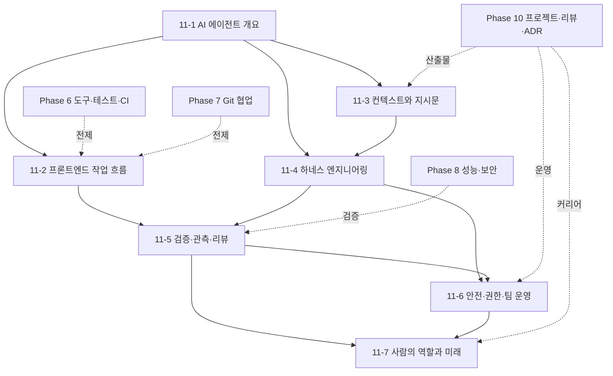

# Phase 11 — AI 에이전트 활용: 프론트엔드 개발 워크플로와 하네스 설계 학습 과정 기획

> ROADMAP.md에 추가할 Phase 11(2주+, 문서 7개)을 실제 집필 가능한 수준으로 구체화한 기획 문서다.
> 현재 단계에서는 ROADMAP.md를 직접 수정하지 않고, 새 과정의 목표, 문서 구성, 실습 과제, 집필 기준을 먼저 고정한다.

---

## 1. 기획 전제

### 독자 상황 분석

독자는 Phase 0~10에서 웹 플랫폼, HTML/CSS 렌더링, HTTP, JavaScript 런타임, TypeScript 타입 설계, React 렌더링 모델, 프론트엔드 도구, Git 협업, 브라우저 성능·보안·Next.js/RSC, 설계 패턴, 실전 프로젝트와 기술 검증까지 다뤘다. Phase 11은 새로운 프레임워크 사용법을 배우는 과정이 아니라, 이미 갖춘 프론트엔드 판단 기준을 **AI 에이전트에게 위임 가능한 작업 단위와 검증 가능한 협업 루프**로 바꾸는 과정이다.

- **이미 아는 것**: 기능 구현, 테스트, 리팩터링, 코드 리뷰, Git 운영, ADR, 브라우저 성능·보안 점검, 프론트엔드 프로젝트 배포. LLM 챗봇에게 질문하거나 코드 조각을 생성하게 하는 경험도 어느 정도 있다고 본다.
- **모르는 것 (이 Phase의 가치)**: AI 에이전트는 자동완성이나 채팅 답변이 아니라, 목표를 받아 코드베이스를 관찰하고 도구를 실행하며 결과를 검증하는 런타임 시스템이다. 따라서 좋은 활용법은 "프롬프트를 잘 쓰는 법"에서 끝나지 않고, 작업 명세, 컨텍스트 공급, 권한 경계, 도구 선택, 관측 가능성, 실패 귀인, 검증 루프를 설계하는 능력에 있다.
- **흔한 함정**: ① 큰 목표를 한 번에 던지고 결과를 사람이 뒤늦게 수습한다. ② 에이전트가 실행한 테스트와 브라우저 검증을 확인하지 않고 코드를 병합한다. ③ `AGENTS.md`, `CLAUDE.md`, rules, memories 같은 지시문을 제품별 마법 파일로만 보고 프로젝트 계약으로 관리하지 않는다. ④ MCP와 브라우저/터미널 권한을 편의상 넓게 열어 prompt injection, secret 노출, 파괴적 명령 실행 위험을 키운다. ⑤ 모델 성능 차이만 비교하고 하네스, 도구, 샌드박스, 컨텍스트 품질이 결과를 좌우한다는 점을 보지 못한다. ⑥ "AI가 만들었다"와 "검증 가능한 변경이다"를 혼동한다.

### Phase 11 전체 목표 (ROADMAP 추가 제안)

웹 프론트엔드 개발자가 AI 에이전트의 동작 모델과 하네스 구성 요소를 이해하고, 기능 구현·버그 수정·리팩터링·테스트·리뷰·문서화 작업을 안전하고 검증 가능한 방식으로 위임할 수 있다.

최종 산출물: agent-ready 저장소 지시문, 프론트엔드 에이전트 워크플로 플레이북, 도구·권한·MCP 설계표, 에이전트 실행 기록과 검증 리포트, 팀 운영 규칙 초안.

### 2주+ 배분

문서 7개는 네 블록으로 묶인다: **동작 모델과 도구 지형**(11-1), **작업 위임과 컨텍스트 설계**(11-2~11-3), **하네스·검증·안전 운영**(11-4~11-6), **사람의 역할과 미래 전망**(11-7). 개인 학습자는 하나의 저장소에서 전체 루프를 돌리고, 팀 학습자는 PR·권한·감사 로그까지 포함한 운영 규칙으로 확장한다.

| 주차 | 문서 | 실습 |
|------|------|------|
| 1주차 | 11-1 AI 에이전트 개요, 11-2 프론트엔드 작업 흐름, 11-3 컨텍스트와 지시문 | 기존 프로젝트를 agent-ready 상태로 정리하고, 작은 버그 수정 또는 테스트 추가를 에이전트와 함께 수행 |
| 2주차 | 11-4 하네스 엔지니어링, 11-5 검증·관측·리뷰, 11-6 안전·권한·팀 운영 | 기능 구현 또는 리팩터링을 에이전트에게 위임하고, 실행 로그·검증 증거·리뷰 기록·권한 정책을 남김 |
| 마무리 | 11-7 사람의 역할과 개발의 미래 | 에이전트 시대의 개인 역할 선언, 팀 역할 재설계, 1년 단위 학습·운영 로드맵 작성 |
| 추가 주차 | 팀 적용 또는 자동화 | 반복 작업 자동화, MCP 도구 추가, 에이전트 리뷰 정책, 작은 평가 세트와 회귀 검증 루프 구성 |

### ROADMAP 반영 초안

나중에 ROADMAP.md를 수정할 때는 Phase 10 뒤에 다음 항목을 추가하는 방향을 제안한다.

| Phase | 주제 | 기간(권장) | 핵심 산출물 |
|-------|------|-----------|------------|
| 11 | AI 에이전트 활용 — 프론트엔드 개발 워크플로와 하네스 설계 | 2주+ | agent-ready 저장소 지시문, 에이전트 워크플로 플레이북, 검증 리포트 |

상세 커리큘럼 초안:

| # | 문서 | 주요 내용 |
|---|------|----------|
| 11-1 | `docs/phase-11/01-agent-mental-model.md` | AI 에이전트와 챗봇/자동완성의 차이, 목표→관찰→계획→도구 실행→피드백→검증 루프, Codex·Claude Code·Antigravity·Pi·Hermes의 간단한 지형 |
| 11-2 | `docs/phase-11/02-agentic-frontend-workflow.md` | 프론트엔드 작업을 에이전트가 처리 가능한 단위로 쪼개는 법, 탐색·계획·구현·테스트·브라우저 검증·PR 작성 루프 |
| 11-3 | `docs/phase-11/03-context-and-instructions.md` | 컨텍스트 엔지니어링, `AGENTS.md`/`CLAUDE.md`/rules/memories, 프로젝트 구조·명령·도메인 규칙·문서 링크를 관리하는 방식 |
| 11-4 | `docs/phase-11/04-harness-engineering.md` | 하네스 엔지니어링: 도구 접근, MCP, 샌드박스, 권한, 메모리, 작업 상태, 관측 가능성, 실패 귀인, 검증 책임 |
| 11-5 | `docs/phase-11/05-verification-and-observability.md` | 테스트·타입체크·린트·빌드·브라우저 스크린샷·성능 측정·리뷰를 에이전트 결과의 증거 패키지로 묶는 법 |
| 11-6 | `docs/phase-11/06-safety-permissions-and-governance.md` | prompt injection, secret 노출, 파괴적 명령, dependency/script 위험, 비용·토큰 예산, 팀 정책과 감사 가능한 운영 |
| 11-7 | `docs/phase-11/07-human-role-and-future-of-development.md` | 에이전트 시대에 사람이 맡아야 할 책임: 문제 정의, 판단, 검증, 윤리·보안 책임, 팀 커뮤니케이션. 향후 개발 업무가 어떻게 재구성될지에 대한 근거 기반 전망 |

**실습 과제**: 기존 Phase 10 프로젝트 또는 실무형 프론트엔드 저장소를 하나 골라 AI 에이전트와 함께 작은 기능 추가, 버그 수정, 테스트 보강, 리팩터링 중 2개 이상을 수행한다. 각 작업마다 작업 명세, 사용한 컨텍스트, 권한 설정, 실행 명령, 검증 결과, 사람이 개입한 지점, 남은 리스크를 기록한 에이전트 실행 리포트를 작성한다.

---

## 2. 문서별 상세 기획

각 문서는 CLAUDE.md의 공통 구조를 따른다. Phase 11 문서는 특정 제품의 단축키나 메뉴 설명으로 흐르지 않고, 대부분의 AI 에이전트에서 반복되는 **모델-하네스-환경 시스템**을 기준으로 쓴다. 제품명은 사례로 사용하되, 본문 판단 기준은 도구가 바뀌어도 남는 구조를 중심에 둔다.

### 11-1. AI 에이전트 개요와 동작 모델 — `docs/phase-11/01-agent-mental-model.md`

- **핵심 질문**: AI 에이전트는 챗봇, 코드 자동완성, IDE 플러그인과 무엇이 다른가 — 개발자는 어떤 책임을 계속 가져야 하는가?
- **다룰 범위**:
  - 에이전트의 구성 요소: 모델, 목표, 컨텍스트, 도구, 메모리, 상태, 권한, 관측 가능성, 검증 절차.
  - 기본 실행 루프: 작업 명세 수신 → 저장소 관찰 → 계획 수립 → 도구 호출 → 결과 관찰 → 계획 수정 → 검증 → 변경 설명과 인계.
  - 프론트엔드에서 에이전트가 특히 유용한 작업: 낯선 코드 탐색, 테스트 보강, 리팩터링, UI 상태 경계 처리, 접근성 점검, 브라우저 재현, 문서화, PR 설명 작성.
  - 대표 에이전트의 간단한 지형: Codex는 OpenAI의 소프트웨어 개발용 코딩 에이전트로 CLI/IDE/앱/웹 표면을 갖춘 예시, Claude Code는 코드베이스 읽기·파일 편집·명령 실행을 중심으로 한 터미널/IDE/데스크톱/웹 에이전트 예시, Antigravity는 에이전트 우선 IDE와 다중 에이전트 조율 표면의 예시로 다룬다. Pi([pi.dev](https://pi.dev/))는 오픈소스 BYOK CLI 코딩 에이전트로, Read/Write/Edit/Bash 네 가지 최소 도구 위에 extension·skill·prompt template으로 자가 확장하는 **미니멀 하네스**의 예시로 다룬다 — 같은 모델이라도 하네스 구성에 따라 결과가 달라진다는 11-4의 논지를 미리 보여 주는 사례로 쓴다. (2026-07-07 확인 완료. Hermes는 코딩 에이전트가 아니라 OpenAPI 문서 점검용 다중 에이전트 연구 시스템으로 확인되어 이 지형에서 제외하고 11-3에서 다룬다.)
  - 모델 선택 기준: 같은 하네스에서도 모델에 따라 능력·지연·비용·컨텍스트 윈도우가 다르다. 탐색·요약 같은 저위험 작업과 설계·구현 같은 고위험 작업에 모델 등급을 다르게 배정하는 판단 기준을 다룬다. 단, "모델 벤치마크 점수 비교"가 아니라 작업 위험도와 검증 비용 기준의 배정 문제로 서술한다.
  - 자동성과 책임의 구분: 에이전트가 행동할 수 있다는 것과 사람이 병합·배포 책임을 위임할 수 있다는 것은 다르다.
- **다루지 않을 범위**: LLM 수학 기초, transformer 구조, 프롬프트 문구 모음, 특정 제품의 가격·요금제 비교, "vibe coding" 성공담.
- **경력자 연결**: 에이전트는 주니어 개발자라기보다 권한을 가진 비결정적 자동화 프로세스에 가깝다. 백엔드의 배치 작업, CI runner, 운영 봇처럼 입력·권한·로그·검증·롤백 경계를 설계해야 한다.
- **의존**: Phase 6 도구·CI, Phase 7 Git 협업, Phase 8 성능·보안, Phase 10 프로젝트 검증.

### 11-2. 에이전트 작업 흐름과 프론트엔드 태스크 분해 — `docs/phase-11/02-agentic-frontend-workflow.md`

- **핵심 질문**: 어떤 프론트엔드 작업을 에이전트에게 맡길 수 있고, 작업 명세는 어느 정도로 작고 검증 가능해야 하는가?
- **다룰 범위**:
  - 작업 분해 기준: 탐색, 재현, 설계 후보 비교, 구현, 테스트, 브라우저 검증, 리뷰, 문서화를 별도 루프로 나눈다.
  - 좋은 작업 명세: 목표, 제외 범위, 영향을 받는 사용자 플로우, 변경 가능한 파일 경계, 재현 명령, 검증 명령, 성공 조건, 실패 시 멈출 조건.
  - 프론트엔드 특화 루프: UI 상태표, 로딩/빈/오류 상태, 접근성 이름·역할, 반응형 뷰포트, Playwright/브라우저 스크린샷, React Profiler 또는 DevTools 근거.
  - 권장 워크플로: 먼저 탐색과 계획만 요청 → 사람이 계획 검토 → 작은 변경 실행 → 테스트와 브라우저 검증 → diff 리뷰 → PR 설명과 남은 리스크 작성.
  - 병렬 작업과 서브에이전트: Git worktree 또는 격리된 브랜치로 충돌을 줄이고, 독립적인 버그 수정·문서화·테스트 보강에만 병렬 에이전트를 사용한다. 서브에이전트 위임(탐색·리뷰 같은 읽기 전용 작업을 별도 컨텍스트로 분리)이 메인 컨텍스트 오염을 줄이는 대신 컨텍스트 전달 비용과 재탐색 비용을 만드는 트레이드오프를 다룬다.
  - 안티패턴: "전체 앱을 개선해 줘", "알아서 테스트해 줘" 같은 모호한 목표, 검증 명령 없는 구현 요청, 실패 로그를 숨긴 재시도, 큰 리팩터링과 기능 추가의 동시 위임.
- **다루지 않을 범위**: 프로젝트 관리 일반론, 애자일 방법론, 제품 기획 전체, 사람이 직접 해야 하는 UX 리서치.
- **경력자 연결**: 좋은 에이전트 작업 명세는 좋은 이슈나 PR 설명과 닮았다. 차이는 에이전트가 질문 없이 행동할 수 있으므로, 모호함이 곧 잘못된 파일 수정이나 불필요한 명령 실행으로 바뀐다는 점이다.
- **의존**: 6-4 테스트 전략, 7-3 커밋 설계, 7-7 협업 워크플로, 8-3 성능 측정, 10-2 코드 품질과 리뷰.

### 11-3. 컨텍스트 엔지니어링과 프로젝트 지시문 — `docs/phase-11/03-context-and-instructions.md`

- **핵심 질문**: 에이전트가 코드베이스를 제대로 이해하게 하려면 무엇을 프롬프트에 쓰고, 무엇을 저장소 문서와 지시문으로 관리해야 하는가?
- **다룰 범위**:
  - 컨텍스트의 종류: 작업 목표, 저장소 구조, 실행 명령, 아키텍처 규칙, 도메인 용어, 코딩 스타일, 테스트 관례, 금지된 변경, 외부 문서 링크.
  - 컨텍스트 윈도우의 동작 모델: 컨텍스트는 유한한 예산이다. 대화가 길어질 때의 압축(compaction)·요약이 무엇을 잃는지, 무관한 파일·실패 로그가 누적되며 판단 품질이 떨어지는 컨텍스트 오염이 왜 생기는지, 긴 세션을 쪼개거나 새 세션으로 넘길 때 무엇을 명시적으로 인계해야 하는지를 다룬다. "왜 작게 시켜야 하는가"의 근거를 이 동작 모델로 설명한다.
  - 프로젝트 지시문: `AGENTS.md`, `CLAUDE.md`, rules, memories, skills, prompt library를 제품별 기능이 아니라 저장소 계약으로 관리한다. 중복과 충돌을 줄이고, 변경 이력을 남긴다.
  - 컨텍스트 선택: 전체 저장소를 한 번에 넣는 대신 관련 파일, 최근 diff, 테스트, ADR, 디자인 스펙, API 계약을 목적별로 선택한다.
  - 프론트엔드 문서 준비: 컴포넌트 구조, 라우팅, 상태 소유권, API 클라이언트, 디자인 토큰, 접근성 규칙, 브라우저 지원 범위를 에이전트가 찾기 쉬운 형태로 둔다.
  - Agent-ready API 문서: 사람이 읽기에 유효한 OpenAPI 문서도 에이전트 소비에는 준비되지 않았을 수 있다. Hermes 연구(OpenAPI 문서·REST 스멜을 점검하는 다중 에이전트 시스템)를 사례로, 프론트엔드가 소비하는 API 계약 문서를 에이전트가 읽을 수 있는 품질로 유지하는 기준을 다룬다.
  - 메모리와 장기 규칙: 반복되는 프로젝트 규칙은 저장하고, 일회성 작업 판단은 작업 리포트나 ADR로 남긴다. 틀린 메모리는 적극적으로 삭제한다.
  - 컨텍스트 품질 검증: 에이전트에게 "이 작업을 수행하기 전에 무엇을 모르는지", "어떤 파일을 읽었는지", "어떤 가정을 했는지"를 보고하게 한다.
- **다루지 않을 범위**: 프롬프트 해킹 모음, 모델별 숨은 시스템 프롬프트 추측, 문서 자동 생성 도구 비교.
- **경력자 연결**: 컨텍스트 엔지니어링은 요구사항 문서, ADR, 온보딩 문서, runbook을 기계가 읽을 수 있게 정리하는 일에 가깝다. 문서가 사람에게도 불명확하면 에이전트에게도 불명확하다.
- **의존**: 6-3 정적 분석, 6-5 CI, 8-6 Next.js/RSC 경계, 10-1 ADR, 10-3 README와 포트폴리오.

### 11-4. 하네스 엔지니어링과 도구 계층 — `docs/phase-11/04-harness-engineering.md`

- **핵심 질문**: 에이전트 성능과 안전성은 모델만으로 결정되지 않는다 — 모델을 감싸는 하네스는 어떤 책임을 가져야 하는가?
- **다룰 범위**:
  - 하네스의 역할: 모델이 저장소를 관찰하고, 도구를 호출하고, 피드백을 받아 다음 행동을 결정하게 하는 런타임 기판으로 설명한다.
  - 핵심 구성 요소: 작업 명세(task specification), 컨텍스트 선택(context selection), 도구 접근(tool access), 프로젝트 메모리(project memory), 작업 상태(task state), 관측 가능성(observability), 실패 귀인(failure attribution), 검증(verification), 권한(permissions), 무작위성/비결정성 관리, 사람 개입 기록.
  - 도구 계층: 파일 읽기·수정, shell, package manager, browser automation, screenshot, DevTools, MCP, issue tracker, design tool, log/monitoring system을 기능과 위험 기준으로 분류한다.
  - MCP와 커넥터: API를 에이전트 도구로 노출할 때 schema, 인증, rate limit, 최소 권한, dry-run, 감사 로그가 왜 필요한지 설명한다.
  - 실행 표면: 같은 에이전트라도 로컬 CLI, IDE 통합, CI에서의 headless 실행, 클라우드 샌드박스는 권한·관측·개입 가능성이 다르다. 사람이 지켜보는 대화형 실행과 자동 트리거되는 무인 실행을 구분하고, 무인 실행일수록 샌드박스·allowlist·검증 게이트가 하네스의 책임으로 이동함을 다룬다.
  - 최근 하네스 엔지니어링 흐름: 프롬프트만 고치는 접근에서 도구·미들웨어·메모리·검증·trace를 함께 개선하는 방향으로 이동하고 있음을 다룬다. Agentic Harness Engineering처럼 실행 trace를 관찰하고, 변경의 예측과 결과를 비교해 하네스를 반복 개선하는 관점을 소개한다.
  - 프론트엔드 적용: Playwright, browser DevTools, Storybook, visual regression, Lighthouse, bundle analyzer를 에이전트 하네스의 검증 도구로 연결한다.
- **다루지 않을 범위**: 에이전트 프레임워크 구현 실습 전체, 모델 fine-tuning, reinforcement learning 알고리즘, 벤치마크 점수 경쟁.
- **경력자 연결**: 하네스는 테스트 하네스, CI runner, 운영 자동화 플랫폼과 닮았다. 같은 모델이라도 어떤 파일을 읽고 어떤 명령을 실행하며 어떤 실패 신호를 받는지에 따라 결과가 달라진다.
- **분량 리스크**: 이 문서는 범위가 가장 넓다. 초안이 상한(본문 4,000단어)을 넘으면 "하네스 구성 요소·실행 표면"과 "MCP·도구 계층"으로 쪼개고 ROADMAP 문서 목록 갱신을 함께 제안한다.
- **의존**: 6-2 번들러, 6-4 테스트, 6-5 CI, 7-8 이력 복구, 8-1 브라우저 렌더링, 8-3 성능.

### 11-5. 검증·관측·리뷰 루프 — `docs/phase-11/05-verification-and-observability.md`

- **핵심 질문**: 에이전트가 만든 변경이 맞다는 것을 어떤 증거로 판단할 것인가 — 실행 기록은 어떻게 리뷰 가능한 산출물이 되는가?
- **다룰 범위**:
  - 증거 패키지: diff, 테스트 결과, 타입체크·린트·빌드 로그, 브라우저 스크린샷, 영상 또는 trace, Network/Performance 결과, 접근성 점검, 보안 점검, 남은 실패 로그를 묶는다.
  - 검증 계층: 빠른 정적 검증 → 단위/컴포넌트 테스트 → 사용자 플로우 e2e → 브라우저 수동 확인 → 성능·접근성·보안 특화 점검 순서.
  - 관측 가능성: 에이전트가 읽은 파일, 실행한 명령, 실패한 시도, 포기한 대안, 사람이 개입한 지점, 최종 판단 근거를 기록하게 한다.
  - 실패 귀인: 모델 추론 실패, 컨텍스트 부족, 작업 명세 모호함, 도구 권한 부족, flaky test, 환경 설정 오류, 외부 API 변화, 하네스 버그를 구분한다.
  - 리뷰 루프: 에이전트 self-review, 사람 리뷰, 에이전트에게 리뷰 지적 반영 요청, 회귀 테스트, PR 설명 작성까지의 순서를 설계한다.
  - 작은 평가 세트: 반복되는 프론트엔드 작업을 5~10개 시나리오로 모아 에이전트 워크플로의 품질을 비교한다. 성공률뿐 아니라 수정량, 검증 누락, 사람 개입 횟수, 재작업 비용을 기록한다.
- **다루지 않을 범위**: 대규모 LLM 평가 플랫폼 구축, 통계적 유의성 검정, 전사 품질 지표 설계.
- **경력자 연결**: 에이전트 작업 리뷰는 일반 코드 리뷰보다 실행 과정의 감사 가능성이 더 중요하다. 사람이 직접 코드를 썼을 때보다 "왜 이 변경을 믿을 수 있는가"를 더 명시적으로 남겨야 한다.
- **의존**: 5-5 React 성능 모델, 6-4 테스트 전략, 8-3 Web Vitals, 8-4 보안, 10-2 코드 품질과 리뷰.

### 11-6. 안전·권한·팀 운영 — `docs/phase-11/06-safety-permissions-and-governance.md`

- **핵심 질문**: 에이전트가 파일·터미널·브라우저·외부 API에 접근할 때 어떤 권한과 운영 규칙이 필요하며, 팀은 무엇을 자동화하고 무엇을 사람이 승인해야 하는가?
- **다룰 범위**:
  - 권한 모델: 읽기 전용, workspace write, 네트워크 차단/허용, 명령별 승인, MCP 도구별 승인, secret 접근 금지, 파괴적 명령 차단.
  - 주요 위험: prompt injection, 악성 저장소 지시문, dependency install script, 브라우저 세션 탈취, API token 노출, `rm`/force push 같은 파괴적 명령, 비용 폭주, 라이선스와 데이터 반출.
  - 안전한 기본값: 신뢰하지 않는 저장소는 격리 환경에서 열기, 네트워크와 secret을 기본 차단, 도구 allowlist, dry-run 선호, 작은 diff, PR 기반 병합, 실행 로그 보존.
  - 팀 정책: 어떤 작업은 자동 실행 가능한지, 어떤 작업은 승인 필요한지, 어떤 산출물을 PR에 붙여야 하는지, AI 생성 코드의 책임자와 리뷰 기준은 무엇인지 정의한다.
  - 도입 전략: 개인 실험 → 팀 파일럿 → 반복 작업 자동화 → CI/리뷰 통합 순서로 확장한다. 생산성 수치보다 결함률, 검증 누락, 리뷰 부담, 보안 사건 가능성을 함께 본다.
  - 법적·조직적 고려: 소스 코드와 고객 데이터가 외부 모델/도구로 이동하는지, 사내 정책과 계약을 만족하는지, 생성 코드의 출처와 라이선스 위험을 어떻게 검토할지 다룬다.
- **다루지 않을 범위**: 회사별 법무 검토 세부, 모델 제공사 계약 비교, 보안 인증 컨설팅, 규제 산업 전용 절차.
- **경력자 연결**: AI 에이전트 운영은 개발자 생산성 도구 도입이면서 동시에 자동화 권한 부여 문제다. CI, 배포 bot, cloud credential 운영처럼 최소 권한과 감사 가능성을 기본값으로 삼아야 한다.
- **의존**: 2-3 쿠키와 상태, 7-5 원격 저장소와 force push 위험, 8-4 웹 보안, 10-2 리뷰, 10-1 의사결정 기록.

### 11-7. 사람의 역할과 개발의 미래 — `docs/phase-11/07-human-role-and-future-of-development.md`

- **핵심 질문**: 에이전트가 코드 작성·수정·검증의 많은 부분을 수행할 때, 프론트엔드 개발자는 무엇을 계속 직접 판단해야 하며 개발 조직은 어떤 모습으로 바뀔 가능성이 높은가?
- **다룰 범위**:
  - 사람이 남겨야 하는 책임: 문제 정의, 사용자 가치 판단, 요구사항의 모순 조정, 설계 의사결정, 검증 기준 설정, 보안·개인정보·접근성 책임, 배포 승인, 장애 대응, 팀 커뮤니케이션.
  - 에이전트에게 위임하기 쉬워지는 일: 반복 구현, 테스트 보강, 코드 탐색, 문서 초안, 작은 리팩터링, 마이그레이션 보조, PR 설명, 회귀 원인 탐색. 단, 구조적 설계·제품 판단·운영 책임은 사람이 검토해야 한다.
  - 역할 변화: 코드를 직접 많이 쓰는 사람에서 작업을 명세하고, 여러 에이전트 실행을 조율하고, 결과를 검증하며, 시스템 제약을 설명하는 사람으로 이동한다. "프롬프트 작성자"가 아니라 에이전트 작업의 편집자·검증자·운영자·설계자가 된다.
  - 팀 구조 변화: feature team 안에 AI workflow owner, agent harness maintainer, verification owner, security/governance reviewer 같은 책임이 생길 수 있다. 별도 직함보다 기존 역할의 책임 재배치로 먼저 설명한다.
  - 미래 개발 모습의 시나리오: ① 현재 도구의 점진적 확장, ② PR 단위 에이전트 협업의 일반화, ③ 이슈→계획→구현→검증이 반자동화된 개발 파이프라인, ④ agent-ready 문서와 API가 제품 경쟁력이 되는 흐름. 각 시나리오는 가능성과 한계를 함께 다룬다.
  - 프론트엔드 특화 전망: 디자인 시스템, Storybook, Playwright, 접근성 규칙, visual regression, performance budget, API schema가 에이전트의 작업 기반이 되면서 "문서화된 UI 계약"의 가치가 커진다.
  - 경계 조건: 비결정성, hallucination, 장기 유지보수, 책임 소재, 조직 신뢰, 보안 사고, 저품질 코드 대량 생산, 주니어 성장 경로 약화, 도구 종속성을 예측의 제한 요소로 둔다.
  - 개인 성장 전략: 기본기 학습을 줄이는 것이 아니라 더 중요하게 만든다. 동작 모델을 알아야 에이전트 결과를 검증하고, 좋은 작업 명세를 만들고, 실패를 귀인할 수 있다.
- **다루지 않을 범위**: 일자리 소멸론/낙관론 단정, 특정 회사 채용 전망, 투자·시장 예측, 일반 AI 윤리 담론 전체, 인간 고유성에 대한 철학적 논쟁.
- **경력자 연결**: 경력 개발자의 가치는 키보드 입력량이 아니라 모호한 문제를 구조화하고, 위험을 줄이고, 팀이 신뢰할 수 있는 변경을 생산하게 만드는 능력에 있다. 에이전트 시대에는 이 능력이 코드 작성 뒤에 숨어 있지 않고 작업 명세와 검증 루프의 품질로 드러난다.
- **의존**: 10-1 프로젝트 의사결정, 10-2 코드 품질과 리뷰, 10-4 면접 준비, 11-2 작업 흐름, 11-5 검증·관측, 11-6 안전·권한.

---

## 3. 문서 간 의존 관계

- 집필 순서는 번호 순서(11-1 → 11-7)를 따른다. 11-1이 에이전트의 공통 동작 모델과 도구 지형을 세우고, 11-2~11-3이 사람이 작업을 어떻게 명세하고 컨텍스트를 공급할지 다룬다. 11-4는 하네스를 런타임 시스템으로 설명하고, 11-5~11-6은 결과 검증과 운영 위험을 닫는다. 11-7은 앞선 내용을 사람의 책임, 팀 역할, 미래 개발 방식의 변화로 정리한다.
- Phase 10에서 만든 포트폴리오 프로젝트를 실습 대상으로 재사용한다. 이미 요구사항, ADR, 테스트, README가 있는 저장소가 에이전트 지시문과 검증 루프를 설계하기에 가장 적합하다.
- 뒤 Phase로 위임하는 주제는 없다. Phase 11은 커리큘럼의 메타 레이어이므로 "AI가 개발을 대신한다"가 아니라 앞선 Phase의 판단 기준을 에이전트와 함께 실행하는 방법으로 닫는다.

## 4. 실습 과제 설계

ROADMAP에 추가할 실습은 "AI 에이전트로 프론트엔드 프로젝트를 안전하게 변경하고 검증하는 리포트"다. 실습은 **저장소 준비 → 작은 작업 위임 → 하네스와 검증 설계 → 운영 규칙 작성** 순서로 진행한다.

### 실습 환경 전제

- 학습자는 터미널 기반 코딩 에이전트를 최소 1개 준비한다. Claude Code, Codex CLI, Pi 중 하나를 권장하며, 문서와 과제는 특정 제품에 종속되지 않게 쓴다.
- 에이전트 사용에는 구독 또는 API 비용이 든다. 과제 안내에 예상 비용 범위와 무료/저비용 대안(오픈소스 하네스 + 저가 모델)을 명시하고, 비용·토큰 예산 자체를 11-6의 학습 소재로 쓴다.
- 실습 대상 저장소는 Phase 10 프로젝트를 기본값으로 하되, 없는 학습자를 위해 대체 가능한 공개 프론트엔드 저장소 조건(테스트 존재, 빌드 가능, 적당한 규모)을 과제 안내에 적는다.
- `exercises/phase-11/README.md`는 기존 Phase 관례를 따라 과제별 상세 기준, 제출물 형식, 자가 점검 체크리스트를 담는다.

### 과제 A — Agent-ready 저장소 준비 (1주차, 11-1~11-3 병행)

- Phase 10 프로젝트 또는 기존 프론트엔드 저장소 하나를 선택한다.
- 저장소 루트에 프로젝트 지시문 초안을 만든다. 도구별 파일명은 집필 시점에 선택하되, 최소한 프로젝트 구조, 설치·실행·테스트 명령, 코딩 규칙, 변경 금지 영역, 브라우저 지원 범위, 검증 기준을 포함한다.
- 에이전트가 알아야 하는 문서를 정리한다. README, ADR, API 계약, 디자인 토큰, 라우팅 구조, 상태 관리 규칙, 테스트 패턴, 접근성 기준을 링크한다.
- 작업 템플릿을 만든다. 버그 수정, 기능 추가, 테스트 보강, 리팩터링, 문서화 요청별로 목표·제외 범위·검증 명령·멈출 조건을 포함한다.
- 도구 지형 비교표를 작성한다. 제품형 에이전트(Codex, Claude Code, Antigravity)와 오픈소스 미니멀 하네스(Pi)를 표면·도구·권한 모델·확장 방식 기준으로 비교한다. (Hermes는 코딩 에이전트가 아니므로 비교 대상에서 제외한다 — 2026-07-07 확인.)

### 과제 B — 작은 프론트엔드 작업 위임 (1주차, 11-2 병행)

- 작은 버그 수정 또는 테스트 보강 작업을 하나 고른다. 예: 실패 상태 처리, 접근성 label 누락, 라우팅 edge case, 오래된 테스트 수정, 컴포넌트 prop 타입 보강.
- 에이전트에게 먼저 탐색과 계획만 요청하고, 사람이 계획을 검토한 뒤 편집을 허용한다.
- 작업 중 에이전트가 읽은 파일, 실행한 명령, 실패한 시도, 사람이 개입한 지점을 기록한다.
- 변경 후 typecheck, lint, test, build 중 프로젝트에 맞는 검증을 실행하고 결과를 남긴다.
- PR 설명 또는 변경 리포트를 작성한다. 변경 의도, 검증 결과, 스크린샷 또는 로그, 남은 리스크를 포함한다.

### 과제 C — 하네스와 검증 루프 설계 (2주차, 11-4~11-5 병행)

- 에이전트가 사용할 도구 목록을 작성한다. 파일 시스템, shell, package manager, browser, DevTools, MCP, issue tracker, design tool, monitoring/log tool을 분류한다.
- 각 도구별 권한을 정한다. 읽기 전용, 승인 후 쓰기, 네트워크 허용 여부, secret 접근 여부, 파괴적 명령 차단 기준을 표로 만든다.
- 더 큰 작업을 하나 수행한다. 예: 작은 기능 추가, 컴포넌트 리팩터링, Storybook/테스트 보강, 접근성 개선, 성능 개선 후보 분석.
- 증거 패키지를 만든다. diff, 테스트 결과, 브라우저 스크린샷 또는 trace, 접근성/성능/네트워크 근거, 에이전트 요약, 사람 리뷰 의견을 묶는다.
- 실패가 있었다면 귀인한다. 작업 명세 문제인지, 컨텍스트 부족인지, 도구 권한 문제인지, 테스트 환경 문제인지, 모델 판단 오류인지 구분한다.

### 과제 D — 안전·팀 운영 플레이북 작성 (2주차 마무리, 11-6 병행)

- 에이전트 사용 정책 초안을 작성한다. 허용 작업, 승인 필요 작업, 금지 작업, PR 필수 증거, secret 처리, 외부 도구 연결, 로그 보존 기간을 포함한다.
- prompt injection과 악성 저장소 지시문을 가정한 점검 목록을 만든다.
- 팀 PR 템플릿에 AI 에이전트 사용 여부, 사용 도구, 검증 명령, 사람이 리뷰한 범위, 남은 리스크 항목을 추가한다.
- 반복 작업 후보를 3개 고른다. 예: dependency update 검토, 테스트 누락 탐색, 접근성 smoke check, 문서 링크 검증, PR 요약. 각 후보마다 자동화 가치와 위험을 비교한다.

### 과제 E — 사람의 역할과 미래 개발 시나리오 정리 (마무리, 11-7 병행)

- 에이전트에게 위임할 작업과 사람이 직접 책임질 작업을 분리한 역할 매트릭스를 작성한다.
- 본인의 현재 프론트엔드 업무를 기준으로 "1년 안에 에이전트로 자동화될 가능성이 높은 일", "부분 자동화되지만 사람이 승인해야 할 일", "사람의 판단이 핵심으로 남을 일"을 나눈다.
- 팀 차원의 미래 개발 흐름을 시나리오로 작성한다. 예: 이슈 작성 → 에이전트 계획 → 사람 승인 → 구현 → 자동 검증 → 사람 리뷰 → 배포 승인.
- 시나리오마다 필요한 문서, 도구, 권한, 검증 기준, 실패 대응 절차를 붙인다.
- 개인 성장 로드맵을 작성한다. 프론트엔드 기본기, 검증 능력, 제품 판단, 보안·접근성 책임, 에이전트 하네스 운영 능력을 3개월/6개월/12개월 단위로 나눈다.

### 산출물 — 에이전트 실행 리포트와 운영 플레이북

- **Agent-ready 지시문**: 에이전트가 프로젝트를 탐색하고 변경할 때 따라야 할 저장소 계약이다.
- **작업 명세 템플릿**: 기능 추가, 버그 수정, 테스트 보강, 리팩터링, 문서화 요청을 검증 가능한 형태로 작성하는 템플릿이다.
- **에이전트 실행 리포트**: 작업 목표, 컨텍스트, 도구·권한, 실행 명령, 실패와 재시도, 최종 diff, 검증 결과, 사람 개입 지점, 남은 리스크를 기록한다.
- **하네스 설계표**: 도구, 권한, MCP/커넥터, 샌드박스, 검증 계층, 로그·trace 보존 방식을 정리한다.
- **팀 운영 플레이북**: 어떤 에이전트 작업을 허용하고 어떤 증거를 요구할지 정의한다.
- **사람-에이전트 역할 매트릭스**: 위임 가능한 작업, 사람이 승인해야 하는 작업, 사람이 직접 판단해야 하는 작업을 구분한다.
- **미래 개발 시나리오와 성장 로드맵**: 팀의 개발 흐름이 어떻게 바뀔지에 대한 근거 기반 전망과 개인 학습 계획을 포함한다.

### 완성 기준 (Definition of Done)

- [ ] 프론트엔드 저장소 하나를 agent-ready 상태로 정리
- [ ] 프로젝트 지시문 또는 운영 규칙 파일 작성
- [ ] 작업 명세 템플릿 5종 이상 작성
- [ ] 제품형 에이전트(Codex, Claude Code, Antigravity)와 오픈소스 하네스(Pi)의 성격·사용 범위 비교표 작성
- [ ] 작은 작업 1개 이상을 에이전트와 함께 수행하고 검증 결과 기록
- [ ] 기능 추가 또는 리팩터링 작업 1개 이상을 에이전트와 함께 수행하고 증거 패키지 작성
- [ ] typecheck/lint/test/build 중 프로젝트에 필요한 검증 명령 실행 기록
- [ ] 브라우저 스크린샷, Playwright trace, Lighthouse, 접근성 점검 중 하나 이상으로 UI 결과 검증
- [ ] 도구·권한·MCP 사용 정책 표 작성
- [ ] 에이전트 실패 사례 또는 한계 사례 1개 이상을 원인별로 귀인
- [ ] PR 템플릿 또는 리뷰 체크리스트에 AI 에이전트 사용 항목 추가
- [ ] 팀 운영 플레이북 초안 작성
- [ ] 사람-에이전트 역할 매트릭스 작성
- [ ] 1년 단위 미래 개발 시나리오와 개인 성장 로드맵 작성

## 5. 공통 집필 기준 (Phase 11 특화)

CLAUDE.md의 전 지침에 더해, Phase 11에서 특히 지킬 것:

- **도구보다 모델-하네스-환경 시스템을 설명**: 특정 제품의 메뉴나 단축키는 예시로만 둔다. 본문은 목표, 컨텍스트, 도구, 권한, 검증, 로그가 어떻게 상호작용하는지 설명한다.
- **제품 정보는 작성 시점 기준으로 확인**: Codex, Claude Code, Antigravity처럼 빠르게 바뀌는 도구는 공식 문서와 릴리스 노트를 확인하고 기준 날짜를 명시한다. Pi(오픈소스 CLI 코딩 에이전트/미니멀 하네스)와 Hermes(OpenAPI 문서 점검 연구 시스템)의 성격은 2026-07-07에 확정했으나, 집필 시점에 변동이 있는지 한 번 더 확인한다.
- **자동화 가능성과 책임을 분리**: 에이전트가 코드를 바꿀 수 있어도 병합, 배포, 고객 영향, 보안 책임은 사람과 팀의 운영 규칙에 남는다는 점을 반복해서 닫는다.
- **프론트엔드 고유 검증을 포함**: 테스트 통과만으로 충분하다고 쓰지 않는다. UI 상태, 브라우저 렌더링, 접근성 트리, 반응형 뷰포트, 성능, 네트워크, 보안 입력 경로를 확인하는 절차를 포함한다.
- **권한과 보안을 기본 축으로 둠**: shell, browser, MCP, 외부 API, secret, 네트워크 접근은 항상 최소 권한과 승인 흐름으로 설명한다.
- **실패 사례를 적극적으로 다룸**: hallucination, 잘못된 파일 수정, 테스트 누락, 과도한 리팩터링, prompt injection, flaky test, 컨텍스트 오염, 비용 폭주를 정상적인 설계 대상처럼 다룬다.
- **관측 가능한 산출물을 요구**: "에이전트가 확인했다"가 아니라 어떤 명령을 실행했고 어떤 로그·스크린샷·trace·테스트 결과가 있는지 쓰게 한다.
- **하네스 엔지니어링은 실무 수준으로 번역**: 논문 용어를 소개하되, 프론트엔드 팀이 당장 적용할 수 있는 작업 명세, 도구 allowlist, 검증 명령, 실행 리포트, 평가 세트로 내린다.
- **사용 팁은 원리와 연결**: "작게 시켜라", "계획 먼저 받아라", "테스트를 실행시켜라" 같은 팁은 왜 에이전트의 컨텍스트·도구·검증 루프에서 중요한지 설명한다.
- **미래 전망은 단정하지 않음**: 개발자의 소멸이나 완전 자동화를 선언하지 않는다. 관측된 변화, 근거, 반례, 불확실성, 시간 범위를 함께 쓴다.
- **사람의 역할을 책임 단위로 설명**: "AI 시대에는 창의성이 중요하다" 같은 추상 표현보다 문제 정의, 승인, 검증, 보안 책임, 장애 대응, 이해관계자 조율처럼 실제 책임으로 풀어쓴다.
- **확인 문제 방향**: "이 작업을 에이전트에게 어떻게 나눠 맡길 것인가", "이 권한 설정에서 어떤 위험이 생기는가", "이 실행 리포트에서 검증 증거가 부족한 지점은 어디인가", "이 실패는 모델 문제인가 하네스 문제인가"처럼 판단·수정·운영형 문제를 우선한다.

## 6. 집필 시 우선 확인할 자료

> 아래 arXiv 자료 4건(2604.25850, 2605.13357, 2605.24220, 2605.14312)은 2026-07-07에 실재와 요지를 확인했다. Pi와 Hermes의 성격도 같은 날 확정했다: Pi는 오픈소스 BYOK CLI 코딩 에이전트(미니멀 하네스), Hermes는 OpenAPI 문서 점검용 다중 에이전트 연구 시스템이다.

- [OpenAI Codex 공식 문서](https://developers.openai.com/codex): Codex의 표면, `AGENTS.md`, 권한, sandbox, MCP, subagents, workflow 문서를 확인한다.
- [Anthropic Claude Code 공식 문서](https://code.claude.com/docs): overview, common workflows, permissions, MCP, context, memory, worktree, subagents 문서를 확인한다.
- [Google Antigravity 공식 페이지](https://antigravity.google/): agent-first IDE, manager/editor surface, artifacts, browser/terminal integration 관련 최신 공식 설명을 확인한다. 공식 페이지가 충분한 텍스트를 제공하지 않으면 Google Developers Blog와 릴리스 노트를 함께 확인한다.
- [Model Context Protocol 공식 문서](https://modelcontextprotocol.io/docs): MCP의 transport, tool schema, resource, prompt, auth/security 모델을 확인한다.
- [Agentic Harness Engineering: Observability-Driven Automatic Evolution of Coding-Agent Harnesses](https://arxiv.org/abs/2604.25850): component observability, experience observability, decision observability를 하네스 개선 루프로 번역한다.
- [AI Harness Engineering: A Runtime Substrate for Foundation-Model Software Agents](https://arxiv.org/abs/2605.13357): task specification, context selection, tool access, memory, state, observability, failure attribution, verification, permissions 같은 구성 책임을 확인한다.
- [Polar: Agentic RL on Any Harness at Scale](https://arxiv.org/abs/2605.24220): 기존 하네스를 블랙박스로 실행하고 model API boundary에서 trace를 수집하는 관점을 확인한다. 같은 모델이 Codex, Claude Code, Qwen Code, Pi 하네스에서 다른 개선 폭을 보인다는 결과를 "하네스가 결과를 좌우한다"의 근거로 쓴다.
- [Pi 공식 사이트](https://pi.dev/): 오픈소스 BYOK CLI 코딩 에이전트. Read/Write/Edit/Bash 최소 도구 코어와 extension·skill 기반 자가 확장 구조를 11-1 도구 지형과 11-4 미니멀 하네스 사례로 확인한다.
- [Making OpenAPI Documentation Agent-Ready](https://arxiv.org/abs/2605.14312): Hermes는 OpenAPI 문서와 REST API의 스멜을 점검하는 다중 에이전트 연구 시스템이다. 11-3의 agent-ready API 문서 기준의 근거로 쓰고, 코딩 에이전트 지형 비교에는 쓰지 않는다.
- [The Rise of AI Teammates in Software Engineering](https://arxiv.org/abs/2507.15003): 실제 GitHub PR 데이터에서 관찰되는 에이전트 활동, 속도와 신뢰 격차, 사람-에이전트 협업의 근거를 확인한다.
- [Agentic Refactoring: An Empirical Study of AI Coding Agents](https://arxiv.org/abs/2511.04824): 현재 에이전트가 잘하는 리팩터링과 한계를 확인해 미래 역할 전망을 과장하지 않도록 한다.
- [Security in the Age of AI Teammates](https://arxiv.org/abs/2601.00477): 에이전트 PR의 보안 관련 기여와 리뷰 지연·merge rate 차이를 확인해 사람 리뷰의 남는 역할을 설명한다.
- [The End of Software Engineering](https://arxiv.org/abs/2606.05608): 강한 미래 전망을 비판적으로 읽고, agentic engineering 관점을 소개하되 단정적 결론으로 쓰지 않는다.
- 프론트엔드 검증 도구 공식 문서: Playwright, Chrome DevTools, Lighthouse, Web Vitals, axe/WCAG, React DevTools Profiler를 확인한다.

## 7. 진행 체크리스트

- [x] `plan/phase11.md` 과정 설계 초안
- [ ] ROADMAP.md Phase 11 반영
- [ ] 11-1 `01-agent-mental-model.md`
- [ ] 11-2 `02-agentic-frontend-workflow.md`
- [ ] 11-3 `03-context-and-instructions.md`
- [ ] 11-4 `04-harness-engineering.md`
- [ ] 11-5 `05-verification-and-observability.md`
- [ ] 11-6 `06-safety-permissions-and-governance.md`
- [ ] 11-7 `07-human-role-and-future-of-development.md`
- [ ] `exercises/phase-11/` 과제 안내 문서
