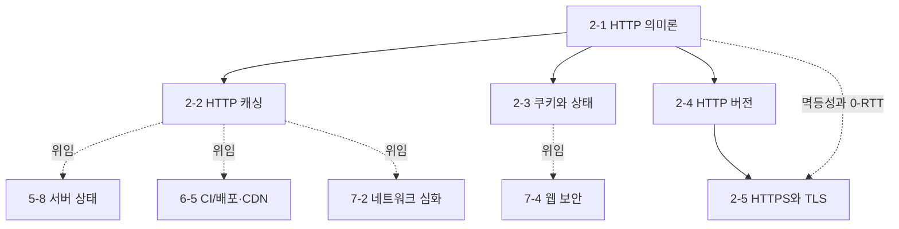

# Phase 2 — HTTP 학습 과정 기획

> ROADMAP.md의 Phase 2(2주, 문서 5개)를 실제 집필 가능한 수준으로 구체화한 기획 문서다.
> 각 문서의 주제 범위, 핵심 논점, 문서 간 의존 관계, 실습 과제 설계, 집필 순서를 정의한다.

---

## 1. 기획 전제

### 독자 상황 분석

독자는 5년차 이상 경력 개발자(백엔드·모바일 출신)다. Phase 2에서 이 전제는 Phase 1과 **정반대 방향**으로 작동한다.

- **이미 아는 것**: HTTP 자체. 백엔드 출신이라면 핸들러를 작성하고, REST API를 설계하고, 상태 코드를 골라 봤다. 메서드·헤더·상태 코드의 존재와 대략적 의미는 재교육 대상이 아니다.
- **모르는 것 (이 Phase의 가치)**: **관점의 반전**이다. 지금까지 독자는 응답을 만드는 쪽이었고, 응답을 보낸 뒤의 일은 클라이언트의 사정이었다. 이 Phase는 그 반대편 — 브라우저라는 클라이언트가 서버가 선언한 계약(메서드의 속성, 캐시 헤더, 쿠키 속성)을 **어떻게 해석하고 집행하는가**를 다룬다. 브라우저·CDN·프록시라는 중간자들의 관점이 전체 Phase의 관통 질문이다.
- **흔한 함정**: "HTTP는 아는 것"이라는 자신감. 그래서 캐싱 모델·쿠키 매칭 규칙·버전별 전송 차이를 건너뛰다가, 배포 후 "왜 옛 버전이 보이는가", "왜 이 요청엔 쿠키가 안 실리는가", "왜 HTTP/2로 올렸는데 안 빨라지는가"에서 무너진다. 각 문서는 이런 "서버 쪽 감각으로는 설명이 안 되는" 지점을 정면으로 다뤄야 한다.

### Phase 2 전체 목표 (ROADMAP 기준)

HTTP를 의미론(semantics)과 전송(transport)의 두 계층으로 나눠 이해하고, 캐싱·상태 관리·프로토콜 버전 선택을 **RFC 9110~9114 스펙을 근거로 판단할 수 있다.**
최종 산출물: 실서비스 HTTP 트래픽 분석 리포트.

### 2주 배분

문서 5개는 의미론 계층(기초 3개)과 전송 계층(심화 2개)으로 나뉜다. 주차 배분도 이 구분을 따른다.

| 주차 | 문서 | 실습 |
|------|------|------|
| 1주차 | 2-1 HTTP 의미론, 2-2 HTTP 캐싱, 2-3 쿠키와 상태 | `curl`/DevTools 미니 실험 (304 재현, 캐시 히트 관찰, 쿠키 전송 조건 확인) |
| 2주차 | 2-4 HTTP 버전, 2-5 HTTPS와 TLS | 실서비스 선정·트래픽 분석·리포트 작성 |

---

## 2. 문서별 상세 기획

각 문서는 CLAUDE.md의 공통 구조(학습 목표 → 배경 → 핵심 개념 → 실무 관점 → 더 깊이 → 정리 → 확인 문제 → 참고 자료)를 따른다. 아래는 문서별로 **다룰 범위 / 다루지 않을 범위 / 핵심 논점 / 경력자 연결 지점**을 정의한다.

### 2-1. HTTP 의미론 — `docs/phase-2/01-http-semantics.md`

- **핵심 질문**: 브라우저·캐시·프록시가 요청을 마음대로 재시도하고, 캐시하고, 프리페치해도 되는 근거는 어디서 오는가?
- **다룰 범위**:
  - HTTP 메시지의 구조(시작줄·필드·바디)와 "의미론 vs 전송"의 계층 분리 — RFC 9110(의미론)이 9112(HTTP/1.1)·9113(HTTP/2)·9114(HTTP/3)와 별도 문서인 이유가 곧 이 Phase의 목차 구조
  - 메서드의 3속성 — 안전성(safe)·멱등성(idempotent)·캐시 가능성(cacheable)이 단순 분류가 아니라 **중간자가 집행하는 계약**임을 중심에 둔다: 브라우저가 뒤로 가기에서 POST만 경고창을 띄우는 이유, 네트워크 계층이 GET만 자동 재시도할 수 있는 이유, 프리페치가 GET 전제인 이유
  - 상태 코드의 클래스 구조와 실무 오용 사례: 200에 에러 바디를 담는 API가 캐시·모니터링에서 잃는 것, 401 vs 403, 리다이렉트 4형제(301/302/303/307/308)의 메서드 보존 차이와 302 오용의 역사
  - 표현(representation) 개념과 콘텐츠 협상: `Accept`/`Content-Type`/`Content-Encoding`, 같은 URL이 여러 표현을 가질 때 생기는 문제(`Vary`의 복선 — 상세는 2-2)
  - 헤더 필드의 문법과 등록 체계, `X-` 접두사가 폐기된 이유
- **다루지 않을 범위**: REST API 설계론 일반(독자가 이미 실무자다), URL 문법 상세, 각 헤더의 백과사전식 나열
- **경력자 연결**: 지금까지 "내 API의 규약"으로 알던 것들이 사실은 **모르는 중간자들과의 계약**이었다는 관점 전환. 멱등성 = 분산 시스템에서의 at-least-once 전달과 재시도 안전성 문제의 HTTP 버전.

### 2-2. HTTP 캐싱 — `docs/phase-2/02-http-caching.md`

- **핵심 질문**: 서버에 도달하지도 않는 응답은 어떻게 만들어지고, 누가 그것을 결정하는가?
- **다룰 범위**:
  - 캐싱의 2단 모델을 **먼저** 세운다: 신선도(freshness — 요청 자체를 생략) vs 재검증(revalidation — 조건부 요청으로 바디 전송만 생략). 각각이 절약하는 비용이 다르다(RTT 전체 vs 대역폭)
  - 신선도 계산: `Cache-Control: max-age`, `Age`, 명시적 지시가 없을 때의 휴리스틱 캐싱(heuristic caching) — "캐시 헤더를 안 줬는데 왜 캐시되는가"의 답
  - 재검증: `ETag`/`If-None-Match`, `Last-Modified`/`If-Modified-Since`, 304의 의미. 강한 검증자 vs 약한 검증자
  - 지시어의 흔한 오해 교정: `no-cache`는 캐시 금지가 아니다(재검증 강제), 캐시 금지는 `no-store`. `must-revalidate`가 실제로 하는 일
  - 공유 캐시와 사설 캐시: `public`/`private`/`s-maxage`, 인증 응답의 캐시 규칙, `Vary`가 캐시 키를 확장하는 방식과 `Vary: *`·과도한 `Vary`가 캐시를 무력화하는 경계 조건
  - 불변 자산 패턴: 콘텐츠 해시 파일명 + `max-age=31536000, immutable`로 캐시를 영구화하는 구조 — 그리고 **HTML 문서는 왜 이 패턴이 불가능한가**(진입점은 이름이 바뀔 수 없다). 번들러가 해시를 만들어 주는 구조는 6-2의 복선
  - `stale-while-revalidate`: 신선도 만료 후에도 응답성을 유지하는 절충 — 5-8(TanStack Query)이 같은 이름의 전략을 쓰는 이유의 원형
- **다루지 않을 범위**: CDN·프록시 계층의 캐시 운용(7-2), 무효화 전략과 배포 파이프라인(6-5), 서비스 워커 캐시, 애플리케이션 계층 캐시(5-8)
- **경력자 연결**: Redis 등 서버 측 캐시는 "내가 넣고 내가 지운다". HTTP 캐시는 **제어권이 없는 원격 캐시에 헤더로 정책만 선언**하는 모델 — 한번 배포한 `max-age`는 회수할 수 없다는 비가역성이 설계를 지배한다.
- **의존**: 2-1의 cacheable 속성, 표현·`Vary` 개념 전제.

### 2-3. 쿠키와 상태 — `docs/phase-2/03-cookies-and-state.md`

- **핵심 질문**: 무상태 프로토콜 위에서 "로그인 유지"는 어떻게 성립하고, 그 대가로 무엇을 지불하는가?
- **다룰 범위**:
  - HTTP가 무상태(stateless)인 설계 이유를 한 문단으로 짚고, 쿠키의 동작 모델로: `Set-Cookie`는 지시이고 저장·첨부는 **브라우저 소유** — 서버는 쿠키 저장소를 읽을 수도, 확인할 수도 없다
  - 전송 조건 매칭 규칙: `Domain`(명시 시 서브도메인 포함 — 직관과 반대), `Path`, 만료(세션 쿠키 vs `Max-Age`/`Expires`)
  - 보안 속성의 함의: `Secure`, `HttpOnly`(JS 접근 차단이 막는 것과 못 막는 것), `SameSite`(None/Lax/Strict — Lax가 기본값이 된 배경과 "왜 갑자기 크로스 사이트 요청에 쿠키가 안 실리는가"), `__Host-` 접두사가 강제하는 불변 조건
  - 세션 식별자 vs 자체 포함 토큰(JWT)의 트레이드오프: 서버 저장소 유무, 무효화 가능성, 크기 — 표로 비교 (저장 위치 논쟁의 보안 상세는 7-4로 위임)
  - 쿠키의 비용: 매칭되는 모든 요청에 자동으로 실리는 바이트 — 정적 자산 도메인을 분리하던 이유, 요청 헤더 크기가 커질 때 생기는 일
  - 서드파티 쿠키와 추적: 파티셔닝(CHIPS)·폐기 흐름은 방향성만 짧게 (브라우저별 정책 차이 명시)
- **다루지 않을 범위**: XSS/CSRF 공격 벡터와 방어 계층 상세(7-4), OAuth/OIDC 등 인증 프로토콜 자체, 웹 저장소 API(localStorage 등, 3-10)
- **경력자 연결**: 백엔드에서 쓰던 세션 미들웨어가 실제로 하던 일의 클라이언트 쪽 절반. "서버가 `Set-Cookie`를 보냈는데 브라우저가 조용히 버리는" 경우들(Secure 위반, 서드파티 차단, `__Host-` 규칙 위반)이 디버깅을 어렵게 하는 이유 — 실패가 응답 코드로 돌아오지 않는다.
- **의존**: 2-1의 헤더 모델 전제. 7-4 보안 문서의 기반.

### 2-4. HTTP 버전 — `docs/phase-2/04-http-versions.md`

- **핵심 질문**: 의미론은 그대로인데 전송 계층은 왜 세 번이나 다시 만들어졌는가? (매번 무엇이 병목이었나)
- **다룰 범위**:
  - HTTP/1.1: keep-alive와 연결 재사용, 파이프라이닝이 실패한 이유(응답 순서 보장 = HOL 블로킹), **오리진당 6연결 제한**이 낳은 한 시대의 안티패턴들 — 도메인 샤딩, 스프라이트, 인라이닝 (Phase 0-1에서 언급한 내용의 상세화)
  - HTTP/2: 바이너리 프레이밍과 스트림, 하나의 연결 위 멀티플렉싱 — 그래서 1.1 시대 안티패턴이 역효과로 뒤집히는 서사. HPACK 헤더 압축(쿠키 비용(2-3)이 완화되는 지점), 우선순위 트리가 실패하고 RFC 9218로 재설계된 경위, 서버 푸시가 폐기된 이유
  - HTTP/2의 남은 한계: TCP 계층 HOL 블로킹 — 스트림은 독립인데 패킷 손실은 연결 전체를 세운다. 손실률이 높은 네트워크에서 H2가 H1보다 느려지는 경계 조건
  - HTTP/3와 QUIC: UDP 위에 스트림·신뢰성·암호화를 다시 만든 이유(TCP는 커널·중간 장비 때문에 진화 불가 — ossification), 스트림 단위 독립 전달, 연결 마이그레이션(모바일 네트워크 전환), TLS 1.3 통합과 핸드셰이크 RTT 절감(상세는 2-5)
  - 버전 협상과 확인: `Alt-Svc`와 HTTPS DNS 레코드, DevTools Network 패널 Protocol 열로 실서비스 버전 확인하는 절차, 어떤 조건에서 H3가 실질 이득인가(고손실·모바일) vs 차이가 없는가
- **다루지 않을 범위**: QUIC 패킷 포맷·혼잡 제어 알고리즘 상세, 서버 설정 방법(nginx 등), gRPC 등 응용
- **경력자 연결**: 커넥션 풀·멀티플렉싱은 DB 커넥션 풀, HTTP/2의 스트림은 하나의 TCP 위 논리 채널이라는 점에서 익숙한 패턴 — 다른 점은 **상대(브라우저·중간 장비)를 제어할 수 없다**는 것. TCP ossification은 "스키마를 바꿀 수 없어 새 테이블을 만드는" 레거시 호환성 문제의 인터넷 규모 버전.
- **의존**: 2-1의 의미론/전송 분리 전제. Phase 0-1의 연결 풀·6연결 제한 언급을 상세화.

### 2-5. HTTPS와 TLS — `docs/phase-2/05-https-and-tls.md`

- **핵심 질문**: TLS는 첫 바이트까지의 지연에 얼마를 얹고, 1.3은 그중 무엇을 없앴는가? 그리고 플랫폼은 왜 HTTPS를 사실상 강제하는가?
- **다룰 범위**:
  - TLS 핸드셰이크의 RTT 비용 분석: TCP 3-way + TLS 1.2(2-RTT) vs TLS 1.3(1-RTT) vs 세션 재개·0-RTT — 각 단계에서 무엇을 주고받길래 왕복이 필요한가를 지연 관점으로. QUIC이 전송·암호화 핸드셰이크를 합친 것(2-4 연결)
  - 0-RTT의 대가: 재전송(replay) 공격 가능성 때문에 멱등 요청에만 안전 — 2-1의 멱등성이 전송 계층 최적화의 전제 조건이 되는 지점
  - 인증서 체인과 신뢰 모델: 루트 CA → 중간 CA → 리프, 브라우저가 체인을 검증하는 과정, "인증서는 유효한데 에러가 나는" 사례들(중간 인증서 누락, SNI 불일치), Certificate Transparency는 존재와 목적만
  - HSTS: 최초 평문 요청이라는 구멍과 preload 목록, `includeSubDomains`의 파급 — 한번 배포하면 되돌리기 어려운 비가역성(2-2의 캐시 비가역성과 같은 패턴)
  - mixed content 차단 규칙: blockable vs upgradable, HTTPS 페이지에서 HTTP 리소스가 조용히 실패하는 디버깅 시나리오
  - Secure Context: Service Worker, Geolocation, Clipboard 등이 HTTPS 전용인 구조 — 표준 자체가 HTTPS를 전제하는 방향으로 움직여 온 플랫폼 정책. 로컬 개발 환경(localhost 예외, mkcert)
- **다루지 않을 범위**: 암호 알고리즘 내부(AEAD, 키 교환 수학), 인증서 발급·서버 설정 절차, mTLS
- **경력자 연결**: 백엔드에서 TLS는 보통 로드밸런서가 종단(termination)해 주는 "남의 일"이었다. 프론트엔드에서는 핸드셰이크 지연이 사용자 체감 성능에 직결되고(DevTools Timing의 SSL 구간), mixed content·Secure Context가 기능 동작 여부를 가른다.
- **의존**: 2-4의 QUIC-TLS 통합, 2-1의 멱등성(0-RTT 제약). Phase 0-1의 HSTS 언급을 상세화.

---

## 3. 문서 간 의존 관계

- 집필 순서는 번호 순서(2-1 → 2-5)를 그대로 따른다. 2-1이 세운 "의미론 vs 전송" 계층 구분이 Phase 전체의 뼈대다: 2-2·2-3은 의미론 계층, 2-4·2-5는 전송 계층.
- Phase 0-1(`docs/phase-0/01-how-the-web-works.md`)에서 개관한 내용(HSTS 확인 순서, 연결 풀, 6연결 제한, 캐시 확인)을 각 문서가 상세화한다 — 해당 지점마다 상대 링크로 연결한다.
- 뒤 Phase로 위임하는 주제(fetch API는 3-8, 애플리케이션 캐시는 5-8, CDN 무효화는 6-5, CORS·리소스 우선순위는 7-2, XSS/CSRF는 7-4)는 본문에서 "Phase N-M에서 다룬다"고 명시해 범위 이탈을 막는다.

## 4. 실습 과제 설계

ROADMAP의 "실서비스 HTTP 트래픽 분석 리포트"를 문서 진도와 연동하는 2단계로 설계한다. 이 Phase의 실습은 코드 작성이 아니라 **관찰과 계측**이다.

### 과제 A — 프로토콜 미니 실험 (1주차, 문서 2-1 ~ 2-3과 병행)

| 단계 | 시점 | 요구사항 |
|------|------|----------|
| A-1 | 2-1 학습 후 | `curl -v`로 임의 사이트의 요청/응답 원문을 캡처하고 메서드·상태 코드·협상 헤더에 주석 달기. 리다이렉트 체인(`curl -vL`)에서 메서드 보존 여부 확인 |
| A-2 | 2-2 학습 후 | 조건부 요청으로 304 직접 재현(`curl -H "If-None-Match: ..."`), DevTools Network에서 from disk cache / from memory cache / 304의 3가지 케이스 구분 관찰 |
| A-3 | 2-3 학습 후 | 임의 서비스 로그인 후 쿠키 속성 감사(Application 패널), SameSite 조건별 전송 여부 확인 |

### 과제 B — 실서비스 트래픽 분석 리포트 (2주차, 문서 2-4 ~ 2-5와 병행)

- 실서비스 하나를 선정해 DevTools Network 패널과 `curl -v`로 트래픽을 분석하고 항목별 평가와 개선안을 담은 리포트를 작성한다.
- 평가 항목: ① 프로토콜 버전(자산별 H1/H2/H3 분포와 근거) ② 캐싱 정책(HTML/JS/CSS/이미지 유형별 — 불변 자산 패턴 적용 여부) ③ 쿠키 속성 감사(보안 속성 누락, 불필요한 전송 범위) ④ 압축·콘텐츠 협상(br/gzip, `Vary`) ⑤ TLS 구성(버전, HSTS, mixed content).
- 완성 기준(Definition of Done)을 과제 안내 문서에 체크리스트로 명시한다.

과제 안내는 `exercises/phase-2/` 아래 별도 문서로 작성한다 (문서 5개 집필 완료 후).

## 5. 공통 집필 기준 (Phase 2 특화)

CLAUDE.md의 전 지침에 더해, Phase 2에서 특히 지킬 것:

- **현행 RFC 기준**: 1차 자료는 RFC 9110(의미론)·9111(캐싱)·9112~9114(버전별)와 RFC 6265bis(쿠키)다. 구식 번호(RFC 2616, 7230~7235)를 인용한 자료를 참조할 때는 현행 번호로 바꿔 표기한다.
- **예제 형식**: 이 Phase의 "실행 가능한 예제"는 JS 코드가 아니라 **HTTP 메시지 원문과 그것을 관찰하는 절차**(`curl -v` 명령, DevTools 패널 경로)다. 모든 주요 개념에 직접 관찰 방법을 최소 1개 붙인다 — 헤더 예제는 실제 서비스 응답 캡처를 기반으로 한다.
- **브라우저별 차이 명시**: 캐시 파티셔닝, 서드파티 쿠키 정책, 0-RTT 지원처럼 브라우저(Chrome/Safari/Firefox)마다 갈리는 동작은 그 사실 자체를 명시하고 단정하지 않는다.
- **확인 문제 방향**: "이 응답이 캐시에서 오지 않는 이유", "이 요청에 쿠키가 실리지 않는 이유", "이 서비스에 H3를 도입하면 무엇이 좋아지는가"처럼 트래픽 진단·설계 판단형 문제를 우선한다.
- **선행 문서 정합성**: Phase 0-1에 남아 있는 개편 이전 참조("HTTP 심화는 Phase 6-2" 등)를 Phase 2 집필 시 현행 번호(Phase 2-N)로 수정한다.

## 6. 진행 체크리스트

- [x] 2-1 `01-http-semantics.md`
- [x] 2-2 `02-http-caching.md`
- [x] 2-3 `03-cookies-and-state.md`
- [x] 2-4 `04-http-versions.md`
- [x] 2-5 `05-https-and-tls.md`
- [x] `exercises/phase-2/` 과제 안내 문서
- [x] Phase 0-1 문서의 stale 참조(구 Phase 6-2 → 현 Phase 2) 수정 — phase-0·1 전체의 구 번호 체계 참조를 현행으로 일괄 수정
- [x] ROADMAP.md 5절 진행 현황 표 갱신
