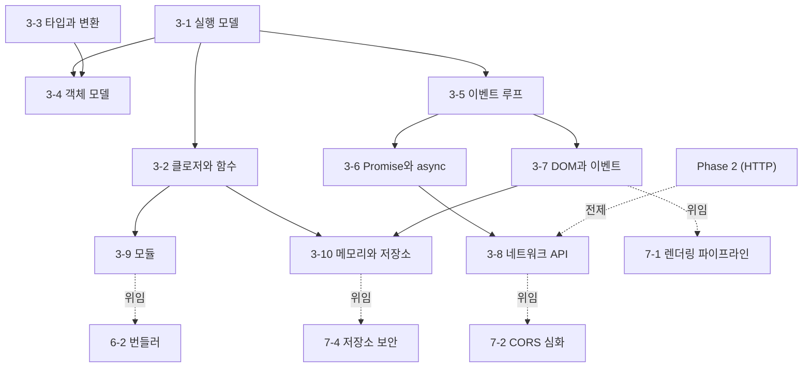

# Phase 3 — JavaScript 학습 과정 기획

> ROADMAP.md의 Phase 3(5주, 문서 10개)를 실제 집필 가능한 수준으로 구체화한 기획 문서다.
> 각 문서의 주제 범위, 핵심 논점, 문서 간 의존 관계, 실습 과제 설계, 집필 순서를 정의한다.

---

## 1. 기획 전제

### 독자 상황 분석

독자는 5년차 이상 경력 개발자(백엔드·모바일 출신)다. Phase 3에서 이 전제는 Phase 2와 또 다른 방식으로 작동한다.

- **이미 아는 것 (그리고 이미 써 본 것)**: JavaScript 자체를 어느 정도 써 봤을 가능성이 높다. C-family 문법, 함수, 배열 메서드, 간단한 async/await까지는 "따라 쓸 수" 있다. 변수·조건문·고차 함수 같은 프로그래밍 일반 개념은 재교육 대상이 아니다.
- **모르는 것 (이 Phase의 가치)**: **"따라 쓸 수 있다"와 "메커니즘으로 설명할 수 있다"의 간극**이다. JS는 문법이 Java/C#과 닮아서 "아는 언어"라는 착각을 만들지만, 핵심 의미론은 정반대다 — this는 호출 시점에 결정되고, 상속은 청사진 복사가 아니라 살아있는 위임 링크이고, 동시성은 스레드가 아니라 단일 스레드 위의 태스크 큐다. 이 Phase는 그 간극을 ECMA-262·WHATWG HTML 스펙의 실행 모델로 메운다.
- **흔한 함정**: "문법은 아니까 프레임워크로 넘어가자"는 조급함. 그래서 클로저가 잡은 stale 값, 마이크로태스크 순서, 리스너 누수 같은 문제를 React 안에서 처음 만나고, 프레임워크 문제로 오진한다. Phase 5의 stale closure·이벤트 루프 기반 배칭·useSyncExternalStore는 전부 이 Phase의 언어 메커니즘 위에 서 있다. 각 문서는 "이걸 모르면 뒤 Phase의 무엇이 무너지는가"를 의식하고 쓴다.

### Phase 3 전체 목표 (ROADMAP 기준)

ECMAScript의 실행 모델(실행 컨텍스트, 프로토타입, 이벤트 루프)과 브라우저 런타임의 상호작용을 **메커니즘 수준에서 설명할 수 있고**, 프레임워크 없이 동작하는 웹 앱을 만들 수 있다.
최종 산출물: 바닐라 JS 웹 앱 2개 + 이벤트 루프/메모리 계측 분석 노트.

### 5주 배분

문서 10개는 네 블록으로 묶인다: **언어 코어**(3-1~3-4, 실행 컨텍스트와 객체 모델), **동시성 모델**(3-5~3-6), **브라우저 런타임**(3-7~3-8), **코드와 메모리의 생애 주기**(3-9~3-10). 주차 배분도 이 구분을 따른다.

| 주차 | 문서 | 실습 |
|------|------|------|
| 1주차 | 3-1 실행 모델, 3-2 클로저와 함수 | Sources 패널 Scope로 환경 레코드·클로저 캡처 직접 관찰 |
| 2주차 | 3-3 타입과 변환, 3-4 객체 모델 | 변환 결과 예측→검증 실험, 프로토타입 체인 조작·관찰 |
| 3주차 | 3-5 이벤트 루프, 3-6 Promise와 async | 실행 순서 예측 퀴즈, Performance 패널 long task 관찰 |
| 4주차 | 3-7 DOM과 이벤트, 3-8 네트워크 API | 과제 A(Todo 앱) 착수 |
| 5주차 | 3-9 모듈, 3-10 메모리와 저장소 | 과제 B(API 검색 앱) + 과제 C(계측 분석 노트) |

---

## 2. 문서별 상세 기획

각 문서는 CLAUDE.md의 공통 구조(학습 목표 → 배경 → 핵심 개념 → 실무 관점 → 더 깊이 → 정리 → 확인 문제 → 참고 자료)를 따른다. 아래는 문서별로 **다룰 범위 / 다루지 않을 범위 / 핵심 논점 / 경력자 연결 지점**을 정의한다.

### 3-1. 실행 모델 — `docs/phase-3/01-execution-model.md`

- **핵심 질문**: 호이스팅·TDZ·this의 "이상한 규칙들"은 암기 대상이 아니라 어떤 단일 구조(실행 컨텍스트 생성 절차)의 필연적 결과인가?
- **다룰 범위**:
  - 실행 컨텍스트 스택과 구성 요소, 렉시컬 환경과 Environment Record의 종류(declarative/object/function/global/module) — 스펙 용어를 뼈대로 세운다
  - "호이스팅"의 실체: 스펙에 없는 통념 용어임을 밝히고, 컨텍스트 생성 단계의 바인딩 등록과 초기화 시점 차이(var는 undefined 초기화, let/const는 미초기화)로 재정의. TDZ는 별도 장치가 아니라 "미초기화 바인딩 접근"이라는 일반 규칙
  - 스코프 체인 = 환경 레코드의 [[OuterEnv]] 정적 연결 — 함수를 **어디서 호출했는가가 아니라 어디서 정의했는가**가 체인을 결정한다는 사실을 관찰 예제로
  - this 바인딩 4규칙(기본/암시적/명시적/new)과 결정 시점(호출 형태) — 스코프 체인(정적)과 this(동적)가 서로 다른 축이라는 것이 이 문서의 종착점. strict mode가 기본 바인딩에 미치는 영향, globalThis
  - 관찰 절차: Sources 패널 중단점에서 Call Stack·Scope 창 읽는 법 (0-2의 DevTools 표에서 예고한 내용)
- **다루지 않을 범위**: 클로저의 메모리 모델(3-2), 화살표 함수의 this(3-2), class 내부의 this와 super(3-4)
- **경력자 연결**: Java/C#의 this는 인스턴스 메서드라는 선언 위치가 컴파일 타임에 결정하지만, JS의 this는 **호출 형태가 런타임에 결정**한다 — "메서드를 변수에 담으면 this가 깨지는" 현상은 버그가 아니라 모델 차이. 스택 프레임과 달리 환경 레코드는 힙에 살아남을 수 있다(3-2의 복선).

### 3-2. 클로저와 함수 — `docs/phase-3/02-closures-and-functions.md`

- **핵심 질문**: 클로저는 값을 캡처하는가 변수를 캡처하는가 — 그리고 캡처된 환경은 언제까지 살아 있는가?
- **다룰 범위**:
  - 캡처 단위는 값이 아니라 **환경(Environment Record) 자체** — 같은 환경을 공유하는 클로저들이 변수를 함께 보는 이유, 3-1의 [[OuterEnv]]가 힙에 살아남는 구조
  - 루프와 클로저: `let`이 반복마다 새 환경을 만드는 스펙 동작(per-iteration environment) — var 루프 함정이 "let을 쓰면 해결"되는 정확한 이유
  - V8의 구현: 어떤 변수가 스택이 아니라 힙의 Context에 할당되는가, 같은 스코프의 무관한 큰 변수가 함께 붙잡히는 경우 — **구현 세부임을 명시**하고 Sources 패널 [[Scopes]]로 관찰
  - 고차 함수 패턴을 클로저 응용으로: 커링, 메모이제이션, once, 디바운스/스로틀(과제 B에서 직접 사용) — 패턴 나열이 아니라 "상태를 은닉한 함수"라는 하나의 원리로
  - 화살표 함수: this·arguments·super 바인딩을 **만들지 않는** 설계 — "렉시컬 this"가 특별 기능이 아니라 바인딩 부재의 결과. `bind(this)`·`var self = this` 시대가 왜 끝났는가
  - ESM 이전의 모듈 패턴(IIFE + 클로저)이 하던 일 — 3-9의 복선
- **다루지 않을 범위**: 클로저 기인 메모리 누수의 진단 절차(3-10), 함수형 프로그래밍 일반론(경력자 전제)
- **경력자 연결**: Java 람다의 effectively final은 **값 복사**, JS 클로저는 **변수 공유** — 같은 "클로저"라는 단어가 가리키는 두 모델의 차이가 루프 함정·stale closure(5-4의 원형)의 근원.
- **의존**: 3-1의 환경 레코드·[[OuterEnv]] 전제.

### 3-3. 타입과 강제 변환 — `docs/phase-3/03-types-and-coercion.md`

- **핵심 질문**: `[] + {}`류의 "이상한" 결과는 임의가 아니라 어떤 알고리즘의 출력인가 — 규칙을 알면 무엇을 다르게 판단하게 되는가?
- **다룰 범위**:
  - 원시 7종 + 객체의 타입 모델: 변수가 아니라 **값에 타입이 붙는** 동적 타이핑, typeof의 함정(`typeof null`, function)
  - 추상 연산(abstract operation)이라는 스펙의 서술 도구: ToPrimitive(힌트와 Symbol.toPrimitive), ToNumber/ToString/ToBoolean — 모든 암묵 변환은 이 몇 개의 조합
  - `==`의 실제 판정 규칙(IsLooselyEqual)을 표로: "느슨한 비교는 무조건 나쁘다"가 아니라 규칙이 대칭적이지 않고 추론 비용이 크다는 것이 `===` 컨벤션의 실제 근거. `Object.is`와의 3자 비교
  - `+`의 이중성(문자열 연결 우선)과 관계 연산자의 변환 규칙
  - 경계 사례를 스펙으로 설명: NaN의 자기 비동등(IEEE 754 유래), `isNaN` vs `Number.isNaN`, -0의 존재와 관찰 방법, BigInt와 Number의 혼합 연산 금지(정밀도 손실을 언어가 거부하는 설계)
  - truthy/falsy 판정과 `??` vs `||` — falsy 함정(0, 빈 문자열)의 실무 사례
- **다루지 않을 범위**: TypeScript의 정적 타입(Phase 4 전체), 문자열·숫자 API 백과사전식 나열, 부동소수점 일반론(경력자 전제 — 0.1+0.2는 한 문장)
- **경력자 연결**: 정적 언어에서 연산자 오버로드 해석은 컴파일 타임에 끝나지만, JS는 **매 연산마다 런타임 추상 연산**이 돈다. 팀 컨벤션(`===` 강제, 명시적 변환)은 취향이 아니라 이 판정 규칙의 비대칭성에서 나온 방어라는 관점.
- **의존**: 없음(독립적). 3-4의 ToPrimitive 활용(객체→원시 변환)의 기반.

### 3-4. 객체 모델 — `docs/phase-3/04-object-model.md`

- **핵심 질문**: class 키워드 아래에서 실제로 무슨 일이 일어나는가 — Java의 클래스와 같은 것을 흉내 낸 것인가, 다른 것에 씌운 문법인가?
- **다룰 범위**:
  - 객체 = 프로퍼티 모음 + [[Prototype]] 링크라는 최소 모델. 체인 탐색([[Get]])과 섀도잉, **읽기는 체인을 타지만 쓰기는 타지 않는 비대칭**(accessor는 예외) — 프로토타입에 둔 배열을 인스턴스가 공유 오염시키는 함정
  - property descriptor: data/accessor 프로퍼티, writable/enumerable/configurable — `for...in`과 spread가 다르게 보는 이유, Object.freeze의 얕음. Vue 2가 defineProperty로, Vue 3와 MobX가 Proxy로 반응성을 구현한 구조를 descriptor의 한계(추가/삭제 감지 불가)로 설명
  - class 문법이 만드는 것: 생성자 함수 + non-enumerable 프로토타입 메서드 + 인스턴스/정적 이중 체인(extends). super가 동작하는 메커니즘([[HomeObject]] — 메서드 축약 문법에서만 되는 이유)
  - class가 감추지 **못하는** 것: 메서드 추출 시 this 상실(3-1의 귀결 — 이벤트 핸들러로 넘길 때), 런타임에 열려 있는 프로토타입(몽키 패칭 가능성)
  - private 필드(#): 클로저·Proxy·Reflect로도 뚫리지 않는 언어 수준 캡슐화 — WeakMap 패턴과의 비교, in 연산자 브랜드 체크
  - `__proto__`가 비권장이고 Object.create/getPrototypeOf가 표준 경로인 이유
- **다루지 않을 범위**: Proxy/Reflect 전면 해설(반응성 설명에 필요한 만큼만), 상속 계층 설계론 일반(경력자 전제), TS의 클래스 타입(Phase 4)
- **경력자 연결**: 클래스 기반 상속은 **청사진 복사**(컴파일 타임 고정, vtable), 프로토타입은 **살아있는 위임 링크**(런타임 탐색·교체 가능). class 문법은 후자에 전자의 표기를 씌운 것 — 표기가 같아서 생기는 오해(정적 필드 상속, 메서드 추출)가 실무 함정의 목록.
- **의존**: 3-1의 this 규칙, 3-3의 ToPrimitive(객체→원시 변환 관례).

### 3-5. 이벤트 루프 — `docs/phase-3/05-event-loop.md`

- **핵심 질문**: `setTimeout(fn, 0)`·`Promise.then`·`requestAnimationFrame`은 왜 서로 다른 시점에 실행되는가 — 그 우선순위는 어느 스펙의 어느 규칙이 정하는가?
- **다룰 범위**:
  - 관할의 분리부터: ECMA-262는 Job만 정의하고 **루프 자체는 WHATWG HTML 스펙 소관**(event loop processing model) — "JS의 이벤트 루프"라는 통념 교정이 문서의 출발점
  - 콜 스택과 run-to-completion: 태스크 하나가 끝날 때까지 아무것도 끼어들 수 없다 — "단일 스레드"의 정확한 의미(0-1의 렌더러 메인 스레드 공유 전제와 연결)
  - task source별 복수 큐(순서 보장은 같은 source 안에서만), microtask checkpoint 규칙: 태스크 하나가 끝날 때마다 **큐가 빌 때까지 전부** 소진 — 마이크로태스크가 마이크로태스크를 낳으면 렌더링이 굶는(starvation) 경계 조건
  - 렌더링 기회(rendering opportunity): update the rendering은 태스크 사이에만 끼어든다 — long task가 프레임을 떨어뜨리는 구조, rAF 콜백의 실행 위치(렌더 직전)와 rAF 루프 패턴
  - setTimeout의 실제 의미론: 지연은 최소 보장일 뿐, 중첩 클램핑(4ms)·백그라운드 탭 스로틀링 — "0ms인데 왜 늦게 실행되는가"
  - Node.js 루프와의 차이: phase 구조, setImmediate, process.nextTick — 같은 코드가 브라우저와 Node에서 순서가 달라지는 지점
  - 관찰 절차: 순서 출력 실험(예측→실행 검증), Performance 패널에서 long task와 프레임 경계 읽기
- **다루지 않을 범위**: Promise 자체의 의미론(3-6), 렌더링 파이프라인 내부(스타일→레이아웃→페인트, 7-1), Web Worker 상세(멀티 스레드 탈출구로 존재만 언급)
- **경력자 연결**: Java의 스레드 풀 + 블로킹 I/O 모델과의 대조 — JS는 대기를 큐로 바꾼다. 단, 논블로킹은 I/O 얘기일 뿐 **CPU 바운드 작업은 여전히 스택을 점유**한다 — "비동기로 했는데 왜 UI가 먹통인가"의 답. Node를 써 본 독자에게는 브라우저 루프가 렌더링과 결합된 점이 차이의 핵심.
- **의존**: 3-1의 콜 스택. 3-6의 전제. Phase 0-1의 메인 스레드 서술을 상세화.

### 3-6. Promise와 async — `docs/phase-3/06-promises-and-async.md`

- **핵심 질문**: async/await는 동기처럼 보이는 코드를 어떻게 마이크로태스크 연쇄로 바꾸며, 에러와 취소는 그 연쇄의 어디로 흐르는가?
- **다룰 범위**:
  - Promise 상태 머신: pending → fulfilled/rejected의 단방향 정착(settled 불변), 생성자 executor가 동기 실행된다는 사실
  - then의 반환 규칙: 콜백 반환값에 따라 새 Promise가 어떻게 결정되는가, thenable 흡수(재귀적 resolve) — 체이닝이 중첩보다 나은 이유를 규칙으로
  - async 함수의 변환 모델: 첫 await까지는 **동기 실행**, await마다 마이크로태스크 경계가 생기는 구조 — 3-5의 순서 실험을 async/await 버전으로 재검증
  - 에러 전파 경로: rejection이 체인을 타고 내려가는 규칙, await + try/catch, unhandledrejection 이벤트. 흔한 실수의 메커니즘 규명: `forEach(async ...)`가 기다려지지 않는 이유, floating promise, `return await`의 유무가 스택 트레이스·catch 범위에 만드는 차이
  - 취소: 언어에 취소가 없는 이유(정착 불변성)와 AbortController/AbortSignal이라는 **협력 프로토콜** — signal 전파, 이벤트 리스너 정리와의 결합(3-7 복선)
  - 동시성 조합기: all/allSettled/race/any의 실패 의미론 비교 표, 순차 vs 병렬 실행의 코드 형태(await 위치), 동시 실행 개수 제한 패턴(풀/세마포어) — 과제 B에서 사용
- **다루지 않을 범위**: fetch 자체(3-8), 제너레이터·이터레이터 프로토콜 상세(async/await 변환 이해에 필요한 만큼만), RxJS 등 스트림 라이브러리
- **경력자 연결**: CompletableFuture/Task와 겉이 같지만 **스레드 전환이 없다** — 콜백은 반드시 같은 스레드의 마이크로태스크로 돌아온다(동기화·락이 필요 없는 이유). 취소는 Java의 interrupt처럼 강제 중단이 아니라 협력적 신호 — 구조적 동시성이 언어에 없어서 정리 책임이 코드에 남는다.
- **의존**: 3-5의 마이크로태스크 규칙 전제.

### 3-7. DOM과 이벤트 — `docs/phase-3/07-dom-and-events.md`

- **핵심 질문**: "DOM 조작은 느리다"는 통념에서 실제로 느린 것은 무엇인가 — 접근 비용인가, 조작이 유발하는 후속 작업인가?
- **다룰 범위**:
  - DOM은 JS 객체가 아니라 **렌더러의 C++ 노드에 대한 바인딩** — 경계 호출 비용과, 진짜 비용의 소재: 조작이 무효화하는 스타일·레이아웃 재계산. 읽기/쓰기 교차가 강제 동기 레이아웃을 유발하는 구조는 **개요만** 세우고 상세는 7-1로 위임
  - 배치(batching) 관점의 조작: DocumentFragment, 읽기 모아서 쓰기, `textContent` vs `innerHTML`의 비용·보안(XSS는 존재만 언급, 7-4) 차이
  - live vs static 컬렉션: HTMLCollection이 순회 중에 변하는 함정, querySelectorAll의 스냅숏 — "왜 절반만 지워지는가" 실험
  - 속성(attribute) vs 프로퍼티 재론: 1-1에서 세운 구분을 폼 상태 관리 관점에서 — 과제 A의 상태-DOM 동기화 설계로 연결
  - 이벤트 전파 3단계(capture/target/bubble)와 리스너 옵션(capture/once/passive) — passive가 스크롤 성능에 미치는 영향(컴포지터가 기다리는 구조), stopPropagation vs preventDefault의 관할 구분
  - 이벤트 위임(delegation): 성립 조건(버블링)과 안 되는 이벤트(focus/blur의 대안), 동적 요소에 리스너가 "붙어 있는 것처럼" 보이는 원리 — 과제 A의 핵심 패턴
  - CustomEvent와 컴포넌트 간 통신: 프레임워크 없이 컴포넌트 경계를 세우는 법 — Phase 5에서 React가 이 문제를 어떻게 다르게 푸는지의 대조군
- **다루지 않을 범위**: 렌더링 파이프라인 내부와 layout thrashing 상세(7-1), Shadow DOM/Web Components(필요 시 존재만), XSS 방어(7-4)
- **경력자 연결**: DOM 경계는 JNI/FFI 경계와 같은 구조 — 호출 하나는 싸도 루프 안에서 교차하면 비용이 계단식으로 커진다. 이벤트 위임은 서버 라우터가 하는 일(진입점 하나 + 디스패치)의 DOM 버전.
- **의존**: 3-5의 이벤트 루프(이벤트 디스패치와 태스크), 1-1의 속성 vs 프로퍼티.

### 3-8. 네트워크 API — `docs/phase-3/08-network-apis.md`

- **핵심 질문**: fetch는 왜 404에서 reject하지 않고, body는 왜 한 번만 읽을 수 있는가 — 이 설계가 강제하는 에러 처리 구조는 무엇인가?
- **다룰 범위**:
  - XHR → fetch 전환이 바꾼 것: 이벤트 기반 → Promise 기반, Request/Response라는 명시적 객체 모델 — Fetch Standard가 "브라우저의 모든 리소스 로딩"의 단일 정의라는 위상
  - Response.body = ReadableStream: **스트림은 되감을 수 없으므로 한 번만 소비**된다 — "body used already" 에러의 원인, clone()이 여는 두 갈래와 그 비용, 스트리밍 소비 예제(청크 단위 진행률)
  - 네트워크 에러 vs HTTP 에러: reject는 전송 실패(연결 불가, CORS 차단, 중단)뿐이고 4xx/5xx는 resolve — 2-1에서 예고한 "전송과 의미론의 분리"의 API 표현. `response.ok` 검사를 강제하는 설계가 낳는 에러 처리 계층화
  - 브라우저 정책과의 결합: cache 모드(2-2의 HTTP 캐시를 코드에서 제어), credentials 모드와 쿠키 전송(2-3 전제), CORS는 **왜 존재하는가(SOP)와 단순 요청/preflight 개념까지만** — 동작 원리 상세는 7-2로 위임
  - 취소와 타임아웃: AbortSignal 연동(3-6 전제), AbortSignal.timeout/any, 검색 자동완성의 race condition을 취소로 푸는 패턴 — 과제 B의 핵심
  - 페이지 이탈 시 전송(keepalive/sendBeacon)은 존재와 용도만
- **다루지 않을 범위**: CORS 헤더별 상세와 preflight 협상(7-2), HTTP 프로토콜 자체(Phase 2 전제), WebSocket/SSE(존재만 언급), 서비스 워커
- **경력자 연결**: 서버에서 쓰던 HTTP 클라이언트(OkHttp, requests)는 코드가 실패의 전부지만, fetch는 **브라우저 정책(CORS·쿠키·캐시·mixed content)이 코드 밖에서 요청을 거부하는** 클라이언트 — "코드는 맞는데 안 되는" 실패 모드의 목록이 디버깅 지도.
- **의존**: 3-6의 Promise/AbortSignal, Phase 2-1(에러 의미론)·2-2(캐시)·2-3(쿠키) 전제. 2-1이 예고한 위임 지점의 이행.

### 3-9. 모듈 — `docs/phase-3/09-modules.md`

- **핵심 질문**: ESM은 왜 동적 편의(조건부 require)를 버리고 정적 구조를 택했는가 — 그 정적 구조가 무엇을 가능하게 하는가?
- **다룰 범위**:
  - 모듈 이전의 상태를 짧게: 전역 오염과 스크립트 순서 의존, IIFE 모듈 패턴(3-2에서 예고) — "언어에 모듈이 없어서 컨벤션으로 버틴 시대"
  - CommonJS의 모델: 동기 require, module.exports **객체 참조**의 런타임 전달, 캐싱 — 동기 로딩이 서버에서는 성립하고 브라우저에서는 성립하지 않는 이유
  - ESM의 모델: import/export가 **구문**이라서 실행 전에 그래프가 확정된다(파스 타임), 라이브 바인딩(값 복사가 아니라 바인딩 연결 — 관찰 실험 필수), 3단계 처리(구성→인스턴스화→평가)와 module Environment Record(3-1 연결)
  - 순환 의존 비교 실험: CJS는 "부분적으로 채워진 exports"를, ESM은 "선언은 존재하되 TDZ인 바인딩"을 보게 되는 차이 — 같은 순환이 CJS에선 undefined, ESM에선 ReferenceError가 되는 사례
  - top-level await가 평가 순서에 미치는 영향(그래프 단위 대기)
  - 브라우저의 ESM: `<script type="module">`의 암묵 defer(1-1 연결)·strict mode·CORS 적용, bare specifier가 브라우저에서 실패하는 이유와 import maps — "번들러가 해석해 주던 것"의 정체
  - Node의 이중 생태계: .mjs/.cjs, 조건부 exports, dual package hazard — 라이브러리 소비자로서 겪는 증상 중심으로 짧게
  - 트리 셰이킹은 **성립 전제(정적 구문 + 사이드 이펙트 판정)까지만** — 구현은 6-2로 위임
- **다루지 않을 범위**: 번들러 동작(6-2), AMD/UMD 등 역사적 포맷 상세(한 문장), 패키지 배포 설정 가이드
- **경력자 연결**: Java의 import는 컴파일 타임 심볼 해석, Python은 런타임 실행 — ESM은 그 중간(정적 그래프 + 런타임 평가)이며 순환 처리 방식이 각각 다르다. "정적 분석 가능성을 위해 동적 편의를 포기"한 트레이드오프는 Phase 4(타입)·6(번들러)에서 반복되는 주제의 첫 등장.
- **의존**: 3-1의 환경 레코드·TDZ, 3-2의 모듈 패턴, 3-6의 top-level await. 6-2의 기반.

### 3-10. 메모리와 저장소 — `docs/phase-3/10-memory-and-storage.md`

- **핵심 질문**: GC가 있는 언어에서 누수는 어떻게 성립하며, 프론트엔드 특유의 누수는 왜 하필 리스너·클로저·분리된 DOM에서 오는가?
- **다룰 범위**:
  - 도달 가능성(reachability) 모델과 GC 루트 — "누수 = 해제 실패"가 아니라 **"의도보다 오래 유지되는 도달 경로"**라는 재정의
  - V8의 세대별 GC: new/old space, Scavenger와 Mark-Sweep-Compact, 세대 가설 — **구현 세부임을 명시**. GC 일시 정지가 프레임 드랍으로 관찰되는 지점(3-5 연결)
  - 프론트엔드 누수 패턴의 해부: ① 해제 안 한 리스너(SPA 화면 전환 — AbortSignal로 일괄 해제, 3-6·3-7 연결) ② 클로저가 잡은 환경(3-2의 캡처 단위가 낳는 결과) ③ 분리된(detached) DOM 노드를 잡은 참조 ④ 한계 없는 캐시/Map — 각각 재현 코드와 함께
  - WeakMap/WeakSet의 용도(객체에 메타데이터 붙이기 — 도달성에 영향 없이), WeakRef/FinalizationRegistry는 "거의 항상 쓰지 말아야 하는 이유"와 함께
  - 계측 절차를 문서의 중심에: Memory 패널 힙 스냅샷 비교(3-snapshot 기법), Detached 노드 검색, allocation timeline — 과제 C가 그대로 수행할 절차
  - 브라우저 저장소 비교: 쿠키(2-3 전제) vs localStorage(동기 블로킹·문자열 한정·용량) vs sessionStorage vs IndexedDB(비동기·구조화 복제·트랜잭션) — 동기성/직렬화/용량/접근 범위/XSS 노출(상세는 7-4)을 표로. structured clone이 JSON 직렬화와 다른 점
  - localStorage가 메인 스레드를 막는 비용의 계측 방법 — "간편함의 가격"
- **다루지 않을 범위**: 저장소 보안과 토큰 저장 위치 논쟁(7-4), 서비스 워커 캐시, GC 알고리즘 이론 일반(경력자 전제 — JVM 대비 차이만)
- **경력자 연결**: JVM의 세대별 GC와 구조가 거의 같다 — 다른 것은 힙 예산(탭 단위, 모바일에서 훨씬 작음)과 실패 모드(서버는 OOM 재시작, 프론트는 탭 크래시와 프레임 드랍으로 **사용자가 직접 목격**). Redis처럼 쓰려고 localStorage를 고르면 동기 블로킹이라는 함정이 기다린다.
- **의존**: 3-2(클로저 캡처), 3-5(GC와 프레임), 3-7(리스너·DOM 참조), 2-3(쿠키). 0-2의 Memory 패널 예고 이행.

---

## 3. 문서 간 의존 관계

- 집필 순서는 번호 순서(3-1 → 3-10)를 그대로 따른다. 3-1이 세운 실행 컨텍스트·환경 레코드가 Phase 전체의 공용 어휘다: 클로저(3-2)는 환경의 생존, TDZ(3-1)는 모듈 순환(3-9)에서 재등장, 콜 스택(3-1)은 이벤트 루프(3-5)의 전제.
- 두 개의 축이 Phase를 관통한다. **정적 축**(3-1 → 3-2 → 3-9): 어디서 정의했는가가 결정하는 것들(스코프, 캡처, 모듈 그래프). **동적 축**(3-5 → 3-6 → 3-8): 언제 실행되는가가 결정하는 것들(태스크, 마이크로태스크, 네트워크 응답). 3-10은 두 축이 만나는 지점(클로저 누수 + 루프와 GC)이다.
- 선행 Phase가 예고한 위임 지점을 이 Phase가 이행한다: 0-2의 DevTools 표(3-1·3-2 Sources, 3-5 Performance, 3-10 Memory), 1-1의 속성 vs 프로퍼티(3-7), 2-1의 fetch 에러 구분(3-8). 각 문서에서 해당 선행 문서로 상대 링크를 건다.
- 뒤 Phase로 위임하는 주제(강제 동기 레이아웃은 7-1, CORS 상세는 7-2, 토큰 저장 위치는 7-4, 트리 셰이킹 구현은 6-2, stale closure의 React 맥락은 5-4)는 본문에서 "Phase N-M에서 다룬다"고 명시해 범위 이탈을 막는다.

## 4. 실습 과제 설계

ROADMAP의 "바닐라 JS 웹 앱 + 이벤트 루프/메모리 분석"을 문서 진도와 연동하는 3단계로 설계한다. 이 Phase의 실습은 Phase 2(관찰)와 달리 **제작 + 계측**이다. 1~3주차는 문서별 미니 실험(위 주차 표)으로 언어 감각을 세우고, 4주차부터 과제에 들어간다.

### 과제 A — 바닐라 JS Todo 앱 (4주차, 문서 3-7까지 학습 후 착수)

- localStorage 저장을 포함한 Todo 앱을 프레임워크 없이 제작한다.
- 요구사항이 곧 학습 검증이 되도록 설계한다:
  - **상태와 DOM의 분리**: 상태 객체를 단일 출처로 두고 렌더 함수가 DOM을 갱신하는 구조(직접 DOM을 상태로 쓰지 않기) — Phase 5의 "UI = f(state)"를 맨손으로 먼저 겪는 것이 목적
  - **이벤트 위임**: 목록 항목의 리스너를 개별 부착하지 않고 컨테이너 위임으로 처리(3-7)
  - **모듈 구조**: 5주차 3-9 학습 후 ESM으로 상태/렌더/저장 계층을 분리하는 리팩터링을 포함
- 완성 기준: 새로고침 후 상태 유지, 항목 100개에서도 입력 지연 없음(Performance 패널로 확인).

### 과제 B — 공개 API 검색/조회 앱 (5주차, 문서 3-8 학습 후)

- 공개 API(예: 도서/영화/GitHub 검색) 하나를 골라 검색→목록→상세 흐름의 앱을 제작한다.
- 요구사항: ① 입력 디바운스(3-2의 클로저 응용) ② 이전 요청 취소(AbortController — 빠르게 타이핑할 때 응답 역전이 없어야 함) ③ 네트워크 에러와 HTTP 에러의 구분 처리(3-8) ④ 로딩/에러/빈 결과의 상태 표현.
- 완성 기준: DevTools Network 패널에서 취소된 요청(canceled)이 관찰될 것, 오프라인 전환 시 구분된 에러 UI가 보일 것.

### 과제 C — 이벤트 루프/메모리 계측 분석 노트 (5주차, 문서 3-10 학습 후)

- 과제 A 또는 B를 대상으로 계측한다. "돌아간다"에서 멈추지 않는다는 학습 원칙의 이행이다.
- 계측 항목: ① Performance 패널로 주요 인터랙션의 태스크 분해(long task 유무, 이벤트→렌더 경로) ② 의도적 누수 버전 제작(리스너 미해제 또는 detached DOM 참조) → 힙 스냅샷 비교로 누수를 "발견"하는 절차 재현 → 수정 후 재계측 ③ localStorage 쓰기가 메인 스레드에 미치는 영향 측정.
- 산출물: 원인-관찰-수정-재확인 구조의 분석 노트. Phase 7 성능 리포트의 축소 연습이다.

과제 안내는 `exercises/phase-3/` 아래 별도 문서로 작성한다 (문서 10개 집필 완료 후).

## 5. 공통 집필 기준 (Phase 3 특화)

CLAUDE.md의 전 지침에 더해, Phase 3에서 특히 지킬 것:

- **1차 자료**: ECMA-262 현행판(tc39.es/ecma262 — 실행 컨텍스트·환경 레코드·Job·추상 연산), WHATWG HTML(이벤트 루프·타이머·저장소), DOM Standard(이벤트·노드), Fetch Standard. V8 세부는 v8.dev로 검증한다.
- **표준 vs 구현의 구분 엄수**: 히든 클래스·인라인 캐시·Context 할당·GC 세부(Scavenger 등)는 V8 구현 세부임을 매번 명시하고, 표준이 보장하는 동작과 문장 수준에서 구분한다. 구현 세부에 의존한 코드를 권하지 않는다.
- **통념 용어의 재정의**: "호이스팅", "JS의 이벤트 루프", "클로저는 값을 기억한다" 같은 통념 표현은 스펙 메커니즘으로 재정의하고, 그 통념이 왜 생겼는지 한 번은 짚는다. 통념을 조롱하지 않는다 — 근사 모델로서의 효용과 무너지는 지점을 함께 쓴다.
- **예제 실행 환경 명시**: 언어 파트(3-1~3-6, 3-9)는 Node 24와 브라우저 양쪽에서 실행 가능하게, 런타임 파트(3-7, 3-8, 3-10)는 브라우저 전용임을 명시한다. 실행 순서가 논점인 예제는 출력 주석(`// 출력: ...`)을 필수로 하고, 독자가 예측 후 실행해 검증하는 구성을 우선한다.
- **관찰 절차 필수**: 내부 동작 주장마다 DevTools 관찰 방법(Sources의 Scope/Call Stack, Performance의 태스크 트랙, Memory의 힙 스냅샷)을 최소 1개 붙인다. 0-2에서 세운 "DevTools = 계측 도구" 관점의 실전 적용이 이 Phase다.
- **확인 문제 방향**: "이 코드의 출력 순서와 그 근거는", "왜 이 클로저는 해제되지 않는가", "이 요청 코드가 실무에서 무너지는 시나리오는"처럼 예측·진단형 문제를 우선한다. 문법 암기형 문제를 내지 않는다.
- **분량 경계**: 3-5와 3-6은 폭발하기 쉬운 주제다. 분량이 상한(본문 4,000단어)을 넘보면 깊이가 아니라 폭을 줄인다 — 예: 3-5에서 Node 루프 비교는 차이가 드러나는 지점만, 3-6에서 조합기 나열보다 실패 의미론에 집중.

## 6. 진행 체크리스트

- [ ] 3-1 `01-execution-model.md`
- [ ] 3-2 `02-closures-and-functions.md`
- [ ] 3-3 `03-types-and-coercion.md`
- [ ] 3-4 `04-object-model.md`
- [ ] 3-5 `05-event-loop.md`
- [ ] 3-6 `06-promises-and-async.md`
- [ ] 3-7 `07-dom-and-events.md`
- [ ] 3-8 `08-network-apis.md`
- [ ] 3-9 `09-modules.md`
- [ ] 3-10 `10-memory-and-storage.md`
- [ ] `exercises/phase-3/` 과제 안내 문서
- [ ] 선행 문서(0-2 DevTools 표, 1-1 속성 vs 프로퍼티, 2-1 fetch 위임)의 Phase 3 참조가 실제 문서 번호·내용과 일치하는지 집필 시 확인
- [ ] ROADMAP.md 5절 진행 현황 표 갱신
