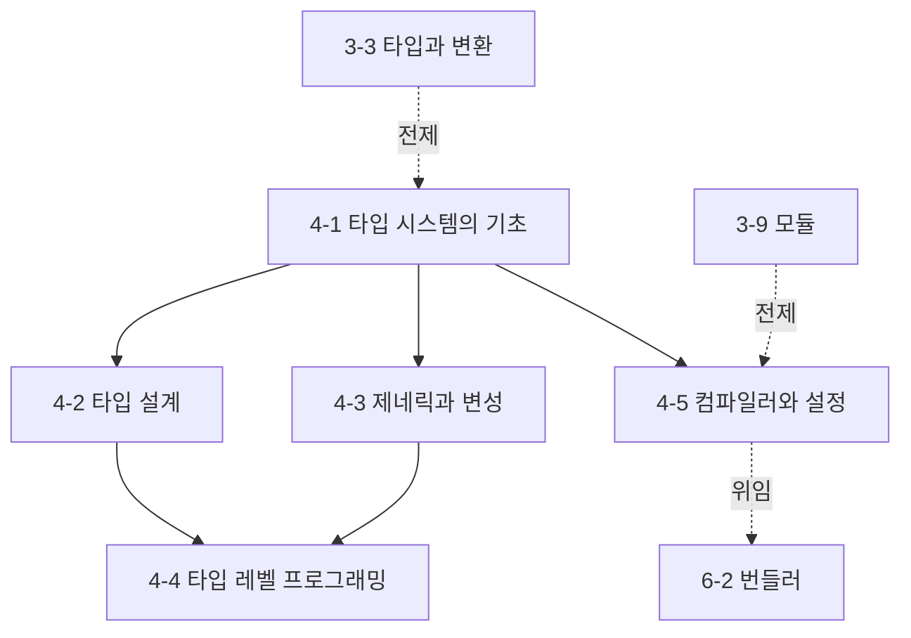

# Phase 4 — TypeScript 학습 과정 기획

> ROADMAP.md의 Phase 4(2주, 문서 5개)를 실제 집필 가능한 수준으로 구체화한 기획 문서다.
> 각 문서의 주제 범위, 핵심 논점, 문서 간 의존 관계, 실습 과제 설계, 집필 순서를 정의한다.

---

## 1. 기획 전제

### 독자 상황 분석

독자는 5년차 이상 경력 개발자(백엔드·모바일 출신)다. Phase 4에서 이 전제는 양날이다.

- **이미 아는 것**: 정적 타입 언어(Java, C#, Kotlin, Swift 등)를 주력으로 써 왔을 가능성이 높다. 제네릭, 인터페이스, 타입 추론이라는 단어 자체는 재교육 대상이 아니다. TypeScript 문법도 "따라 쓸 수" 있다.
- **모르는 것 (이 Phase의 가치)**: 익숙한 단어들이 **다른 의미론** 위에서 동작한다는 사실이다. Java의 타입은 명목적(이름이 계약)이고 런타임에 실재하지만, TS의 타입은 구조적(모양이 계약)이고 **컴파일하면 소거된다**. 이 두 차이에서 경력자의 오진 대부분이 나온다 — "왜 implements 안 한 객체가 할당되는가", "왜 instanceof로 인터페이스를 못 거르는가", "왜 런타임 검증이 따로 필요한가". Phase 4는 TS를 "Java 비슷한 것"이 아니라 **JavaScript의 실제 동작(Phase 3)을 기술하는 정적 서술 계층**으로 다시 세운다.
- **흔한 함정**: 타입 에러를 이해가 아니라 **진압**(any, as, @ts-ignore)으로 대응하는 습관. 에러 메시지는 할당 가능성 판정의 실패 로그이므로, 판정 규칙을 알면 에러는 읽는 대상이 된다. 이 Phase의 목표는 "에러를 없애는 법"이 아니라 "판정 규칙으로 에러를 예측하는 능력"이다.

### Phase 4 전체 목표 (ROADMAP 기준)

구조적 타입 시스템의 판정 규칙을 이해하고, 타입으로 도메인 제약을 표현하는 설계와 타입 레벨 프로그래밍을 구사할 수 있다.
최종 산출물: Phase 3 프로젝트의 TypeScript 마이그레이션 + 타입 설계 문서.

### 2주 배분

문서 5개는 세 블록으로 묶인다: **판정 모델**(4-1, 시스템의 공리), **타입 설계**(4-2~4-3, 도메인을 타입으로 표현), **메타 계층**(4-4~4-5, 타입을 계산하는 언어와 그것을 실행하는 컴파일러).

| 주차 | 문서 | 실습 |
|------|------|------|
| 1주차 | 4-1 타입 시스템의 기초, 4-2 타입 설계, 4-3 제네릭과 변성 | 할당 가능성 예측→검증 실험, 판별 유니언으로 상태 모델링 |
| 2주차 | 4-4 타입 레벨 프로그래밍, 4-5 컴파일러와 설정 | 유틸리티 타입 직접 구현, 과제(Phase 3 프로젝트 마이그레이션) |

---

## 2. 문서별 상세 기획

각 문서는 CLAUDE.md의 공통 구조(학습 목표 → 배경 → 핵심 개념 → 실무 관점 → 더 깊이 → 정리 → 확인 문제 → 참고 자료)를 따른다. 기준 버전은 **TypeScript 5.9**로 각 문서에 명시한다.

### 4-1. 타입 시스템의 기초 — `docs/phase-4/01-type-system-foundations.md`

- **핵심 질문**: TS는 두 타입이 호환되는지를 무엇으로 판정하는가 — 이름인가 구조인가, 그리고 그 판정은 언제 수행되고 언제 사라지는가?
- **다룰 범위**:
  - 타입 소거(type erasure)부터: TS 타입은 런타임에 존재하지 않는다 — 컴파일 산출물 비교로 시작. `instanceof MyInterface`가 불가능한 이유, 런타임 검증(타입 가드, 스키마 검증)이 별도로 필요한 구조적 이유
  - 구조적 타이핑 vs 명목적 타이핑: 할당 가능성(assignability)은 선언 관계가 아니라 **구조 포함 관계** — Java의 implements 계약과의 정면 대조. 덕 타이핑(Python)과의 차이(런타임 시도 vs 컴파일 타임 증명)
  - 할당 가능성 판정 규칙: 프로퍼티별 재귀 비교, 초과 프로퍼티 검사(excess property check)가 **객체 리터럴에만** 적용되는 이유(fresh literal type) — "변수에 담으면 통과하는" 현상의 메커니즘
  - 타입 추론과 넓히기(widening): 리터럴에서 원시 타입으로 넓혀지는 규칙, `const`와 `let`의 추론 차이, `as const`가 멈추는 것
  - 좁히기(narrowing)와 제어 흐름 분석(control flow analysis): typeof/instanceof/in/판별 프로퍼티/사용자 정의 타입 가드(`is`) — 좁히기가 무효화되는 지점(콜백 경계, 시간 축)과 그 이유
  - any / unknown / never의 타입 격자(lattice) 상 위치: any는 격자를 탈출하는 구멍(양방향 할당), unknown은 top(들어오기만), never는 bottom(나가기만) — 철저성 검사에서 never가 하는 일(4-2 복선)
- **다루지 않을 범위**: 유니언/교차 타입의 설계 활용(4-2), 제네릭(4-3), tsconfig의 검사 강도 옵션(4-5)
- **경력자 연결**: Java/C#의 타입은 **런타임 실체**(리플렉션 가능, 캐스트는 런타임 검사)지만 TS의 타입은 **컴파일 타임 서술**이며 `as`는 캐스트가 아니라 "검사 포기 선언"이다. 구조적 판정은 Go의 인터페이스(암묵적 충족)와 가장 가깝다.
- **의존**: Phase 3의 typeof·값 타입 모델(3-3). Phase 4 전체의 공용 어휘(할당 가능성, 넓히기/좁히기)를 이 문서가 세운다.

### 4-2. 타입 설계 — `docs/phase-4/02-type-design.md`

- **핵심 질문**: "불가능한 상태를 표현 불가능하게(make illegal states unrepresentable)" 만드는 도구는 무엇이고, interface/type/enum 중 무엇이 그 도구인가?
- **다룰 범위**:
  - interface vs type의 실제 차이: 대부분의 경우 교환 가능하다는 사실부터 — 실질 차이는 선언 병합(declaration merging, 라이브러리 타입 확장의 통로이자 오염 통로), 교차 타입과 extends의 에러 방식 차이, 에러 메시지·hover 표시 방식. "팀 컨벤션은 무엇을 근거로 정하는가"까지
  - 유니언 타입이 설계의 중심: 합 타입(sum type)이 없는 언어(Java의 상속 계층, enum + null 필드)에서 오는 습관과의 대조 — "상태를 boolean 플래그 여러 개로 두면 불가능한 조합이 생긴다"
  - 판별 유니언(discriminated union): 판별 프로퍼티(리터럴 타입)로 좁히기가 자동화되는 메커니즘(4-1의 제어 흐름 분석 적용), 로딩/성공/실패 상태 모델링 — Phase 3 과제 B의 상태 표현을 타입으로 재설계
  - 철저성 검사(exhaustiveness check): never를 이용한 switch 완결성 보장 — 새 variant 추가 시 컴파일 에러가 나는 구조 만들기
  - enum의 문제: 런타임 산출물 생성(타입 소거 원칙의 예외), const enum의 격리 모듈 문제, 숫자 enum의 할당 구멍 — 대안으로서의 `as const` 객체 + `keyof typeof` 패턴, 리터럴 유니언과의 선택 기준
  - 브랜드 타입(branded type): 구조적 타이핑이 만드는 구멍(UserId와 PostId가 서로 할당됨)을 명목적으로 막는 관례 — 구조적 시스템 안에서 명목성이 필요해지는 경계 조건
- **다루지 않을 범위**: 제네릭 설계(4-3), 조건부 타입으로 하는 고급 변형(4-4), 스키마 검증 라이브러리(존재만 언급)
- **경력자 연결**: 판별 유니언은 Kotlin의 sealed class, Rust/Swift의 enum(대수적 데이터 타입)과 같은 문제의 해법 — 차이는 TS가 이를 **상속 계층 없이 구조와 리터럴 타입만으로** 얻는다는 점. Java 개발자의 enum 직역이 TS에서 왜 어색해지는가.
- **의존**: 4-1의 좁히기·리터럴 타입·never.

### 4-3. 제네릭과 변성 — `docs/phase-4/03-generics-and-variance.md`

- **핵심 질문**: `Array<Dog>`는 `Array<Animal>`에 할당 가능해야 하는가 — TS의 답은 무엇이고, 그 답에는 어떤 구멍이 의도적으로 남아 있는가?
- **다룰 범위**:
  - 제네릭 타입 인자의 추론: 호출 인자로부터의 추론 동작, 추론 지점이 여러 개일 때의 통합, 추론이 실패해 unknown/제약으로 떨어지는 경우 — 명시적 타입 인자를 써야 하는 시점의 판단
  - 제약(constraints): `extends`가 여는 것(프로퍼티 접근)과 흔한 오해 — `T extends string`인 T는 string의 **부분 타입**(리터럴일 수 있음), 제약과 기본값(`= `)의 구분
  - 변성(variance)의 문제 설정: 컨테이너 타입의 할당 가능성은 원소 타입에서 어떻게 유도되는가 — 공변(covariant)/반공변(contravariant)/불변(invariant)의 정의를 함수 타입으로 도출(반환은 공변, 매개변수는 반공변인 이유를 대입 관점에서)
  - TS의 실제 선택: 배열·객체 프로퍼티는 소리(soundness)를 포기하고 공변(가변 배열의 공변은 이론상 구멍 — Java 배열과 같은 선택, 단 TS는 런타임 검사도 없음), 함수 매개변수는 strictFunctionTypes에서 반공변
  - **메서드 축약 표기의 구멍**: method shorthand(`m(x: T): void`)는 이변(bivariant), 프로퍼티 표기(`m: (x: T) => void`)는 반공변 — 같은 의미의 두 표기가 다른 검사 강도를 갖는 이유(DOM 이벤트 핸들러 호환성)와 라이브러리 타입 작성 시의 함정
  - in/out 변성 주석(TS 4.7+)의 용도와 한계
- **다루지 않을 범위**: 조건부 타입·infer(4-4), 고차 타입 수준의 추상화, 함수 오버로드 상세(추론에 필요한 만큼만)
- **경력자 연결**: Java의 `? extends`/`? super`(사용처 변성), Kotlin의 in/out(선언처 변성)과의 3자 비교 — TS는 기본적으로 **구조에서 변성을 계산**하며 선언처 주석은 보조 수단. Java 배열 공변의 ArrayStoreException을 아는 독자에게: TS는 같은 구멍을 열어 두고 **런타임 검사조차 없다** — 소리보다 실용을 택한 시스템의 명시적 트레이드오프.
- **의존**: 4-1의 할당 가능성(변성은 그 규칙의 고차 확장).

### 4-4. 타입 레벨 프로그래밍 — `docs/phase-4/04-type-level-programming.md`

- **핵심 질문**: Partial, ReturnType 같은 유틸리티 타입은 마법이 아니라 어떤 언어 기능의 조합인가 — 그 "타입을 계산하는 언어"의 문법과 비용은 무엇인가?
- **다룰 범위**:
  - 타입 레벨 언어라는 관점: 타입 공간에는 별도의 함수형 언어가 있다 — 제네릭이 함수, 조건부 타입이 분기, 재귀가 루프, 유니언이 컬렉션. 이 관점을 세우고 시작한다
  - 조건부 타입(`T extends U ? X : Y`)과 **유니언 분배(distributive conditional type)**: naked type parameter에서만 분배가 일어나는 규칙, 분배를 막는 `[T] extends [U]` 관용구 — "유니언을 넣었더니 유니언이 나오는" 동작의 정확한 조건
  - infer: 타입 패턴 매칭 — ReturnType/Parameters를 직접 구현하며 추론 위치·다중 infer·제약 결합
  - mapped type: `[K in keyof T]`의 순회 모델, 수식어(`?`, `readonly`)의 추가·제거(`-?`), key remapping(`as`) — Partial/Required/Pick/Omit/Readonly를 직접 구현
  - template literal type: 문자열 리터럴의 타입 레벨 조합·분해(infer와 결합), 이벤트 이름 매핑(`on${Capitalize<K>}`) 같은 실전 패턴
  - 재귀 조건부 타입과 그 한계: 재귀 깊이 제한, 유니언 크기 폭발 — 타입 계산이 tsc 성능(에디터 반응성)을 잡아먹는 경계 조건과 계측 방법(`tsc --extendedDiagnostics`, `--generateTrace`)
  - 판단 기준: 타입 레벨 프로그래밍이 **정당한 경우**(라이브러리 경계, 코드 생성 대체)와 **과잉인 경우**(애플리케이션 코드의 곡예) — 읽을 수 없는 타입은 잘못된 타입이라는 원칙
- **다루지 않을 범위**: 선언 파일 작성(4-5), 데코레이터, 특정 라이브러리(zod 등)의 타입 내부 해부
- **경력자 연결**: C++ 템플릿 메타프로그래밍과 구조가 같다(컴파일 타임 순수 함수형 계산, 에러 메시지 폭발까지) — 차이는 TS가 이를 **값 생성이 아니라 서술 정밀화**에만 쓴다는 점. Java의 제네릭이 소거로 잃는 표현력과의 대조.
- **의존**: 4-1의 리터럴 타입·never, 4-3의 제네릭·추론. Phase 4의 기술적 정점.

### 4-5. 컴파일러와 설정 — `docs/phase-4/05-compiler-and-config.md`

- **핵심 질문**: 왜 esbuild·Vite는 타입 검사를 하지 않는가 — 타입 검사와 트랜스파일은 어떻게 분리되며, 그 분리 위에서 tsconfig의 각 옵션은 무엇을 조정하는가?
- **다룰 범위**:
  - tsc 파이프라인: 스캐너 → 파서(AST) → 바인더(심볼) → 체커(판정) → 이미터(JS/.d.ts) — 검사(checker)와 방출(emitter)이 **독립**이라는 구조. `noEmit`(검사만)과 transpile-only(방출만)의 두 반쪽
  - 왜 esbuild는 검사를 안 하는가: 타입 검사는 전체 프로그램 분석(파일 간 심볼 해석)이고 트랜스파일은 파일 단위 구문 변환 — 병렬화 가능성과 비용이 다른 두 작업의 분리. isolatedModules가 강제하는 "파일 단위로 변환 가능한 문법 부분집합"(const enum·재수출의 제약이 여기서 나옴), `verbatimModuleSyntax`와 type-only import
  - CI와 에디터의 역할 분담: 빌드는 transpile-only로 빠르게, 검사는 `tsc --noEmit`으로 병렬 — Vite의 기본 구성이 이 구조인 이유
  - strict 계열 옵션 각각의 근거: strictNullChecks(null 추적을 켜는 스위치 — 꺼진 세계의 타입은 전부 거짓말), noImplicitAny, strictFunctionTypes(4-3의 반공변), noUncheckedIndexedAccess(인덱스 접근의 정직화) — "strict는 왜 기본값이 아닌가"(하위 호환)와 신규 프로젝트의 기준선
  - 선언 파일(.d.ts): 타입 정보의 배포 형식, DefinitelyTyped(@types)의 위상, declare와 앰비언트 선언, 라이브러리 타입이 틀렸을 때의 대처(모듈 보강 — 4-2의 선언 병합 적용)
  - 모듈 해석(moduleResolution): bundler vs nodenext의 차이 — Phase 3-9의 Node 이중 생태계·조건부 exports가 **타입 해석에도** 반복되는 구조, "값은 되는데 타입을 못 찾는" 증상의 진단
- **다루지 않을 범위**: 번들러 자체의 동작(6-2), 프레임워크별 tsconfig 프리셋 나열, 컴파일러 API 프로그래밍
- **경력자 연결**: javac는 검사와 바이트코드 생성이 한 몸이지만 TS는 둘이 분리된 도구 생태계다 — "컴파일이 됐는데 타입 에러가 있다"가 성립하는 이유. Gradle 멀티모듈의 증분 빌드 감각으로 project references를 이해할 수 있다.
- **의존**: 3-9의 모듈 해석·이중 생태계, 4-1의 타입 소거. 6-2(번들러)의 기반.

---

## 3. 문서 간 의존 관계

- 집필 순서는 번호 순서(4-1 → 4-5)를 그대로 따른다. 4-1이 세운 **할당 가능성·넓히기/좁히기·타입 소거**가 Phase 전체의 공용 어휘다: 판별 유니언(4-2)은 좁히기의 응용, 변성(4-3)은 할당 가능성의 고차 확장, 조건부 타입(4-4)의 extends는 같은 판정의 재사용, 검사/방출 분리(4-5)는 소거의 도구적 귀결.
- Phase 3과의 관계: TS는 Phase 3에서 세운 JS 의미론의 **서술 계층**이다. 4-1은 3-3의 값 타입 모델을, 4-5는 3-9의 모듈 해석을 전제하며, 각 문서에서 상대 링크로 연결한다.
- 뒤 Phase로 위임하는 주제(번들러의 TS 처리와 트리 셰이킹은 6-2, React 컴포넌트 타이핑은 Phase 5 각 문서)는 본문에서 "Phase N-M에서 다룬다"고 명시해 범위 이탈을 막는다.

## 4. 실습 과제 설계

ROADMAP의 "Phase 3 프로젝트를 TypeScript로 마이그레이션"을 문서 진도와 연동한다. 이 Phase의 실습은 **마이그레이션 + 타입 설계 기록**이다 — 새 코드를 짜는 것이 아니라, 이미 동작하는 코드의 암묵적 계약을 타입으로 명시화하면서 추론과 판정 규칙을 몸으로 확인한다.

### 과제 — Phase 3 프로젝트 TypeScript 마이그레이션 (2주차, 4-1~4-3 학습 후 착수)

- 과제 A(Todo 앱) 또는 과제 B(API 검색 앱)를 TypeScript로 전환한다. 빌드 도구를 도입하지 않고 `tsc`로 트랜스파일하거나 브라우저 실행은 기존 JS 산출물로 유지한다(4-5의 검사/방출 분리를 도구 구성으로 체험).
- 요구사항이 곧 학습 검증이 되도록 설계한다:
  - **strict 전체 활성화 + any 0개**: 암묵 any가 나오는 지점마다 "왜 추론이 실패했는가"를 판정 규칙으로 설명할 수 있어야 한다
  - **상태의 판별 유니언화**(4-2): 로딩/성공/에러/빈 결과 상태를 판별 유니언으로 재설계하고 철저성 검사를 건다
  - **DOM 경계의 타입 처리**(4-1): `querySelector`의 null과 요소 타입 좁히기를 단언이 아니라 가드로 처리하는 원칙, 단언이 불가피한 지점의 근거 기록
  - **API 응답 경계**(4-1의 타입 소거): fetch 응답에 제네릭 단언 대신 unknown + 런타임 검증(직접 작성한 타입 가드)을 배치
- **타입 설계 문서**: 타입 단언(`as`)·non-null 단언(`!`)이 필요했던 지점마다 "왜 추론이 실패했는가 / 왜 이 단언이 안전한가"를 기록한 문서를 함께 작성한다. 단언 0개가 아니라 **근거 없는 단언 0개**가 목표다.
- 완성 기준: `tsc --noEmit` 통과(strict), any 0개(`--noImplicitAny` + 명시적 any 금지), 동작 동일성 유지, 타입 설계 문서 완성.

과제 안내는 `exercises/phase-4/` 아래 별도 문서로 작성한다 (문서 5개 집필 완료 후).

## 5. 공통 집필 기준 (Phase 4 특화)

CLAUDE.md의 전 지침에 더해, Phase 4에서 특히 지킬 것:

- **기준 버전 명시**: 모든 문서에 "이 문서는 TypeScript 5.9 기준이다"를 명시한다. 버전에 따라 달라진 동작(strictFunctionTypes 4.7의 변성 주석 등)은 도입 버전을 붙인다.
- **1차 자료**: TypeScript Handbook과 microsoft/TypeScript 저장소(스펙 문서가 없는 언어이므로 공식 문서·릴리스 노트·소스가 1차 자료임을 명시), ECMA-262(JS 의미론 참조 시).
- **검사기의 판정을 어휘로**: "에러가 난다/안 난다"가 아니라 할당 가능성 판정의 어느 규칙이 실패했는지로 서술한다. 대표 에러 메시지(TS2322, TS2345 등)를 실제로 재현해 읽는 법을 함께 보인다.
- **예제 검증 방식**: 타입 수준 예제는 `tsc --noEmit`(저장소의 typescript 5.9)으로 에러 유무를 검증하고, 에러가 논점인 예제는 `// ❌ TS2322: ...` 형식으로 에러 코드를 주석에 남긴다. 런타임 동작이 논점인 예제는 Node 24로 실행해 출력을 검증한다.
- **소거 원칙의 반복 확인**: "이 타입은 런타임에 무엇이 되는가"를 각 문서에서 최소 한 번 확인한다(컴파일 산출물 제시). enum·데코레이터처럼 소거 원칙을 깨는 기능은 그 사실 자체를 명시한다.
- **soundness 트레이드오프의 정직한 서술**: TS가 의도적으로 남긴 구멍(배열 공변, 메서드 이변, any)을 결함이 아니라 명시된 설계 선택으로 다루고, 각 구멍이 실제로 뚫리는 재현 코드를 붙인다.
- **확인 문제 방향**: "이 할당은 통과하는가, 판정 근거는", "이 타입 에러를 단언 없이 해소하는 설계는", "이 유틸리티 타입이 이 입력에서 만드는 결과 타입은"처럼 판정 예측·설계형 문제를 우선한다. 문법 암기형 문제를 내지 않는다.

## 6. 진행 체크리스트

- [x] 4-1 `01-type-system-foundations.md`
- [x] 4-2 `02-type-design.md`
- [x] 4-3 `03-generics-and-variance.md`
- [x] 4-4 `04-type-level-programming.md`
- [x] 4-5 `05-compiler-and-config.md`
- [x] `exercises/phase-4/` 과제 안내 문서
- [x] ROADMAP.md 5절 진행 현황 표 갱신
