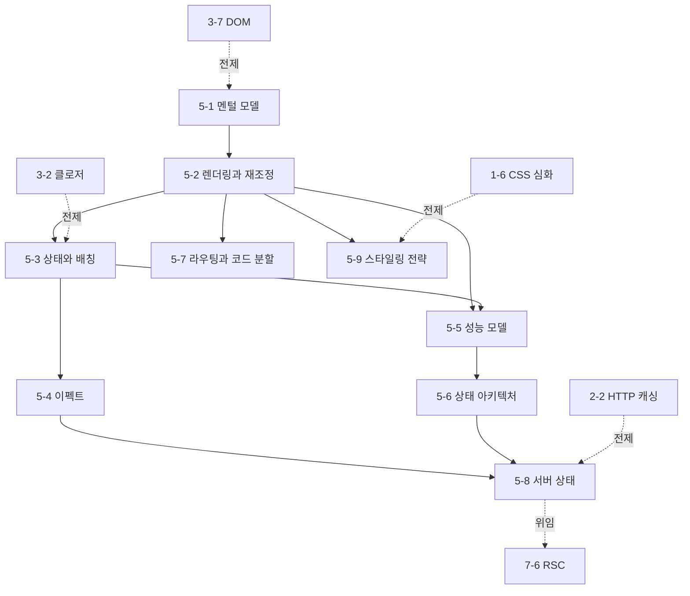

# Phase 5 — React 학습 과정 기획

> ROADMAP.md의 Phase 5(5주, 문서 9개)를 실제 집필 가능한 수준으로 구체화한 기획 문서다.
> 각 문서의 주제 범위, 핵심 논점, 문서 간 의존 관계, 실습 과제 설계, 집필 순서를 정의한다.

---

## 1. 기획 전제

### 독자 상황 분석

독자는 5년차 이상 경력 개발자(백엔드·모바일 출신)로, Phase 3에서 JS 실행 모델(이벤트 루프, 클로저, DOM)을, Phase 4에서 TypeScript 판정 규칙을 이미 세웠다. Phase 5에서 이 전제는 다음을 의미한다.

- **이미 아는 것**: 선언형 UI라는 단어 자체(모바일 출신이면 SwiftUI/Compose로, 백엔드 출신이면 템플릿 엔진으로 유사 개념 경험). 컴포넌트·props 같은 표면 문법은 하루면 따라 쓴다. 상태 관리가 어렵다는 소문도 안다.
- **모르는 것 (이 Phase의 가치)**: React가 "UI = f(state)"를 실제로 어떻게 구현하는가 — 렌더가 함수 재실행이라는 사실과 그 귀결(클로저 스냅샷, 리렌더 전파, 이펙트의 stale closure)이다. React의 난해함으로 알려진 것 대부분은 프레임워크의 변덕이 아니라 **"컴포넌트는 순수 함수이고 훅은 호출 순서로 식별된다"는 두 규칙의 논리적 귀결**이다. 이 Phase는 그 귀결을 규칙에서 유도하는 훈련이다.
- **흔한 함정**: ① 렌더를 DOM 갱신과 동일시(렌더는 계산, 커밋이 반영), ② 상태 갱신을 대입으로 취급(스냅샷 의미론 위반), ③ 리렌더를 무조건 성능 문제로 취급해 메모이제이션을 살포, ④ useEffect를 "무언가 하고 싶을 때"의 만능 훅으로 사용. 네 함정 모두 렌더링 모델을 세우면 원인이 보인다.

### Phase 5 전체 목표 (ROADMAP 기준)

React의 렌더링 파이프라인(렌더/커밋, 재조정)을 모델로 세우고, 리렌더·이펙트·상태 배치를 근거를 갖고 설계·진단할 수 있다.
최종 산출물: React + TypeScript SPA + Profiler 기반 리렌더 개선 전/후 리포트.

### 5주 배분

문서 9개는 세 블록으로 묶인다: **렌더링 모델**(5-1~5-4, React가 화면을 만드는 규칙), **진단과 아키텍처**(5-5~5-6, 그 규칙 위에서의 성능·상태 설계), **애플리케이션 계층**(5-7~5-9, SPA를 완성하는 라우팅·서버 상태·스타일링).

| 주차 | 문서 | 실습 |
|------|------|------|
| 1주차 | 5-1 멘털 모델, 5-2 렌더링과 재조정 | 렌더/커밋 관찰 실험, key 실험 |
| 2주차 | 5-3 상태와 배칭, 5-4 이펙트 | 스냅샷·배칭 예측 실험, race condition 재현 |
| 3주차 | 5-5 성능 모델, 5-6 상태 아키텍처 | 프로젝트 착수(상품 목록/상세/장바구니) |
| 4주차 | 5-7 라우팅과 코드 분할, 5-8 서버 상태 | 라우팅·서버 상태 통합 |
| 5주차 | 5-9 스타일링 전략 | Profiler 리렌더 진단 → 개선 전/후 리포트 |

---

## 2. 문서별 상세 기획

각 문서는 CLAUDE.md의 공통 구조를 따른다. 기준 버전은 **React 19**로 각 문서에 명시한다(라이브러리를 다루는 문서는 해당 라이브러리 버전도 명시 — React Router 7, TanStack Query 5, Tailwind CSS 4).

### 5-1. React 멘털 모델 — `docs/phase-5/01-react-mental-model.md`

- **핵심 질문**: "UI를 상태의 함수로 본다"는 말은 구현 수준에서 무엇을 뜻하며, 직접 DOM 조작(Phase 3 방식) 대비 무엇을 사고 무엇을 지불하는가?
- **다룰 범위**:
  - Phase 3 과제(수동 상태-DOM 동기화)의 한계에서 출발: 상태 전이 수 × DOM 갱신 지점 수의 조합 폭발 — React가 없애는 것은 DOM 조작이 아니라 **전이(transition) 코드**다
  - JSX의 실체: 컴파일 산출물(`jsx()` 호출)과 React 요소(플레인 객체)의 구조 — `tsc`/esbuild 산출물을 직접 확인. 요소 ≠ 인스턴스 ≠ DOM 노드의 3층 구분
  - 렌더 = 함수 재실행: 컴포넌트 함수의 반환값은 "이번 상태의 UI 서술"이고, React는 서술 간 차이만 DOM에 반영한다 — 가상 DOM은 목적이 아니라 이 서술-비교 전략의 자료구조
  - 컴포넌트가 순수해야 하는 이유: 렌더는 여러 번, 임의 시점에 호출될 수 있는 계산 — StrictMode 이중 호출이 검증하는 것
  - 비용의 정직한 계산: 서술 생성 + diff 비용을 항상 지불하고, 그 대가로 전이 코드 삭제와 상태-화면 일관성을 산다 — 직접 조작이 더 나은 경계 조건
- **다루지 않을 범위**: 재조정 알고리즘 상세(5-2), 훅 내부(5-3), SSR/RSC(7-5, 7-6)
- **경력자 연결**: 백엔드의 선언형-명령형 대비(SQL vs 커서, Terraform vs 셸 스크립트) — "무엇을"을 서술하면 "어떻게"는 엔진이 계산하고, 그 엔진의 비용 모델을 아는 사람이 잘 쓴다. 모바일 출신에게는 SwiftUI/Compose가 같은 모델의 다른 구현.
- **의존**: 3-7의 DOM 조작 비용 모델. Phase 5 전체의 공용 어휘(요소, 렌더, 커밋)를 이 문서가 세운다.

### 5-2. 렌더링과 재조정 — `docs/phase-5/02-rendering-and-reconciliation.md`

- **핵심 질문**: React는 두 렌더 결과 사이에서 "무엇이 같은 것인가"를 어떻게 판정하며, 그 판정이 틀렸을 때(상태가 엉뚱한 곳에 남을 때) 무슨 일이 일어나는가?
- **다룰 범위**:
  - 렌더 단계와 커밋 단계의 분리: 렌더는 중단·재시작·폐기 가능한 순수 계산, 커밋은 동기적 DOM 반영 — 이 분리가 동시성 기능(transition)의 전제
  - 재조정 휴리스틱: 트리 diff의 일반해는 O(n³)이므로 React는 두 가정(다른 타입 = 다른 트리, key = 형제 간 신원)으로 O(n)에 타협 — 휴리스틱이라는 사실 자체가 경계 조건의 근원
  - 타입 비교의 귀결: 같은 위치·같은 타입이면 인스턴스(상태) 유지, 타입이 바뀌면 서브트리 전체 언마운트 — **렌더 중 컴포넌트 정의**가 매 렌더 새 타입이 되어 상태를 파괴하는 사고의 메커니즘
  - key의 실제 역할: 배열 순회용 경고 끄기가 아니라 **재조정의 신원(identity) 선언** — index key가 삽입/삭제/정렬에서 상태를 밀리게 하는 재현, key 변경으로 의도적 상태 리셋
  - 리렌더 전파 규칙: "부모가 렌더하면 자식도 렌더한다"(props 변경 여부와 무관), 전파가 멈추는 조건(memo, 같은 요소 참조 — children 패턴)
- **다루지 않을 범위**: 배칭·상태 갱신 의미론(5-3), memo의 비용-편익(5-5), Fiber 구조 상세(더 깊이에서 개요만)
- **경력자 연결**: diff는 DB의 실행 계획과 같은 위상 — 선언(쿼리/JSX)과 실행(계획/재조정) 사이에 옵티마이저가 있고, 옵티마이저의 가정을 알아야 힌트(key)를 제대로 쓴다.
- **의존**: 5-1의 요소/렌더/커밋 어휘.

### 5-3. 상태와 배칭 — `docs/phase-5/03-state-and-batching.md`

- **핵심 질문**: `setCount(count + 1)`을 두 번 불러도 1만 오르는 것은 버그인가 — 상태 갱신의 스냅샷 의미론과 배칭은 어떤 규칙인가?
- **다룰 범위**:
  - useState의 내부: 훅 상태는 컴포넌트 함수 밖(Fiber)에 살고, 훅 호출은 **호출 순서**로 자기 슬롯을 찾는다 — 훅 규칙(조건문 금지)이 스타일 가이드가 아니라 식별 메커니즘의 요구사항인 이유
  - 스냅샷 의미론: 렌더 한 번의 props/state는 그 렌더의 클로저에 고정된 값 — `setCount(count+1)` 연타가 1만 오르는 것은 3-2 클로저의 직접 귀결. 함수형 갱신(`c => c+1`)이 해결하는 것
  - 자동 배칭: 갱신은 큐에 쌓이고 리렌더는 이벤트 핸들러 종료 후 한 번 — React 18+에서 Promise/setTimeout 내부까지 배칭이 확대된 변화, `flushSync`라는 탈출구와 그 비용
  - 불변성이 전제인 이유: React의 변경 감지는 `Object.is` 참조 비교뿐 — 깊은 비교를 포기한 설계와 그 대가(스프레드 갱신 패턴), 3-4의 참조 모델 연결
  - 제어 컴포넌트와 폼: DOM 자체 상태(비제어)와 React 상태(제어)의 이중 소유 문제, 각각의 경계 조건, React 19의 폼 액션이 이 구도에 더한 것
- **다루지 않을 범위**: 이펙트(5-4), 외부 스토어(5-6), useReducer 심화(판별 유니언 연결만 — 4-2 참조)
- **경력자 연결**: 상태 갱신은 대입이 아니라 **트랜잭션 커밋 요청**이다 — 읽기는 스냅샷에서, 쓰기는 큐로, 커밋은 배치로. DB의 MVCC 스냅샷 격리와 구조가 같다.
- **의존**: 3-2(클로저), 3-4(참조와 불변성), 5-2(리렌더가 언제 일어나는가).

### 5-4. 이펙트 — `docs/phase-5/04-effects.md`

- **핵심 질문**: useEffect는 "렌더 후 실행되는 콜백"이 아니라면 무엇이며, 의존성 배열은 왜 "실행 빈도 조절 노브"가 아닌가?
- **다룰 범위**:
  - 이펙트의 자리: 렌더는 순수 계산이므로 외부 세계 동기화(구독, 타이머, 수동 DOM, 네트워크)는 커밋 후로 밀린다 — 실행 시점(커밋 후, 페인트와의 관계), useLayoutEffect와의 차이
  - 클린업 사이클: "마운트/언마운트 콜백"이 아니라 **동기화 시작/중단의 쌍** — 의존성이 바뀔 때마다 이전 클린업 → 새 이펙트 순서, StrictMode 이중 실행이 검증하는 것
  - 의존성 배열과 stale closure: 배열은 "언제 실행할지"가 아니라 "이 이펙트가 읽는 반응형 값의 목록" — 의존성 누락이 만드는 stale closure를 3-2 클로저로 해부, 린트 규칙을 끄는 대신 의존성을 줄이는 설계(함수형 갱신, 값 분해)
  - 데이터 페칭의 race condition: 빠른 의존성 변경 → 늦게 도착한 응답이 이기는 사고 재현 — ignore 플래그와 AbortController(3-8 연결) 두 해법
  - "이펙트가 필요 없는 경우"의 판별: 렌더 중 계산 가능한 값, 이벤트에 속한 로직, 상태 연쇄(setState → effect → setState) — 각각의 재설계
- **다루지 않을 범위**: 데이터 페칭 라이브러리(5-8이 정식 해법), 성능 최적화로서의 메모이제이션(5-5)
- **경력자 연결**: 이펙트는 crontab이 아니라 **reconciliation loop**(Kubernetes 컨트롤러)다 — 선언된 상태와 외부 세계의 지속적 동기화이며, 클린업 없는 이펙트는 리소스 릭이 있는 컨트롤러다.
- **의존**: 3-2(클로저), 3-5(이벤트 루프 — 실행 시점), 3-8(AbortController), 5-3(상태 갱신).

### 5-5. 성능 모델 — `docs/phase-5/05-performance-model.md`

- **핵심 질문**: useMemo/useCallback/memo는 언제 이득이고 언제 순손실인가 — "일단 감싼다"가 왜 틀린 기본값인가?
- **다룰 범위**:
  - 리렌더의 실제 비용 구조: 렌더(함수 실행 + diff)는 대개 싸고, 커밋(DOM 변경)은 diff가 걸러낸다 — "리렌더 = 성능 문제"라는 통념의 해체, 진짜 문제는 넓은 전파 × 무거운 서브트리의 곱
  - 메모이제이션 3종의 정확한 동작: memo(props 얕은 비교로 렌더 생략), useMemo(값 캐시), useCallback(함수 참조 유지) — 셋의 관계(참조형 props가 memo를 무력화 → useMemo/useCallback이 memo의 보조)
  - 역효과인 경우: 비교 비용 + 메모리 + 코드 복잡도를 항상 지불하는데 하나라도 새 참조인 props가 있으면 편익 0 — 무효화되는 조합의 체크리스트
  - React DevTools Profiler: 커밋 단위 flame chart 읽는 법, "왜 렌더되었는가" 추적, 계측 → 원인 → 조치 → 재계측의 루프 — 성능 주장에 측정을 붙이는 Phase 공통 원칙의 React판
  - 구조적 해법 우선: 상태 내리기(colocation), children으로 전파 차단 — 메모이제이션 없이 전파를 끊는 설계가 먼저
  - React Compiler의 접근: 수동 메모이제이션을 컴파일 타임 자동화로 대체하는 방향 — 무엇이 바뀌고 무엇(구조 설계)은 남는가
- **다루지 않을 범위**: 번들 크기·로딩 성능(5-7, 7-3), 가상 스크롤 등 개별 기법 카탈로그
- **경력자 연결**: 메모이제이션은 캐시 도입과 같은 판단이다 — 히트율 낮은 캐시는 순손실이고, 캐시보다 쿼리(구조) 개선이 먼저다.
- **의존**: 5-2(리렌더 전파 규칙), 5-3(참조 비교).

### 5-6. 상태 아키텍처 — `docs/phase-5/06-state-architecture.md`

- **핵심 질문**: 이 상태는 어디에 두어야 하는가 — 컴포넌트/Context/외부 스토어/서버 캐시의 선택 기준은 무엇인가?
- **다룰 범위**:
  - 상태 분류가 설계의 시작: 지역 UI 상태 / 전역 앱 상태 / 서버 상태(원본이 서버에 있는 캐시) — 서버 상태를 클라이언트 상태 도구로 다룰 때 생기는 문제(5-8로 위임 지점 명시)
  - 상태 끌어올리기와 colocation: 기본값은 "필요한 곳에서 가장 가까운 공통 조상" — 전역화는 비용(전파 범위)을 갖는 결정
  - Context의 실제 동작: Provider의 value가 바뀌면 **모든 consumer가 리렌더** — 참조형 value가 매 렌더 새로 만들어지는 함정, 분리 전략(값/디스패치 분리, Context 쪼개기), Context는 상태 관리 도구가 아니라 주입(DI) 도구라는 재정의
  - 외부 스토어와 useSyncExternalStore: React 밖의 상태를 구독하는 표준 통로 — tearing(동시성 렌더 중 스토어 값이 바뀌어 한 화면에 두 시점이 공존)이라는 문제와 이 훅이 막는 방식
  - Zustand로 보는 외부 스토어 패턴(기준: Zustand 5): selector 구독으로 전파 범위를 좁히는 모델 — Context 대비 무엇이 달라지는가
  - 선택 기준의 종합: 전파 범위, 갱신 빈도, 소유권(누가 원본인가)으로 지역/Context/외부 스토어/서버 캐시를 판정하는 표
- **다루지 않을 범위**: TanStack Query(5-8), Redux 생태계 상세(패턴으로서만 언급), 폼 라이브러리
- **경력자 연결**: 상태 배치는 데이터 소유권 설계다 — 마이크로서비스에서 "이 데이터의 원본은 어느 서비스인가"를 정하는 것과 같은 문제. Context 남용은 전역 싱글턴 남용과 같은 결과를 낳는다.
- **의존**: 5-2(전파 규칙), 5-3(불변성), 5-5(전파 차단 기법).

### 5-7. 라우팅과 코드 분할 — `docs/phase-5/07-routing-and-code-splitting.md`

- **핵심 질문**: 서버 없이 URL이 바뀌는 SPA 라우팅은 무엇으로 성립하며, 라우트는 왜 코드 분할의 자연스러운 경계인가?
- **다룰 범위**:
  - History API가 SPA 라우팅의 전부: pushState/popstate로 "URL 변경과 문서 로드의 분리" — 새로고침 404가 나는 이유(서버 fallback 설정), 3-7의 DOM 이벤트 모델 연결
  - React Router의 모델(기준: React Router 7, 라이브러리 모드): 선언적 라우트 매칭 → 요소 트리 변환 — 라우팅이 결국 "URL을 상태로 보는" 5-1 모델의 적용이라는 관점, 중첩 라우트와 Outlet, loader의 render-then-fetch vs fetch-then-render
  - lazy와 Suspense: `import()`(3-9)가 만드는 분할 지점을 React 트리에 통합하는 메커니즘 — Suspense의 동작 모델(promise를 던진다는 관례)을 필요한 만큼
  - 라우트 단위 분할이 기본값인 이유: 사용자 이동 경계 = 코드 필요 경계의 일치 — 청크 로딩 워터폴, 프리로딩 전략
- **다루지 않을 범위**: 번들러의 분할 구현(6-2), SSR 라우팅·프레임워크 모드(7-5, 7-6), 데이터 라우터의 뮤테이션 기능 상세
- **경력자 연결**: SPA 라우터는 백엔드 라우터의 이식이 아니라 **클라이언트 상태 머신**이다 — 서버 라우팅은 요청마다 무상태 매칭이지만, SPA 라우팅은 전이(이전 화면이 살아 있는 채로의 이동)를 다룬다.
- **의존**: 3-7(History·이벤트), 3-9(동적 import), 5-2(요소 트리 교체 = 재조정).

### 5-8. 서버 상태 — `docs/phase-5/08-server-state.md`

- **핵심 질문**: 서버 데이터를 useState + useEffect로 다루면 무엇이 무너지며, TanStack Query의 캐싱 모델은 그것을 어떤 규칙으로 대체하는가?
- **다룰 범위**:
  - 서버 상태의 정체: 소유권이 서버에 있는 데이터의 **클라이언트 캐시** — 수명, 중복 요청, 동기화, 무효화라는 캐시 고유 문제가 따라온다. 수동 구현(5-4의 페칭 이펙트)이 컴포넌트마다 이 문제를 재발명하는 구조
  - stale-while-revalidate 모델(기준: TanStack Query 5): 캐시된 값을 즉시 보여주고 뒤에서 재검증 — HTTP 캐싱(2-2)과 같은 문제의 애플리케이션 계층 해법이라는 관점, staleTime/gcTime의 정확한 의미(fresh/stale/inactive 상태 기계)
  - 캐시 키 설계: 쿼리 키 = 캐시 신원 + 의존성 배열의 통합 — 키에 들어가야 하는 것(응답을 결정하는 모든 입력), 계층적 키와 부분 무효화
  - 무효화 전략: 뮤테이션 후 invalidate(재검증 트리거) vs setQueryData(직접 갱신) vs 낙관적 업데이트 — 각각의 트레이드오프와 실패 처리
  - 클라이언트 상태와의 분리: 서버 상태를 전역 스토어에 복사하면 생기는 이중 원본 문제(5-6의 소유권 기준 적용) — "전역 상태의 대부분은 서버 캐시였다"는 재분류
- **다루지 않을 범위**: HTTP 캐싱 자체(2-2 전제), RSC의 서버 데이터 접근(7-6), 무한 스크롤·페이지네이션 API 카탈로그
- **경력자 연결**: TanStack Query는 read-through cache다 — 백엔드에서 Redis를 DB 앞에 두는 구조와 같고, 무효화 전략(TTL vs 이벤트 기반)의 고민도 같다. 캐시 무효화가 어려운 문제라는 격언이 클라이언트에도 그대로 성립한다.
- **의존**: 2-2(HTTP 캐싱), 3-8(fetch), 5-4(수동 페칭의 문제), 5-6(상태 분류).

### 5-9. 스타일링 전략 — `docs/phase-5/09-styling-strategies.md`

- **핵심 질문**: CSS Modules / Tailwind / CSS-in-JS는 같은 문제(스타일 격리와 재사용)를 어느 시점(빌드/런타임)에 푸는가, 그리고 그 시점 차이가 성능·DX에 어떤 비용을 만드는가?
- **다룰 범위**:
  - 문제 설정: CSS의 전역 네임스페이스와 캐스케이드(1-3, 1-6 전제)가 컴포넌트 모델과 충돌하는 지점 — 격리(scoping)를 얻는 세 시점: 빌드 타임 이름 변환 / 빌드 타임 원자화 / 런타임 생성
  - CSS Modules: 클래스명 해싱으로 격리 — 빌드 타임에 끝나므로 런타임 비용 0, 동적 스타일은 인라인 style·CSS 변수로 우회하는 경계
  - Tailwind CSS(기준: Tailwind CSS 4): 원자(utility) 클래스의 조합 — "중복 클래스가 늘어도 CSS 총량은 수렴"하는 원자화의 비용 구조, 소스 스캔 방식(자의적 클래스명 조합이 불가능한 이유), 디자인 토큰 강제라는 부수 효과
  - CSS-in-JS의 런타임 비용: 렌더 중 스타일 직렬화·주입이 렌더 경로에 얹히는 구조, SSR에서의 추가 문제 — 제로 런타임 컴파일 방식(vanilla-extract 등)으로의 이동이라는 생태계 방향
  - 선택 기준: 팀 규모·디자인 시스템 유무·동적 스타일 비중·SSR 여부로 갈리는 판단표 — 각 접근이 무너지는 지점 명시
- **다루지 않을 범위**: CSS 자체 문법·레이아웃(Phase 1 전제), 컴포넌트 라이브러리 비교, 디자인 시스템 구축론
- **경력자 연결**: 빌드 타임 vs 런타임의 선택은 정적 타이핑 vs 동적 타이핑, AOT vs JIT과 같은 축의 문제다 — 미리 계산할수록 런타임이 싸지고 유연성이 준다.
- **의존**: 1-3·1-6(CSS 캐스케이드·특이성), 5-2(렌더 경로 — CSS-in-JS 비용의 위치).

---

## 3. 문서 간 의존 관계

- 집필 순서는 번호 순서(5-1 → 5-9)를 그대로 따른다. 5-1~5-2가 세운 **요소/렌더/커밋/재조정** 어휘 위에 5-3~5-4가 상태·이펙트 의미론을 얹고, 5-5~5-6이 그 규칙의 진단·설계 응용, 5-7~5-9가 애플리케이션 계층이다.
- Phase 3과의 관계: React의 난해한 동작 대부분은 JS 의미론(클로저 스냅샷, 참조 비교, 이벤트 루프)의 귀결이다 — 각 문서에서 Phase 3 문서로 상대 링크한다.
- 뒤 Phase로 위임하는 주제(SSR/하이드레이션·RSC는 7-5/7-6, 번들러의 분할 구현은 6-2, Core Web Vitals는 7-3)는 본문에서 위임 지점을 명시한다.

## 4. 실습 과제 설계

ROADMAP의 "React + TypeScript SPA + Profiler 전/후 리포트"를 문서 진도와 연동한다. 이 Phase의 실습은 **제작 + 진단 리포트**다 — 만드는 것으로 끝나지 않고, 렌더링 모델 어휘로 자기 앱의 리렌더를 진단·개선한 증거를 남긴다.

### 1~2주차 — 관찰 실험 (문서 병행)

- 렌더/커밋 분리, key에 의한 상태 보존/파괴, 배칭·스냅샷, stale closure와 race condition을 각각 최소 재현으로 관찰하고 한두 문장으로 해설한다.

### 3~5주차 — SPA 제작 + 진단 리포트

- React 19 + TypeScript(strict) + Vite로 상품 목록/상세/장바구니 SPA를 만든다. 라우팅(React Router 7), 서버 상태(TanStack Query 5), 전역 UI 상태(장바구니 — Context 또는 Zustand, 선택 근거 기록)를 포함한다.
- Phase 4의 타입 원칙(판별 유니언 상태, unknown + 가드 경계, 근거 없는 단언 0개)을 그대로 적용한다.
- **Profiler 리포트**: 의도적으로 넓은 전파를 가진 초기 구현 → Profiler 계측(무엇이 왜 렌더되는가) → 구조적 개선(상태 내리기, children, 필요한 곳만 memo) → 재계측. 전/후 flame chart와 원인-조치-효과 서술을 리포트로 남긴다.

과제 안내는 `exercises/phase-5/` 아래 별도 문서로 작성한다 (문서 9개 집필 완료 후).

## 5. 공통 집필 기준 (Phase 5 특화)

CLAUDE.md의 전 지침에 더해, Phase 5에서 특히 지킬 것:

- **기준 버전 명시**: 모든 문서에 "이 문서는 React 19 기준이다"를 명시한다. 라이브러리 문서는 해당 버전(React Router 7, TanStack Query 5, Zustand 5, Tailwind CSS 4)을 함께 명시한다. 18→19에서 달라진 동작(자동 배칭은 18, 폼 액션·use는 19 등)은 도입 버전을 붙인다.
- **1차 자료**: react.dev(공식 문서·API 레퍼런스)와 facebook/react 저장소. React는 스펙 문서가 없으므로 공식 문서가 보장하는 동작과 현재 구현의 세부(Fiber 내부 등)를 구분해 서술하고, 구현 세부에 의존한 코드를 권하지 않는다.
- **규칙에서 유도**: "React가 원래 그렇다"를 금지한다. 각 동작을 두 공리(렌더 = 순수 함수 재실행, 훅 = 호출 순서 식별)와 JS 의미론(Phase 3)에서 유도한다.
- **예제 검증 방식**: 실행 순서·배칭·이펙트 타이밍이 논점인 예제는 React 19 + jsdom(또는 Vite 데브 서버)에서 실제 실행해 `// 출력:` 주석을 검증한다. JSX 컴파일 산출물은 esbuild/tsc로 직접 확인한다.
- **StrictMode 기본**: 예제와 실습은 StrictMode 켠 상태를 기본으로 하고, 이중 실행이 드러내는 문제를 학습 장치로 활용한다.
- **성능 주장에 계측 첨부**: 리렌더·메모이제이션 관련 주장은 React DevTools Profiler(또는 콘솔 관찰)로 확인하는 절차를 함께 제시한다.
- **확인 문제 방향**: "이 코드에서 몇 번 렌더되는가", "왜 이 상태가 사라지는가/남는가", "이 상태는 어디에 두겠는가"류의 예측·설계형 문제를 우선한다.

## 6. 진행 체크리스트

- [x] 5-1 `01-react-mental-model.md`
- [x] 5-2 `02-rendering-and-reconciliation.md`
- [x] 5-3 `03-state-and-batching.md`
- [x] 5-4 `04-effects.md`
- [x] 5-5 `05-performance-model.md`
- [x] 5-6 `06-state-architecture.md`
- [x] 5-7 `07-routing-and-code-splitting.md`
- [x] 5-8 `08-server-state.md`
- [x] 5-9 `09-styling-strategies.md`
- [x] `exercises/phase-5/` 과제 안내 문서
- [x] ROADMAP.md 5절 진행 현황 표 갱신
