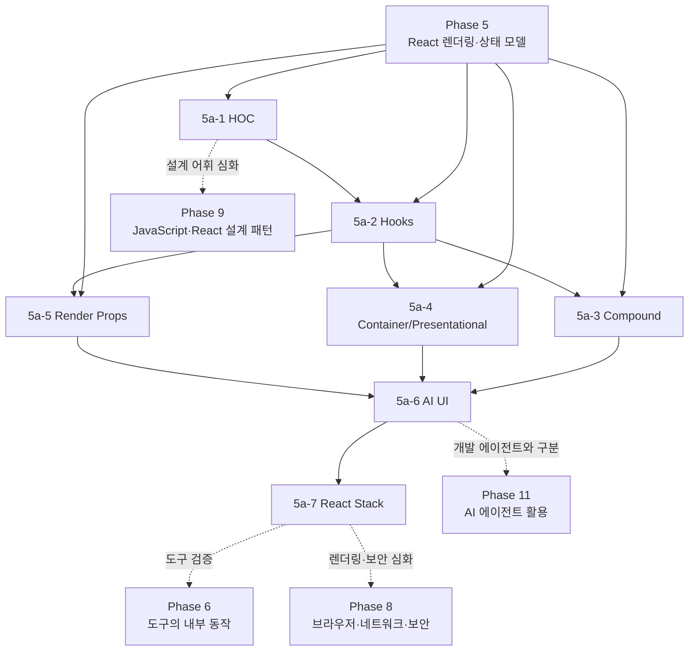

# Phase 5a — React Patterns 학습 과정 기획

> ROADMAP.md의 Phase 5a(2주, 문서 7개)를 실제 집필 가능한 수준으로 구체화한 기획 문서다.
> 각 패턴이 해결하는 문제, 데이터 흐름과 컴포넌트 트리의 형태, 현대적 대안, 실패 조건, 문서 간 의존 관계, 실습 과제와 검증 기준을 정의한다.

---

## 1. 기획 전제

### 독자 상황 분석

독자는 Phase 5에서 React의 렌더/커밋, 재조정, 상태 스냅샷, Hooks 호출 순서, Effect, Context 전파, 외부 스토어, 서버 상태를 이미 학습했다. Phase 5a는 React 문법을 다시 설명하는 과정이 아니라, 그 동작 모델을 **재사용 가능한 컴포넌트 API와 애플리케이션 구조로 변환하는 과정**이다.

- **이미 아는 것**: 함수 컴포넌트, props/children, `useState`·`useEffect`·`useContext`, 리렌더 전파와 참조 신원, TypeScript generic과 판별 유니언, React DevTools Profiler 사용법.
- **모르는 것(이 Phase의 가치)**: 같은 로직 재사용 문제를 HOC, custom hook, Render Props로 풀었을 때 공개 API·트리 소유권·타입 추론·디버깅 경계가 어떻게 달라지는지, 관련된 여러 컴포넌트를 compound API로 묶을 때 무엇을 암묵적 계약으로 만드는지, AI UI와 전체 React stack처럼 패턴 여러 개가 만나는 곳에서 어떻게 선택 근거를 남기는지다.
- **흔한 함정**: ① 패턴 이름을 먼저 정하고 코드를 끼워 맞춘다. ② HOC·Render Props를 무조건 낡았다고 보거나 반대로 모든 재사용 문제에 적용한다. ③ custom hook이 호출 간 상태까지 공유한다고 오해한다. ④ compound component의 Context 전파와 접근성 계약을 보지 않고 JSX 모양만 복제한다. ⑤ Container/Presentational을 폴더·접미사 규칙으로 고정한다. ⑥ AI 응답을 단일 문자열과 `loading` boolean만으로 모델링한다. ⑦ React stack을 요구사항 분석 없이 인기 라이브러리 목록으로 만든다.

### 커리큘럼 내 위치와 경계

| 인접 과정 | Phase 5a가 이어받는 것 | Phase 5a가 다루고 넘기는 것 |
|---|---|---|
| Phase 4 — TypeScript | generic, 판별 유니언, `unknown` 경계, 철저성 검사 | 주입 props·render function·compound API·AI message parts의 타입 계약에 적용한다. 타입 레벨 프로그래밍 자체는 반복하지 않는다. |
| Phase 5 — React 렌더링 모델 | 렌더 전파, Hooks 식별 규칙, Effect, Context, 상태 소유권, Profiler | 패턴의 트리 모양·데이터 흐름·리렌더 비용을 이 모델로 비교한다. 내장 Hook 사용법과 상태 관리 기초는 반복하지 않는다. |
| Phase 6 — 도구의 내부 동작 | Phase 5 프로젝트의 Vite·TypeScript 환경 | Phase 5a에서는 동일 동작 계약과 최소 테스트로 패턴을 비교한다. 테스트 러너·린터·번들러의 내부 원리와 CI는 Phase 6으로 넘긴다. |
| Phase 8 — 렌더링·보안 심화 | HTTP·브라우저 API와 Phase 5의 클라이언트 경계 | 서버/클라이언트 책임과 비밀 정보 보호를 설계 경계로 소개하되, SSR/RSC·하이드레이션·웹 보안의 상세 메커니즘은 Phase 8로 넘긴다. |
| Phase 9 — JavaScript·React 설계 패턴 | Phase 5a에서 만든 패턴별 비교 증거와 API 샘플 | Phase 9는 이를 factory·strategy·adapter·state 같은 더 넓은 JavaScript 설계 어휘와 연결하고 적용·배제 판단을 심화한다. |
| Phase 11 — AI 에이전트 활용 | 5a-6의 AI를 사용하는 제품 UI | Phase 5a는 사용자에게 보이는 AI UI를 다룬다. 코딩 에이전트 하네스·권한·검증·개발 워크플로는 Phase 11의 범위다. |

### 패턴을 읽는 공통 프레임

7개 문서는 같은 순서로 패턴을 분석한다. 이 프레임은 문서별 비교표와 최종 리포트의 공통 축이 된다.

1. **문제와 힘(forces)**: 무엇이 반복되고 무엇이 호출 지점마다 달라지는가. 상태·트리·서버·도구 중 누가 원본을 소유하는가.
2. **공개 API와 데이터 흐름**: props, 함수 인자, Context, Hook 반환값 중 어디로 값과 행동이 흐르는가. 암묵적인 값은 무엇인가.
3. **트리와 실행 모델**: wrapper/provider/slot이 트리에 노드를 추가하는가. 상태와 Effect는 어느 컴포넌트 인스턴스에 속하는가.
4. **비용과 실패 조건**: 타입 복잡도, prop 충돌, Context 전파, callback 중첩, 추적 난이도, 접근성 책임, 네트워크 실패가 어디서 나타나는가.
5. **대안과 전환 경로**: 일반 합성, custom hook, Context, headless API, framework 기능으로 바꾸면 무엇을 얻고 잃는가. 기존 코드를 점진적으로 옮길 수 있는가.
6. **검증 증거**: TypeScript 오류, React DevTools 트리/Profiler, 사용자 동작 테스트, 스트림 상태 전이, ADR 중 무엇으로 선택을 입증할 것인가.

### Phase 5a 전체 목표(ROADMAP 기준)

Phase 5의 렌더링·상태 모델을 바탕으로 React에서 로직과 UI를 합성하는 주요 패턴의 데이터 흐름과 비용을 설명하고, 레거시 패턴을 읽거나 현대적 대안으로 전환하며, 제품 요구사항에 맞는 UI·애플리케이션 스택을 근거 있게 선택할 수 있다.

최종 산출물은 다음 네 묶음이다.

- HOC 또는 Render Props와 custom hook의 동일 요구사항 비교 리포트
- Context 기반 compound/headless 컴포넌트와 접근성·리렌더 검증 기록
- 제어 가능한 mock stream 기반 AI UI와 상태 전이 테스트
- 선택한 React stack과 대안·재검토 조건을 기록한 ADR

### 2주 배분

| 주차 | 문서 | 학습·실습 초점 |
|---|---|---|
| 1주차 | 5a-1~5a-5 HOC, Hooks, Compound, Container/Presentational, Render Props | 같은 로직 재사용 문제를 여러 패턴으로 구현하고 공개 API·트리·타입·리렌더·테스트 경계를 비교한다. compound/headless 컴포넌트를 제작한다. |
| 2주차 | 5a-6 AI UI Patterns, 5a-7 React Stack Patterns | mock stream으로 부분 응답·취소·재시도·오류 상태를 구현하고, 프로젝트 요구사항에서 출발한 stack 책임 지도와 ADR을 작성한다. |

---

## 2. 문서별 상세 기획

각 문서는 [Patterns.dev React Patterns](https://www.patterns.dev/react/)의 해당 글을 출발점으로 삼되, API와 권장 방식은 집필 시점의 React 공식 문서와 관련 Web API·라이브러리 공식 문서로 다시 검증한다. Patterns.dev의 특정 연도·도구 버전·패키지 API는 그대로 고정하지 않는다.

### 5a-1. HOC Pattern — `docs/phase-5a/01-hoc-pattern.md`

- **기준 자료**: [Patterns.dev — HOC Pattern](https://www.patterns.dev/react/hoc-pattern/)
- **핵심 질문**: 컴포넌트를 입력받아 기능이 추가된 컴포넌트를 반환하는 간접층은 언제 횡단 관심사를 일관되게 적용하고, 언제 데이터 흐름과 타입을 숨기는가?
- **다룰 범위**:
  - HOC의 최소 모델 `Component<P> → Component<P'>`와 일반 wrapper component·함수 합성의 차이.
  - analytics, authorization, feature flag, error/suspense boundary처럼 여러 컴포넌트에 같은 트리 경계를 적용해야 하는 문제.
  - 원본 props와 주입 props의 TypeScript 계약: generic 보존, `Omit`을 이용한 외부 API, 선택적/필수 prop 충돌, 이름 공간을 둔 주입 값.
  - HOC를 렌더 중 만들지 않고 모듈 경계에서 합성해야 컴포넌트 타입과 상태가 보존되는 이유를 5-2의 재조정 모델로 설명.
  - `displayName`, wrapper 계층, React DevTools에서 원본과 장식된 컴포넌트를 추적하는 방법.
  - prop spread 우선순위, ref·정적 멤버·원본 컴포넌트 계약이 자동 전달되지 않는 경계, 여러 HOC를 중첩할 때의 wrapper hell.
  - 기존 `connect`, `withRouter`, `withTranslation`류 코드를 custom hook·일반 합성으로 옮길 때 호출 지점 API와 테스트 경계가 어떻게 바뀌는지 비교.
- **관찰 실험**:
  - 같은 analytics 요구사항을 HOC와 custom hook으로 구현해 DevTools 트리 노드 수, 호출 지점 가시성, props 타입 표면을 비교한다.
  - HOC를 렌더 함수 안에서 생성해 자식 상태가 매번 초기화되는 실패를 재현하고, 모듈 최상위 합성으로 수정한다.
- **다루지 않을 범위**: class lifecycle 자체의 재교육, decorator 제안 문법, 특정 라이브러리의 전체 API. class component는 유지보수 코드를 읽는 맥락에서만 사용한다.
- **경력자 연결**: HOC는 함수형 decorator이자 middleware와 유사하다. 횡단 관심사를 중앙화하지만 호출 그래프에 간접층을 추가한다는 점을 서버 middleware·모바일 view modifier와 연결한다.
- **의존**: 3-2 고차 함수와 클로저, 4-3 generic, 5-2 타입·key에 따른 상태 보존, 5-5 Profiler. 5a-2와 5a-5의 비교 기준을 먼저 세운다.

### 5a-2. Hook Pattern — `docs/phase-5a/02-hooks-pattern.md`

- **기준 자료**: [Patterns.dev — Hooks Pattern](https://www.patterns.dev/react/hooks-pattern/)
- **핵심 질문**: custom hook은 상태를 공유하지 않으면서 어떻게 상태 있는 로직을 재사용하며, 좋은 Hook 경계는 어떤 의도와 제약을 공개해야 하는가?
- **다룰 범위**:
  - Hooks를 호출 순서로 식별하는 Phase 5 모델에서 top-level·React 함수 호출 규칙을 짧게 복습하고, 규칙이 API 설계를 제한하는 이유를 연결.
  - custom hook이 **로직을 공유하되 호출별 상태 인스턴스는 분리**한다는 점과 Context/외부 store를 통한 실제 상태 공유의 차이.
  - low-level lifecycle 이름(`useMount`, `useEffectOnce`)보다 동기화 대상과 사용자 의도를 드러내는 Hook 이름·입출력 계약.
  - Effect를 감추는 것만으로 추상화가 완성되지 않는 이유: 반응형 입력, cleanup, 취소, stale closure, 오류를 호출자에게 어떻게 표현할지.
  - 값·상태·행동을 tuple/object 중 무엇으로 반환할지, 명령형 callback과 선언형 입력을 어떻게 나눌지, 외부 시스템을 주입해 테스트 경계를 만드는 방법.
  - 외부 구독을 `useEffect + useState`로 복제하는 대신 `useSyncExternalStore`를 고려할 조건.
  - `use`, `useActionState`, `useFormStatus`, `useOptimistic`이 Promise·Action·form pending·낙관적 상태를 표현하는 방식. API 목록 암기보다 상태 소유권과 Suspense/Action 경계를 중심으로 비교한다.
  - HOC/Render Props에서 custom hook으로 전환했을 때 wrapper 제거, 호출 지점 제어권, TypeScript 추론, 트리 소유권의 변화.
- **관찰 실험**:
  - 하나의 `useOnlineStatus` 또는 `useGeolocation` Hook을 두 컴포넌트에서 호출해 로직은 재사용되지만 지역 상태는 공유되지 않음을 확인한다.
  - 불필요한 Effect 기반 파생 상태와 누락된 의존성을 제거하고, 변경 전후 렌더 수·상태 전이·lint 경고를 비교한다.
- **다루지 않을 범위**: 모든 내장 Hook의 카탈로그, Phase 5의 상태·Effect 기초 반복, 특정 form/server framework 사용법.
- **경력자 연결**: custom hook은 UI 프레임워크 안의 protocol adapter에 가깝다. 외부 시스템의 명령형 수명주기를 React의 선언형 렌더 모델로 번역하지만 데이터 원본 자체를 새로 만들지는 않는다.
- **의존**: 3-2 클로저, 5-3 Hooks 슬롯과 상태 스냅샷, 5-4 Effect, 5-6 외부 store. 이후 모든 문서의 현대적 대안이 되는 기준 문서다.

### 5a-3. Compound Pattern — `docs/phase-5a/03-compound-pattern.md`

- **기준 자료**: [Patterns.dev — Compound Pattern](https://www.patterns.dev/react/compound-pattern/)
- **핵심 질문**: 함께 동작하는 여러 UI 조각의 상태와 행동을 어떤 부모 계약으로 묶어야 사용자는 유연한 마크업을 얻고 구현자는 일관성과 접근성을 지킬 수 있는가?
- **다룰 범위**:
  - HTML의 `select/option`처럼 관련 요소가 함께 하나의 기능을 만드는 모델과 compound component의 root/trigger/content/item 역할.
  - root가 상태·id·행동을 소유하고 하위 컴포넌트가 Context로 소비하는 암묵적 계약. provider 밖 사용을 조기에 실패시키는 전용 Hook과 sentinel 기본값.
  - `Tabs.Root`, `Tabs.List`, `Tabs.Trigger`, `Tabs.Panel` 같은 namespaced API와 개별 named export의 discoverability·tree shaking·타입 표현 비교.
  - uncontrolled `defaultValue`와 controlled `value/onValueChange`를 동시에 지원할 때 단일 상태 원본을 유지하는 계약과 전환 경고.
  - Context의 상태/행동 분리, value 참조 안정성, consumer별 갱신 빈도에 따른 provider 분할 판단. 메모이제이션은 Profiler 증거 뒤에 적용한다.
  - `Children.map`/`cloneElement`로 직접 자식에게 props를 주입하는 구현의 얕은 탐색, wrapper 삽입, prop 충돌, 데이터 흐름 추적 한계. 유지보수 코드를 읽기 위해 다루되 새 구현의 기본값으로 두지 않는다.
  - Tabs/Menu/Accordion이 가져야 할 role, name, keyboard 이동, focus 소유권을 시각적 API와 동등한 컴포넌트 계약으로 취급.
- **관찰 실험**:
  - clone 기반 구현에서 중간 `<div>`를 넣어 계약이 깨지는 사례와 Context 기반 구현이 중첩에 견디는 사례를 비교한다.
  - provider value를 매 렌더 새로 만드는 버전과 분리/안정화한 버전의 consumer 렌더 범위를 Profiler로 확인한다.
- **다루지 않을 범위**: 디자인 시스템 전체 구축, 특정 headless UI 라이브러리 사용법, WAI-ARIA 패턴 전체 암기. 선택한 위젯의 접근성 계약만 깊게 검증한다.
- **경력자 연결**: compound component는 여러 객체가 하나의 aggregate invariant를 지키는 구조와 닮았다. 편리한 DSL을 제공하는 대신 허용되는 자식 역할과 상태 전이라는 숨은 문법을 소유한다.
- **의존**: 5-2 children과 신원, 5-3 controlled/uncontrolled, 5-5 리렌더 비용, 5-6 Context. 5a-5의 headless slot과 5a-6의 메시지 구성 요소로 확장한다.

### 5a-4. Container/Presentational Pattern — `docs/phase-5a/04-container-presentational-pattern.md`

- **기준 자료**: [Patterns.dev — Container/Presentational Pattern](https://www.patterns.dev/react/presentational-container-pattern/)
- **핵심 질문**: 데이터·상태·오케스트레이션과 시각적 표현의 변경 축을 어디에서 나눠야 재사용성과 테스트 가능성이 높아지고, 언제 그 분리가 빈 wrapper만 늘리는가?
- **다룰 범위**:
  - container가 데이터 원본·상태 전이·외부 시스템 연결을, presentational component가 props를 UI로 매핑한다는 기본 책임 분리.
  - presentational이 반드시 stateless이거나 container가 반드시 class/wrapper여야 한다는 규칙을 폐기하고 **변경 이유와 의존성 방향**으로 경계를 판정.
  - 로딩·빈 상태·오류·성공을 판별 유니언 props로 표현해 UI 컴포넌트가 네트워크 구현을 몰라도 모든 상태를 렌더하게 하는 계약.
  - custom hook으로 데이터 연결을 추출하면서 pure view를 유지하는 방식과 container component가 여전히 route/provider/boundary를 소유해야 하는 조건.
  - 데이터 shaping·formatting·event translation을 어느 경계에 둘지: view용 model을 container에서 만들 때 얻는 단순성 및 다른 화면 재사용 비용.
  - 순수 UI의 Storybook/fixture/동작 테스트 용이성과, props drilling·파일 수·이름만 다른 1:1 wrapper가 만드는 ceremony.
  - 서버/클라이언트 컴포넌트 경계가 현대적 container 역할을 일부 대체할 수 있음을 예고하되 RSC 실행·직렬화 모델은 Phase 8-6으로 위임.
- **관찰 실험**:
  - 데이터 페칭·정렬·표시가 한 컴포넌트에 섞인 기능을 `useFeatureData` + `FeatureView`로 분리하고, view를 loading/error/success fixture만으로 렌더한다.
  - 1:1 container가 아무 정책도 소유하지 않는 반례에서는 wrapper를 제거해 파일·props 단계가 줄어드는지 확인한다.
- **다루지 않을 범위**: 폴더 구조 처방, CSS 아키텍처, RSC 상세, 모든 컴포넌트를 pure view/container 쌍으로 만드는 규칙.
- **경력자 연결**: ports/adapters의 경계와 비슷하지만 애플리케이션 전체 아키텍처가 아니라 UI 변경 축을 분리하는 국소 패턴이다. DTO와 view model 변환의 위치를 백엔드 presentation layer와 연결한다.
- **의존**: 4-2 판별 유니언, 5-4 데이터 연결 Effect의 한계, 5-8 서버 상태, 5a-2 custom hook. 5a-6의 메시지 표시/스트림 제어 분리에 직접 적용한다.

### 5a-5. Render Props Pattern — `docs/phase-5a/05-render-props-pattern.md`

- **기준 자료**: [Patterns.dev — Render Props Pattern](https://www.patterns.dev/react/render-props-pattern/)
- **핵심 질문**: 로직 또는 트리 경계를 소유한 컴포넌트가 렌더 결과를 호출자에게 위임해야 할 때 함수값 prop은 어떤 유연성을 주며, 언제 custom hook보다 불필요한 중첩이 되는가?
- **다룰 범위**:
  - `render`, `children`, `renderItem`, `renderEmpty`처럼 React node를 반환하는 함수값 prop의 공통 모델과 일반 callback의 차이.
  - children-as-function과 명시적 `renderX` prop의 가독성·discoverability·다중 slot 표현 비교.
  - TypeScript generic으로 입력 item/API의 타입이 render function 매개변수까지 추론되는 계약, optional slot의 반환형과 key 책임.
  - owner component가 Context, ref, portal, focus/animation boundary 등 **트리의 일부여야 하면서** 내부 JSX는 소비자가 작성해야 하는 headless component 사례.
  - HOC의 암묵적 prop 병합과 달리 함수 인자로 데이터 흐름이 드러나는 장점, 반대로 여러 render component를 중첩할 때 생기는 callback pyramid.
  - inline function identity가 memoization을 무력화할 수 있는 조건을 측정으로 판단하고, 무조건적인 `useCallback` 처방을 피한다.
  - 순수 데이터/상태 로직만 전달하는 wrapper를 custom hook으로 평탄화하는 전환, 작은 `renderItem`/typed slot이 계속 유효한 조건.
- **관찰 실험**:
  - 동일한 geolocation/form/list 로직을 children-as-function과 custom hook으로 구현해 트리 소유권·호출 지점 분기·타입 추론을 비교한다.
  - render prop 두세 개를 중첩해 가독성 저하를 재현한 뒤 Hook 조합 또는 compound slot으로 평탄화한다.
- **다루지 않을 범위**: 과거 render-props 중심 라이브러리의 전체 역사, 모든 callback을 render prop으로 부르는 설명, 근거 없는 함수 생성 성능 공포.
- **경력자 연결**: Render Props는 strategy callback이 UI 트리를 반환하는 형태다. Template Method의 변경 지점을 상속이 아닌 일급 함수로 외부에 열어 둔 구조로 해석할 수 있다.
- **의존**: 3-2 일급 함수와 클로저, 4-3 generic, 5-5 함수 신원과 메모이제이션, 5a-2 custom hook, 5a-3 headless 합성.

### 5a-6. AI UI Patterns — `docs/phase-5a/06-ai-ui-patterns.md`

- **기준 자료**: [Patterns.dev — AI UI Patterns](https://www.patterns.dev/react/ai-ui-patterns/)
- **핵심 질문**: 지연되고 부분적으로 도착하며 취소·실패·도구 호출을 포함할 수 있는 AI 응답을 React 상태와 컴포넌트 경계로 어떻게 모델링해야 안전하고 복구 가능한 UI가 되는가?
- **다룰 범위**:
  - 브라우저에는 provider 비밀 키를 두지 않고, UI가 같은 출처의 애플리케이션 endpoint만 호출하는 서버 경계. framework route handler와 Vite+별도 서버의 배포·운영 책임 차이.
  - conversation/message/message-part의 타입 모델: 안정적 id, role, text·tool call·tool result·error 같은 판별 유니언, message별 전송 상태.
  - `idle → submitting → streaming → success/error/cancelled` 상태 전이와 사용자 입력·진행 상태·중단 버튼의 계약. 하나의 `loading` boolean으로 손실되는 정보를 드러낸다.
  - Web Streams의 chunk를 완성된 메시지와 구분하고, UTF-8 decode·부분 frame·누적 결과·완료 신호를 transport adapter에서 처리하는 경계.
  - `AbortController` 기반 취소, 컴포넌트 해제/새 요청 시 cleanup, 늦게 도착한 이전 요청이 최신 메시지를 덮지 않게 request id를 판정하는 방식.
  - 재시도 시 사용자 메시지 중복·부분 assistant 메시지·idempotency를 어떻게 처리할지, 중복 제출 방지와 명시적 submit/debounce/rate limit의 구분.
  - 스트리밍 중 매 chunk 상태 갱신이 만드는 렌더 빈도, batching/throttling 판단, 사용자가 위로 스크롤했을 때 강제 auto-scroll하지 않는 scroll ownership.
  - markdown/링크/tool output을 신뢰하지 않는 출력 경계, 오류·재시도·취소 상태의 접근 가능한 이름과 `aria-live` 사용 시 과도한 낭독을 피하는 기준.
  - `useChat`류 SDK Hook과 presentational message/input 컴포넌트를 분리하고, SDK 교체 시 transport/state adapter만 바뀌게 하는 경계.
- **관찰 실험**:
  - 실제 모델 호출 없이 `ReadableStream` 또는 async iterator mock으로 chunk 지연·중간 오류·취소·재시도를 결정적으로 재현한다.
  - text-only 배열을 message-part 판별 유니언으로 확장해 tool call/result가 추가되어도 렌더 분기가 철저성 검사를 통과하는지 확인한다.
  - chunk마다 렌더하는 버전과 작은 배치로 반영하는 버전의 커밋 횟수·사용자 체감 차이를 Profiler로 관찰한다.
- **다루지 않을 범위**: prompt engineering, 모델 품질 평가, RAG·vector database, provider별 인증·과금 상세, 자율 에이전트 하네스. 보안 공격·CSP·Trusted Types 상세는 Phase 8-4, 개발 에이전트는 Phase 11로 위임한다.
- **경력자 연결**: 스트리밍 AI UI는 단순 채팅 화면이 아니라 event stream을 materialized view로 축적하는 클라이언트다. 메시지 id와 상태 전이는 분산 시스템의 중복·순서·취소 문제를 사용자 경험에 노출한다.
- **의존**: 3-6 Promise/async, 3-8 fetch·AbortController·stream, 4-2 판별 유니언, 5-3 배칭, 5-4 cleanup, 5a-2 Hook adapter, 5a-4 presentation 분리, 5a-5 typed slot.

### 5a-7. React Stack Patterns — `docs/phase-5a/07-react-stack-patterns.md`

- **기준 자료**: [Patterns.dev — React Stack Patterns](https://www.patterns.dev/react/react-2026/)
- **핵심 질문**: 제품 요구사항과 팀의 운영 제약에서 출발해 framework 또는 custom stack을 선택하고, 각 계층의 책임 중복과 철회 비용을 어떻게 드러낼 것인가?
- **다룰 범위**:
  - stack 선택의 입력: 공개 콘텐츠/SEO, 인증된 앱, 상호작용 밀도, offline 요구, 배포 runtime, 데이터 원본, 초기 응답·bundle 목표, 팀 역량, 운영 권한.
  - **framework vs custom stack**: routing·data loading·mutation·code splitting·rendering·deployment를 통합해 얻는 일관성과 convention/upgrade/runtime 결합 비용, 필요한 계층만 고르는 유연성과 통합 책임.
  - 책임 지도: runtime/hosting → framework/rendering → build/compile → routing → server data/cache → client state → form/validation → UI/accessibility → test/observability. 제품마다 필요 없는 계층은 비워 둔다.
  - route loader와 client query cache, framework mutation과 별도 form state, Context와 external store처럼 같은 원본을 두 도구가 소유하는 중복을 찾는 방법.
  - Phase 5의 상태 분류를 stack 전체에 확장해 URL·서버·client local/global·form draft의 원본을 하나씩 지정.
  - 도구 이름보다 capability와 quality attribute로 후보를 비교하고, benchmark·bundle report·운영 제약처럼 관측 가능한 증거를 요구.
  - ADR 구조: context, decision drivers, 후보, 결정, 결과/새 비용, 검증 방법, 재검토 trigger, 제거·migration 경로.
  - 버전·생태계 인기도를 영구 사실처럼 쓰지 않고, 집필·도입 시점에 공식 지원 상태와 release 문서를 다시 확인하는 절차.
- **관찰 실험**:
  - 동일한 내부 관리자 SPA와 공개 콘텐츠 서비스 요구사항을 두고 같은 stack이 왜 다른 평가를 받는지 decision matrix로 비교한다.
  - Phase 5 SPA의 현재 도구를 책임 지도에 배치해 비어 있는 책임, 중복 소유권, framework가 흡수할 수 있는 glue code를 표시한다.
- **다루지 않을 범위**: 라이브러리 인기 순위, 하나의 보편적 추천 stack, 각 framework 튜토리얼, bundler·SSR·RSC의 내부 구현. bundler는 Phase 6, SSR/RSC는 Phase 8에서 심화한다.
- **경력자 연결**: stack은 의존성 목록이 아니라 운영 모델이다. 프레임워크 선택은 build-vs-buy와 플랫폼 채택 결정처럼 여러 기능을 묶어 사고, custom stack은 그 통합 비용을 팀이 직접 소유하는 결정이다.
- **의존**: 5-6 상태 소유권, 5-7 routing/code splitting, 5-8 server state, 5-9 styling, 5a-1~5a-6의 API·UI 경계. Phase 6·8·10의 도구 검증과 프로젝트 ADR로 이어진다.

---

## 3. 문서 간 의존 관계



- 집필 순서는 ROADMAP 번호(5a-1 → 5a-7)를 따른다. 5a-1이 legacy/간접층의 비용을 드러내고, 5a-2가 현대적 로직 재사용의 기준을 세운 뒤 5a-3~5a-5가 트리·표현·책임 분리의 서로 다른 축을 확장한다.
- 5a-3~5a-5는 독립 패턴이지만 5a-6에서 함께 사용된다. AI UI의 transport/state는 Hook 또는 container가, message/slot UI는 presentational·compound·render prop API가 맡을 수 있다.
- 5a-7은 앞 문서의 도구 이름을 단순히 나열하지 않고 책임 지도로 재배치한다. 이 문서의 ADR이 Phase 6의 도구 검증과 Phase 10의 프로젝트 의사결정 기록으로 이어진다.
- Phase 9의 React 패턴 파트는 Phase 5a의 구현 경험과 비교 리포트를 선수 자료로 삼고, 일반 JavaScript 패턴과 함께 적용·배제 판단을 심화한다.

---

## 4. 실습 과제 설계

ROADMAP의 실습을 **동일 문제 비교 → compound API 제작 → 스트리밍 상태 모델 → stack ADR** 순서로 진행한다. 모든 실습은 Phase 5 SPA의 기능 또는 별도 작은 fixture에서 수행할 수 있지만, 비교 대상끼리는 같은 사용자 동작 계약을 사용해야 한다.

### 과제 A — 로직 재사용 패턴 비교(1주차, 5a-1·2·4·5 병행)

- analytics, authorization, geolocation, feature flag, form validation 중 하나를 선택한다.
- 첫 구현은 HOC 또는 Render Props 중 하나로, 두 번째 구현은 custom hook으로 만든다. 필요하면 pure presentational view를 공통으로 둔다.
- 두 구현이 같은 사용자 동작과 오류 상태를 만족하는지 동일 테스트로 검증한다.
- 다음 비교표를 작성한다.

| 비교 축 | HOC/Render Props | custom hook | 해석 |
|---|---|---|---|
| 호출 지점에서 보이는 입력·출력 | | | 암묵적 값과 명시적 값은 무엇인가 |
| 컴포넌트 트리와 상태 소유자 | | | wrapper가 필요한가 |
| TypeScript 공개 타입 | | | generic/Omit/함수 인자 중 어디가 복잡한가 |
| 오류·취소·cleanup 경계 | | | 누가 수명주기를 소유하는가 |
| 테스트 seam | | | 어떤 외부 시스템을 주입하거나 mock하는가 |
| 리렌더 범위 | | | Profiler/console에서 무엇이 관찰되는가 |
| 적합한 사용 조건 | | | 이 구현을 유지할 이유는 무엇인가 |
| 전환 비용 | | | 소비자 코드를 얼마나 바꿔야 하는가 |

### 과제 B — Compound/headless 컴포넌트 제작(1주차, 5a-3 병행)

- Tabs, Accordion, Menu, Select 중 하나를 함수 컴포넌트와 Context로 구현한다.
- root/trigger/content/item 역할을 분리하고 provider 밖 오용은 설명 가능한 오류로 실패시킨다.
- uncontrolled 또는 controlled API를 최소 하나 지원하고, 다른 방식까지 지원할 경우 단일 원본 규칙을 지킨다.
- 선택한 위젯의 role/name/keyboard/focus 계약을 동작 테스트에 포함한다.
- Context consumer의 리렌더 범위를 측정하고 provider 분할·값 안정화가 실제로 필요한지 근거를 남긴다.
- cloneElement 구현은 비교용 최소 재현으로만 만들고, 중간 wrapper·prop 충돌 실패를 기록한다.

### 과제 C — Mock stream AI UI(2주차, 5a-6 병행)

- 실제 provider와 외부 네트워크를 사용하지 않고 지연·chunk 크기·실패 지점이 고정된 mock stream을 만든다.
- 메시지는 안정적 id와 판별 유니언 part를 사용하고, 최소 `text`, `tool-call`, `tool-result`, `error`를 표현한다.
- `submitting`, `streaming`, `success`, `error`, `cancelled` 상태가 UI에서 구분된다.
- 필수 시나리오: 정상 완료, 중간 취소, 중간 오류 후 재시도, 빠른 연속 제출 또는 이전 응답의 지연 도착.
- 사용자가 대화 상단을 읽는 동안 강제 scroll이 발생하지 않으며, 새 응답으로 이동할 명시적 affordance를 제공한다.
- React DevTools Profiler로 streaming 중 커밋 횟수를 관찰하고, 작은 batching/throttling이 필요한지 판단한다.
- transport/state Hook과 message/input presentational component를 분리해 mock transport를 다른 구현으로 교체할 수 있게 한다.

### 과제 D — React stack ADR(2주차, 5a-7 병행)

- 현재 Phase 5 SPA와 성격이 다른 가상 제품 하나를 정한다. 예: 공개 콘텐츠·커머스·내부 관리자·실시간 협업 도구.
- 각 제품의 SEO, rendering, routing, data mutation, offline, hosting, team ownership, 성능·운영 제약을 시나리오로 작성한다.
- framework 기반 후보와 custom stack 후보를 하나 이상 포함해 동일 decision drivers로 비교한다.
- 선택한 stack의 책임 지도를 그리고 상태·데이터 원본의 중복, framework와 library의 기능 중첩, 직접 소유할 glue code를 표시한다.
- ADR에 선택하지 않은 대안, 관측할 지표, 재검토 trigger, migration/철회 경로를 포함한다.

### 권장 산출물 구조

```text
phase-5a-lab/
  src/
    comparisons/
      withFeature.tsx
      useFeature.ts
      FeatureView.tsx
    components/
      Tabs/
    ai/
      model.ts
      mockTransport.ts
      useConversation.ts
      components/
  tests/
    feature-contract.test.tsx
    tabs.test.tsx
    conversation.test.tsx
  reports/
    pattern-comparison.md
    compound-profiler.md
    streaming-profiler.md
  adr/
    001-react-stack.md
```

### 완성 기준(Definition of Done)

- [ ] HOC 또는 Render Props와 custom hook이 같은 사용자 동작 계약을 만족하고, 8개 비교 축을 채웠다.
- [ ] wrapper/Context/render function이 만드는 데이터 흐름과 상태 소유자를 컴포넌트 트리로 설명했다.
- [ ] compound/headless 컴포넌트가 접근성 keyboard 흐름과 provider 오용 경계를 테스트한다.
- [ ] TypeScript strict에서 주입 props, render function, Context, AI message parts에 근거 없는 `any`와 단언이 없다.
- [ ] AI UI가 정상·취소·오류·재시도·경합 시나리오를 실제 모델 호출 없이 결정적으로 재현한다.
- [ ] Profiler 또는 console trace로 compound Context와 streaming UI의 리렌더 범위를 기록했다.
- [ ] stack ADR이 요구사항, 후보, 결정, 결과, 검증 지표, 재검토 조건, 철회 경로를 포함한다.
- [ ] 패턴을 적용해 줄어든 복잡도와 새로 생긴 간접층·타입·런타임 비용을 모두 기록했다.

---

## 5. 공통 집필 기준(Phase 5a 특화)

`docs/phase-5a/`의 실제 문서는 [.agents/content-writing.md](../.agents/content-writing.md)를 따르며, 다음 기준을 추가로 적용한다.

- **문제에서 시작**: 패턴 정의나 완성 코드보다 반복되는 문제와 변경 축을 먼저 제시한다. 해결책 뒤에는 같은 문제가 더 단순한 합성이나 함수로 충분한 경계 조건을 반드시 둔다.
- **비교 가능한 공통 예제**: HOC·Hook·Container/Presentational·Render Props는 analytics/geolocation/form 등 일부 공통 도메인을 재사용해 구조 차이가 문제 차이로 가려지지 않게 한다.
- **React 동작 모델로 비용 설명**: wrapper node, component type, Hook call, Context value, function identity가 렌더·재조정·상태 보존에 어떤 영향을 주는지 Phase 5 상대 링크로 근거를 잇는다.
- **React 19 기준선과 재검증**: 저장소 Phase 5의 기준선인 React 19를 사용한다. React·framework·SDK API는 집필 시점의 공식 문서에서 지원 상태와 정확한 signature를 재확인하고, 기준 버전과 확인 날짜를 문서에 남긴다.
- **Patterns.dev의 역할 제한**: Patterns.dev는 문제·패턴 지형을 잡는 출발점이다. 특정 연도 추천, 패키지 이름, 모델 이름, 오래된 API 예제는 규범으로 복사하지 않는다.
- **함수 컴포넌트 기본**: 새 예제는 함수 컴포넌트와 Hooks로 작성한다. class component는 HOC를 사용하는 기존 코드를 해석하거나 error boundary 같은 실제 경계를 설명할 때만 최소로 사용한다.
- **TypeScript strict**: HOC의 주입 props, render props generic, Context sentinel, controlled/uncontrolled union, AI message parts를 타입으로 표현한다. 타입 체조가 커지면 장점이 아니라 비용으로 기록한다.
- **접근성은 패턴 계약**: Compound·Render Props·AI UI에서 접근성은 별도 마무리 항목이 아니다. 역할·이름·키보드·focus·live update를 공개 API와 상태 모델에 포함한다.
- **성능은 측정 후 판단**: wrapper 수, inline function, Context value, streaming update가 느리다고 단정하지 않는다. Profiler·commit count·사용자 시나리오로 비용을 확인한 뒤 조치한다.
- **동일 동작 테스트**: 패턴 비교에서는 구현별 테스트를 따로 쓰지 않고 같은 사용자 동작 계약을 재사용해 구조 변경이 외부 행동을 보존했는지 확인한다. 테스트 도구의 내부 원리는 Phase 6으로 위임한다.
- **AI를 신뢰 경계로 취급**: 모델 출력·tool result·markdown은 신뢰하지 않는 입력이다. secret은 서버에 두고, 실제 provider 호출 없이도 transport·상태·UI를 검증할 수 있게 설계한다.
- **보편적 stack 금지**: “최고의 React stack”을 제시하지 않는다. 제품 시나리오와 decision drivers가 바뀌면 결론도 바뀌도록 비교하고 재검토 조건을 남긴다.

### 문서별 공통 구성

각 문서는 콘텐츠 집필 지침의 기본 구조 안에서 다음 항목을 반드시 포함한다.

1. 동기와 실패 사례
2. 패턴의 최소 형태와 데이터 흐름
3. TypeScript를 포함한 단계별 구현
4. React 트리·상태 소유권·실행 시점 해설
5. 장점이 실제로 성립하는 조건
6. 실패 모드와 관찰 실험
7. 현대적 대안과 점진적 전환
8. 선택 체크리스트와 확인 문제
9. 1차 자료 중심 참고 문헌

---

## 6. 자료와 정확성 검증 전략

### 자료 계층

1. **React 공식 문서와 공식 release/blog**: 보장되는 API, Rules of React, 권장 app 시작점.
2. **Web 표준·공식 Web API 문서**: Fetch, Streams, AbortController, 접근성 semantics.
3. **선택한 framework·router·state·AI SDK의 공식 문서**: 버전별 API와 지원 범위.
4. **Patterns.dev**: 패턴의 문제 설정, 비교 사례, 생태계 지형을 위한 2차 자료.
5. **라이브러리 소스/타입 선언과 실행 실험**: 문서만으로 모호한 generic 추론·렌더·스트림 동작 검증.

### 문서별 출발 자료

| 문서 | Patterns.dev | 우선 확인할 1차 자료 |
|---|---|---|
| 5a-1 HOC | [HOC Pattern](https://www.patterns.dev/react/hoc-pattern/) | [React legacy — Higher-Order Components](https://legacy.reactjs.org/docs/higher-order-components.html), 현재 React의 ref·component API 문서, 사용 사례 라이브러리 공식 문서 |
| 5a-2 Hooks | [Hooks Pattern](https://www.patterns.dev/react/hooks-pattern/) | [Rules of React](https://react.dev/reference/rules), [Reusing Logic with Custom Hooks](https://react.dev/learn/reusing-logic-with-custom-hooks), `use`·`useActionState`·`useFormStatus`·`useOptimistic` 공식 API |
| 5a-3 Compound | [Compound Pattern](https://www.patterns.dev/react/compound-pattern/) | [Passing Data Deeply with Context](https://react.dev/learn/passing-data-deeply-with-context), [Children](https://react.dev/reference/react/Children), [cloneElement](https://react.dev/reference/react/cloneElement), 선택 위젯의 WAI-ARIA APG |
| 5a-4 Container/Presentational | [Container/Presentational Pattern](https://www.patterns.dev/react/presentational-container-pattern/) | React의 custom Hook·state sharing 문서, Phase 5 서버 상태 자료, 이후 RSC 공식 문서 |
| 5a-5 Render Props | [Render Props Pattern](https://www.patterns.dev/react/render-props-pattern/) | [React legacy — Render Props](https://legacy.reactjs.org/docs/render-props.html), `cloneElement` 대안, 실제 headless library의 공식 API |
| 5a-6 AI UI | [AI UI Patterns](https://www.patterns.dev/react/ai-ui-patterns/) | Fetch/Streams/AbortController 공식 Web API 문서, 선택한 AI SDK·provider의 최신 공식 문서, WAI-ARIA live region 지침 |
| 5a-7 React Stack | [React Stack Patterns](https://www.patterns.dev/react/react-2026/) | [Creating a React App](https://react.dev/learn/creating-a-react-app), [Build a React App from Scratch](https://react.dev/learn/build-a-react-app-from-scratch), 각 후보 도구의 공식 지원·migration 문서 |

### 집필 시 검증 체크

- 코드 예제의 React·TypeScript·library 버전을 기록하고 실제 `typecheck`·test·build가 통과하는지 확인한다.
- React 공식 문서가 legacy 또는 uncommon/fragile로 표시한 API는 그 상태를 숨기지 않고 현대적 대안과 함께 설명한다.
- HOC ref·static 전달, `Children`/`cloneElement`, async Action API처럼 버전 영향을 받는 주장은 공식 reference와 타입 선언을 함께 확인한다.
- streaming 예제는 chunk 경계와 UTF-8 decode, 취소 후 state update, 늦은 응답 경합을 결정적 테스트로 검증한다.
- framework/stack 추천은 글의 연도나 다운로드 수가 아니라 공식 지원 상태·capability·프로젝트 제약으로 갱신한다.
- AI SDK 예시는 provider 중립적인 transport/state 계약을 먼저 세우고, 특정 SDK adapter는 부록 예제로 격리한다.

---

## 7. 집필 순서와 진행 체크리스트

### 권장 집필 순서

1. **공통 비교 fixture 확정**: analytics/geolocation/form 중 1~2개를 골라 5a-1·2·4·5가 같은 요구사항과 타입을 사용하게 한다.
2. **5a-1~5a-2 집필**: HOC의 간접층과 Hook의 로직 추출을 먼저 대비해 나머지 문서의 현대적 대안 기준을 세운다.
3. **5a-3~5a-5 집필**: 상태 공유, 책임 분리, 렌더 제어라는 서로 다른 축을 같은 비교 프레임으로 작성한다.
4. **5a-6 집필**: 앞 패턴을 실제 비동기 UI에 조합하고, mock transport로 오류·취소·경합을 검증한다.
5. **5a-7 집필**: 도구 지형을 책임 지도와 ADR로 종합하고 Phase 6·8·9·10의 위임 링크를 확정한다.
6. **실습 문서 작성**: `exercises/phase-5a/README.md`에 네 과제와 DoD를 옮기고 문서별 상대 링크를 연결한다.
7. **통합 검토**: 중복 설명, 버전 기준, source link, 접근성·Profiler·테스트 증거, ROADMAP 문서 수와 상태를 점검한다.

### 진행 체크리스트

- [x] 공통 비교 fixture와 패턴 비교표 확정
- [x] 5a-1 `01-hoc-pattern.md`
- [x] 5a-2 `02-hooks-pattern.md`
- [x] 5a-3 `03-compound-pattern.md`
- [x] 5a-4 `04-container-presentational-pattern.md`
- [x] 5a-5 `05-render-props-pattern.md`
- [x] 5a-6 `06-ai-ui-patterns.md`
- [x] 5a-7 `07-react-stack-patterns.md`
- [x] `exercises/phase-5a/README.md` 과제 안내 문서
- [x] 문서 간 상대 링크·위임 지점 검증
- [x] `docs/.vitepress/navigation.ts`의 Phase 5a 발견 패턴·레이블·정렬과 nav/sidebar 포함 검증
- [x] TypeScript/JavaScript code fence 문법 검사와 VitePress production build
- [x] test·Profiler 검증 시나리오와 학습자 증거 기준 정의
- [x] ROADMAP.md 5절 진행 현황 표 갱신

> 집필 완료 검증(2026-07-10): 모든 로컬 Markdown link target이 존재하고, TypeScript/JavaScript code fence가 문법 검사를 통과했으며, Phase 5a 그룹과 7개 링크가 nav/sidebar에 포함되고 `pnpm docs:build`가 성공했다. React runtime typecheck·동작 test·Profiler 수치는 실습 프로젝트에서 학습자가 생성할 산출물이므로 본 저장소의 문서 빌드 결과로 대신 주장하지 않는다.
