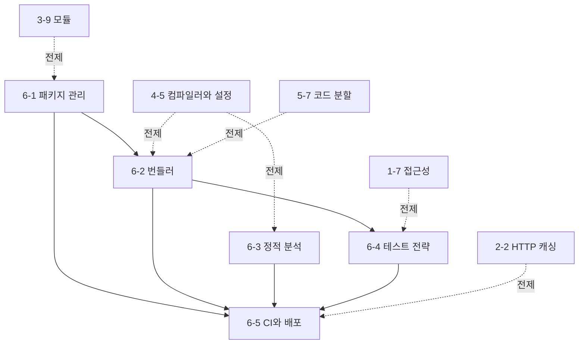

# Phase 6 — 도구의 내부 동작 학습 과정 기획

> ROADMAP.md의 Phase 6(2주, 문서 5개)를 실제 집필 가능한 수준으로 구체화한 기획 문서다.
> 각 문서의 주제 범위, 핵심 논점, 문서 간 의존 관계, 실습 과제 설계, 집필 순서를 정의한다.

---

## 1. 기획 전제

### 독자 상황 분석

독자는 5년차 이상 경력 개발자(백엔드·모바일 출신)로, Phase 1~5에서 HTML/CSS·HTTP·JavaScript 런타임·TypeScript·React를 이미 세웠다. Phase 6에서 이 전제는 다음을 의미한다.

- **이미 아는 것**: 빌드 시스템·의존성 관리·CI/CD·테스트라는 개념 자체. Maven/Gradle, Make, Jenkins/GitLab CI, JUnit을 실무로 써 왔을 가능성이 높다. "번들러가 뭐 하는 건지"는 webpack config를 복붙하며 넘겼더라도 감은 있다.
- **모르는 것 (이 Phase의 가치)**: 이 도구들이 **JS 생태계 고유의 제약 위에서** 왜 이렇게 생겼는가다. 자바 개발자에게 "왜 lodash가 세 벌 설치되는가", "왜 브라우저가 ESM을 지원하는데도 번들러가 필요한가", "왜 린터와 타입 검사기가 별개 도구인가"는 낯설다. 이 Phase는 각 도구를 블랙박스가 아니라 **입력에서 산출물을 계산하는 함수**로 열어, 그 계산이 서는 전제(모듈 시스템의 정적 구조, 여러 버전 공존을 허용하는 의존성 모델, 검사와 방출의 분리)를 드러낸다.
- **흔한 함정**: 도구를 설정 파일의 주술로 다루는 습관 — 문제가 생기면 Stack Overflow의 config를 복사한다. 이 Phase의 목표는 "설정법 암기"가 아니라 **"문제가 어느 계층에서 났는지 판단하는 능력"**이다. `import`한 게 번들에 다 들어오는 문제는 트리 셰이킹 계층, 선언 안 한 패키지가 동작하는 건 호이스팅 계층, 배포했는데 옛 화면이 뜨는 건 캐시 계층 — 증상에서 계층으로 내려가는 진단이 산출물이다.

### Phase 6 전체 목표 (ROADMAP 기준)

패키지 매니저·번들러·린터·테스트 러너를 블랙박스가 아니라 동작 원리 수준에서 이해하고, 문제가 생겼을 때 어느 계층을 의심할지 판단할 수 있다.
최종 산출물: Phase 5 프로젝트에 린트/포맷/테스트/CI/자동 배포를 적용하고, 번들 분석으로 트리 셰이킹과 청크 구성을 검증한 도구 계층 진단 노트.

### 2주 배분

문서 5개는 세 블록으로 묶인다: **소스에서 산출물로**(6-1~6-2, 의존성이 어떻게 모여 번들이 되는가), **정적 검증**(6-3, 실행 없이 코드를 읽는 도구), **동적 검증과 배포**(6-4~6-5, 실행으로 검증하고 세상에 내보내는 파이프라인).

| 주차 | 문서 | 실습 |
|------|------|------|
| 1주차 | 6-1 패키지 관리, 6-2 번들러, 6-3 정적 분석 | pnpm 전환·유령 의존성 점검, 번들 분석(트리 셰이킹·청크), ESLint/Prettier 적용 |
| 2주차 | 6-4 테스트 전략, 6-5 CI와 배포 | RTL+Vitest+MSW 테스트, GitHub Actions CI + 정적 배포·캐시 헤더 |

---

## 2. 문서별 상세 기획

각 문서는 CLAUDE.md의 공통 구조를 따른다. 도구를 다루므로 기준 버전을 각 문서에 명시한다(아래 5절의 버전 정책 참고).

### 6-1. 패키지 관리 — `docs/phase-6/01-package-management.md`

- **핵심 질문**: `pnpm install`이 실행될 때 정확히 무슨 일이 일어나는가 — 버전 범위 목록에서 어떻게 단일한 디스크 레이아웃이 결정되고, 그 결정이 왜 lockfile에 고정되어야 하는가?
- **다룰 범위**:
  - 의존성 해석(dependency resolution): semver 범위(`^`, `~`)의 의미와 해석이 제약 만족 문제라는 것 — 범위는 시간에 따라 다른 버전으로 해석되므로 재현성을 위해 lockfile이 결과를 고정한다. `package.json`(의도)과 lockfile(결정)의 역할 분리
  - 다이아몬드 의존성과 버전 공존: 같은 패키지의 서로 다른 버전 요구를 JS 생태계가 어떻게 다루는가 — 각 모듈이 자기 트리에서 자기 버전을 보는 중첩 모델(Java의 단일 classpath, nearest-wins와 정면 대조). "왜 lodash가 세 벌 설치되는가"의 구조적 답
  - node_modules 평탄화(호이스팅): npm3+의 flat 구조가 푸는 문제(중복 감소, 깊은 경로 회피)와 만드는 문제 — **유령 의존성(phantom dependency)**: 선언하지 않은 패키지가 import되는 이유와 그것이 왜 시한폭탄인가(다른 의존성의 부수 효과로 우연히 존재)
  - pnpm의 링크 구조: content-addressable store + 심볼릭 링크 — `node_modules/.pnpm`의 실제 레이아웃을 열어 보고, 왜 non-flat 구조가 유령 의존성을 구조적으로 차단하는가(선언한 것만 최상위에서 보인다), 디스크·설치 속도 이점의 출처(하드링크 재사용)
  - semver·중복의 함정: 범위 지정의 트레이드오프(느슨하면 유령/드리프트, 엄격하면 갱신 부담), 같은 패키지 여러 버전이 번들에 들어가는 경로(6-2 복선), `peerDependencies`가 푸는 문제(호스트가 제공하는 단일 인스턴스 — React가 대표 사례)
- **다루지 않을 범위**: 번들러의 모듈 해석과 중복 제거(6-2), monorepo 워크스페이스 상세(개념만 언급), 배포 시 의존성 처리(6-5)
- **경력자 연결**: Maven/Gradle의 nearest-wins·단일 버전 강제, Go modules의 MVS(minimal version selection)와 3자 대조 — JS는 여러 버전 공존을 명시적으로 허용하며, 그 대가가 중복 설치와 유령 의존성이다. `mvn dependency:tree`의 감각으로 `pnpm why`를 읽을 수 있다.
- **의존**: 3-9(모듈 해석·이중 생태계), 4-5(moduleResolution — 타입 해석도 같은 트리를 걷는다). 6-2·6-5의 기반.

### 6-2. 번들러 — `docs/phase-6/02-bundlers.md`

> 이전 Phase에서 이 문서로 위임한 주제가 많다: 3-9(동적 import의 청크 처리), 4-5(TS의 트리 셰이킹·esbuild transpile-only), 5-7(코드 분할의 구현). 이 문서가 그 위임을 수령한다.

- **핵심 질문**: 브라우저가 ESM을 네이티브로 지원하는 지금도 왜 번들러가 필요한가 — 번들러는 모듈 그래프에서 무엇을 계산하고, 개발과 빌드에서 왜 다른 전략을 쓰는가?
- **다룰 범위**:
  - 번들링이 존재하는 이유(역사 → 현재): HTTP/1.1 시대의 이유(수백 모듈 = 수백 요청)와 HTTP/2·네이티브 ESM 이후에도 남는 이유 — 트리 셰이킹, 코드 변환(JSX/TS), node_modules의 CJS·수천 파일 최적화, 요청 폭포 회피. "번들이 필요 없어졌다"가 왜 절반만 맞는가
  - 모듈 그래프 구성: 엔트리에서 `import`를 따라 그래프를 구성하는 과정 — 3-9의 정적 구조가 배당금(정적 import만 그래프에 정확히 들어간다), 동적 import는 그래프의 분할 지점
  - 트리 셰이킹: 데드 코드 제거가 성립하는 **조건** — ESM의 정적 구조(3-9)가 전제, `sideEffects` 필드와 `/*#__PURE__*/` 주석에 의한 부수 효과 판정, CJS가 흔들리지 않는 이유(런타임 동적 구조). "import 하나 했는데 라이브러리가 통째로 들어온다"의 진단(배럴 파일, 부수 효과 오판)
  - Vite의 이중 구조: **개발**(네이티브 ESM 서빙 + esbuild 의존성 사전 번들 + 온디맨드 변환 — 시작 속도·HMR 우선)과 **빌드**(Rollup 번들 — 최적화된 산출물 우선). 왜 하나의 도구가 두 전략을 쓰는가, esbuild가 타입 검사를 하지 않는 것(4-5)이 여기서 반복되는 지점
  - HMR(Hot Module Replacement)의 원리: 모듈 그래프에서 변경 모듈과 그 교체 경계(HMR boundary)를 찾아 그 부분만 교체하며 상태를 보존하는 메커니즘, React Fast Refresh와의 관계(컴포넌트 경계에서 상태 유지 — 5-2의 재조정과는 다른 계층의 상태 보존)
  - 코드 분할: 동적 import(3-9, 5-7)가 청크 경계가 되는 구현, 공통 청크 추출과 청크 폭포의 트레이드오프
- **다루지 않을 범위**: 개별 번들러 설정 문법 카탈로그, esbuild/SWC 파서 내부, 프레임워크별 빌드 프리셋, 서버 번들·SSR 빌드(7-x)
- **경력자 연결**: C의 링커(`ld`)와 같은 문제 — 여러 모듈을 하나의 산출물로 합치고 안 쓰는 심볼을 제거(트리 셰이킹 ≈ dead code elimination/링크 타임 최적화). JS에는 컴파일-링크 분리가 없어 번들러가 그 역할을 겸한다. webpack→Vite 이동은 "번들 우선"에서 "네이티브 ESM 우선"으로의 개발 모델 전환이다.
- **의존**: 3-9(ESM 정적 구조·동적 import), 4-5(esbuild transpile-only·isolatedModules), 5-7(코드 분할의 사용처), 6-1(번들 입력이 되는 의존성 레이아웃).

### 6-3. 정적 분석 — `docs/phase-6/03-static-analysis.md`

- **핵심 질문**: ESLint는 코드를 어떻게 "읽고" 규칙을 적용하는가 — 린터·포매터·타입 검사기는 각각 무엇을 보고 무엇을 구조적으로 못 보는가?
- **다룰 범위**:
  - AST(추상 구문 트리) 기반 분석의 동작: 소스 → 파서(4-5 tsc 파이프라인의 스캐너·파서와 같은 계층) → AST → 규칙이 노드를 방문(visitor 패턴). 간단한 규칙 하나가 코드를 읽는 실제 방식을 AST 수준에서 보인다(AST explorer로 직접 관찰)
  - 린터 vs 포매터의 역할 분리: 린터는 정확성·버그 가능성 패턴을, 포매터(Prettier)는 스타일(공백·줄바꿈)을 다룬다 — 왜 분리하는가(포매팅을 린터가 맡으면 규칙 충돌·성능 저하), `eslint-config-prettier`가 둘의 경계를 긋는 방식
  - 규칙의 두 종류: 단일 파일 구문만 보는 규칙(대부분)과 **타입 정보가 필요한 규칙** — 타입 인지(type-aware) 린트(typescript-eslint)가 타입 체커를 호출하는 비용. 4-5의 "타입 검사 = 전체 프로그램 분석"이 여기서 반복된다(파일 단위 린트 vs 전체 그래프를 봐야 하는 린트의 속도 차이)
  - Flat config와 생태계 현황: ESLint 9의 flat config가 왜 설정 모델을 바꿨는가(설정 병합의 명시성·정적 분석 용이성 — 개념 수준)
  - 성능과 경계: 린트가 CI에서 느려지는 지점(타입 인지 규칙 × 대규모 코드), 무엇을 린터로 잡고 무엇을 타입/테스트로 넘길 것인가의 분업 판단
- **다루지 않을 범위**: 개별 규칙 카탈로그, 커스텀 규칙 작성 상세, ESTree 명세 전체, 포매터 옵션 나열
- **경력자 연결**: 컴파일러 프론트엔드(파서)를 도구로 재사용하는 계보 — Java의 Error Prone·어노테이션 프로세서, Checkstyle/SpotBugs와 같은 정적 분석 전통. AST 방문은 방문자 패턴 그 자체이고, 타입 인지 린트의 비용은 "빌드에 정적 분석을 얹을 때의 비용"이라는 익숙한 트레이드오프다.
- **의존**: 4-5(tsc 파이프라인·타입 검사의 전체 프로그램 분석), 3-3/4-1(타입 정보가 규칙에 주는 것). 6-5(CI 게이트)의 기반.

### 6-4. 테스트 전략 — `docs/phase-6/04-testing-strategy.md`

- **핵심 질문**: 프론트엔드에서 "무엇을" 테스트해야 하는가 — 구현 상세와 동작을 어떻게 구분하고, 그 구분이 도구 선택(무엇을 mock할지, 어떤 쿼리로 요소를 찾을지)을 어떻게 결정하는가?
- **다룰 범위**:
  - 테스팅 트로피(Testing Trophy) vs 피라미드: 프론트엔드가 통합 테스트에 무게를 두는 이유 — 단위 테스트의 비용 대비 신뢰도, UI는 조각의 합보다 상호작용에서 깨진다. "무엇을 테스트하는가"가 도구 이전의 질문이라는 것
  - 구현 상세 vs 동작: 테스트가 리팩터링에 깨지는 이유는 내부 구현에 결합했기 때문이다 — 사용자가 관찰하는 동작(렌더 결과·상호작용 결과)을 테스트하면 리팩터링에 강하다. React에서 상태(useState 내부)가 아니라 화면과 상호작용을 검증한다(5-2·5-3의 "렌더는 구현, 결과가 계약"과 연결)
  - React Testing Library의 쿼리 철학: `getByRole` 우선 — 접근성 트리(1-7)를 기준으로 요소를 찾는다. test-id·클래스 선택을 지양하는 이유(사용자는 role로 요소를 인식하며, 그것이 곧 계약). RTL이 "사용자처럼 테스트"를 도구 차원에서 강제하는 방식
  - mock의 비용과 경계: 무엇을 mock할 것인가 — 네트워크 경계를 MSW로 가로채기 vs 함수 단위 mock. over-mocking이 테스트를 구현 상세에 다시 묶는 문제, 5-8의 서버 상태(캐시)를 테스트하는 올바른 경계
  - Vitest의 동작 구조: Vite의 변환 파이프라인 재사용(6-2 연결 — 같은 esbuild 변환을 테스트에서 재사용), jsdom/happy-dom 환경, 네이티브 ESM 지원 — Jest와의 구조적 차이(왜 Vite 프로젝트에서 Vitest가 자연스러운가)
- **다루지 않을 범위**: E2E(Playwright) 상세, 개별 matcher 카탈로그, 스냅샷 테스트·비주얼 회귀 심화, 커버리지 수치 목표론
- **경력자 연결**: JUnit + Mockito 경험에서의 전환 — "구현이 아니라 계약을 테스트"라는 원리는 같지만, 프론트에서 "계약"은 접근성 트리와 사용자 상호작용이다. mock 경계 설정은 헥사고날 아키텍처의 포트를 어디에 둘지와 같은 판단이고, 통합 중심 무게는 백엔드의 단위 테스트 관성과 대비된다.
- **의존**: 1-7(접근성 트리 — role 쿼리), 5-2/5-3(테스트 대상인 렌더·상태), 5-8(서버 상태 — MSW 경계), 6-2(Vitest가 Vite 변환을 재사용).

### 6-5. CI와 배포 — `docs/phase-6/05-ci-and-deployment.md`

- **핵심 질문**: 커밋에서 배포까지의 파이프라인은 어떻게 설계하는가 — 무엇을 캐싱·병렬화하고, 정적 사이트의 배포와 캐시 무효화는 어떤 모델 위에서 원자적으로 동작하는가?
- **다룰 범위**:
  - CI 파이프라인 설계: 무엇을 언제 돌리는가(설치 → 린트·타입체크·테스트 병렬 → 빌드), 빠른 실패(fail-fast) 게이트 순서, 캐싱(pnpm store가 content-addressable(6-1)이라 캐시 친화적인 이유), `tsc --noEmit`를 CI 게이트로 두는 근거(4-5의 검사/방출 분리를 파이프라인으로 구현)
  - 미리보기 배포(preview deployment): PR마다 격리된 배포 URL이 생기는 동작(브랜치/커밋 → 고유 URL 매핑)과 그 가치(리뷰·QA를 실물로), 이 저장소의 GitHub Pages 배포(`build → upload-pages-artifact → deploy-pages`)를 기준 사례로
  - 정적 호스팅과 CDN: 빌드 산출물(정적 파일)이 엣지에 분산되는 모델, 파일 단위 캐싱
  - **캐시 무효화 전략**: 콘텐츠 해시 파일명(content hashing)이 무효화 문제를 푸는 방식 — `index.html`은 `no-cache`(항상 재검증), 해시된 에셋은 `immutable` 장기 캐시. 왜 이 조합이 정답인가(배포마다 새 해시 = 새 URL = 자동 캐시 미스, HTML 포인터만 교체하면 원자적 전환). 2-2의 HTTP 캐싱 모델 위에서 서술
  - SPA fallback과 캐싱의 상호작용(5-7 연결): "모르는 경로 → index.html" 설정과 HTML의 no-cache가 함께 성립해야 하는 이유
- **다루지 않을 범위**: 특정 CI 플랫폼 문법 카탈로그, 컨테이너·쿠버네티스 배포, 서버 렌더링 배포(7-x), 블루-그린/카나리 상세
- **경력자 연결**: Jenkins/GitLab CI 경험은 그대로 적용된다 — 새로운 것은 프론트 특유의 산출물(정적 에셋 + 콘텐츠 해시)과 CDN 캐시 모델이다. 백엔드의 무중단 배포와 달리 정적 사이트는 "해시된 새 파일을 올리고 HTML 포인터를 바꾸는 것"이 곧 원자적 배포이며, 캐시 무효화는 2-2에서 배운 HTTP 캐싱의 실전 적용이다.
- **의존**: 2-2(HTTP 캐싱 — 무효화의 토대), 5-7(SPA fallback), 4-5(tsc --noEmit 게이트), 6-1(pnpm store 캐싱), 6-2/6-3/6-4(파이프라인이 실행하는 빌드·검사·테스트).

---

## 3. 문서 간 의존 관계

- 집필 순서는 번호 순서(6-1 → 6-5)를 그대로 따른다. 6-1이 세운 **의존성 레이아웃**이 6-2의 번들 입력이고, 6-2가 세운 **Vite 변환 파이프라인**이 6-4의 Vitest가 재사용하는 것이며, 6-5의 CI는 6-2~6-4가 정의한 빌드·검사·테스트를 실행하는 파이프라인이다. 6-3은 상대적으로 독립적이라 순서상 6-2 뒤 어디에 놓아도 되지만, "정적 검증"이라는 블록 정체성을 위해 6-2와 6-4 사이에 둔다.
- 이전 Phase에서 위임한 주제(3-9의 동적 import, 4-5의 트리 셰이킹·transpile-only, 5-7의 코드 분할)를 6-2가 수령하고, 4-5의 전체 프로그램 분석을 6-3이, 2-2의 캐시 무효화를 6-5가 수령한다. 각 문서에서 "Phase N-M에서 위임된 주제"임을 상대 링크로 명시한다.
- 뒤 Phase로 위임하는 주제(SSR 빌드·서버 배포는 7-5/7-6, 성능 계측 도구는 7-3)는 본문에서 위임 지점을 명시한다.

## 4. 실습 과제 설계

ROADMAP의 "Phase 5 프로젝트에 린트/포맷/테스트/CI/자동 배포를 적용, 번들 분석으로 트리 셰이킹·청크 검증"을 문서 진도와 연동한다. 이 Phase의 실습은 **도구 적용 + 계층 진단 노트**다 — 도구를 설정하는 것으로 끝나지 않고, 각 도구가 무엇을 계산했는지(번들이 무엇을 떨궜는지, 린터가 어떤 종류의 문제를 잡았는지, CI가 무엇을 캐싱했는지)를 관찰해 기록한다.

### 과제 — Phase 5 SPA에 도구 체인 적용 (문서 진도와 병행)

- **6-1 연동**: pnpm으로 의존성을 관리하고 lockfile을 커밋한다. `node_modules/.pnpm` 레이아웃을 열어 확인하고, 선언하지 않았는데 import되는 유령 의존성이 없는지 점검한다. `pnpm why`로 중복 설치된 패키지가 있으면 원인을 기록한다.
- **6-2 연동**: 번들 분석 도구(rollup-plugin-visualizer 또는 `vite build`의 분석 출력)로 산출물을 연다. ① 트리 셰이킹 검증 — 큰 라이브러리에서 일부만 import했을 때 실제로 그만큼만 들어갔는가, 배럴 파일이나 부수 효과로 통째 들어온 것은 없는가. ② 청크 구성 검증 — 5-7의 라우트 단위 코드 분할이 실제로 별도 청크로 나뉘었는가, 공통 청크는 어떻게 묶였는가.
- **6-3 연동**: ESLint(flat config) + Prettier를 적용한다. 타입 인지 규칙을 하나 이상 켜고 그 규칙이 잡는 문제와 검사 시간의 차이를 관찰한다. eslint-config-prettier로 포매터와의 경계를 정리한다.
- **6-4 연동**: React Testing Library + Vitest로 핵심 컴포넌트·상호작용을 테스트한다. 쿼리는 role 우선으로 작성하고, 서버 상태(5-8)는 MSW로 네트워크 경계에서 mock한다. "구현 상세가 아니라 동작"을 테스트했는지를 스스로 검증하는 기준: 내부 리팩터링(상태 구조 변경, 컴포넌트 분리)에도 테스트가 통과하는가.
- **6-5 연동**: GitHub Actions로 CI를 구성한다 — 설치(frozen-lockfile) → 린트·타입체크(`tsc --noEmit`)·테스트 병렬 → 빌드. pnpm store 캐싱을 켜고 캐시 히트를 로그로 확인한다. 정적 배포(GitHub Pages 또는 유사 정적 호스트)를 붙이고, 에셋에 콘텐츠 해시가 붙는지·HTML과 에셋의 캐시 헤더가 다른지 확인한다. SPA라면 fallback 설정을 함께 검증한다.

### 도구 계층 진단 노트 (산출물)

- **각 도구가 잡은 문제의 종류**를 목록화한다: 린터가 잡은 것(버그 가능성 vs 스타일), 타입 검사가 잡은 것, 테스트가 잡은 것 — 세 계층이 서로 다른 종류의 문제를 잡는다는 것을 자기 프로젝트에서 확인한다.
- **번들 분석 전/후**: 트리 셰이킹이 안 되던 지점을 찾아 고치고(import 방식 변경, sideEffects 설정), 번들 크기 전/후를 기록한다. 안 고쳐지는 경우(라이브러리 구조상 불가)도 그 이유와 함께 기록한다.
- **CI 파이프라인 다이어그램**: 게이트 순서와 병렬화, 캐싱 지점을 그림으로 남기고 "왜 이 순서인가"(빠른 실패)를 서술한다.
- **증상 → 계층 대응표**: 실습 중 만난 문제를 "어느 계층에서 났고 어떻게 진단했는가"로 정리한다 — 이 표가 Phase 6 목표(계층 판단 능력)의 증거다.

### 완성 기준 (Definition of Done)

- [ ] pnpm 설치 + lockfile 커밋, 유령 의존성 0개(또는 발견 시 근거 기록)
- [ ] 번들 분석으로 트리 셰이킹·청크 구성 검증 완료, 전/후 크기 기록
- [ ] ESLint + Prettier 통과, 타입 인지 규칙 1개 이상 적용
- [ ] RTL + Vitest 테스트 통과(role 쿼리 우선, 서버 상태는 MSW), 리팩터링에 견디는 동작 테스트
- [ ] GitHub Actions CI(병렬 게이트 + 캐싱) + 자동 배포 동작, 콘텐츠 해시·캐시 헤더 확인
- [ ] 도구 계층 진단 노트 완성(증상→계층 대응표 포함)

## 5. 공통 집필 기준 (Phase 6 특화)

CLAUDE.md의 전 지침에 더해, Phase 6에서 특히 지킬 것:

- **기준 버전 명시**: 도구를 다루므로 각 문서에 기준 버전을 명시한다. 기획 시점의 목표 앵커는 pnpm 11, Vite(집필 시점 최신 안정 — 6/7 계열), Rollup 4, ESLint 9(flat config), typescript-eslint, Vitest(3 계열), React Testing Library 16, MSW 2다. **정확한 minor 버전과 버전별로 달라진 동작은 집필 시점에 공식 문서로 확인**한 뒤 명시한다(도구는 버전 간 변화가 크므로 CLAUDE.md 4절 정확성 원칙을 특히 엄격히 적용). 이 저장소 자체의 도구 버전(pnpm 11.10.0, Node 24.14.0, `.github/workflows/deploy-pages.yml`)을 기준 사례로 활용한다.
- **도구는 계산 함수로 서술**: 각 도구를 "어떻게 설정하는가"가 아니라 "무슨 입력에서 무슨 산출물을 어떤 규칙으로 계산하는가"로 연다. 설정 파일 문법 나열을 금지하고, 설정은 그 계산 모델의 표현으로만 소개한다(4-1의 "API는 동작 모델의 표현" 원칙을 도구에 적용).
- **관찰·검증 방식**: 주장을 관찰로 뒷받침한다 — `node_modules/.pnpm` 실제 레이아웃 열기, 번들 분석 도구로 산출물 열기, AST explorer로 규칙이 보는 노드 확인, CI 로그로 캐시 히트 확인. 성능 주장(설치 속도, 빌드/린트 시간, 번들 크기)은 측정 방법이나 관찰 절차를 반드시 붙인다.
- **계층 진단 관점**: Phase 목표가 "문제가 어느 계층에서 났는지 판단"이므로, 각 문서는 해당 도구의 **증상 → 원인 계층 대응표**를 실무 관점에 포함한다("import한 게 다 들어온다 → 트리 셰이킹", "선언 안 한 게 동작한다 → 호이스팅", "배포했는데 옛 화면 → HTML 캐시" 등).
- **위임 수령의 명시**: 3-9·4-5·5-7·2-2·1-7에서 이 Phase로 위임된 주제를 각 문서 도입에서 "여기서 이어받는다"고 상대 링크로 잇는다. Phase 6은 이전 Phase들이 미뤄 둔 도구 계층의 청구서를 정산하는 위치다.
- **트레이드오프의 정직한 서술**: 도구의 한계와 비용을 결함이 아니라 설계 선택으로 다룬다 — 트리 셰이킹이 성립하지 않는 실제 경우(CJS·동적 접근·부수 효과 오판), 유령 의존성이 "동작하는데 위험한" 이유, 타입 인지 린트의 속도 비용, over-mocking의 함정, 콘텐츠 해시 캐싱이 못 푸는 문제(HTML 자체의 전파 지연).
- **확인 문제 방향**: "이 번들에 라이브러리가 통째 들어온 이유는", "이 패키지가 세 벌 설치된 경로는", "이 테스트가 리팩터링에 깨진 이유는", "배포 후 옛 화면이 뜨는 원인 계층은"처럼 계층 진단·원인 추적형 문제를 우선한다. 설정 문법 암기형 문제를 내지 않는다.

## 6. 진행 체크리스트

- [ ] 6-1 `01-package-management.md`
- [ ] 6-2 `02-bundlers.md`
- [ ] 6-3 `03-static-analysis.md`
- [ ] 6-4 `04-testing-strategy.md`
- [ ] 6-5 `05-ci-and-deployment.md`
- [ ] `exercises/phase-6/` 과제 안내 문서
- [ ] ROADMAP.md 5절 진행 현황 표 갱신
