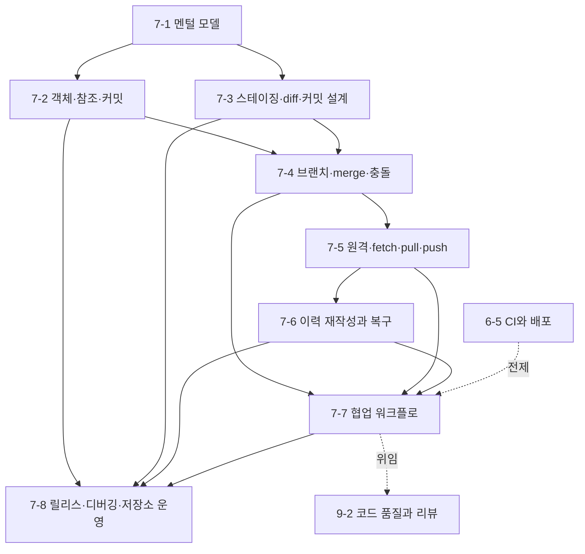

# Phase 7 — Git 학습 과정 기획

> ROADMAP.md의 Phase 7(3주, 문서 8개)을 실제 집필 가능한 수준으로 구체화한 기획 문서다.
> 각 문서의 주제 범위, 핵심 논점, 문서 간 의존 관계, 실습 과제 설계, 집필 순서를 정의한다.

---

## 1. 기획 전제

### 독자 상황 분석

독자는 5년차 이상 경력 개발자(백엔드·모바일 출신)로, 이미 실무에서 Git을 써 왔을 가능성이 높다. 하지만 이 Phase는 "Git 명령어 입문"이 아니라, Git을 **분산 객체 데이터베이스와 커밋 그래프 조작 도구**로 다시 세우는 과정이다. Phase 6에서 CI·배포 파이프라인을 다뤘으므로, Phase 7은 그 파이프라인이 입력으로 삼는 변경 이력과 협업 규칙을 정면으로 다룬다.

- **이미 아는 것**: `add`, `commit`, `push`, `pull`, 브랜치, pull request 같은 표면 워크플로. 실무에서 충돌을 해결하거나 rebase를 해 본 경험도 있을 수 있다. SVN, Perforce, Mercurial, Gerrit, GitHub/GitLab을 통한 협업 경험이 있을 가능성도 높다.
- **모르는 것 (이 Phase의 가치)**: Git의 위험해 보이는 명령 대부분은 **커밋 DAG와 참조(ref)를 어떻게 움직이는가**로 설명된다. `reset --hard`, rebase, force push, detached HEAD, reflog, fast-forward는 별개의 주문이 아니라 같은 그래프 모델의 다른 조작이다. 이 Phase의 가치는 "무슨 명령을 치는가"보다 **명령 전후의 그래프와 도달 가능성(reachability)을 예측하는 능력**이다.
- **흔한 함정**: ① 작업 트리·인덱스·HEAD를 구분하지 못해 `add`와 `commit`의 의미를 흐리게 이해한다. ② 브랜치를 코드 복사본처럼 이해해 merge/rebase 결과를 예측하지 못한다. ③ 원격 브랜치를 중앙의 진실로 오해해 fetch/pull/push가 하는 참조 갱신을 보지 못한다. ④ 이력 재작성과 복구를 "위험한 명령 목록"으로만 외워 공개 이력과 개인 이력의 경계를 판단하지 못한다.

### Phase 7 전체 목표 (ROADMAP 기준)

Git을 명령어 모음이 아니라 객체 데이터베이스·참조(ref)·인덱스(index)·커밋 DAG로 이해하고, 개인 작업부터 팀 협업·릴리스·이력 복구까지 근거 있는 운영 결정을 내릴 수 있다.
최종 산출물: 작은 기능 개발 저장소에서 충돌·잘못된 rebase·잘못된 force push 시나리오를 재현하고, 커밋 그래프·reflog·원격 브랜치 상태를 근거로 분석한 이력 복구 리포트와 팀 Git 운영 플레이북.

### 3주 배분

문서 8개는 세 블록으로 묶인다: **로컬 저장소의 모델**(7-1~7-3, Git이 데이터를 어떻게 저장하고 커밋을 어떻게 만든다), **그래프 조작과 복구**(7-4~7-6, 브랜치·원격·이력 재작성), **팀 운영**(7-7~7-8, 협업 워크플로·릴리스·저장소 운영).

| 주차 | 문서 | 실습 |
|------|------|------|
| 1주차 | 7-1 멘털 모델, 7-2 객체·참조·커밋, 7-3 스테이징·diff·커밋 설계 | 로컬 저장소 생성, `.git` 내부 관찰, `cat-file`/`ls-files`로 객체·인덱스 확인, 의미 있는 커밋 분할 |
| 2주차 | 7-4 브랜치·merge·충돌, 7-5 원격·fetch·pull·push, 7-6 이력 재작성과 복구 | bare remote + clone 2개로 협업 시나리오 재현, 충돌 해결, rebase/force push 사고와 reflog 복구 |
| 3주차 | 7-7 협업 워크플로, 7-8 릴리스·디버깅·저장소 운영 | 팀 브랜치 전략·PR 규칙·릴리스 태그·hotfix·bisect 절차를 포함한 Git 운영 플레이북 작성 |

---

## 2. 문서별 상세 기획

각 문서는 CLAUDE.md의 공통 구조를 따른다. Git 문서는 명령어를 반드시 **그래프·참조·인덱스 상태 변화**와 함께 설명한다. 모든 위험 명령은 작은 임시 저장소에서 재현 가능한 예제로만 다루며, 복구 경로를 함께 제시한다.

### 7-1. Git 멘털 모델 — `docs/phase-7/01-git-mental-model.md`

- **핵심 질문**: Git은 파일 변경 내역을 저장하는 도구인가, 스냅샷 그래프를 저장하는 도구인가 — 작업 트리·인덱스·로컬 저장소는 각각 무엇을 책임지는가?
- **다룰 범위**:
  - Git이 해결한 문제: 중앙형 버전 관리와 다른 분산 저장소 모델 — 네트워크가 없어도 커밋·브랜치·로그 조회가 가능한 이유
  - 세 영역 모델: 작업 트리(현재 파일), 인덱스(다음 커밋 후보 스냅샷), 로컬 저장소(커밋 객체 그래프). `status` 출력이 이 세 영역의 차이를 어떻게 보여 주는지
  - 스냅샷 모델: Git은 변경분 자체가 아니라 루트 트리 스냅샷을 커밋으로 기록한다. 실제 저장은 객체 공유와 압축으로 최적화되지만, 사용자 모델은 "커밋 = 프로젝트 스냅샷"이다
  - `.git` 디렉터리의 최소 구조: `objects`, `refs`, `HEAD`, `index`, `config`의 역할. `git init` 직후와 첫 커밋 후 차이를 직접 관찰한다
  - 상태 전이의 기본 흐름: modify → stage → commit. `restore`, `restore --staged`, `checkout` 계열 명령이 어느 영역을 바꾸는지 큰 그림만 세운다
- **다루지 않을 범위**: 객체 포맷 상세(7-2), 커밋 메시지와 patch 분할(7-3), 브랜치·merge(7-4), 원격 저장소(7-5)
- **경력자 연결**: Git은 "파일 복사본 여러 개"가 아니라 로컬에 완전한 데이터베이스를 가진다. 백엔드 관점에서는 content-addressable object store + append-only commit log에 가깝다. DB 트랜잭션에서 staging area를 commit 후보로 준비하는 감각과 연결할 수 있다.
- **의존**: Phase 6의 CI·배포가 "어떤 커밋을 입력으로 삼는가"의 토대가 된다. Phase 7 전체의 공용 어휘(작업 트리, 인덱스, 객체, 참조, DAG)를 이 문서가 세운다.

### 7-2. 객체·참조·커밋 — `docs/phase-7/02-objects-refs-and-commits.md`

- **핵심 질문**: 커밋 해시는 무엇의 주소이며, 브랜치와 HEAD는 실제로 무엇을 가리키는가?
- **다룰 범위**:
  - Git 객체 4종: blob(파일 내용), tree(디렉터리 구조), commit(트리 + 부모 + 메타데이터), tag(이름 붙은 객체). `git cat-file -p`로 각 객체를 직접 확인한다
  - content-addressing: 객체 내용에서 해시가 계산되고, 해시가 주소가 되는 구조. 내용이 바뀌면 주소도 바뀌므로 커밋 이력의 무결성 체인이 만들어진다
  - SHA-1과 SHA-256 전환: 전통적으로 SHA-1을 사용해 왔고 SHA-256 저장소 지원이 존재하지만, 호환성·상호운용성 경계를 문서 집필 시점의 공식 문서 기준으로 확인해야 한다. 보안 해시와 Git 객체 식별자를 혼동하지 않는다
  - 참조(ref)의 실체: 브랜치는 커밋 해시를 담은 이동 가능한 이름이다. `refs/heads/*`, `refs/tags/*`, `HEAD`가 어떤 파일 또는 symbolic ref로 표현되는지 확인한다
  - detached HEAD: HEAD가 브랜치 이름이 아니라 커밋을 직접 가리키는 상태다. 위험한 이유는 커밋 생성이 불가능해서가 아니라, 새 커밋을 가리키는 이름이 없어 도달 불가능해질 수 있기 때문이다
  - 커밋 DAG 읽기: 부모 포인터, merge commit의 부모 2개 이상, 도달 가능성, `log --graph --oneline --decorate` 해석
- **다루지 않을 범위**: packfile·GC 내부(7-8), merge 알고리즘(7-4), rebase가 객체를 새로 만드는 방식(7-6)
- **경력자 연결**: Docker 이미지 레이어나 IPFS/Merkle DAG처럼 내용 기반 주소화가 무결성과 공유를 동시에 만든다. "이름"과 "주소"를 분리해서 보는 습관이 Git 브랜치 이해의 핵심이다.
- **의존**: 7-1의 세 영역 모델. 7-4~7-8에서 모든 그래프 조작을 설명하는 기반.

### 7-3. 스테이징·diff·커밋 설계 — `docs/phase-7/03-staging-diff-and-commit-design.md`

- **핵심 질문**: `git add`는 파일을 저장하는 명령인가, 다음 커밋의 트리를 구성하는 명령인가 — 좋은 커밋은 어떤 단위로 설계해야 하는가?
- **다룰 범위**:
  - 인덱스의 역할: 작업 트리 전체를 그대로 커밋하는 것이 아니라, 선택한 변경으로 다음 커밋 후보 스냅샷을 만든다. `git ls-files -s`로 인덱스 엔트리를 확인한다
  - diff의 세 관점: working tree vs index(`git diff`), index vs HEAD(`git diff --cached`), working tree vs HEAD(`git diff HEAD`). `status`가 이 차이를 요약하는 방식
  - patch 단위 staging: `git add -p`로 한 파일 안의 서로 다른 의도를 분리한다. 의미 단위 커밋이 나중의 revert, bisect, review 비용을 줄이는 이유
  - 커밋 메시지 설계: 제목은 변경의 의도를, 본문은 왜와 맥락을 설명한다. Conventional Commits를 문법 암기가 아니라 release note·검색·자동화와 연결되는 메타데이터로 소개한다
  - `.gitignore`와 추적 상태: ignore는 이미 추적 중인 파일을 자동으로 제거하지 않는다. 추적(tracked)·미추적(untracked)·ignored 상태를 구분한다
  - 부분 커밋의 경계 조건: 빌드가 깨지는 중간 커밋, 테스트와 함께 나뉘지 않은 커밋, 대규모 리네임과 내용 변경을 한 커밋에 섞는 경우의 비용
- **다루지 않을 범위**: 브랜치 전략(7-7), 충돌 해결(7-4), release note 자동화 상세(7-8에서 일부)
- **경력자 연결**: 커밋은 DB 마이그레이션이나 이벤트 소싱의 이벤트처럼 "나중에 읽고 되돌릴 수 있는 단위"다. 리뷰어와 미래의 자신이 소비할 변경 단위를 설계하는 행위로 본다.
- **의존**: 7-1의 인덱스 모델, 7-2의 커밋 객체. 7-6의 revert/cherry-pick/bisect 품질을 좌우한다.

### 7-4. 브랜치·merge·충돌 — `docs/phase-7/04-branching-merging-and-conflicts.md`

- **핵심 질문**: 브랜치는 코드 복사본인가, 커밋을 가리키는 포인터인가 — merge는 두 브랜치의 파일을 어떻게 합치는가?
- **다룰 범위**:
  - 브랜치의 실체: 브랜치는 커밋을 가리키는 ref이고, 커밋할 때 현재 브랜치 ref가 앞으로 이동한다. "브랜치 생성"이 왜 가벼운지 객체 모델로 설명한다
  - fast-forward: 현재 브랜치가 대상 커밋의 조상일 때 ref만 앞으로 이동하는 merge. 커밋 객체를 새로 만들지 않는다
  - 3-way merge: 공통 조상(merge base), ours, theirs 세 스냅샷을 비교해 변경을 합친다. 같은 줄을 서로 다르게 바꿨을 때 충돌 마커가 생기는 조건을 재현한다
  - merge commit: 두 부모를 가진 커밋으로 통합 사실을 이력에 남긴다. 선형 이력과 merge commit 이력의 읽기 비용·추적 비용을 비교한다
  - 충돌 해결 절차: 충돌 파일을 해석하고, 의도한 최종 스냅샷을 만든 뒤, 인덱스에 해결 상태를 올린다. `--ours`/`--theirs`의 의미와 rebase 중 의미가 헷갈리는 지점을 구분한다
  - `rerere`: 반복 충돌 해결 재사용의 원리와 경계. 장기 브랜치나 반복 rebase에는 이득이 있지만, 잘못된 해결도 재사용될 수 있다
- **다루지 않을 범위**: 원격 브랜치와 push 충돌(7-5), rebase 상세(7-6), 워크플로 선택(7-7)
- **경력자 연결**: merge는 두 디렉터리 복사본을 덮어쓰는 행위가 아니라 공통 조상 기준의 3-way reconciliation이다. 분산 시스템의 divergent state를 공통 기준으로 합치는 문제와 같은 구조다.
- **의존**: 7-2의 DAG와 부모 포인터, 7-3의 인덱스 해결 상태.

### 7-5. 원격·fetch·pull·push — `docs/phase-7/05-remotes-fetch-pull-push.md`

- **핵심 질문**: 원격 저장소는 중앙 서버인가, 다른 저장소인가 — `fetch`, `pull`, `push`는 어떤 참조를 어떻게 갱신하는가?
- **다룰 범위**:
  - remote의 정체: 원격은 네트워크 너머의 다른 Git 저장소다. 로컬 저장소는 원격의 브랜치 상태를 remote-tracking branch(`refs/remotes/origin/*`)로 기록한다
  - `fetch`: 원격 객체를 내려받고 remote-tracking ref를 갱신한다. 작업 트리와 현재 브랜치는 바꾸지 않는다
  - upstream과 tracking: 로컬 브랜치가 기본으로 비교·pull·push할 원격 브랜치를 갖는 구조. `branch -vv`와 `status`의 ahead/behind 해석
  - `pull`: fetch + merge 또는 fetch + rebase다. 팀 규칙 없이 기본값에 맡기면 이력 모양이 섞이는 이유
  - `push`: 로컬 ref를 원격 ref로 갱신하라는 요청이다. 원격이 fast-forward가 아니면 기본적으로 거부한다. 이 거부는 데이터 손실 방지 장치다
  - refspec: 어떤 로컬 ref를 어떤 원격 ref로 매핑할지의 규칙. 일상 사용에서 깊게 쓰지는 않지만, push/fetch의 본질을 설명하는 핵심 모델로 다룬다
  - force push와 `--force-with-lease`: 원격 ref를 되감는 행위의 위험, lease가 "내가 마지막으로 본 원격 상태"를 전제로 안전장치를 제공하는 방식
- **다루지 않을 범위**: GitHub/GitLab 권한·인증 상세, pull request 리뷰 정책(7-7), partial clone·protocol v2 상세(7-8에서 개요)
- **경력자 연결**: 원격 동기화는 "중앙 진실에 덮어쓰기"가 아니라 복제된 로그의 참조를 갱신하는 프로토콜이다. optimistic concurrency control에서 버전이 바뀌었으면 쓰기를 거부하는 구조와 비슷하다.
- **의존**: 7-2의 ref와 도달 가능성, 7-4의 merge/rebase 통합 방식. 7-6의 공개 이력 재작성 판단으로 이어진다.

### 7-6. 이력 재작성과 복구 — `docs/phase-7/06-rewriting-history-and-recovery.md`

- **핵심 질문**: `reset`, `rebase`, `revert`, `restore`는 모두 "되돌리기"인가 — 각각은 어떤 영역과 그래프를 바꾸며, 언제 복구 가능한가?
- **다룰 범위**:
  - 되돌리기의 네 계층: 작업 트리 복구(`restore`), 인덱스 복구(`restore --staged`), 브랜치 ref 이동(`reset`), 새 되돌림 커밋 생성(`revert`). "되돌린다"는 말이 어느 계층을 뜻하는지 명확히 한다
  - `reset` 3모드: `--soft`, `--mixed`, `--hard`가 HEAD/ref, 인덱스, 작업 트리 중 무엇을 바꾸는지 표로 정리한다. `--hard`의 위험은 작업 트리 변경 손실에 있다
  - `commit --amend`: 마지막 커밋을 수정하는 것이 아니라 새 커밋을 만들고 브랜치 ref를 옮기는 행위다. 기존 커밋은 당장 사라지는 것이 아니라 도달 가능성만 잃을 수 있다
  - rebase: 커밋을 다른 base 위에 새로 재생해 새 커밋 객체를 만든다. merge와 같은 최종 스냅샷을 만들 수 있지만 이력 모양과 충돌 해결 시점이 달라진다
  - interactive rebase: squash, fixup, reorder, edit로 개인 이력을 정리하는 방식. 의미 있는 커밋 설계(7-3)와 연결한다
  - `cherry-pick`: 특정 커밋의 patch를 현재 브랜치 위에 새 커밋으로 적용한다. 원본 커밋과 새 커밋은 내용이 같아도 해시가 다를 수 있다
  - 복구 도구: reflog, `ORIG_HEAD`, `git fsck --lost-found`의 역할. "삭제된 커밋"이 아니라 "이름을 잃은 커밋"이라는 관점에서 복구한다
  - 공개 이력 재작성의 판단 기준: 개인 브랜치에서는 정리 도구, 공유 브랜치에서는 다른 사람의 base를 흔드는 행위다. 예외는 팀 합의와 강한 커뮤니케이션이 있을 때뿐이다
- **다루지 않을 범위**: 팀 브랜치 정책 전체(7-7), signed commit·release tag(7-8), 플랫폼별 UI 복구 기능
- **경력자 연결**: Git의 이력 재작성은 append-only 로그를 물리적으로 수정한다기보다, 새 로그를 만들고 이름을 갈아끼우는 행위에 가깝다. 이벤트 소싱에서 이미 발행한 이벤트를 바꾸면 소비자가 깨지는 것과 공개 이력 재작성 문제가 같은 계열이다.
- **의존**: 7-2의 객체와 ref, 7-3의 커밋 단위, 7-5의 원격 ref와 force push.

### 7-7. 협업 워크플로 — `docs/phase-7/07-collaboration-workflows.md`

- **핵심 질문**: trunk-based development, GitHub Flow, Git Flow는 무엇이 다른가 — 브랜치 수명과 통합 주기가 팀의 리스크를 어떻게 바꾸는가?
- **다룰 범위**:
  - 워크플로 선택의 축: 브랜치 수명, 배포 빈도, release branch 필요 여부, 리뷰와 CI gate의 위치. 이름 있는 워크플로보다 팀의 제약을 먼저 본다
  - trunk-based development: 짧은-lived 브랜치와 자주 통합하는 모델. feature flag와 강한 CI가 전제다. merge hell을 줄이지만 trunk 안정성에 높은 규율이 필요하다
  - GitHub Flow: main + 짧은 feature branch + PR + 배포 가능 main. 웹 서비스·지속 배포와 잘 맞지만, 장기 버전 유지나 복잡한 릴리스 승인에는 보강이 필요하다
  - Git Flow: develop/release/hotfix/main으로 릴리스 절차를 분리한다. 배포 주기가 느리고 버전 유지가 필요한 제품에는 설명력이 있지만, 장기 브랜치 비용과 통합 지연이 크다
  - PR과 code review: 코드 리뷰는 승인 버튼이 아니라 변경 의도·테스트 증거·운영 영향 검증이다. 커밋 단위(7-3)와 PR 단위의 차이를 구분한다
  - merge 전략: merge commit, squash merge, rebase merge의 이력 모양과 추적성 비교. 어떤 팀 규칙에서 무엇을 기본값으로 둘지 판단표로 제시한다
  - 자동화 정책: protected branch, required status checks, CODEOWNERS, commit signing requirement, branch naming, PR template. 정책은 사람의 기억이 아니라 저장소 규칙으로 옮긴다
- **다루지 않을 범위**: 코드 리뷰 문장 작성법과 아키텍처 리뷰 상세(Phase 9), CI 설정 문법(6-5), release artifact 배포(7-8에서 Git 관점만)
- **경력자 연결**: 브랜치 전략은 조직의 배포 모델을 반영한다. 백엔드의 release train, 모바일 앱스토어 승인, SaaS 지속 배포처럼 운영 제약이 다르면 Git 워크플로도 달라진다.
- **의존**: 7-4의 merge 모델, 7-5의 remote ref, 7-6의 공개 이력 재작성 기준, 6-5의 CI gate.

### 7-8. 릴리스·디버깅·저장소 운영 — `docs/phase-7/08-release-debugging-and-repo-operations.md`

- **핵심 질문**: Git 이력은 개발 중 변경 관리에서 끝나는가 — 릴리스 식별, 회귀 추적, 대형 저장소 운영에는 어떤 Git 기능이 필요한가?
- **다룰 범위**:
  - tag와 release: lightweight tag와 annotated tag의 차이, 릴리스 식별자로서 tag가 브랜치와 다른 점. 서명된 tag/commit이 필요한 보안·감사 맥락
  - release branch와 hotfix: 이미 배포된 버전 계열을 유지하면서 main 개발을 계속하는 모델. cherry-pick과 merge-back의 위험을 그래프 관점으로 설명한다
  - 회귀 추적: `git bisect`의 이진 탐색 모델, 좋은 커밋 단위(7-3)가 bisect 효율을 어떻게 좌우하는지, 테스트 명령과 결합해 자동화하는 법
  - 이력 조사: `git blame`을 책임 추궁 도구가 아니라 맥락 탐색 도구로 사용하는 법, `log --graph --decorate --all`, pathspec, pickaxe(`-S`, `-G`)로 변경의 도입 지점을 찾는 법
  - worktree: 하나의 저장소 객체 데이터베이스를 공유하면서 여러 작업 트리를 여는 방식. hotfix와 장기 리뷰에 유용하지만, 같은 브랜치를 동시에 checkout할 수 없는 제약을 이해한다
  - submodule vs subtree vs monorepo: 외부 저장소를 포함하는 세 선택의 소유권·업데이트·CI 비용 비교. "항상 submodule 금지"가 아니라 깨지는 지점을 정확히 본다
  - Git LFS: 대형 바이너리를 Git 객체에 직접 넣지 않는 이유, 포인터 파일과 별도 객체 저장소 모델, 프론트엔드 자산·디자인 파일에서의 적용 경계
  - packfile·GC 개요: loose object가 packfile로 압축되고 unreachable object가 시간이 지나 정리되는 구조. reflog와 GC 만료가 복구 가능 기간에 미치는 영향
  - hooks: pre-commit/pre-push 훅의 위치와 한계. 로컬 훅은 보조 장치이고, 필수 정책은 서버 측 보호 규칙과 CI에서 강제해야 한다
- **다루지 않을 범위**: Git 서버 구축, 대규모 monorepo 빌드 시스템, 패키지 배포 자동화 상세, GitHub Releases UI 세부 사용법
- **경력자 연결**: Git 이력은 운영 관측 데이터다. 장애 분석에서 로그와 trace를 보듯, 회귀 분석에서는 커밋 그래프와 변경 지점을 읽는다. 좋은 이력은 코드 품질의 부산물이 아니라 운영 가능한 시스템의 일부다.
- **의존**: 7-2의 객체·도달 가능성, 7-3의 커밋 단위, 7-5의 remote, 7-6의 cherry-pick/reflog, 7-7의 팀 정책.

---

## 3. 문서 간 의존 관계

- 집필 순서는 번호 순서(7-1 → 7-8)를 그대로 따른다. 7-1~7-2가 **저장 구조와 그래프 어휘**를 세우고, 7-3이 커밋 생성 품질을 다진다. 7-4~7-6은 그 그래프를 합치고 동기화하고 다시 쓰는 방법이며, 7-7~7-8은 개인 조작을 팀 운영·릴리스·디버깅 절차로 끌어올린다.
- Phase 6과의 관계: 6-5의 CI gate와 배포 파이프라인은 "어떤 브랜치와 커밋을 신뢰할 것인가"라는 Phase 7의 정책 위에서 동작한다. 7-7에서 protected branch와 required checks를 다룰 때 6-5로 상대 링크한다.
- 뒤 Phase로 위임하는 주제: 코드 리뷰의 문장·설계 관점·리팩터링 전략은 9-2에서 본격적으로 다룬다. Phase 7은 Git 이력과 PR 정책이 리뷰를 가능하게 만드는 구조까지만 다룬다.

## 4. 실습 과제 설계

ROADMAP의 "충돌 해결·이력 복구 리포트 + Git 운영 플레이북"을 문서 진도와 연동한다. 이 Phase의 실습은 **시나리오 재현 + 그래프 분석 + 팀 규칙 설계**다. 단순히 명령을 성공시키는 것으로 끝내지 않고, 각 명령 전후에 어떤 ref와 커밋이 바뀌었는지 기록한다.

### 과제 A — 로컬 저장소 내부 관찰 (1주차, 7-1~7-3 병행)

- 빈 저장소를 만들고 파일 추가·수정·삭제·리네임을 수행한다. 각 단계에서 `git status`, `git diff`, `git diff --cached`, `git ls-files -s`, `git cat-file -p`로 작업 트리·인덱스·객체 상태를 관찰한다.
- 같은 파일의 두 변경을 `git add -p`로 다른 커밋에 나눠 담는다. 각 커밋의 의도와 메시지를 기록하고, 나중에 `revert`나 `bisect`가 쉬운 단위인지 평가한다.
- 커밋 그래프를 `git log --graph --oneline --decorate --all`로 출력하고, 각 ref가 어떤 커밋을 가리키는지 도식화한다.

### 과제 B — 충돌·원격·복구 시나리오 재현 (2주차, 7-4~7-6 병행)

- `git init --bare`로 원격 역할 저장소를 만들고 clone 2개를 준비한다. 두 clone에서 같은 파일을 다르게 바꿔 push 충돌, merge 충돌, rebase 충돌을 각각 재현한다.
- fast-forward merge, merge commit, rebase를 같은 시작 그래프에서 각각 수행해 최종 스냅샷과 이력 모양의 차이를 비교한다.
- 잘못된 `reset --hard`, amend 후 force push, rebase 중 잘못된 충돌 해결 시나리오를 만든다. reflog, `ORIG_HEAD`, remote-tracking branch를 이용해 어디까지 복구 가능한지 기록한다.
- force push는 반드시 실습용 bare remote에서만 수행하고, `--force`와 `--force-with-lease`의 차이를 같은 원격 상태 변화로 비교한다.

### 과제 C — Git 운영 플레이북 작성 (3주차, 7-7~7-8 병행)

- 가상의 팀 상황을 하나 정한다: 지속 배포 웹 서비스, 승인 절차가 있는 모바일 앱, 장기 버전 유지가 필요한 라이브러리 중 하나를 선택한다.
- 선택한 상황에 맞는 브랜치 전략(trunk-based, GitHub Flow, Git Flow 변형)을 고르고, 선택하지 않은 대안이 왜 덜 맞는지 트레이드오프 표로 설명한다.
- PR 정책을 정의한다: 커밋/PR 크기, merge 전략, required checks, CODEOWNERS, release tag, hotfix, rollback/revert 기준.
- 회귀 대응 절차를 쓴다: `bisect`로 원인 커밋을 찾고, revert/cherry-pick/hotfix branch 중 무엇을 선택할지 결정하는 플로우를 포함한다.

### 산출물 — 이력 복구 리포트 + Git 운영 플레이북

- **커밋 그래프 분석**: 각 실습 시나리오의 시작 그래프, 명령, 결과 그래프를 함께 기록한다. 그래프는 Mermaid, ASCII, `git log --graph` 캡처 중 하나를 사용한다.
- **복구 리포트**: 사고 유형별로 "손상된 것", "남아 있는 증거(reflog, remote ref, tag)", "복구 명령", "복구 후 검증"을 표로 정리한다.
- **운영 플레이북**: 팀의 기본 브랜치 전략, PR 규칙, merge 전략, force push 금지/예외, release tag 규칙, hotfix 절차, 회귀 추적 절차를 문서화한다.
- **판단 기록**: 각 선택마다 "무엇을 얻고 무엇을 포기하는가"를 남긴다. 예: squash merge는 main 이력을 단순하게 만들지만 개별 커밋 추적성을 잃는다.

### 완성 기준 (Definition of Done)

- [ ] 작업 트리·인덱스·HEAD·브랜치 ref의 차이를 실제 명령 출력으로 설명한 관찰 노트
- [ ] `cat-file`, `ls-files`, `log --graph`를 사용한 객체·인덱스·DAG 분석
- [ ] 의미 단위 커밋 5개 이상과 각 커밋 메시지의 의도 설명
- [ ] merge 충돌과 rebase 충돌을 각각 재현하고 해결한 기록
- [ ] bare remote + clone 2개로 fetch/pull/push, push 거부, force-with-lease 시나리오 재현
- [ ] 잘못된 reset/rebase/force push 중 2개 이상을 reflog 또는 remote ref로 복구한 리포트
- [ ] 팀 상황에 맞는 Git 운영 플레이북 완성(브랜치 전략·PR 정책·릴리스·hotfix·회귀 추적 포함)

## 5. 공통 집필 기준 (Phase 7 특화)

CLAUDE.md의 전 지침에 더해, Phase 7에서 특히 지킬 것:

- **1차 자료와 기준 버전**: Git 공식 문서(`git-scm.com/docs`, `git help <command>`, Pro Git 2nd Edition의 공식 배포판)를 우선한다. 정확한 옵션명, 기본 전략, SHA-256 지원 상태, Git LFS·partial clone 같은 기능의 현재 제약은 문서 집필 시점에 공식 문서로 확인한다.
- **명령어보다 상태 변화**: 모든 명령은 "무슨 명령을 입력한다"가 아니라 "작업 트리, 인덱스, ref, 객체 그래프 중 무엇이 바뀐다"로 설명한다. 명령 표만 나열한 섹션은 미완성으로 본다.
- **그래프를 매번 그린다**: 브랜치, merge, rebase, reset, revert, cherry-pick, force push는 전후 커밋 그래프를 함께 제시한다. 독자가 명령 실행 전 결과 그래프를 예측할 수 있어야 한다.
- **위험 명령은 복구와 짝을 이룬다**: `reset --hard`, rebase, force push, clean, prune/GC처럼 손실 가능성이 있는 명령은 실습용 저장소에서만 예제를 만들고, reflog·remote ref·tag·backup branch로 복구하는 절차를 함께 둔다.
- **공개 이력과 개인 이력 구분**: 개인 브랜치 정리와 공유 브랜치 재작성은 같은 명령이라도 비용이 다르다. "가능하다"와 "팀에서 해도 된다"를 분리해서 서술한다.
- **플랫폼 기능과 Git 모델 구분**: pull request, protected branch, CODEOWNERS, required checks는 Git 자체가 아니라 호스팅 플랫폼의 정책 계층이다. Git의 ref/DAG 모델 위에 어떤 정책이 얹히는지 구분한다.
- **트레이드오프의 정직한 서술**: merge commit, squash merge, rebase merge, trunk-based, Git Flow, submodule, subtree, LFS는 정답/오답이 아니라 비용 구조가 다른 선택지다. 각 선택이 무너지는 조건을 반드시 함께 적는다.
- **실행 가능한 예제**: 모든 실습 예제는 임시 디렉터리 안에서 복사해 실행 가능한 최소 명령 묶음으로 작성한다. 중요한 출력(`status`, `log --graph`, `reflog`)은 예제 아래에 기대 형태를 주석 또는 코드 블록으로 제시한다.
- **확인 문제 방향**: "이 그래프에서 `git merge`/`git rebase` 후 어떤 커밋이 생기는가", "이 force push 사고에서 어떤 ref가 복구 단서인가", "이 팀에는 어떤 브랜치 전략이 맞는가"처럼 그래프 예측·복구·운영 판단형 문제를 우선한다. 옵션 암기형 문제를 내지 않는다.

## 6. 진행 체크리스트

- [ ] 7-1 `01-git-mental-model.md`
- [ ] 7-2 `02-objects-refs-and-commits.md`
- [ ] 7-3 `03-staging-diff-and-commit-design.md`
- [ ] 7-4 `04-branching-merging-and-conflicts.md`
- [ ] 7-5 `05-remotes-fetch-pull-push.md`
- [ ] 7-6 `06-rewriting-history-and-recovery.md`
- [ ] 7-7 `07-collaboration-workflows.md`
- [ ] 7-8 `08-release-debugging-and-repo-operations.md`
- [ ] `exercises/phase-7/` 과제 안내 문서
- [ ] ROADMAP.md 5절 진행 현황 표 갱신
