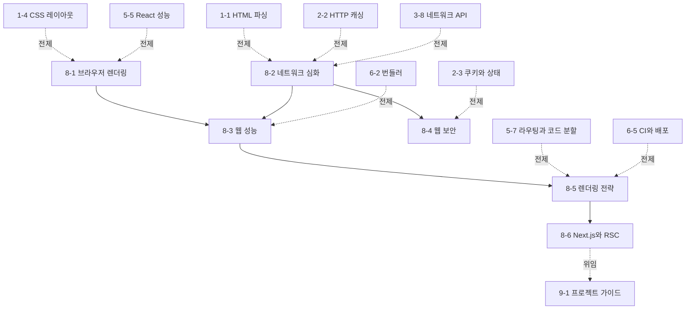

# Phase 8 — 브라우저·네트워크·보안 심화 학습 과정 기획

> ROADMAP.md의 Phase 8(3주, 문서 6개)을 실제 집필 가능한 수준으로 구체화한 기획 문서다.
> 각 문서의 주제 범위, 핵심 논점, 문서 간 의존 관계, 실습 과제 설계, 집필 순서를 정의한다.

---

## 1. 기획 전제

### 독자 상황 분석

독자는 5년차 이상 경력 개발자(백엔드·모바일 출신)로, Phase 1~7에서 HTML/CSS 파싱과 렌더링, HTTP 의미론과 캐싱, JavaScript 런타임, React 렌더링 모델, 빌드·테스트·CI, Git 협업 모델까지 이미 다뤘다. Phase 8은 이 전제를 바탕으로 "브라우저에서 돌아가는 앱"을 **운영 가능한 성능·보안·렌더링 전략의 문제**로 끌어올리는 과정이다.

- **이미 아는 것**: DOM과 CSSOM, HTTP 캐싱, fetch/CORS 개요, React SPA, 코드 분할, CI·배포, Git 협업. Lighthouse 점수, Core Web Vitals, SSR, XSS/CSRF 같은 용어도 실무에서 들어 봤을 가능성이 높다.
- **모르는 것 (이 Phase의 가치)**: 성능·보안·렌더링 전략은 독립 주제가 아니라 서로 얽힌 **브라우저 경계면 문제**다. 레이아웃 계산을 막는 코드는 INP를 악화시키고, 리소스 우선순위는 LCP를 바꾸며, SSR은 TTFB와 하이드레이션 비용을 교환하고, CSP는 XSS 방어와 배포 파이프라인을 동시에 건드린다. 이 Phase의 가치는 각 기능의 사용법보다 **계층별 병목과 공격면을 측정하고, 어떤 비용을 어디로 옮기는 선택인지 설명하는 능력**이다.
- **흔한 함정**: ① Lighthouse 점수를 목표로 삼고 실제 사용자 지표를 보지 않는다. ② `will-change`, `preload`, `memo`, `dynamic import` 같은 "최적화 키워드"를 계측 없이 추가한다. ③ CORS를 보안 기능과 통신 허용 설정 사이에서 혼동한다. ④ XSS/CSRF 방어를 단일 옵션으로 해결하려 한다. ⑤ SSR/SSG/RSC를 "빠르다/느리다"의 이분법으로 이해하고 캐싱·직렬화·하이드레이션 경계를 보지 못한다.

### Phase 8 전체 목표 (ROADMAP 기준)

렌더링 파이프라인·네트워크·보안 모델을 계층 수준에서 이해하고, 성능·보안·렌더링 전략을 측정과 근거에 기반해 결정할 수 있다.
최종 산출물: Phase 6 프로젝트의 Core Web Vitals 계측·개선 리포트와 Next.js App Router 기반 SSR/RSC 미니 프로젝트.

### 3주 배분

문서 6개는 세 블록으로 묶인다: **브라우저 실행 비용**(8-1~8-3, 렌더링 파이프라인·네트워크·성능 계측), **브라우저 보안 경계**(8-4, 공격면과 방어 계층), **서버 렌더링과 프레임워크 경계**(8-5~8-6, CSR/SSR/SSG/ISR/RSC의 비용 구조).

| 주차 | 문서 | 실습 |
|------|------|------|
| 1주차 | 8-1 브라우저 렌더링, 8-2 네트워크 심화 | Performance/Network 패널로 렌더링 비용과 리소스 워터폴 관찰, CORS/preflight·리소스 힌트 실험 |
| 2주차 | 8-3 웹 성능, 8-4 웹 보안 | Core Web Vitals 계측, LCP/CLS/INP 개선 실험, XSS/CSRF 방어 계층 점검 |
| 3주차 | 8-5 렌더링 전략, 8-6 Next.js와 RSC | 같은 화면을 CSR/SSR/SSG 관점으로 비교, Next.js App Router + RSC 미니 프로젝트 제작 |

---

## 2. 문서별 상세 기획

각 문서는 CLAUDE.md의 공통 구조를 따른다. Phase 8 문서는 브라우저·네트워크·프레임워크 정책이 빠르게 바뀌므로, 기준 브라우저와 라이브러리 버전은 문서 작성 시점에 공식 문서로 확인해 문서 본문에 명시한다.

### 8-1. 브라우저 렌더링 — `docs/phase-8/01-browser-rendering.md`

- **핵심 질문**: DOM/CSSOM이 바뀐 뒤 브라우저는 어떤 단계를 거쳐 픽셀을 갱신하며, 어떤 코드가 메인 스레드를 막아 사용자 입력 지연으로 이어지는가?
- **다룰 범위**:
  - 렌더링 파이프라인 복기와 정밀화: DOM/CSSOM → 스타일 계산(style recalculation) → 레이아웃(layout) → 페인트(paint) → 합성(compositing). Phase 1의 파싱·레이아웃 지식을 실제 프레임 생성 비용 모델로 연결한다.
  - 메인 스레드와 컴포지터 스레드: JavaScript 실행, 스타일·레이아웃, 페인트가 메인 스레드에서 경쟁하고, transform/opacity 같은 일부 변경은 합성 단계에서 처리될 수 있는 이유. "GPU가 처리한다"는 통념을 레이어와 합성 관점으로 정리한다.
  - 강제 동기 레이아웃(forced synchronous layout): DOM 쓰기 후 레이아웃 값을 읽으면 브라우저가 미뤄 둔 레이아웃을 즉시 계산해야 하는 구조. layout thrashing을 최소 예제로 재현하고 Performance 패널에서 확인한다.
  - 레이어 승격과 `will-change`: 레이어를 늘리면 합성 비용을 줄일 수 있지만, 메모리와 래스터 비용을 새로 만든다. `will-change`를 상시 적용하는 안티패턴과 제거 시점을 다룬다.
  - 관찰 도구: Chrome DevTools Performance, Rendering 탭, Layers, paint flashing, layout shift regions를 사용해 어떤 단계가 병목인지 찾는 절차.
- **다루지 않을 범위**: CSS 레이아웃 알고리즘 자체(Phase 1), React 리렌더 원인 분석(Phase 5), Core Web Vitals 지표 정의(8-3), 애니메이션 API 카탈로그.
- **경력자 연결**: 브라우저 렌더링은 게임 루프나 모바일 UI 스레드와 같은 프레임 예산 문제다. 16.6ms 안에 모든 작업을 끝내야 60fps를 유지한다는 압박은 Android/iOS 메인 스레드 블로킹과 같은 계열이다.
- **의존**: 1-3/1-4/1-6의 CSS 모델, 3-5의 이벤트 루프, 3-7의 DOM 조작 비용, 5-5의 React 성능 계측.

### 8-2. 네트워크 심화 — `docs/phase-8/02-network-deep-dive.md`

- **핵심 질문**: 브라우저는 어떤 리소스를 언제, 어떤 우선순위로 요청하며, CORS·리소스 힌트·CDN 캐시는 그 흐름의 어디에 개입하는가?
- **다룰 범위**:
  - 브라우저 네트워크 스택과 요청 출처: navigation request, subresource request, fetch/XHR 요청의 차이. HTML 파서와 preload scanner가 리소스 발견 시점을 어떻게 바꾸는지 1-1과 연결한다.
  - CORS의 동작 원리: same-origin policy가 보호하는 대상, CORS가 서버의 opt-in으로 교차 출처 읽기 권한을 여는 구조, 단순 요청(simple request)과 preflight의 조건, preflight cache. CORS는 인증·인가가 아니라 브라우저 읽기 권한 모델이라는 점을 명확히 한다.
  - 리소스 로딩 우선순위: CSS, font, image, script, fetch 요청의 기본 우선순위와 브라우저별 차이 가능성. `preload`, `preconnect`, `dns-prefetch`, `fetchpriority`, lazy loading이 우선순위·발견 시점·연결 준비 중 무엇을 바꾸는지 구분한다.
  - CDN·프록시 계층 캐시: 브라우저 캐시(2-2)와 공유 캐시/CDN의 차이, `Cache-Control`, `Vary`, surrogate key, stale-while-revalidate 계열 전략의 실무 의미. 캐시 키가 늘어나는 조건과 개인화 응답 캐싱의 위험.
  - 관찰 도구: DevTools Network 워터폴, priority 컬럼, initiator chain, connection id, server timing header, CDN cache status header를 읽는 절차.
- **다루지 않을 범위**: HTTP 의미론·캐싱·TLS 자체(Phase 2), fetch API 기본(3-8), 보안 공격 방어(XSS/CSRF는 8-4), Core Web Vitals 최적화 우선순위(8-3).
- **경력자 연결**: 브라우저 네트워크는 단순 HTTP 클라이언트가 아니라 HTML 파서·렌더링 엔진·보안 정책과 결합된 스케줄러다. 백엔드에서 큐 우선순위와 캐시 키를 설계하듯, 프론트엔드는 리소스 발견 시점과 요청 우선순위를 설계한다.
- **의존**: 1-1의 파서와 스크립트 로딩, 2-2의 HTTP 캐싱, 2-5의 TLS, 3-8의 fetch와 CORS 개요, 6-5의 CDN 캐시 무효화.

### 8-3. 웹 성능 — `docs/phase-8/03-web-performance.md`

- **핵심 질문**: 성능 개선은 무엇을 기준으로 우선순위를 정해야 하는가 — Core Web Vitals는 어떤 사용자 경험을 어떤 방식으로 근사하며, 각 지표는 어떤 계층의 병목을 가리키는가?
- **다룰 범위**:
  - 성능 지표의 계층: lab data와 field data의 차이, Lighthouse/WebPageTest/DevTools와 CrUX/RUM이 보는 세계의 차이. 재현 가능한 실험과 실제 사용자 분포를 혼동하지 않는다.
  - Core Web Vitals: LCP(로딩), CLS(시각 안정성), INP(입력 응답성)의 계측 원리와 대표 원인. FCP/TTFB/TBT 같은 보조 지표가 각 문제를 추적하는 데 어떻게 쓰이는지.
  - 로딩 워터폴과 크리티컬 패스: HTML 문서, render-blocking CSS, 폰트, LCP 이미지, JavaScript 실행이 첫 화면을 지연시키는 경로. 8-2의 리소스 우선순위를 성능 지표와 연결한다.
  - 개선 전략의 우선순위: 이미지 최적화, 코드 스플리팅, 리소스 힌트, CSS/JS 지연, 폰트 전략, long task 분할, third-party script 격리. 각 전략이 어떤 지표를 개선하고 어떤 부작용을 만들 수 있는지 표로 비교한다.
  - 측정 루프: 기준선 수집 → 병목 가설 → 단일 변경 → 재측정 → 실제 사용자 지표 확인. "점수 올리기"가 아니라 원인-조치-효과 기록을 산출물로 삼는다.
- **다루지 않을 범위**: 렌더링 파이프라인 상세(8-1), CORS/CDN 캐시 상세(8-2), React 리렌더 최적화(5-5), Next.js 이미지/캐시 API 세부(8-6에서 필요한 만큼).
- **경력자 연결**: 성능 최적화는 APM 기반 병목 분석과 같다. 평균 응답 시간 하나로 백엔드 병목을 판단하지 않듯, Lighthouse 점수 하나로 사용자 경험을 판단하지 않는다. percentile, 분포, 재현 조건이 중요하다.
- **의존**: 2-2의 캐싱, 6-2의 번들·청크, 6-5의 배포 캐시, 8-1의 렌더링 비용, 8-2의 워터폴과 우선순위.

### 8-4. 웹 보안 — `docs/phase-8/04-web-security.md`

- **핵심 질문**: 브라우저 보안은 어떤 신뢰 경계를 전제로 하며, XSS·CSRF·토큰 저장 문제는 각각 어느 계층에서 방어해야 하는가?
- **다룰 범위**:
  - 브라우저 보안 모델의 토대: origin, site, browsing context, secure context의 차이. same-origin policy가 막는 것과 막지 않는 것, 쿠키의 site 기반 정책과 origin 기반 API 권한이 엇갈리는 지점.
  - XSS 공격 벡터: HTML 삽입, 속성/URL 컨텍스트, DOM XSS, third-party script. 이스케이프와 sanitization의 차이, React의 기본 escape가 막는 범위와 `dangerouslySetInnerHTML`의 경계.
  - 방어 계층: 출력 인코딩, 안전한 템플릿/프레임워크 기본값, CSP(Content Security Policy), nonce/hash 기반 스크립트 허용, Trusted Types. CSP를 "헤더 하나로 해결"이 아니라 피해 면적을 줄이는 방어선으로 설명한다.
  - CSRF와 쿠키: 브라우저가 자동으로 쿠키를 붙이는 동작이 공격의 전제다. SameSite, CSRF token, double submit, custom header + CORS preflight의 관계를 2-3 쿠키 모델 위에서 정리한다.
  - 토큰 저장 위치의 트레이드오프: localStorage, sessionStorage, memory, httpOnly cookie의 XSS/CSRF/UX/운영 비용 비교. JWT vs 세션은 저장 위치 문제가 아니라 폐기·회전·서버 상태 비용의 문제라는 점을 분리한다.
  - 관찰·검증: 보안 헤더 점검, DevTools Application 패널의 쿠키 속성 확인, 간단한 취약 예제로 XSS/CSRF가 언제 성립하는지 재현한다.
- **다루지 않을 범위**: 암호학 구현, OAuth/OIDC 전체 프로토콜, 서버 인가 모델, 공급망 보안, Git 서명(Phase 7), HTTPS/TLS 상세(2-5).
- **경력자 연결**: 브라우저 보안은 서버 보안보다 클라이언트가 적대적 실행 환경이라는 사실을 더 강하게 전제한다. 백엔드의 "입력 검증"만으로는 부족하고, 브라우저가 자동으로 붙이는 권한(쿠키, ambient authority)을 제어해야 한다.
- **의존**: 2-3의 쿠키와 상태, 2-5의 HTTPS, 3-8의 fetch/CORS, 8-2의 CORS 심화, 5-1의 React escape 기본값.

### 8-5. 렌더링 전략 — `docs/phase-8/05-rendering-strategies.md`

- **핵심 질문**: CSR/SSR/SSG/ISR은 각각 어떤 작업을 어느 시점과 어느 컴퓨팅 자원으로 옮기며, 그 선택은 TTFB·LCP·인터랙션·캐시 전략을 어떻게 바꾸는가?
- **다룰 범위**:
  - 렌더링 전략을 나누는 축: HTML 생성 시점(빌드/요청/클라이언트), 데이터 신선도, 사용자별 개인화, 캐시 가능성, 하이드레이션 필요성. 이름보다 축을 먼저 세운다.
  - CSR: 서버는 빈 shell과 JS를 보내고 브라우저가 렌더링한다. 배포와 캐싱은 단순하지만 초기 로딩·SEO·저사양 기기 비용이 커지는 경계.
  - SSR: 요청 시 서버에서 HTML을 생성해 보내고 클라이언트가 하이드레이션한다. LCP와 SEO에 유리할 수 있지만 TTFB·서버 비용·하이드레이션 불일치와 상호작용 지연을 만든다.
  - SSG/ISR: 빌드 시점 또는 재검증 시점에 HTML을 만든다. 캐시 효율이 높지만 개인화·실시간성·빌드 시간·stale content 문제가 경계가 된다.
  - 하이드레이션의 실체: 서버 HTML을 버리지 않고 이벤트 핸들러와 클라이언트 상태를 연결하는 과정. 전체 하이드레이션, progressive/selective hydration, islands/partial hydration 계열 접근을 비용 구조 중심으로 비교한다.
  - 스트리밍 SSR: HTML을 한 번에 완성하지 않고 준비된 부분부터 흘려보내는 모델. Suspense boundary가 네트워크와 렌더링 경계가 되는 이유와 경계 조건.
- **다루지 않을 범위**: Next.js App Router API 세부(8-6), React Server Components의 직렬화 모델(8-6), 서버 인프라 배포 상세, SEO 일반론.
- **경력자 연결**: 렌더링 전략은 캐시와 컴퓨팅 위치 선택 문제다. 백엔드에서 "요청마다 계산할 것인가, 미리 계산해 캐시할 것인가"를 판단하듯, 프론트엔드는 HTML과 인터랙션 준비 비용을 서버·빌드·클라이언트 중 어디에 배치할지 결정한다.
- **의존**: 2-2의 캐싱, 5-7의 라우팅·코드 분할, 6-2의 번들, 6-5의 배포/CDN, 8-3의 성능 지표.

### 8-6. Next.js와 RSC — `docs/phase-8/06-nextjs-and-rsc.md`

- **핵심 질문**: Next.js App Router와 React Server Components는 "서버에서 React를 실행한다"는 말 이상으로 무엇을 바꾸며, 서버/클라이언트 컴포넌트 경계는 어떤 기준으로 나누어야 하는가?
- **다룰 범위**:
  - Next.js App Router의 모델: file-system routing, layout/page/loading/error 경계, nested route segment가 렌더링·데이터·스트리밍 경계가 되는 구조. Pages Router와의 역사적 차이는 필요한 만큼만 다룬다.
  - React Server Components 실행 모델: 서버 컴포넌트는 서버에서 실행되어 클라이언트로 직렬화 가능한 UI payload를 보낸다. 클라이언트 컴포넌트는 상호작용과 브라우저 API를 담당한다. "서버 컴포넌트는 HTML 문자열"이라는 오해를 바로잡는다.
  - 직렬화 경계: 서버에서 클라이언트로 넘길 수 있는 값, 함수·클래스 인스턴스·브라우저 객체가 경계를 넘지 못하는 이유, `use client`가 번들 경계와 실행 환경을 어떻게 바꾸는지.
  - 데이터 페칭과 캐싱 계층: request memoization, route segment cache, fetch cache, revalidation, dynamic/static rendering 판정. 정확한 API명과 기본값은 집필 시점 공식 문서로 확인하고, 개념은 "어느 계층 캐시인가"로 설명한다.
  - 서버 액션과 뮤테이션: 클라이언트 이벤트에서 서버 함수를 호출하는 모델, progressive enhancement와 보안 경계, 검증·인가를 서버에서 다시 수행해야 하는 이유.
  - 경계 분리 기준: 상태·이벤트·브라우저 API가 필요하면 클라이언트, 데이터 접근·비밀 값·무거운 의존성·캐시 가능한 렌더링은 서버. 잘못 나눈 경계가 번들 크기·직렬화 비용·상호작용 지연으로 드러나는 사례.
- **다루지 않을 범위**: Next.js 설정 옵션 카탈로그, 배포 플랫폼별 세부 기능, 전체 인증 시스템 구현, RSC 내부 wire format의 구현 세부 의존.
- **경력자 연결**: RSC는 백엔드 템플릿으로 회귀한 것이 아니라, React 트리를 서버와 클라이언트로 분할하는 컴파일·런타임 경계다. 마이크로서비스 경계를 잘못 나누면 직렬화와 네트워크 비용이 커지듯, 서버/클라이언트 컴포넌트 경계도 소유 데이터와 상호작용 위치로 나누어야 한다.
- **의존**: 5-1/5-2의 React 요소·렌더 모델, 5-7의 라우팅, 5-8의 서버 상태, 6-2의 번들 경계, 8-5의 SSR/하이드레이션 전략.

---

## 3. 문서 간 의존 관계

- 집필 순서는 번호 순서(8-1 → 8-6)를 그대로 따른다. 8-1~8-2가 브라우저의 **계산 비용과 요청 비용**을 세우고, 8-3이 이 비용을 사용자 경험 지표로 묶는다. 8-4는 같은 브라우저 경계면을 보안 관점에서 읽고, 8-5~8-6은 성능·보안·캐시 모델 위에서 렌더링 전략과 Next.js/RSC를 판단한다.
- 이전 Phase에서 위임한 주제: 3-8의 CORS 개요는 8-2에서, 5-7의 코드 분할·라우팅은 8-5에서, 5-8의 서버 상태와 데이터 캐시는 8-6에서 이어받는다. 6-5의 CDN 캐시와 배포 모델은 8-2·8-5에서 실제 성능 전략으로 확장한다.
- 뒤 Phase로 위임하는 주제: 프로젝트 기획·ADR·기술 의사결정 문서화는 9-1에서 본격적으로 다룬다. Phase 8은 성능·보안·렌더링 전략의 판단 근거와 측정 리포트 작성 방식까지만 다룬다.

## 4. 실습 과제 설계

ROADMAP의 "성능 개선 리포트 + Next.js 앱"을 문서 진도와 연동한다. 이 Phase의 실습은 **계측 → 개선 → 전략 비교 → 프레임워크 적용**이다. 최종 산출물은 점수 스크린샷이 아니라, 원인-조치-효과와 남은 트레이드오프를 기록한 리포트다.

### 과제 A — 렌더링·네트워크 관찰 노트 (1주차, 8-1~8-2 병행)

- Phase 6 프로젝트 또는 기존 SPA를 대상으로 DevTools Performance 패널에서 long task, style recalculation, layout, paint, composite 이벤트를 관찰한다. DOM 읽기/쓰기 순서를 바꿔 layout thrashing을 재현하고, 변경 전후 trace를 비교한다.
- Network 패널에서 HTML, CSS, JS, font, image, fetch 요청의 initiator와 priority를 기록한다. LCP 후보 리소스가 언제 발견되는지, preload/preconnect/fetchpriority를 적용하면 워터폴이 어떻게 바뀌는지 비교한다.
- CORS 실험용 API를 하나 만들거나 공개 테스트 서버를 사용해 simple request와 preflight request를 비교한다. preflight가 발생한 조건과 cache 결과를 기록한다.
- CDN 또는 정적 호스팅 응답 헤더를 확인해 browser cache와 shared cache 관점에서 `Cache-Control`, `Vary`, cache status header를 해석한다.

### 과제 B — Core Web Vitals 개선 리포트 (2주차, 8-3~8-4 병행)

- Lighthouse, DevTools Performance, WebPageTest 중 하나 이상의 lab 도구로 기준선을 잡고, 가능하면 RUM 또는 `web-vitals` 라이브러리로 field-like 측정 코드를 추가한다.
- LCP, CLS, INP 중 최소 2개 지표를 개선 대상으로 정한다. 각 지표마다 "원인 가설 → 조치 → 재측정 결과 → 부작용"을 표로 정리한다.
- 개선 후보는 이미지 최적화, JS 청크 축소, third-party script 지연, 폰트 로딩 전략, layout shift 원인 제거, long task 분할 중 프로젝트에 맞는 것을 고른다. 계측 없이 모든 기법을 한꺼번에 적용하지 않는다.
- 보안 점검을 병행한다. 쿠키 속성, CSP 적용 가능성, XSS 입력 경로, 토큰 저장 위치를 점검하고, 성능 개선과 충돌할 수 있는 지점(예: third-party script, inline script와 CSP nonce/hash)을 기록한다.

### 과제 C — Next.js App Router + RSC 미니 프로젝트 (3주차, 8-5~8-6 병행)

- 같은 요구사항을 CSR 중심 SPA와 Next.js App Router 미니 프로젝트로 비교한다. 예시 주제는 상품 목록/상세, 문서 검색, 블로그/뉴스 목록처럼 정적·동적 데이터가 섞인 화면이 적합하다.
- 최소 요구사항: App Router route segment, server component, client component, loading/error boundary, server-side data fetching, cache/revalidate 전략, 상호작용이 필요한 클라이언트 컴포넌트 1개 이상.
- 동일 화면에서 CSR/SSR/SSG/ISR 중 어떤 전략을 택했는지 ADR 형식으로 기록한다. TTFB, LCP, JS 번들 크기, 하이드레이션 비용, 데이터 신선도, 개인화 여부를 비교 축으로 둔다.
- 서버/클라이언트 컴포넌트 경계를 의도적으로 한 번 잘못 나눠 보고, 번들 크기·직렬화 오류·브라우저 API 접근 오류·상호작용 지연 중 어떤 문제가 발생하는지 기록한다.

### 산출물 — 성능 개선 리포트 + 렌더링 전략 ADR + Next.js 미니 프로젝트

- **성능 개선 리포트**: 기준선, 병목 증거(trace/waterfall/metric), 적용한 조치, 전후 수치, 남은 리스크를 포함한다. Lighthouse 점수만 붙이지 않고 LCP/CLS/INP 각각의 원인과 근거를 쓴다.
- **보안 점검 표**: XSS 입력 경로, CSP 적용 가능성, 쿠키 속성, CSRF 방어, 토큰 저장 위치를 프로젝트 맥락에서 정리한다.
- **렌더링 전략 ADR**: CSR/SSR/SSG/ISR/RSC 중 어떤 전략을 왜 선택했는지, 선택하지 않은 대안이 어떤 조건에서 더 나아지는지 기록한다.
- **Next.js 미니 프로젝트**: App Router와 RSC 경계를 사용한 동작 가능한 예제와, 서버/클라이언트 경계·캐시 전략 설명을 포함한다.

### 완성 기준 (Definition of Done)

- [ ] DevTools Performance trace로 style/layout/paint/composite 또는 long task 병목을 하나 이상 설명한 관찰 노트
- [ ] Network 워터폴에서 LCP 후보 리소스와 주요 JS/CSS/font/image 요청의 발견 시점·우선순위 분석
- [ ] CORS simple request/preflight 재현과 preflight 발생 조건 설명
- [ ] Core Web Vitals 기준선과 개선 후 수치 비교(LCP/CLS/INP 중 2개 이상)
- [ ] 성능 개선마다 원인-조치-효과-부작용 기록
- [ ] XSS/CSRF/토큰 저장 위치/CSP를 포함한 보안 점검 표
- [ ] CSR/SSR/SSG/ISR/RSC 렌더링 전략 비교 ADR
- [ ] Next.js App Router + RSC 미니 프로젝트 완성(server/client component, loading/error boundary, cache/revalidate 전략 포함)

## 5. 공통 집필 기준 (Phase 8 특화)

CLAUDE.md의 전 지침에 더해, Phase 8에서 특히 지킬 것:

- **1차 자료와 기준 버전**: WHATWG HTML, Fetch Standard, CSSOM View, CSS Containment, CSP/Trusted Types 관련 공식 문서, web.dev/Chrome DevTools 공식 문서, MDN Baseline, React 공식 문서, Next.js 공식 문서를 우선한다. Next.js·React·Core Web Vitals·브라우저 정책은 변화가 크므로 정확한 기본값과 API명은 집필 시점에 공식 문서로 확인한다.
- **측정 없는 최적화 금지**: 성능 문장은 반드시 관찰 방법을 동반한다. "빠르다/느리다" 대신 "Performance trace에서 long task가 줄었다", "Network 워터폴에서 LCP 이미지 발견 시점이 앞당겨졌다", "field data의 p75 INP가 줄었다"처럼 측정 가능한 표현을 쓴다.
- **계층을 분리해 설명**: 렌더링 파이프라인, 네트워크 스케줄링, HTTP 캐시, CDN 캐시, 애플리케이션 캐시, React 렌더링, Next.js route cache를 같은 "캐시/렌더링"이라는 말로 뭉개지 않는다. 어떤 계층의 어떤 상태가 바뀌는지 명확히 한다.
- **브라우저 구현 차이 명시**: 리소스 우선순위, preload scanner, 레이어 승격, DevTools 표시 방식은 브라우저 엔진별 구현 차이가 있을 수 있다. 표준 보장과 Chromium 중심 관찰을 구분해서 서술한다.
- **보안은 방어 계층으로 서술**: XSS, CSRF, 토큰 저장은 단일 정답이 아니라 threat model에 따른 방어 조합이다. "localStorage는 항상 금지", "JWT는 항상 안전" 같은 단정을 피하고, 공격 성공 조건과 방어가 막는 지점을 함께 쓴다.
- **렌더링 전략은 비용 이동으로 설명**: SSR/SSG/RSC를 유행어로 다루지 않는다. 각 전략이 계산을 빌드·서버·엣지·클라이언트 중 어디로 옮기는지, 그 결과 TTFB/LCP/INP/번들 크기/캐시 무효화/운영 복잡도가 어떻게 바뀌는지 비교한다.
- **위임 수령의 명시**: 2-2(HTTP 캐싱), 2-3(쿠키), 3-8(fetch/CORS), 5-5(React 성능), 5-7(라우팅/코드 분할), 5-8(서버 상태), 6-2(번들), 6-5(CDN 배포)에서 이어지는 주제를 문서 도입에서 상대 링크로 연결한다.
- **실행 가능한 예제**: 렌더링·네트워크·보안 예제는 작은 HTML/JS 또는 Next.js 미니 프로젝트로 재현 가능해야 한다. 보안 예제는 취약 코드를 보여 주되 반드시 안전한 수정 예와 방어 계층을 짝지어 제시한다.
- **확인 문제 방향**: "이 trace에서 병목은 어느 단계인가", "이 요청은 왜 preflight가 발생했는가", "이 LCP가 늦은 원인은 리소스 발견인가 전송인가 렌더링인가", "이 서비스에는 SSR/SSG/RSC 중 무엇이 맞는가", "이 토큰 저장 전략의 공격 성공 조건은 무엇인가"처럼 계층 진단·전략 판단형 문제를 우선한다.

## 6. 진행 체크리스트

- [x] 8-1 `01-browser-rendering.md`
- [x] 8-2 `02-network-deep-dive.md`
- [x] 8-3 `03-web-performance.md`
- [x] 8-4 `04-web-security.md`
- [x] 8-5 `05-rendering-strategies.md`
- [x] 8-6 `06-nextjs-and-rsc.md`
- [ ] `exercises/phase-8/` 과제 안내 문서
- [x] ROADMAP.md 5절 진행 현황 표 갱신
