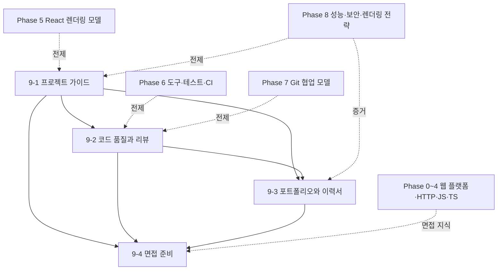

# Phase 9 — 실전 프로젝트와 기술 검증 학습 과정 기획

> ROADMAP.md의 Phase 9(3주+, 문서 4개)를 실제 집필 가능한 수준으로 구체화한 기획 문서다.
> 각 문서의 주제 범위, 핵심 논점, 문서 간 의존 관계, 실습 과제 설계, 집필 순서를 정의한다.

---

## 1. 기획 전제

### 독자 상황 분석

독자는 5년차 이상 경력 개발자(백엔드·모바일 출신)로, Phase 0~8에서 웹 플랫폼, HTML/CSS 렌더링, HTTP, JavaScript 런타임, TypeScript 타입 설계, React 렌더링 모델, 프론트엔드 도구, Git 협업, 브라우저 성능·보안·Next.js/RSC까지 다뤘다. Phase 9는 새 API를 하나 더 배우는 과정이 아니라, 지금까지 익힌 원리와 판단 기준을 **완성된 프로젝트와 검증 가능한 기술 서사**로 전환하는 과정이다.

- **이미 아는 것**: 기능 구현, 배포, GitHub README 작성, 코드 리뷰 참여, 이력서 작성, 면접 답변 준비. React/TypeScript/Next.js, 테스트, CI, 성능 측정, 보안 점검 같은 실무 요소도 앞선 Phase에서 한 번씩 다뤘다.
- **모르는 것 (이 Phase의 가치)**: 좋은 포트폴리오 프로젝트는 "기능이 많다"가 아니라 **문제 정의, 제약, 선택지, 측정 결과, 남은 한계**가 드러나는 산출물이다. 기술 면접의 좋은 답변도 암기한 정의가 아니라, 동작 모델과 트레이드오프를 상황에 맞게 압축하는 능력에서 나온다. 이 Phase의 가치는 구현 자체보다 **왜 그렇게 만들었는지 검증 가능한 증거로 설명하는 능력**이다.
- **흔한 함정**: ① 포트폴리오 프로젝트를 CRUD 기능 목록으로만 구성한다. ② 기술 스택을 먼저 정하고 나중에 이유를 붙인다. ③ ADR을 회고용 장식 문서처럼 사후 작성한다. ④ 리팩터링을 코드 취향 문제로 다루고 동작 보존 증거를 남기지 않는다. ⑤ README와 이력서에서 "무엇을 했다"만 말하고 "어떤 제약에서 무엇을 포기했는가"를 말하지 않는다. ⑥ 면접 답변을 키워드 암기로 준비해 꼬리 질문에서 동작 모델을 설명하지 못한다.

### Phase 9 전체 목표 (ROADMAP 기준)

기획부터 배포까지 프로젝트를 완주하며 기술 의사결정을 문서로 남기고, 원리 수준의 기술 질문에 대응할 수 있다.
최종 산출물: 포트폴리오 프로젝트, 기술 의사결정 기록(ADR), 코드 리뷰·리팩터링 기록, README/포트폴리오/이력서 개선본, 원리 기반 면접 답변 노트.

### 3주+ 배분

문서 4개는 세 블록으로 묶인다: **프로젝트 정의와 의사결정**(9-1), **품질 검증과 리뷰**(9-2), **기술 서사의 외부화**(9-3~9-4). 팀 프로젝트를 선택하면 3주 이후에도 구현과 리뷰 사이클을 반복할 수 있도록 확장 가능하게 설계한다.

| 주차 | 문서 | 실습 |
|------|------|------|
| 1주차 | 9-1 프로젝트 가이드 | 문제 정의, 요구사항·비기능 요구사항 작성, 기술 선택 후보 비교, ADR 초안, 마일스톤과 협업 규칙 수립 |
| 2주차 | 9-2 코드 품질과 리뷰 | 핵심 수직 절편(vertical slice) 구현, PR 단위 설계, 코드 리뷰 체크리스트 적용, 테스트·타입·성능·접근성·보안 검증 |
| 3주차 | 9-3 포트폴리오와 이력서, 9-4 면접 준비 | 배포, README와 사례 연구 작성, 이력서 bullet 정리, Phase별 원리 기반 면접 답변과 프론트엔드 시스템 설계 연습 |
| 추가 주차 | 프로젝트 보강 | 사용자 피드백, 성능·보안 개선, 리팩터링, 팀 리뷰, 포트폴리오 서사 보강 |

---

## 2. 문서별 상세 기획

각 문서는 CLAUDE.md의 공통 구조를 따른다. Phase 9 문서는 "좋은 조언"을 나열하는 대신, 앞선 Phase에서 만든 기술 모델을 실제 프로젝트 판단과 산출물로 연결해야 한다. 모든 선택은 대안·근거·측정 방법·무너지는 조건을 함께 다룬다.

### 9-1. 프로젝트 가이드 — `docs/phase-9/01-project-guide.md`

- **핵심 질문**: 포트폴리오 프로젝트는 어떤 문제와 제약을 가져야 기술 깊이가 드러나는가 — 기술 선택은 언제, 어떤 증거로 결정해야 하는가?
- **다룰 범위**:
  - 프로젝트 주제 선정 기준: 단순 CRUD보다 데이터 신선도, 인증·권한, 검색·필터링, 대용량 목록, 오프라인/저장소, 성능 병목, 접근성 요구, 보안 경계 중 최소 몇 개의 판단 지점이 있는 주제를 고른다.
  - 요구사항 정의: 사용자, 핵심 작업(job), 성공 기준, 범위 제외 항목, 비기능 요구사항(성능·접근성·보안·운영·브라우저 지원)을 문서화한다. "만들고 싶은 기능"을 "검증해야 할 동작"으로 바꾼다.
  - 기술 선택의 순서: 문제와 제약 → 선택지 → 비교 기준 → 결정 → 결과 추적. React SPA, Next.js, 상태 관리, 서버 상태 캐시, 스타일링, 테스트, 배포 플랫폼 같은 선택을 앞선 Phase의 비용 모델로 평가한다.
  - ADR(Architecture Decision Record): 결정 배경, 선택지, 결정, 결과, 재검토 조건을 남기는 형식. ADR은 정답 선언이 아니라 나중에 선택을 반박하거나 갱신할 수 있게 만드는 변경 이력이다.
  - 일정과 협업 워크플로: 수직 절편, 마일스톤, issue/PR 템플릿, Definition of Done, 코드 리뷰 규칙, 의사결정 권한. 팀 프로젝트에서는 합의 비용과 병렬 작업 경계를 별도로 다룬다.
  - 문서화 초기값: README 골격, `docs/adr/`, 설계 메모, 측정 로그, 회고 로그를 프로젝트 초기에 만든다. 문서는 완성 후 포장지가 아니라 의사결정의 작업 공간이다.
- **다루지 않을 범위**: 코드 리뷰의 세부 관점(9-2), README와 이력서 표현법(9-3), 면접 답변 구조(9-4), 프로젝트 관리 방법론 일반론.
- **경력자 연결**: 백엔드의 RFC, ADR, API contract, migration plan처럼 프론트엔드 프로젝트도 제약과 선택을 기록해야 운영 가능한 시스템이 된다. 차이는 브라우저·네트워크·사용자 기기라는 불안정한 실행 환경이 선택의 핵심 제약으로 들어온다는 점이다.
- **의존**: Phase 5의 React 상태·렌더링 모델, Phase 6의 도구·CI, Phase 7의 Git 협업, Phase 8의 성능·보안·렌더링 전략. 특히 8-5/8-6의 CSR/SSR/SSG/RSC 판단을 프로젝트 ADR로 이어받는다.

### 9-2. 코드 품질과 리뷰 — `docs/phase-9/02-code-quality-and-review.md`

- **핵심 질문**: 코드 리뷰에서 무엇을 봐야 하는가 — 정합성, 설계, 성능, 접근성, 보안, 경계 조건은 어떤 증거로 검증할 수 있는가?
- **다룰 범위**:
  - 품질 모델: 포맷과 네이밍을 넘어 동작 정합성, 타입 경계, 상태 소유권, 데이터 흐름, 접근성, 성능, 보안, 테스트 가능성, 변경 용이성을 코드 품질의 축으로 세운다.
  - 리뷰 관점: 요구사항 충족 여부, 실패·빈 상태·로딩·재시도·권한 오류 같은 경계 조건, React 리렌더 전파, 서버 상태 캐시 무효화, 네트워크 요청 수, 보안 입력 경로, 접근성 트리와 키보드 흐름을 확인한다.
  - 아키텍처 경계: feature-based 구조와 layer-based 구조, UI 상태와 서버 상태, 도메인 로직과 뷰 로직, API 클라이언트와 캐시 계층, 서버/클라이언트 컴포넌트 경계의 트레이드오프를 비교한다.
  - 리팩터링 전략: characterization test, 작은 단위의 이동, public behavior 보존, 성능 리팩터링의 계측 기준, 불필요한 추상화 제거. "깔끔해 보인다"가 아니라 변경 비용과 결함 가능성을 줄였는지 본다.
  - PR 단위 설계: 리뷰 가능한 변경 크기, 설명 템플릿, 스크린샷·trace·테스트 결과·ADR 링크·남은 리스크를 포함한 PR 본문 작성. 커밋 단위와 PR 단위가 항상 같지는 않다는 점을 구분한다.
  - 품질 gate: typecheck, lint, unit/component/e2e smoke test, accessibility check, bundle/performance budget, 보안 헤더 점검. gate가 느려지거나 flaky해질 때의 경계 조건과 완화 전략을 다룬다.
- **다루지 않을 범위**: Git 객체·브랜치 모델(Phase 7), 테스트 전략 기초(6-4), React 성능 기초(5-5), 웹 보안 공격 모델 상세(8-4), 조직 문화 일반론.
- **경력자 연결**: 코드 리뷰는 컴파일러가 잡지 못하는 시스템 경계 검증이다. 백엔드 리뷰에서 트랜잭션 경계, 장애 복구, API 호환성을 보듯 프론트엔드 리뷰에서는 렌더링 비용, 접근성 트리, 브라우저 저장소, 캐시 무효화, 사용자 입력 지연을 본다.
- **의존**: 4-5의 타입 검사와 설정, 5-5의 React Profiler, 5-8의 서버 상태 캐시, 6-3/6-4/6-5의 정적 분석·테스트·CI, 7-7의 PR 정책, 8-3/8-4의 성능·보안 검증.

### 9-3. 포트폴리오와 이력서 — `docs/phase-9/03-portfolio-and-resume.md`

- **핵심 질문**: 프로젝트의 깊이는 어떻게 드러나는가 — README, 포트폴리오, 이력서는 기술 선택과 측정 결과를 어떤 구조로 보여 줘야 하는가?
- **다룰 범위**:
  - 깊이가 드러나는 사례 연구 구조: 문제 → 제약 → 선택지 → 결정 → 구현 → 측정 결과 → 남은 한계 → 다음 개선. 기술 스택 목록보다 판단 과정과 결과 증거를 앞에 둔다.
  - README 설계: 실행 방법, 환경 변수, 아키텍처 개요, 주요 기능, ADR 링크, 테스트·검증 방법, 성능·접근성·보안 점검 결과, 알려진 한계를 포함한다. README는 채용 담당자와 동료 개발자가 서로 다른 속도로 읽을 수 있어야 한다.
  - 증거의 종류: 배포 URL, Lighthouse/Core Web Vitals, bundle 분석, React Profiler, Network waterfall, 접근성 점검, 테스트 결과, 보안 헤더, 코드 리뷰 기록, 이슈·PR 흐름. 수치를 쓸 때는 측정 조건과 한계를 함께 적는다.
  - 포트폴리오 페이지 구성: 프로젝트 목록보다 대표 프로젝트 1~2개의 깊이를 보여 준다. 스크린샷은 기능 나열이 아니라 문제 해결 흐름과 설계 판단을 보조해야 한다.
  - 이력서 bullet 작성: "무엇을 구현했다"를 "어떤 제약에서 어떤 선택을 했고 어떤 결과를 얻었다"로 바꾼다. 정량 지표가 없으면 관찰 가능한 품질 변화나 운영 리스크 감소를 근거로 쓴다.
  - 공개 저장소 위생: 커밋 메시지, PR 설명, ADR, issue, release note, license, demo data, secret 제거, 로컬 실행 가능성. 저장소 자체가 협업 습관을 보여 주는 자료가 된다.
- **다루지 않을 범위**: 디자인 템플릿 제작, 일반 취업 조언, 지원 회사별 자기소개서, 면접 질의응답 상세(9-4).
- **경력자 연결**: 경력직 포트폴리오는 "사용한 기술 목록"보다 "제약 아래 의사결정을 내리고 결과를 검증한 기록"에 가깝다. 장애 회고나 기술 설계 문서처럼, 맥락과 판단 근거가 빠지면 산출물의 기술 깊이가 보이지 않는다.
- **의존**: 9-1의 ADR과 요구사항, 9-2의 리뷰·품질 기록, 8-3의 성능 리포트, 8-4의 보안 점검, 7-3의 커밋 설계와 7-7의 PR 흐름.

### 9-4. 면접 준비 — `docs/phase-9/04-interview-prep.md`

- **핵심 질문**: 각 Phase에서 배운 "왜"를 면접 답변으로 어떻게 변환할 것인가 — 프론트엔드 시스템 설계 질문에서 어떤 순서로 제약과 선택지를 좁혀야 하는가?
- **다룰 범위**:
  - 원리 기반 답변 구조: 표면 답변 → 동작 모델 → 설계 배경 → 트레이드오프 → 경계 조건 → 관찰·측정 방법. 암기형 정의를 꼬리 질문에 견디는 설명으로 바꾼다.
  - Phase별 핵심 질문 맵: 브라우저 파이프라인, HTML 파서와 접근성, CSS 캐스케이드와 레이아웃, HTTP 캐싱·쿠키·TLS, JavaScript 이벤트 루프와 메모리, TypeScript 타입 설계, React 렌더링·상태·이펙트, 번들러·테스트·CI, Git 협업, 성능·보안·렌더링 전략을 면접 질문 형태로 재구성한다.
  - 프론트엔드 시스템 설계: 요구사항 확인, 렌더링 전략, 데이터 모델과 서버 상태 캐시, 상태 소유권, 컴포넌트 경계, 접근성, 성능 예산, 보안 위협 모델, 관측·배포 전략 순서로 답변을 전개한다.
  - 코드 리뷰형 면접: 주어진 코드에서 버그, race condition, stale closure, 리렌더 비용, 타입 구멍, 접근성 누락, 보안 입력 경로를 찾고 수정 방향을 설명한다.
  - 포트폴리오 방어: 자신의 ADR을 면접관이 반박한다고 가정하고, 선택하지 않은 대안이 더 나아지는 조건까지 답변한다. "그때는 맞았지만 지금은 바꿀 수 있다"는 판단 갱신 능력을 보여 준다.
  - 연습 루프: 답변 초안 작성, 소리 내어 설명, 꼬리 질문 생성, 실제 프로젝트 증거와 연결, 모르는 질문의 처리 방식. 모르는 것을 추측으로 채우지 않고 어떤 1차 자료로 확인할지 말한다.
- **다루지 않을 범위**: 알고리즘 면접 일반론, CS 기초 전체 복습, 회사별 기출 암기, 협상·처우 전략.
- **경력자 연결**: 경력직 면접은 정답을 외운 사람보다 복잡한 제약에서 판단을 설명할 수 있는 사람을 찾는다. 좋은 답변은 설계 리뷰와 비슷하게 전제를 확인하고, 선택지를 비교하고, 실패 조건과 검증 방법을 제시한다.
- **의존**: Phase 0~8 전체와 9-1~9-3의 프로젝트 산출물. 특히 면접 답변은 추상 지식만으로 만들지 않고 본인이 작성한 ADR, 성능 리포트, 코드 리뷰 기록, README와 연결한다.

---

## 3. 문서 간 의존 관계

- 집필 순서는 번호 순서(9-1 → 9-4)를 그대로 따른다. 9-1이 프로젝트의 문제와 의사결정 구조를 세우고, 9-2가 구현 과정에서 품질을 검증한다. 9-3은 그 산출물을 외부 독자가 읽을 수 있는 포트폴리오와 이력서로 압축하고, 9-4는 같은 근거를 면접 답변과 시스템 설계 답변으로 변환한다.
- 이전 Phase에서 위임한 주제: 7-7에서 위임한 코드 리뷰의 문장·설계 관점은 9-2에서 본격적으로 다룬다. 8-5~8-6에서 위임한 프로젝트 기획·ADR·렌더링 전략 의사결정은 9-1에서 실제 프로젝트 문서로 확장한다. 8-3/8-4의 성능·보안 리포트는 9-3의 포트폴리오 증거와 9-4의 면접 답변 근거로 재사용한다.
- Phase 9 이후 별도 교육 Phase는 없다. 따라서 문서 집필 시 "나중에 심화"로 미루기보다, 필요한 범위는 앞선 Phase 문서로 역참조하고 최종 산출물에 어떻게 반영되는지까지 닫아야 한다.

## 4. 실습 과제 설계

ROADMAP의 "자유 주제 포트폴리오 프로젝트 완성 + ADR + 배포 및 회고"를 문서 진도와 연동한다. 이 Phase의 실습은 **문제 정의 → 구현과 검증 → 외부화와 방어**다. 최종 산출물은 동작하는 앱 하나가 아니라, 앱과 함께 그 앱을 설명하고 검증하는 문서 묶음이다.

### 과제 A — 프로젝트 정의와 ADR 작성 (1주차, 9-1 병행)

- 자유 주제 프로젝트를 하나 선택한다. 단, 로그인 없는 단순 CRUD처럼 판단 지점이 적은 주제는 범위를 보강한다. 예시: 개인화된 대시보드, 검색·필터가 있는 데이터 탐색 도구, 콘텐츠 관리/예약 시스템, 오프라인 저장이 필요한 작업 도구, 성능 개선 여지가 있는 미디어/목록 서비스.
- 요구사항 문서를 작성한다. 핵심 사용자, 사용자 시나리오, 기능 요구사항, 비기능 요구사항, 브라우저 지원 범위, 접근성 목표, 성능 예산, 보안 위협 모델, 제외 범위를 포함한다.
- 기술 선택 후보를 비교한다. 렌더링 전략(CSR/SSR/SSG/ISR/RSC), 상태 관리, 서버 상태 캐시, 스타일링, 테스트, 배포 플랫폼, 인증·저장소가 필요한 경우 그 선택지를 표로 비교한다.
- ADR을 최소 3개 작성한다. 예: 렌더링 전략, 상태·데이터 계층, 스타일링 전략, 테스트 범위, 배포·캐시 전략, 인증·토큰 저장 전략. 각 ADR에는 재검토 조건을 포함한다.
- 마일스톤과 issue를 만든다. 최소 수직 절편, 품질 gate, 배포 시점, 회고 시점을 정의한다.

### 과제 B — 구현, 리뷰, 품질 검증 (2주차, 9-2 병행)

- 핵심 수직 절편을 먼저 완성한다. 화면, 데이터 흐름, 실패 상태, 로딩 상태, 접근성 흐름, 배포 경로가 모두 얇게 연결된 상태를 목표로 한다.
- PR 단위를 설계하고 리뷰 기록을 남긴다. 혼자 진행하더라도 셀프 리뷰(self-review)를 PR 설명 형식으로 작성한다. 변경 의도, 검증 방법, 스크린샷 또는 trace, 관련 ADR, 남은 리스크를 포함한다.
- 품질 gate를 구성한다. typecheck, lint, test, build, 접근성 smoke check, 주요 사용자 플로우 e2e 또는 수동 검증 절차를 프로젝트 규모에 맞게 둔다.
- 성능·보안·접근성 점검을 수행한다. Core Web Vitals 또는 Lighthouse, Network waterfall, React Profiler, bundle 분석, 쿠키·보안 헤더·XSS 입력 경로, 키보드 탐색과 스크린 리더 이름 계산 중 프로젝트에 맞는 증거를 남긴다.
- 리팩터링 기록을 남긴다. 변경 전 문제, 보존해야 할 동작, 변경 단위, 검증 결과, 남은 트레이드오프를 기록한다.

### 과제 C — 포트폴리오, 이력서, 면접 답변으로 변환 (3주차, 9-3~9-4 병행)

- 배포 URL과 저장소를 정리한다. 로컬 실행 방법, 환경 변수, seed/demo data, 알려진 한계, 테스트 명령이 README만 보고 재현 가능해야 한다.
- README 또는 별도 case study를 작성한다. 문제, 제약, 선택지, ADR 요약, 아키텍처, 측정 결과, 회고를 포함한다. 스크린샷은 사용자 흐름과 설계 판단을 설명하는 데 필요한 만큼만 사용한다.
- 이력서 bullet을 3~5개 작성한다. 각 bullet은 "상황/제약 → 행동/기술 선택 → 결과/증거" 구조로 쓴다.
- 면접 답변 노트를 만든다. 프로젝트 기반 질문 10개 이상, Phase별 원리 질문 20개 이상, 프론트엔드 시스템 설계 질문 2개 이상을 준비한다. 각 답변은 동작 모델, 트레이드오프, 경계 조건, 검증 방법을 포함한다.
- 포트폴리오 방어 리허설을 한다. ADR 하나를 골라 반대 선택지를 주장해 보고, 어떤 조건에서 결정을 바꿀지 답한다.

### 산출물 — 프로젝트 + 의사결정 기록 + 기술 서사

- **포트폴리오 프로젝트**: 배포 가능한 앱, 실행 가능한 저장소, 핵심 사용자 플로우, 품질 gate, 최소한의 운영 문서를 포함한다.
- **ADR 묶음**: 주요 기술 선택마다 배경, 선택지, 결정, 결과, 재검토 조건을 기록한다.
- **검증 리포트**: 성능, 접근성, 보안, 테스트, 코드 리뷰·리팩터링 결과를 프로젝트 맥락에서 정리한다.
- **README와 사례 연구**: 외부 독자가 프로젝트의 문제, 구조, 판단 근거, 실행 방법, 한계를 빠르게 파악할 수 있어야 한다.
- **이력서·면접 자료**: 프로젝트 기반 bullet, Phase별 원리 답변, 시스템 설계 답변, 포트폴리오 방어 질문을 포함한다.

### 완성 기준 (Definition of Done)

- [ ] 프로젝트 요구사항 문서 완성(사용자 시나리오, 기능/비기능 요구사항, 제외 범위 포함)
- [ ] 주요 기술 선택 ADR 5개 이상 작성(선택지·트레이드오프·재검토 조건 포함)
- [ ] 배포 가능한 포트폴리오 프로젝트 완성
- [ ] 로컬 실행, 테스트, 빌드, 배포 절차가 README로 재현 가능
- [ ] typecheck/lint/test/build 중 프로젝트에 필요한 품질 gate 구성
- [ ] 주요 사용자 플로우의 실패·로딩·빈 상태·권한 또는 입력 오류 처리
- [ ] 성능 측정 결과와 개선 또는 유지 판단 기록
- [ ] 접근성 점검 결과(키보드 흐름, 이름/역할, Lighthouse/axe 등) 기록
- [ ] 보안 점검 결과(XSS 입력 경로, 토큰/쿠키 저장, 보안 헤더, 의존성 위험 중 해당 항목) 기록
- [ ] 코드 리뷰 또는 셀프 리뷰 기록 3개 이상
- [ ] 리팩터링 전후의 문제·조치·검증 결과 기록 1개 이상
- [ ] 프로젝트 case study 또는 README 심화 섹션 작성
- [ ] 이력서 bullet 3~5개 작성
- [ ] 프로젝트 기반 면접 질문 10개 이상과 답변 초안 작성
- [ ] 프론트엔드 시스템 설계형 질문 2개 이상 답변 연습

## 5. 공통 집필 기준 (Phase 9 특화)

CLAUDE.md의 전 지침에 더해, Phase 9에서 특히 지킬 것:

- **조언보다 산출물 중심**: "좋은 프로젝트를 만들어라", "README를 잘 써라" 같은 일반론으로 끝내지 않는다. 요구사항 문서, ADR, PR 본문, 리뷰 체크리스트, README 구조, 면접 답변 구조처럼 독자가 바로 적용할 수 있는 산출물 단위로 설명한다.
- **프로젝트 선택은 판단 지점으로 평가**: 주제의 화려함보다 기술 선택이 갈리는 지점이 있는지를 본다. 성능, 보안, 접근성, 데이터 신선도, 캐시, 상태 소유권, 렌더링 전략 중 어떤 판단을 보여 줄 수 있는지 기준을 제시한다.
- **기술 선택은 대안과 함께 쓴다**: React SPA, Next.js, 상태 관리 라이브러리, CSS 전략, 테스트 범위, 배포 플랫폼 등 모든 선택은 선택하지 않은 대안과 무너지는 조건을 포함한다. "이 프로젝트에서는 충분하다"와 "항상 옳다"를 구분한다.
- **측정 결과는 조건과 한계를 포함**: 성능·접근성·테스트·보안 지표는 측정 환경, 도구, 기준선, 해석 한계를 함께 쓴다. Lighthouse 점수나 테스트 커버리지 숫자만으로 품질을 대표하지 않는다.
- **리뷰는 취향이 아니라 위험 검출로 설명**: 코드 리뷰 관점은 네이밍·스타일보다 동작 정합성, 경계 조건, 렌더링 비용, 캐시 무효화, 접근성, 보안 입력 경로, 변경 용이성을 중심으로 둔다.
- **포트폴리오는 마케팅 문구보다 증거**: 프로젝트 소개 문장은 기술 스택 나열을 줄이고 문제, 제약, 결정, 결과, 한계로 구성한다. 과장된 수식어보다 검증 가능한 근거를 우선한다.
- **면접 답변은 암기가 아니라 압축**: 각 Phase의 개념을 정의문으로 외우게 하지 않는다. 동작 모델, 설계 배경, 경계 조건, 관찰 방법을 1~2분 답변으로 압축하는 연습을 설계한다.
- **개인 프로젝트와 팀 프로젝트를 모두 고려**: 팀 프로젝트는 협업 규칙, PR 리뷰, 역할 분담, 의사결정 기록을 더 강조한다. 개인 프로젝트는 셀프 리뷰, issue 기록, ADR, 회고로 협업 습관을 드러내게 한다.
- **실무 수준의 한계 인정**: 포트폴리오 프로젝트가 모든 실서비스 요구를 만족할 수는 없다. 인증, 결제, 개인정보, 대규모 트래픽, 운영 모니터링처럼 다루지 못한 영역은 알려진 한계로 명시하고, 실제 서비스라면 무엇을 보강할지 쓰게 한다.
- **1차 자료와 공식 문서 우선**: React, Next.js, TypeScript, GitHub Actions, Web Vitals, Chrome DevTools, WCAG, MDN, OWASP, 선택한 배포 플랫폼의 공식 문서를 우선한다. 특정 라이브러리나 플랫폼 기본값은 문서 작성 시점의 공식 문서로 확인한다.
- **확인 문제 방향**: "이 프로젝트에는 CSR과 SSR 중 무엇이 맞는가", "이 ADR에서 빠진 재검토 조건은 무엇인가", "이 PR 설명으로 리뷰어가 어떤 위험을 검증할 수 있는가", "이 포트폴리오 문장은 왜 깊이가 드러나지 않는가", "이 면접 답변의 꼬리 질문은 무엇인가"처럼 판단·수정·방어형 문제를 우선한다.

## 6. 진행 체크리스트

- [x] 9-1 `01-project-guide.md`
- [x] 9-2 `02-code-quality-and-review.md`
- [x] 9-3 `03-portfolio-and-resume.md`
- [x] 9-4 `04-interview-prep.md`
- [x] `exercises/phase-9/` 과제 안내 문서
- [x] ROADMAP.md 5절 진행 현황 표 갱신
