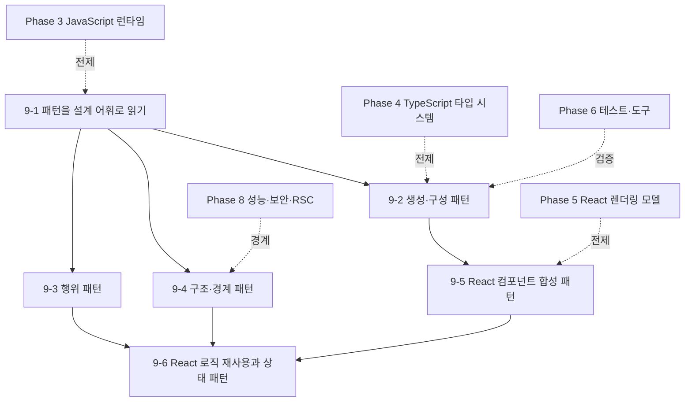

# Phase 9 — 설계 패턴: JavaScript와 React 컴포넌트 패턴 학습 과정 기획

> ROADMAP.md의 Phase 9(2주, 문서 6개)를 실제 집필 가능한 수준으로 구체화한 기획 문서다.
> 각 문서의 주제 범위, 핵심 논점, 문서 간 의존 관계, 실습 과제 설계, 집필 순서를 정의한다.

---

## 1. 기획 전제

### 독자 상황 분석

독자는 Phase 0~8에서 웹 플랫폼, HTML/CSS 렌더링, HTTP, JavaScript 런타임, TypeScript 타입 설계, React 렌더링 모델, 도구, Git, 성능·보안·Next.js/RSC까지 다뤘다. Phase 9는 새로운 프레임워크를 배우는 과정이 아니라, 이미 배운 언어와 프레임워크 모델 위에서 반복되는 설계 문제를 **패턴이라는 어휘로 식별하고 선택하는 과정**이다.

- **이미 아는 것**: 함수, 객체, 모듈, 클로저, 비동기 처리, React 함수 컴포넌트, hook, context, 상태 배치, 리렌더 비용, TypeScript 타입 설계.
- **모르는 것 (이 Phase의 가치)**: 패턴 이름을 외우는 것이 아니라, 같은 문제를 해결하는 여러 구조 중 어떤 것이 현재 제약에 맞는지 판단하는 기준이다. JavaScript는 일급 함수와 동적 객체 모델 때문에 전통적 객체지향 패턴의 모양이 자주 바뀐다. React도 클래스 상속보다 합성과 hook을 중심으로 패턴을 다시 구성한다.
- **흔한 함정**: ① GoF 패턴 이름을 코드에 억지로 붙인다. ② singleton과 전역 캐시를 구분하지 못한다. ③ observer/pub-sub으로 데이터 흐름을 숨겨 디버깅 가능성을 낮춘다. ④ compound component를 쓰면서 context 리렌더 비용을 측정하지 않는다. ⑤ custom hook을 로직 재사용 도구가 아니라 상태 은닉 도구로 오용한다. ⑥ class component 패턴을 함수 컴포넌트 코드에 그대로 옮긴다.

### Phase 9 전체 목표 (ROADMAP 기준)

JavaScript의 객체·함수·모듈 모델 위에서 자주 쓰이는 설계 패턴을 해석하고, React 함수 컴포넌트의 합성·상태·로직 재사용 패턴을 트레이드오프에 따라 선택할 수 있다.

최종 산출물: JavaScript 패턴 리팩터링 리포트, React 함수 컴포넌트 패턴 샘플, 패턴 선택 ADR, 리렌더·테스트 가능성·변경 비용 비교 기록.

### 2주 배분

| 주차 | 문서 | 실습 |
|------|------|------|
| 1주차 | 9-1~9-4 JavaScript 설계 패턴 | 기존 JS/TS 코드에서 패턴 후보를 식별하고, factory/strategy/adapter/observer 등 3개 이상을 적용 또는 배제한 근거를 기록 |
| 2주차 | 9-5~9-6 React 컴포넌트 패턴 | 함수 컴포넌트만 사용해 compound component, controlled/uncontrolled, custom hook, reducer/context 중 필요한 패턴을 구현하고 리렌더·테스트 경계를 검증 |

---

## 2. 문서별 상세 기획

각 문서는 CLAUDE.md의 공통 구조를 따른다. Phase 9 문서는 패턴 카탈로그가 아니라 **문제가 먼저, 패턴은 그 문제를 다루는 구조적 선택지**라는 순서로 쓴다. 모든 패턴은 동작 모델, 설계 배경, 경계 조건을 포함해야 한다.

### 9-1. 패턴을 설계 어휘로 읽기 — `docs/phase-9/01-patterns-as-design-vocabulary.md`

- **핵심 질문**: 패턴은 언제 설계를 선명하게 만들고, 언제 불필요한 간접층이 되는가?
- **다룰 범위**:
  - 패턴의 역할: 코드 템플릿이 아니라 반복되는 힘(force)과 선택의 이름.
  - JavaScript가 패턴을 바꾸는 이유: 일급 함수, 클로저, 프로토타입, 동적 객체, ESM, structural typing.
  - 패턴 적용 판단 기준: 변경 축, 상태 소유권, 테스트 경계, 의존성 방향, 런타임 비용, 디버깅 가능성.
  - 전통적 객체지향 패턴을 JavaScript에 옮길 때의 왜곡: class 계층보다 함수·객체 조합이 단순한 경우.
- **다루지 않을 범위**: GoF 23개 패턴 전체 암기, UML 표기법 일반론, 객체지향 입문.
- **의존**: 3-2 클로저와 함수, 3-4 객체 모델, 3-9 모듈, 4-2 타입 설계.

### 9-2. 생성·구성 패턴 — `docs/phase-9/02-creational-and-composition-patterns.md`

- **핵심 질문**: 객체나 서비스를 어디서 만들고, 의존성을 어디서 주입해야 테스트 가능성과 변경 용이성이 유지되는가?
- **다룰 범위**:
  - factory function과 class constructor의 차이: 캡슐화, 타입 추론, mock 경계.
  - builder: 옵션 조합이 늘어날 때 생성 과정을 명시화하는 비용과 이점.
  - module pattern과 ESM: private 상태, 초기화 시점, 사이드 이펙트, tree shaking.
  - singleton: 인스턴스 1개 보장이 아니라 전역 상태 공유라는 비용으로 읽기.
  - dependency injection: 브라우저 API, fetch client, clock, storage 같은 외부 경계를 주입하는 방식.
- **다루지 않을 범위**: 서버 DI 컨테이너 프레임워크, reflect-metadata 기반 런타임 DI.
- **의존**: 3-9 모듈, 3-10 메모리와 저장소, 6-2 번들러, 6-4 테스트 전략.

### 9-3. 행위 패턴 — `docs/phase-9/03-behavioral-patterns.md`

- **핵심 질문**: 조건 분기, 이벤트, 상태 전이를 어떤 구조로 분리해야 변경 축이 드러나는가?
- **다룰 범위**:
  - strategy: 조건 분기를 데이터/함수 테이블로 바꾸는 기준과 과잉 추상화의 경계.
  - command: 실행과 기록을 분리해 undo/redo, queue, retry를 가능하게 만드는 구조.
  - observer/pub-sub: DOM 이벤트, CustomEvent, EventTarget, 외부 store 구독 모델과 디버깅 비용.
  - state pattern: 상태 전이 테이블, reducer, 명시적 state machine의 선택 기준.
  - iterator/generator: 지연 평가와 순회 프로토콜이 UI 데이터 흐름에 주는 이점.
- **다루지 않을 범위**: RxJS 전체, 복잡한 statechart 도구 사용법.
- **의존**: 3-5 이벤트 루프, 3-6 Promise와 async, 3-7 DOM과 이벤트, 5-3 상태와 배칭.

### 9-4. 구조·경계 패턴 — `docs/phase-9/04-structural-and-boundary-patterns.md`

- **핵심 질문**: 외부 API, 레거시 코드, 브라우저 API 같은 불안정한 경계를 어떻게 안정적인 내부 계약으로 감쌀 것인가?
- **다룰 범위**:
  - adapter: 외부 응답·브라우저 API·스토리지 스키마를 내부 모델로 변환하는 경계.
  - facade: 복잡한 하위 시스템을 좁은 API로 감싸는 이점과 정보 은닉의 비용.
  - proxy: lazy loading, access control, cache, logging을 끼워 넣는 구조와 투명성의 한계.
  - decorator: 함수 합성, middleware, React wrapper에서 책임을 누적하는 방식.
  - chain of responsibility/middleware: fetch pipeline, validation pipeline, error handling pipeline.
- **다루지 않을 범위**: 백엔드 repository 패턴 일반론, 대규모 클린 아키텍처 계층 설계 전체.
- **의존**: 3-8 네트워크 API, 4-3 제네릭과 변성, 5-8 서버 상태, 8-2 네트워크 심화.

### 9-5. React 컴포넌트 합성 패턴 — `docs/phase-9/05-react-composition-patterns.md`

- **핵심 질문**: 함수 컴포넌트 트리에서 확장 가능한 UI 계약은 props, children, context 중 어디에 놓아야 하는가?
- **다룰 범위**:
  - composition over inheritance: React가 상속보다 합성을 기본 모델로 삼는 이유.
  - children-as-slot: layout ownership과 rendering ownership을 분리하는 방식.
  - compound components: Tabs, Dialog, Menu 같은 위젯에서 부모·자식 계약을 만드는 법.
  - controlled/uncontrolled components: 상태 소유권을 호출자와 컴포넌트 중 어디에 둘지 판단하는 기준.
  - polymorphic component: `as` prop, ref, 접근성 role이 얽힐 때의 타입·런타임 경계.
  - context 기반 합성의 리렌더 비용과 React DevTools Profiler 확인 방법.
- **다루지 않을 범위**: class component, legacy lifecycle, mixin. HOC는 함수 컴포넌트와도 쓸 수 있지만 주요 패턴이 아니라 migration 맥락으로만 언급한다.
- **의존**: 5-1 React 멘털 모델, 5-2 렌더링과 재조정, 5-5 성능 모델, 5-6 상태 아키텍처.

### 9-6. React 로직 재사용과 상태 패턴 — `docs/phase-9/06-react-logic-and-state-patterns.md`

- **핵심 질문**: UI 로직을 custom hook, reducer, context, 외부 store 중 어디에 배치해야 렌더링 비용과 테스트 경계가 예측 가능한가?
- **다룰 범위**:
  - custom hook: 로직 재사용과 상태 공유를 구분하는 기준.
  - reducer + context: 상태 전이 명시성, dispatch 안정성, provider 분할.
  - provider boundary: 기능 단위 provider와 앱 전역 provider의 비용 비교.
  - external store adapter: `useSyncExternalStore`를 통한 React 밖 상태와의 일관성 계약.
  - function-as-children/render prop: hook으로 대체되는 경우와 여전히 유효한 경우.
  - 서버 상태와 클라이언트 상태 패턴 분리: TanStack Query 같은 캐시 라이브러리를 직접 패턴으로 재구현하지 않는 기준.
- **다루지 않을 범위**: 특정 상태 관리 라이브러리 심화, React Server Components 심화(8-6에서 다룸), class component.
- **의존**: 5-3 상태와 배칭, 5-4 이펙트, 5-6 상태 아키텍처, 5-8 서버 상태, 8-6 Next.js와 RSC.

---

## 3. 문서 간 의존 관계

- 집필 순서는 번호 순서(9-1 → 9-6)를 따른다. 9-1이 패턴 적용 판단 기준을 세우고, 9-2~9-4가 JavaScript 설계 패턴을 다룬다. 9-5~9-6은 같은 판단 기준을 React 함수 컴포넌트와 hook 기반 설계로 옮긴다.
- 뒤 Phase로 위임하는 주제: 프로젝트 전체의 ADR, 포트폴리오, 면접 답변 전환은 Phase 10에서 다룬다. Phase 9는 패턴 선택 자체의 근거와 리팩터링 검증에 집중한다.
- React는 함수 컴포넌트만 다룬다. class component, mixin, legacy lifecycle은 현재 코드베이스를 읽을 때 필요한 역사적 맥락으로만 언급한다.

## 4. 실습 과제 설계

ROADMAP의 "패턴 리팩터링 리포트 + React 컴포넌트 패턴 샘플"을 문서 진도와 연동한다. 실습은 **패턴 후보 식별 → 리팩터링 또는 배제 → React 함수 컴포넌트 패턴 구현 → 비용 검증** 순서로 진행한다.

### 과제 A — JavaScript 패턴 후보 분석 (1주차, 9-1 병행)

- 기존 JavaScript/TypeScript 코드 1개를 선택한다. Phase 3 바닐라 JS 앱, Phase 5 React 앱의 유틸리티 계층, 또는 별도 미니 프로젝트를 사용할 수 있다.
- 반복 조건문, 외부 API 경계, 전역 상태, 이벤트 전달, 옵션 객체, 비동기 retry/queue처럼 패턴 후보가 되는 지점을 최소 5개 찾는다.
- 각 후보마다 "적용할 패턴", "적용하지 않을 이유", "변경 축", "테스트 경계", "예상 비용"을 기록한다.

### 과제 B — JavaScript 패턴 리팩터링 (1주차, 9-2~9-4 병행)

- factory/builder/module/singleton/DI 중 1개 이상을 적용하거나 배제한다.
- strategy/command/observer/state/iterator 중 1개 이상을 적용하거나 배제한다.
- adapter/facade/proxy/decorator/middleware 중 1개 이상을 적용하거나 배제한다.
- 변경 전후 테스트 또는 실행 로그를 남기고, 추상화가 줄인 복잡도와 새로 만든 비용을 비교한다.

### 과제 C — React 함수 컴포넌트 패턴 샘플 (2주차, 9-5~9-6 병행)

- 함수 컴포넌트만 사용해 작은 UI 샘플을 만든다. 예시: Tabs, Accordion, Dialog, Combobox, DataTable filter panel, Wizard.
- compound component 또는 children-as-slot 패턴을 포함한다.
- controlled/uncontrolled 중 하나를 지원하고, 선택하지 않은 방식이 더 적합해지는 조건을 기록한다.
- custom hook, reducer + context, provider boundary 중 1개 이상을 사용한다.
- React DevTools Profiler 또는 테스트 로그로 리렌더 범위와 외부 동작 보존을 검증한다.

### 과제 D — 패턴 선택 ADR 작성 (2주차 마무리)

- 최소 3개의 패턴 선택 ADR을 작성한다.
- 각 ADR은 문제, 후보 패턴, 선택한 구조, 선택하지 않은 대안, 검증 방법, 재검토 조건을 포함한다.
- "패턴을 쓰지 않기로 한 결정"도 ADR로 인정한다. 불필요한 간접층을 피하는 것도 설계 판단이다.

## 5. 공통 집필 기준 (Phase 9 특화)

CLAUDE.md의 전 지침에 더해, Phase 9에서 특히 지킬 것:

- **패턴 이름보다 힘을 먼저 설명**: "factory를 쓴다"가 아니라 생성 책임, 의존성 방향, 테스트 경계가 왜 문제가 되는지 먼저 쓴다.
- **JavaScript식 형태를 기준으로 설명**: class 상속 계층보다 함수, 객체 리터럴, 클로저, ESM, TypeScript 타입이 패턴을 어떻게 바꾸는지 보여 준다.
- **React는 함수 컴포넌트만 사용**: class component 기반 패턴은 역사적 배경으로만 언급하고, 예제는 hook과 함수 컴포넌트로 작성한다.
- **좋은 예와 나쁜 예를 짝지음**: 패턴 적용 전후를 함께 보여 주고, 좋아진 점뿐 아니라 새 비용을 명시한다.
- **리렌더와 테스트 가능성 검증**: React 패턴은 DevTools Profiler, 테스트, console trace 중 하나로 비용을 관찰하게 한다.
- **패턴 미적용도 선택지로 둠**: 패턴을 늘리는 것이 목표가 아니다. 단순 함수나 명시적 분기가 더 나은 경계 조건을 반드시 다룬다.

## 6. 진행 체크리스트

- [x] 9-1 `01-patterns-as-design-vocabulary.md`
- [x] 9-2 `02-creational-and-composition-patterns.md`
- [x] 9-3 `03-behavioral-patterns.md`
- [x] 9-4 `04-structural-and-boundary-patterns.md`
- [x] 9-5 `05-react-composition-patterns.md`
- [x] 9-6 `06-react-logic-and-state-patterns.md`
- [x] `exercises/phase-9/` 과제 안내 문서
- [x] ROADMAP.md 5절 진행 현황 표 갱신
